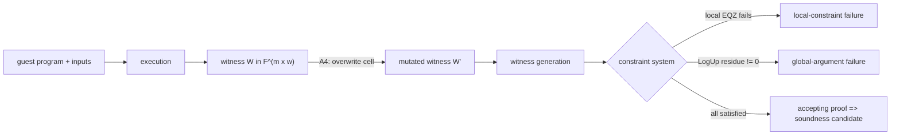
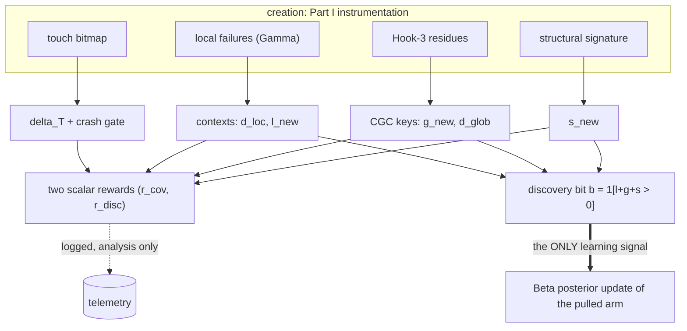
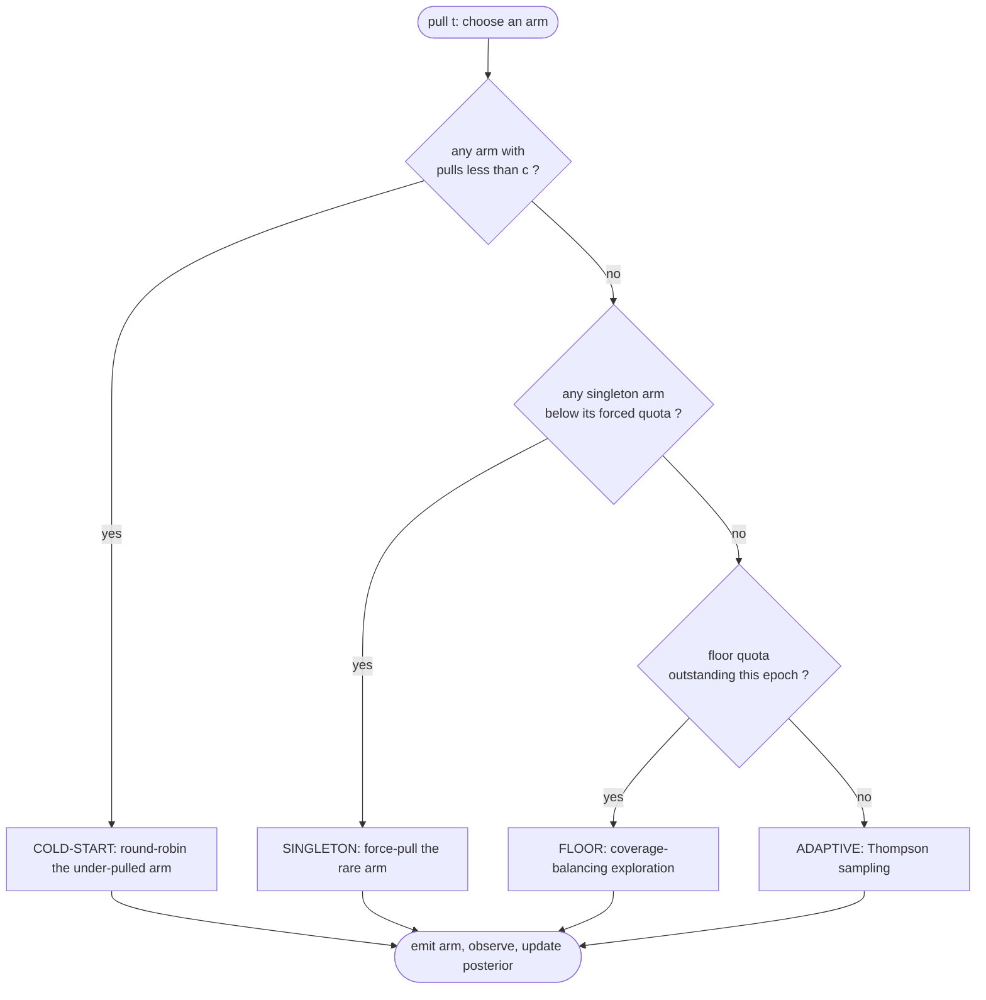

# A Constraint-Guided Bandit for zkVM Soundness Fuzzing

## The V5 Architecture — A Formal Introduction

*A self-contained, graduate-level treatment of the scheduling, reward, and learning machinery underlying the V5 baseline. The aim is conceptual and mathematical: by the end, a reader should understand precisely* **why** *V5 is shaped the way it is, and exactly* **what** *information flows through it — from the algebra of the constraint system, through the instrumentation that reads it, to the bandit that learns from it. Where it sharpens understanding, claims are grounded in the measured behavior of a real V5 campaign.*

The document is in three parts. **Part I — The Environment** builds the object we act on: the proving pipeline, the constraint system (local and global), the channels through which it rejects bad traces, the instrumentation (Hook 3, the touch bitmap) that reads those channels, and the coverage spaces they induce. **Part II — The Agent** builds the decision-maker: the semantic *arm*, the bandit framing, the *reward* (how every signal of Part I is created, channeled, and processed), and the Thompson-sampling learner. **Part III — The Architecture** assembles these into V5: the tension that forbids a naive bandit, the constrained scheduler that resolves it, the coverage floor and its Bernoulli generalization, and the campaign dynamics — which, measured on a real run, turn out to be more extreme and more interesting than the nominal parameters suggest.

---

# Part I — The Environment

## 1. The proving pipeline and the mutation surface

### 1.1 From execution to proof

A zero-knowledge virtual machine (zkVM) proves that a program executed correctly. At its heart, a proof is a succinct certificate that a large table of field elements — the *execution trace* — is internally consistent according to a fixed set of algebraic rules. The prover takes a guest program and its inputs and produces:

1. an **execution trace** (the *witness*): conceptually a matrix $W \in \mathbb{F}^{m \times w}$ over a finite field $\mathbb{F}$, whose $m$ rows are successive cycles of execution and whose $w$ columns hold machine state and auxiliary quantities at each cycle. ($\mathbb{F}$ is the BabyBear prime field, $p = 15\cdot 2^{27}+1 \approx 2^{31}$. In the implementation the trace is split across several physical column groups — the main data columns, accumulator columns, and global/mixing columns — but for our purposes the single-matrix abstraction is faithful.)
2. a **constraint system** $\{C_i\}_{i\in I}$: polynomial identities a legitimate trace must satisfy, developed formally in §2.

The verifier never sees $W$; it checks, succinctly, that all constraints hold. **Soundness** is the property that no trace violating the intended semantics can satisfy every $C_i$. A *soundness bug* is a semantically illegitimate trace that is nonetheless algebraically consistent — it satisfies all $C_i$ and is accepted. These are the bugs we hunt.

### 1.2 The A4 mutation surface

The **A4** surface mutates the *post-execution* witness. A single mutation overwrites one (or a few) cells of $W$ — for instance, the value a load is recorded as returning, or the instruction word a cycle is recorded as executing — producing a perturbed witness $W'$ that is, in general, illegitimate. $W'$ is pushed back through witness generation and proving, and we observe how the constraint system responds. Because the edit is applied directly to the witness rather than by perturbing execution, A4 can manufacture inconsistencies that ordinary execution would never produce — a fact that matters greatly when we reach the *global* arguments (§2.2, §4) and their compression into coverage (§5).


*Figure 1. The proving pipeline. A4 injects at the witness; the constraint system is the environment whose structured response we observe and learn from. ("EQZ" — the equality-to-zero check that discharges a local constraint — and the LogUp residue are defined in §2 and §4.)*

The essential point for everything below: **a mutation is an action, and the environment's response is structured information** — a set of fired constraint locations, a per-family global residue, a reachability footprint — not a scalar. The whole architecture is an apparatus for choosing actions whose responses are *informative*.

---

## 2. The constraint system: local and global

The constraints divide into two kinds with fundamentally different scope and detection mechanisms. This dichotomy is the backbone of the entire reward design, so we treat it formally.

### 2.1 Local (row-wise) constraints

A **local constraint** is a polynomial identity over a bounded window of adjacent rows. Writing $W_{j}$ for row $j$ (the vector of $w$ column values at cycle $j$), a local constraint has the form
$$
C_i\big(W_{j},\, W_{j+1},\, \dots,\, W_{j+\Delta}\big) \;=\; 0 \qquad \text{for every applicable row } j,
$$
with $\Delta$ a small fixed window (rows reach a bounded number of neighbors). These encode the *step semantics* of the machine: "if this cycle decodes an addition, the output column equals the sum of the input columns modulo $2^{32}$," and so on. The prover discharges each such identity by an **equality-to-zero** check, written $\mathrm{EQZ}(v, \ell)$: it evaluates the constraint polynomial $v$ at the relevant rows and asserts the result is the field's zero, tagging the check with its symbolic location $\ell$. A nonzero value is a failure. (For values in the extension field, $\mathrm{EQZ}$ checks all coordinates are zero.)

A mutation that makes a row locally inconsistent causes the corresponding $\mathrm{EQZ}$ to fail. Each failure is *localized*: it carries the symbolic identity that fired and where, which we formalize in §3.1 as a **failure context**.

### 2.2 Global (whole-trace) constraints

A **global constraint** couples the *entire* trace; no single row is at fault. Two flavors occur, but — importantly — **both are enforced by the same algebraic device**, a *logarithmic-derivative lookup argument* (LogUp), and *not* by a grand-product permutation argument:

- **Memory consistency.** A read at cycle $j$ must return the value of the most recent write to that address, possibly thousands of rows earlier. This is a multiset-equality claim: the multiset of memory transactions *written* must match those *read*. The circuit certifies it not with a running product but with a **fractional sum** (developed in §4): each access contributes a signed rational term, and consistency is the *vanishing* of the sum.
- **Lookup / range arguments.** Many columns must lie in a small table (a byte $\in \{0,\dots,255\}$, a 16-bit limb, a valid cycle index). This asserts that the multiset of *looked-up* values is contained, with correct multiplicity, in the *table* — again certified by the same LogUp fractional sum.

The bridge between "two multisets coincide" and "a fractional sum vanishes" is the logarithmic derivative, and is exactly why one mechanism serves both flavors; §4.1 makes it precise. The contrast that matters now is detection *scope*:

```text
                       LOCAL constraint                 GLOBAL constraint
   scope               bounded window of rows           the entire trace
   device              EQZ on a constraint polynomial   LogUp fractional-sum identity
                                                          (NOT a grand product)
   a failure is...     one fired identity at (loc,maj,min)   a nonzero per-family residue
   reachable by        any inconsistent row             only inconsistencies that break a
                                                          whole-trace multiset
   A4's special reach  ordinary                          witness edits create global
                                                          imbalances execution cannot
```
*Figure 2. The two constraint kinds. They induce the two principal coverage spaces (§6): local **failure contexts** and global **compressed contexts (CGC)**.*

This taxonomy is not incidental. It is *why* the reward has separate local and global channels (§9), why we need a dedicated global-residue instrument (§4), and why A4 — which can edit witness cells the execution would never write — is valuable precisely on the global side.

---

## 3. Observing rejection: detecting and counting local failures

When a mutated run is proved with failures made non-fatal (so that the run reports *all* violations rather than aborting at the first), each fired local $\mathrm{EQZ}$ emits a structured **failure record**. We parse these into a canonical form and count them; those counts feed the reward.

### 3.1 The failure context and its normalization

A raw failure carries a verbose source location together with two discrete coordinates that situate it in the trace's algebraic layout: the cycle's **major** and **minor** opcode indices. The verbose location is *normalized* to a canonical short form — a constraint name, source basename, and line — written $\texttt{Name@file:line}$ (for example $\texttt{MemoryWrite@mem.zir:99}$ or $\texttt{IsRead@mem.zir:79}$). Normalization is essential and non-trivial: the *same* algebraic identity surfaces under several syntactic spellings depending on how it was reached (a direct emission, or wrapped in a `callsite(...)`), and a small family of patterns collapses these to one canonical key — so that we can decide whether two failures are "the same constraint." A **failure context** is the triple
$$
\gamma \;=\; \big(\texttt{Name@file:line},\; \mathrm{major},\; \mathrm{minor}\big),
$$
identifying *which* local rule was violated and *where* in the opcode layout.

### 3.2 Counting: distinct contexts and cascade mass

A single mutation typically triggers a *cascade* of failures — one root inconsistency makes many downstream $\mathrm{EQZ}$ fire. We separate signal from echo. Let a run emit a multiset of contexts $\Gamma$, with $\mathrm{set}(\Gamma)$ its distinct elements. We define
$$
n_{\text{fail}} = |\Gamma| \;(\text{total fired}), \qquad
d_{\text{loc}} = |\mathrm{set}(\Gamma)| \;(\text{distinct contexts}), \qquad
r_{\text{rep}} = \max\big(0,\; n_{\text{fail}} - d_{\text{loc}}\big) \;(\text{cascade mass}).
$$
Here $d_{\text{loc}}$ measures *how many genuinely distinct local rules* the mutation broke — a quality signal (a clean, surgical break has small $d_{\text{loc}}$), while $r_{\text{rep}}$ measures redundant echo, which the reward will lightly penalize (§9.3) so the scheduler is not seduced by mutations that merely make a large mess. The *local coverage* contribution is the set of distinct contexts; its novelty against history drives the bandit (§6, §9).

### 3.3 The rejection channels

Operationally, a mutated run resolves into one of a few channels, which the analysis later separates:

- a **local-constraint failure** ($\mathrm{EQZ}$ fires, $d_{\text{loc}} > 0$);
- a **global-argument failure** (no local rule fires, yet a whole-trace argument fails — read directly by Hook 3, §4);
- a **clean rejection with no recorded failure** — the run is rejected and a proof was attempted, yet neither a local nor a recorded global signal is present (a *recording gap* flagged for triage, formalized as the indicator $U=1$ in §9.3);
- an **accepting proof** of an illegitimate trace — the dangerous soundness candidate.

(A fifth outcome, a **crash** — the run failing to produce usable telemetry — is treated not as a rejection channel but as an invalid run that gates the reward to zero; §6.2.) The first two are the productive coverage signals; the last is the prize. The architecture is built to drive the budget toward exercising the first two broadly, because breadth there is our best proxy for eventually provoking the last.

---

## 4. Hook 3: reading the global argument's residue

The global arguments of §2.2 are detected, in an ordinary proof, only as an all-or-nothing failure deep in the proving pipeline — uninformative for guidance. **Hook 3** is instrumentation that evaluates the global argument's *residue* directly, per family and per offending entry, **without** running the full prover. Understanding it requires the theory of the LogUp argument.

### 4.1 The logarithmic-derivative (LogUp) identity

Consider a multiset-equality claim: a signed multiset of tuples $\{(z_i, c_i)\}$ *telescopes* — i.e. every distinct tuple's signed multiplicities sum to zero. For memory, each access contributes a tuple $z=(\text{addr},\text{cycle},\text{dataLow},\text{dataHigh})$ with a signed field multiplicity $c$: the write/insert side carries $c=+1$ and the read/remove side carries $c=-1$ (represented in the field as $p-1$); these signs are themselves constraint-pinned in the trace. A consistent execution pairs each read with its matching write, so identical tuples cancel.

The LogUp argument certifies "the signed multiset telescopes" with a single rational identity. The connection is the logarithmic derivative: a signed multiset balances $\iff \prod_i (X - a_i)^{c_i} = 1 \iff$ its logarithmic derivative $\sum_i \frac{c_i}{X - a_i} \equiv 0$. A grand-product permutation argument enforces the *product* form; LogUp enforces the *sum-of-reciprocals* form — and this circuit uses the latter. Concretely, draw verifier challenges $r$ and define a random **affine hash** that collapses a tuple to one field element,
$$
h_r(z) \;=\; r_1 z_1 + r_2 z_2 + \cdots + r_d z_d + r_0 .
$$
(For **memory**, $d=4$ with an independent random coefficient on each of $\text{addr},\text{cycle},\text{dataLow},\text{dataHigh}$; for a **lookup** family, $d=1$ — the hash is $r\cdot\text{index} + r_0$ — and the affine offset $r_0$ is shared across all families.) Then the multiset balances **iff** the *fractional sum* vanishes:
$$
\sum_{i} \frac{c_i}{\,h_r(z_i)\,} \;=\; 0 .
$$
By the Schwartz–Zippel lemma, if the multiset does *not* balance, this sum is nonzero except with probability $O(D/|\mathbb{F}|)$ over the random $r$, where $D$ is the number of distinct tuples (the degree of the rational identity). To make that collision probability cryptographically negligible, the challenges and the residue live not in the base field but in a **degree-4 extension** $\mathbb{F}_{p^4} = \mathbb{F}[X]/(X^4 - 11)$, of size $p^4 \approx 2^{124}$, driving the error to $O(D/2^{124})$.

### 4.2 What Hook 3 computes

Hook 3 records, during witness generation, every memory access as a tuple $z_i$ with its signed multiplicity $c_i$, and every lookup as $(\text{table}, \text{index}_i, c_i)$. After the trace is assembled, it reads the same challenges $r$ the prover would use and evaluates, **per family** $\mathcal{F}$ (memory, and the lookup families $\texttt{u8}, \texttt{u16}, \texttt{cycle}$), the residue
$$
\boxed{\;\operatorname{res}_{\mathcal{F}} \;=\; \sum_{i \in \mathcal{F}} c_i \cdot h_r(z_i)^{-1} \;\in\; \mathbb{F}_{p^4}\;}
$$
($h_r(z_i)^{-1}$ the field inverse). For a consistent trace $\operatorname{res}_{\mathcal{F}} = 0$ for every family; a mutation that breaks a family's multiset leaves $\operatorname{res}_{\mathcal{F}} \neq 0$. The residue is reported as its four base-field coordinates $(e_0,e_1,e_2,e_3)$. When a residue is nonzero, Hook 3 recomputes the per-entry partial residue and emits the **broken entries** — the addresses (memory) or indices (lookup) whose partial residue is itself nonzero, i.e. *where* the chain broke, **grouped by address/index and capped** (at most 10 broken addresses, 20 broken indices per family). This cap is load-bearing: §5's global coverage consumes exactly these deduplicated, capped lists.

Two properties carry real weight:

- **Hook 3 is prover-free.** It needs only the recorded transactions and the challenges, not a full STARK — cheap enough to run on every mutation and thus usable as live guidance.
- **It requires sequential witness generation.** The records must be appended in cycle order without data races, so the V5 launch path sets an environment flag that switches witness generation into a sequential (SeqForward) mode; the residue is then evaluated once at the start of the accumulation phase. (This is also why the touch bitmap of §6.2 — which shares the requirement — is emitted only in sequential mode.) A *zero* residue is the soundness-error side of Schwartz–Zippel; a *nonzero* residue is conclusive (a balanced multiset always yields $0$; an unbalanced one yields $0$ only on the negligible challenge set), so a nonzero residue is overwhelmingly trustworthy evidence of a genuine global break.

```text
   consistent trace:   writes (+1) and reads (-1) cancel    sum cᵢ / h_r(zᵢ) = 0   => res_F = 0
   broken by mutation: one tuple unmatched (c != 0)         sum cᵢ / h_r(zᵢ) != 0  => res_F != 0
                                                              └ broken addr/index = the unmatched zᵢ
```
*Figure 3. Hook 3 evaluates the LogUp residue per family at the verifier's challenges, in the degree-4 extension. Zero ⇔ the whole-trace multiset balances; nonzero ⇔ a global inconsistency, localized to its (capped) broken entries. This is the raw material the global coverage space (§5) compresses.*

---

## 5. Compressed Global Context (CGC): coverage of the global failure space

Hook 3 tells us a family's residue is nonzero and which raw addresses/indices broke. Raw addresses are far too fine to use as a coverage coordinate — billions of possibilities, most differing trivially. The **Compressed Global Context** (CGC) maps a global break to a compact, semantically meaningful key, so that "have we reached this *kind* of global inconsistency before?" becomes a finite set-membership question. CGC is the global analogue of the local failure context (§3.1), and the set of distinct keys is the global coverage space $\mathcal{G}$ that the global reward channel rewards.

### 5.1 The CGC key

A CGC key is **family-tagged**, with family-specific coordinates that blend two sources of information: features *derived from the residue* (where in the address/index space the break lies) and features *derived from the mutation's own context* (its role and phase), since the residue alone does not expose the latter. For a **memory** break,
$$
\kappa_{\text{mem}} \;=\; \big(\,\texttt{memory},\; \rho(\text{addr}),\; \beta(\text{addr}),\; \tau(\text{kind}),\; \psi(\text{zone})\,\big),
$$
and for a **lookup** break in family $\mathcal{F}\in\{\texttt{u8},\texttt{u16},\texttt{cycle}\}$,
$$
\kappa_{\text{lk}} \;=\; \big(\,\mathcal{F},\; \beta(\text{index}),\; \texttt{producer}(\text{kind}),\; \mathrm{oc}(\text{major})\,\big).
$$
The component maps are (here *kind* is the mutation kind and *zone* its semantic zone — the two coordinates of the arm, formalized in §7):

- **Address region $\rho$** — a coarse partition of the $2^{32}$ address space into **nine** functional regions: the zero page, the user region, the user big-integer region, kernel space, the machine register file, the user register file, the machine-special region, the ecall-dispatch region, and a trap-dispatch/high catch-all — plus an *invalid* fallback for addresses in no region. Two breaks in the same functional region are treated as the same territory.
- **Magnitude band $\beta$** — a logarithmic bucket, $\beta(x) = \lfloor \log_2 \max(x,1)\rfloor$. This is the heart of the compression. For 32-bit addresses $\beta \in \{0,\dots,31\}$; for lookup indices, a handful of bands. (The same $\beta$ is reused for the lookup index. A subtle historical defect — using a circuit *word* address where the guest *byte* address was intended, an off-by-a-factor-of-four that mis-binned a majority of memory breaks — was corrected by preferring the byte address; the corrected scheme is the one in force.)
- **Transaction role $\tau$** — *read, write, instruction-fetch, register, …* — read off the mutation **kind**, because the residue does not record the access's role.
- **Cycle phase $\psi$** — *normal, ecall, mret, halt, boundary* — read off the mutation's semantic **zone**, distinguishing breaks at machine-boundary cycles from those in ordinary computation.
- **Opcode class $\mathrm{oc}$** and **producer kind** (lookup keys) — the instruction class (from the cycle's major index) and the mutation kind responsible.

Attributing $\tau$ and $\psi$ to the *mutation's* context rather than the broken transaction's is a deliberate, documented **approximation**: Hook 3 does not expose per-transaction role or phase, so we label the global break by the perturbation that most plausibly caused it.

### 5.2 Why this shape

The design goal is a coordinate that is *coarse enough to recur* (so "new key" is a meaningful, finite discovery signal that does not explode combinatorially) yet *fine enough to be semantically faithful* (so two distinct keys really do represent different reaches into the global algebra). The logarithmic magnitude band supplies the compression: two addresses in the same $\log_2$ window lie within a factor of two of each other — almost always the same structure (the same array, the same stack frame) probed at a nearby offset — so collapsing them loses no constraint-mechanism information. The region/role/phase/class coordinates supply the semantics. The memory key space is bounded (on the order of $9 \times 32 \times 6 \times 5 \approx 10^4$ combinatorially, with a hard per-run cap of $64$ contexts), and only a handful are realized per run, so $\mathcal{G}$ grows slowly and saturates — exactly the behavior we exploit in §6. CGC is A4's distinctive coverage dimension: because A4 edits witness cells directly, it provokes global residues — and hence populates $\mathcal{G}$ — in ways a purely execution-level perturbation does not naturally reach.

---

## 6. Coverage, novelty, saturation, and the touch bitmap

We now have all the raw signals; this section assembles them into the notion of *progress* the scheduler optimizes, and introduces one more coverage modality — reachability — that complements the failure-based ones.

### 6.1 Three failure-coverage spaces and one reachability space

We track, across a campaign of pulls $t=1,2,\dots,N$, four monotone accumulating sets:

- **Local failure coverage** $\mathcal{L}$ — distinct local failure contexts $\gamma$ (§3.1). *Which row-wise rules we have managed to violate, and where.*
- **Global coverage** $\mathcal{G}$ — distinct CGC keys $\kappa$ (§5). *Which corners of the whole-trace algebra we have disturbed.*
- **Structural coverage** $\mathcal{S}$ — distinct *structural signatures* of the mutations themselves (a tuple of kind, zone, opcode class, machine mode, transaction role, and a finer sub-strategy descriptor). Where $\mathcal{L},\mathcal{G}$ measure what the environment did, $\mathcal{S}$ measures what *we* tried, ensuring we exercise the catalog of mutation behaviors broadly.
- **Touch (reachability) coverage** — a distinct modality (§6.2) that, unlike the three above, is *diagnostic and gating only*: it does not enter the campaign objective or the learner's signal.

### 6.2 The touch bitmap: reachability coverage

Failure coverage records what *broke*. **Touch coverage** records what was *reached*: every time witness generation evaluates a constraint's $\mathrm{EQZ}$ at a cycle — whether or not it fails — that event is recorded. Following AFL's bitmap tradition (a fixed-size, hashed hit-count map), touches are folded into a bitmap: the context $(\texttt{loc},\mathrm{major},\mathrm{minor})$ is mapped by a 32-bit FNV-1a hash into a bitmap of $M = 2^{16} = 65536$ saturating byte-counters,
$$
\mathrm{idx} \;=\; \mathrm{FNV1a}(\texttt{loc},\mathrm{major},\mathrm{minor}) \bmod M, \qquad b[\mathrm{idx}] \leftarrow \min(255,\, b[\mathrm{idx}]+1).
$$
Two bitmaps are maintained — one for local (row-wise) evaluation and a separate one for the global accumulation phase — so reachability is tracked across *both* constraint kinds of §2. The bitmap is emitted (base-64 encoded) only under sequential generation, dovetailing with Hook 3's requirement (§4.2).

The campaign holds a running *global* bitmap $B$, seeded from an unmutated **baseline** run so that re-covering what the program already exercises earns nothing. A run's reachability novelty is its count of newly-lit buckets,
$$
\delta_T \;=\; \big|\{\, i : b^{\text{run}}[i] > 0 \ \wedge\ B[i] = 0 \,\}\big|,
$$
after which $B$ absorbs the run. Finally, a run is treated as an invalid **crash** — gating its reward to zero — if it returns a crash exit code *or* fails to produce a touch bitmap; the bitmap thus doubles as a run-validity signal.

### 6.3 Novelty, the discovery objective, and what does *not* enter it

Writing $\mathcal{L}_{t-1},\mathcal{G}_{t-1},\mathcal{S}_{t-1}$ for the sets accumulated before pull $t$, and $L_t,G_t,\sigma_t$ for that pull's observed local contexts, CGC keys, and structural signature, the **novelty counts** are the first-hits:
$$
\ell_{\text{new}}(t) = |L_t \setminus \mathcal{L}_{t-1}|, \qquad
g_{\text{new}}(t) = |G_t \setminus \mathcal{G}_{t-1}|, \qquad
s_{\text{new}}(t) = \mathbb{1}[\sigma_t \notin \mathcal{S}_{t-1}].
$$
Two further first-hit signals are computed but play only a *diagnostic* role (they enter the logged scalar reward of §9.3 but **neither the campaign objective nor the learner's discovery bit**): the reachability novelty $\delta_T$ (§6.2), and a coarse **family novelty** $f_{\text{new}}$ — newly-seen constraint *families*, where a family is the `.zir` source module (the substring identifying the constraint's defining file), a coarsening of $\ell_{\text{new}}$.

The **campaign objective** is to maximize total discovered failure/structural coverage under the budget:
$$
\max_{\text{policy}} \;\; |\mathcal{L}_N| + |\mathcal{G}_N| + |\mathcal{S}_N| \qquad\text{subject to } N \text{ pulls.}
$$

### 6.4 Saturation: the phenomenon that shapes everything

Coverage is set-valued and monotone, and marginal value obeys **diminishing returns**. Make this precise. Let $U = \mathcal{L}\cup\mathcal{G}\cup\mathcal{S}$ be the universe of discoverable contexts, and let each pull $z$ produce a (random) realized outcome set $C(z) \subseteq U$. The accumulated coverage
$$
f(X) \;=\; \Big|\textstyle\bigcup_{z\in X} C(z)\Big|
$$
is a **monotone submodular** set function: for pull sets $X\subseteq Y$ and any pull $z$,
$$
f(X\cup\{z\}) - f(X) \;\ge\; f(Y\cup\{z\}) - f(Y),
$$
because $C(z)\setminus\bigcup_{w\in X}C(w) \supseteq C(z)\setminus\bigcup_{w\in Y}C(w)$. Equivalently, the marginal gain $\Delta f(z\mid X)=\big|C(z)\setminus\bigcup_{w\in X}C(w)\big|$ is non-increasing as history $X$ grows. Since the discovery bit (§9.4) is $b=\mathbb{1}[\Delta f(z\mid X)>0]$, each arm's success probability $\theta_a = \Pr[\Delta f > 0]$ **decays as $X$ saturates $U$** — this is the precise sense in which the learner's target is non-stationary (§12).

Empirically the decay is steep but does *not* reach zero: on a real campaign the discovery rate falls from roughly $200$ new contexts in the first $1000$ pulls to roughly $20$ in the last $1000$ — flattening at a low residual rate, because the long tail of rare reaches keeps producing. This single fact — **the discovery signal is non-stationary and decays toward a low residual** — is the antagonist of the entire design, and the remainder of the document is a response to it.

---

# Part II — The Agent

## 7. The arm: a semantic decomposition of the mutation space

A learner needs a tractable, structured action space. The raw space — every editable cell of $W$ — is far too large and unstructured. We instead decompose it into **arms** that group mutations likely to behave alike. In full generality an arm is a five-tuple,
$$
a \;=\; \big(\,\underbrace{\mathrm{surface}}_{\text{which fuzzer surface}},\; \underbrace{k}_{\text{kind}},\; \underbrace{z}_{\text{zone}},\; \underbrace{\mathrm{oc}}_{\text{opcode class}},\; \underbrace{\mathrm{pp}}_{\text{pre/post}}\,\big),
$$
and each coordinate answers a distinct question about *what* the mutation does and *where*:

- **Surface** — which mutation methodology the arm belongs to. V5 uses a single surface, the post-execution witness-cell surface (denoted $\texttt{A4\_trace\_cell}$); a second surface, execution-fault injection ($\texttt{arguzz\_exec\_fault}$), exists for later variants. The coordinate exists so that a *hybrid* scheduler can reason about both surfaces in one action space; in V5 it is constant.
- **Kind** $k$ — *what* is altered and *how*: alter a recorded load result ($\texttt{LOAD\_VAL\_MOD}$), a store output ($\texttt{STORE\_OUT\_MOD}$), an ALU output ($\texttt{COMP\_OUT\_MOD}$), an instruction word, a register, and so on. A kind is *applicable* only to cycles of a compatible instruction class — one cannot mutate a load's result on a cycle that performs no load.
- **Zone** $z$ — *where* in the trace, semantically. The reference guest defines **19 zones**: eight machine-boundary zones (the first and last steps; the cycles bracketing system calls, returns, and halts) and the *core* computational zones (arithmetic, memory-load, memory-store, branch, multiply, divide, shift, the two hashing families, a catch-all `core_other`, and a `kernel_other` zone for kernel-mode cycles). The zone lets the scheduler distinguish "mutate an ALU output *inside the hashing loop*" from "…*at the boot boundary*."
- **Opcode class** $\mathrm{oc}$ and **pre/post** $\mathrm{pp}$ — finer descriptors used by the execution-fault surface: the instruction class the targeted cycle belongs to, and whether the fault lands *before* or *after* the instruction executes. For the A4 surface these are not meaningful distinctions.

### 7.1 The V5 arm: a deliberate collapse

V5 schedules over the A4 surface only, where opcode class and pre/post do not apply. Its arms are therefore the *collapsed* form
$$
a \;=\; \big(\,\texttt{A4\_trace\_cell},\; k,\; z,\; \texttt{n/a},\; \texttt{n/a}\,\big),
$$
so that a V5 arm is, effectively, a **(kind, zone) pair**. The realized arm set $\mathcal{A}$ is the subset of $\mathcal{K}\times\mathcal{Z}$ that is actually *instantiable* on the trace at hand — a kind–zone pair with at least one applicable cycle — which on the reference guest yields $K = 48$ arms. ($K$ is guest-specific: a guest that never hashes contributes no hashing-zone arms; on the reference guest the realized count is $48$, a figure we confirm empirically in §16.) The full five-tuple is introduced now, rather than hidden, because it is the same identity object the later variants use; V5 is the special case in which two coordinates are inert. This is what lets the *same* scheduler, reward, and learner serve every variant — only the realized arm set changes.

```text
          zones  z ->
          +----------+----------+----------+------ ...
kinds k   | (k1,z1)  | (k1,z2)  |   --     |           each filled cell is a V5 arm a=(k,z)
   |      +----------+----------+----------+------       "--" = kind not applicable in that zone
   v      | (k2,z1)  |   --     | (k2,z3)  |
          +----------+----------+----------+------
          |   :      |          |          |
```
*Figure 4. V5 arms as the applicable cells of the kind × zone grid (the collapsed five-tuple). The grid is sparse: most kinds apply only in some zones; the reference guest realizes K=48 cells.*

### 7.2 Instantiation, valid steps, and singletons

Selecting an arm fixes only its *semantic class*; a concrete **target cycle** and **mutated value** are then drawn within it (the cycle uniformly at random among the arm's valid steps). Each arm carries its set of **valid steps** — the cycles where its kind is applicable and which fall in its zone — *deduplicated by step* so that a multi-cycle step (a hashing or system step spanning thousands of micro-cycles) is counted once rather than over-represented. An arm whose valid-step set is a single cycle *and* whose zone is one of the two **singleton zones** (the strict first or last step) is a **singleton arm**: a rare reach with exactly one place to fire. Singletons are structurally fragile under reward-greedy selection (§12) and receive a dedicated guarantee in the scheduler (§13).

---

## 8. Scheduling as a multi-armed bandit

A **multi-armed bandit** models sequential choice under uncertainty: a finite arm set $\mathcal{A}$, $|\mathcal{A}|=K$; at each round $t$ the policy picks $a_t$ and receives a stochastic reward $r_t$ from $a_t$'s unknown distribution. In the classical *stochastic* setting each arm has a fixed mean $\mu_a$, the best is $\mu^\star=\max_a\mu_a$, and a policy is judged by **cumulative regret**
$$
R(T) = \sum_{t=1}^{T}\big(\mu^\star - \mu_{a_t}\big),
$$
the reward foregone by not always playing optimally. The policy faces the **exploration–exploitation dilemma**: exploit arms that look good, yet explore uncertain arms enough to be confident.

The abstraction fits our problem — arms are the semantic mutation classes of §7, a "reward" will be a discovery signal (§9) — with one caveat developed in §12. The *coverage objective* (§6.3) is a monotone submodular set function, not a sum of stationary per-arm rewards; consequently each arm's effective success probability $\theta_a$ is non-stationary (it decays as coverage saturates, §6.4), and classical regret against a fixed $\mu^\star$ is the wrong yardstick. A textbook stochastic bandit is therefore, strictly, a *misspecified* model here. V5 adopts a bandit because it is a principled way to *concentrate effort where discovery is still happening*, then augments it (§13) to compensate for the misspecification.

---

## 9. The reward structure: creation, channeling, processing

This is the heart of the agent. We trace a single pull's reward end to end — how each signal is **created** by instrumentation, **channeled** into novelty and quality measures, and **processed** into the quantity the learner consumes — and we are explicit that the system maintains *two distinct scalar rewards plus one binary bit*, and that V5's learner consumes only the bit.

### 9.1 Creation: the four raw signals

A pull's mutated run emits, from the instrumentation of Part I, four families of raw signal:

1. **Touch bitmap** $b^{\text{run}}$ — reachability (§6.2); also the crash/validity gate.
2. **Local failures** $\Gamma$ — fired $\mathrm{EQZ}$'s, parsed to contexts $\gamma$ (§3).
3. **Global residues** $\{\operatorname{res}_{\mathcal{F}}\}$ and broken entries — from Hook 3 (§4), compressed to CGC keys $\kappa$ (§5).
4. **Structural signature** $\sigma$ — the mutation's own descriptors (kind, zone, …), requiring no run output.

### 9.2 Channeling: novelty, rarity, and quality

These raw signals become bounded measures against campaign history. The **discovery (novelty)** measures are the first-hit counts of §6.3. Two further measures shape the *scalar* rewards:

- **Rarity.** Among the contexts a run touches or breaks, rare ones are worth more. With $\mathrm{freq}(c)$ the number of prior runs that hit context $c$, a rarity weight $1/\sqrt{1+\mathrm{freq}(c)}$ is averaged over a run's top-$K$ rarest contexts, giving touch-rarity and failure-rarity terms in $[0,1]$.
- **Quality.** A clean, surgical break is preferred to a sprawling cascade. Multiplicative quality factors penalize breadth and echo:
$$
Q_{\text{loc}} = e^{-d_{\text{loc}}/\tau_d}, \qquad
Q_{\text{rep}} = e^{-\max(0,\,r_{\text{rep}}-r_0)/\tau_r}, \qquad
Q_{\text{glob}} = e^{-d_{\text{glob}}/\tau_g}, \qquad
Q = Q_{\text{loc}}\,Q_{\text{rep}}\,Q_{\text{glob}},
$$
each decaying as the corresponding distinct-failure count grows ($d_{\text{glob}}$ the distinct global-context count; $\tau_g$ here is the *quality* temperature, distinct from the additive-reward temperature in §9.3).

### 9.3 Processing (a): two distinct scalar rewards — *recorded, not learned from*

A novelty signal in raw counts is heavy-tailed and bursty, so every count is passed through the concave **saturating transform**
$$
\operatorname{sat}(x,\tau) = 1 - e^{-x/\tau}, \qquad \operatorname{sat}(0,\tau)=0,\ \ \operatorname{sat}'(x,\tau)=\tfrac1\tau e^{-x/\tau},\ \ \operatorname{sat}(x,\tau)\uparrow 1,
$$
which rewards *the existence* of discovery strongly while damping *quantity* — mirroring the submodularity of §6.4. The system computes **two different scalar rewards** every pull. They are *not* two forms of one formula: they read different channels, live in different modules, and serve different analyses.

- A **coverage-quality reward**, bounded in $[0,1]$:
$$
r^{\text{cov}} \;=\; \min\!\big(1,\; Q \cdot S\big), \qquad
S = \frac{a_{T_n}T_{\text{new}} + a_{T_r}T_{\text{rare}} + a_{F_n}F_{\text{new}} + a_{F_r}F_{\text{rare}} + a_U\,U}{a_{T_n}+a_{T_r}+a_{F_n}+a_{F_r}+a_U},
$$
where $S$ blends touch novelty/rarity ($T$), failure novelty/rarity ($F$), and the recording-gap indicator $U$ (§3.3), gated by the multiplicative quality $Q$. A crash zeroes it; an accepting proof pins it to $1$.
- A **discovery-additive reward** (the "§8 additive" form), *unclipped* and possibly negative:
$$
r^{\text{disc}} \;=\; 1.00\operatorname{sat}(\ell_{\text{new}},1) + 0.30\operatorname{sat}(f_{\text{new}},1) + 0.25\operatorname{sat}(g_{\text{new}},3) + 0.15\operatorname{sat}(s_{\text{new}},2) - 0.50\,\mathbb{1}[\textit{crash}] - 0.05\operatorname{sat}(r_{\text{rep}},5),
$$
placing primary weight on local discovery, secondary on global and structural, with small penalties for crashes and cascade echo (range $\approx[-0.55,\,0.85]$). The per-channel temperatures differ — global novelty arrives in larger bursts, so its $\tau=3$ (distinct from the $Q_{\text{glob}}$ temperature $\tau_g$ of §9.2) damps quantity less aggressively.

Both scalars are *recorded* — they feed offline counterfactual analysis, and non-V5 scalar-reward strategies consume one or the other — but **V5's bandit consumes neither.**

### 9.4 Processing (b): the Bernoulli discovery bit — what V5 learns from

V5's learner is fed a single **binary discovery indicator**:
$$
\boxed{\;b_t \;=\; \mathbb{1}\big[\,\ell_{\text{new}}(t) + g_{\text{new}}(t) + s_{\text{new}}(t) \;>\; 0\,\big] \;\in\;\{0,1\}\;}
$$
— a pull *succeeds* iff it discovered *anything* new in the local, global, or structural space. (Note that the touch novelty $\delta_T$ and family novelty $f_{\text{new}}$ are **excluded**: the learner is driven by failure/structural discovery, not reachability.) The binary choice is deliberate. For the question the bandit poses — "is this arm still advancing the frontier?" under a Bernoulli model — the indicator is the minimal sufficient statistic *for that model*; it is robust to the heavy-tailed raw counts; and, decisively, it is conjugate to the posterior the learner uses (§10), making the update exact and $O(1)$. Its cost is information loss — and §12 shows that loss has teeth in the saturated regime. Note what $b_t$ is *not*: it is not "did we find a bug," but "did this action expand our coverage frontier." V5's bandit is thus a **discovery-rate maximizer**.


*Figure 5. The reward pipeline. Four raw signals are created by instrumentation, channeled into novelty/quality measures, and processed into two recorded scalar rewards and one binary discovery bit. V5's bandit learns from the bit alone; both scalars (and δ_T, f_new) are diagnostic.*

---

## 10. Posterior learning: Thompson sampling

### 10.1 Beta–Bernoulli conjugacy

Model arm $a$ as having an unknown success probability $\theta_a\in[0,1]$ — the probability a pull of $a$ yields $b=1$. Place a $\operatorname{Beta}(\alpha,\beta)$ prior; the uniform $\operatorname{Beta}(1,1)$ encodes ignorance. Beta is conjugate to Bernoulli: after $s$ successes and $f$ failures,
$$
\theta_a \mid \text{data} \;\sim\; \operatorname{Beta}(\alpha+s,\ \beta+f),
$$
so each pull updates by pure bookkeeping, $\alpha_a \leftarrow \alpha_a + b_t,\ \ \beta_a \leftarrow \beta_a + (1-b_t)$. The posterior mean $\widehat\mu_a = \alpha_a/(\alpha_a+\beta_a)$ estimates the arm's discovery probability, and the posterior *variance* shrinks as the pull count $\alpha_a+\beta_a$ grows. This conjugacy is exactly why the discovery signal was distilled to a Bernoulli bit (§9.4): it makes the learner trivial and exact.

### 10.2 Thompson sampling as probability matching

**Thompson sampling** samples from the posteriors and acts greedily on the sample:
$$
\theta_a \sim \operatorname{Beta}(\alpha_a,\beta_a)\ \ \forall a, \qquad a_t = \arg\max_{a}\theta_a.
$$
A high-mean arm usually samples high and is chosen — *exploitation*; a rarely-pulled arm has a wide posterior and occasionally samples high — *exploration*. As evidence accumulates, posteriors concentrate and the policy commits. Formally TS is **probability matching**: it plays each arm with the posterior probability that the arm is optimal,
$$
\Pr[a_t=a] \;=\; \Pr\big[\theta_a = \textstyle\max_{a'}\theta_{a'} \mid \text{data}\big],
$$
achieving logarithmic regret in the stationary stochastic setting. In V5 this is the **adaptive mode** — the regime where the scheduler genuinely acts on accumulated discovery history.

```text
   posterior density of theta_a for three arms (schematic)

   arm A: tried a lot, often succeeds   _.-####+-.        (tall, narrow, high mean -> usually exploited)
   arm B: tried a lot, rarely succeeds   ####+-..          (narrow, low mean -> seldom chosen)
   arm C: barely tried                   .-+++++-.         (wide -> occasionally samples high -> explored)
                                         0 --------- theta -- 1
```
*Figure 6. Thompson sampling reads off uncertainty for free: wide posteriors self-explore, narrow high posteriors self-exploit.*

---

# Part III — The Architecture

## 11. From a learner to a scheduler

Parts I and II built an *environment* whose discovery signal saturates and an *agent* that learns per-arm discovery probabilities from a Bernoulli bit. If we simply ran Thompson sampling over the arms, we would have a complete system — and a poor one. §12 explains why; §13–§15 construct the scheduler V5 actually is; §16 shows — with measured numbers — that V5's realized behavior is far more exploration-dominated than its nominal parameters suggest.

## 12. The central tension: why pure exploitation fails here

**(i) Non-stationarity from saturation.** The Beta–Bernoulli model assumes each $\theta_a$ is *fixed*; but by §6.4 every arm's true discovery probability *decays toward a low residual* as coverage saturates. The posterior mean lags this decay, so TS chronically *overrates* arms whose productive era has passed.

**(ii) Premature abandonment of rare reaches.** An arm that succeeds only occasionally — the lone singleton (§7.2) that can reach a rarely-exercised constraint — has a low posterior mean and is quickly starved by reward-greedy selection, even though its *remaining* novel coverage may be exactly what we most want. The long tail is where soundness bugs hide.

**(iii) Collapse of discrimination.** As $\ell_{\text{new}},g_{\text{new}},s_{\text{new}}$ all decay together, $b_t=1$ becomes rare for *every* arm; the posteriors drift toward a common low mean and similar shape, the sampled $\theta_a$ become nearly exchangeable, and TS degenerates toward **near-uniform selection** — precisely when one hoped learning would help. The information discarded in §9.4 (scalar $\to$ bit) was, in the saturated regime, much of what could have separated the arms.

**(iv) Cold-start and breadth.** A freshly initialized bandit has no evidence; acting on empty posteriors is meaningless. And independently, the campaign objective (§6.3) values *breadth* of coverage, which a reward-maximizer does not directly optimize.

These four pathologies say a pure bandit is the wrong sole controller. There are two ways to respond, and they distinguish V5 from its successors. One can **keep the learner small** — reserve most of the budget for guaranteed, breadth-first exploration and let TS act only on a thin residual — which is **V5's choice** (§13, and its measured ~4% adaptive share, §16). Or one can **hand the budget from exploration to the learner as discovery slows** (a decaying exploration schedule) — which the later variants attempt, and which, as §15 shows, the integer-quota floor mechanism cannot actually realize. Either way the instrument is the same: a guaranteed-exploration **floor**.

## 13. The constrained scheduler: a priority waterfall

V5's scheduler is a **priority cascade**: at each pull it takes the first applicable obligation, falling through to adaptive Thompson sampling only when none is outstanding.


*Figure 7. The V5 selection waterfall. Each higher tier neutralizes a pathology of §12; adaptive Thompson sampling runs only on the residual budget — which, for V5, is small (§16).*

- **Cold-start tier.** Every arm must be pulled at least $c$ times (V5: $c=3$) before adaptive selection reasons about it; selection here is round-robin. This seeds every posterior with real evidence — answering (iv).
- **Singleton tier.** Each rare (singleton) arm is *forced* a small fixed number of pulls (V5: $5$), guaranteeing the long tail is exercised regardless of measured productivity — answering (ii).
- **Floor tier.** A guaranteed quota of coverage-balancing exploration — picking the least-pulled arm this epoch rather than the highest-posterior one — keeps breadth alive as posteriors collapse (answering i, iii). The quota is set by a fraction $\phi$ and an epoch mechanism whose *realized* share is the subject of §15; for V5 that realized share is ~94% of pulls, not the nominal $\phi_0=0.55$.
- **Adaptive tier.** Only with no outstanding obligation does the scheduler sample the posteriors and exploit (§10). For V5 this is a thin sliver (~4%).

The floor is what makes V5 *constrained* Thompson sampling: it overrides the posteriors on most pulls, trading short-term reward for the breadth the objective values and insurance against saturation-driven degeneracy. It plays the role of an $\varepsilon$-greedy exploration term, but coverage-aware (it balances pulls across arms) — and, as §15 shows, with a *realized* $\varepsilon$ near $0.94$, far above the nominal $\phi_0$.

## 14. The floor's selection rule: coverage-balancing, not random

When the floor fires, it does not pick uniformly at random; it picks the arm with the fewest pulls *in the current epoch window*. This makes the reserved exploration *evenly cover the action space* rather than re-sampling already-explored arms by chance — a meaningful difference from $\varepsilon$-greedy, and the reason the floor protects rare reaches as a side effect of balancing.

## 15. The coverage floor: quotas, geometry, and the Bernoulli floor

### 15.1 The floor schedule

The floor fraction is in general a **schedule** $\phi:\mathbb{N}\to[0,1]$. Three forms: *constant* $\phi(t)=\phi_0$ (V5 uses $\phi_0=0.55$); *exponential decay* $\phi(t)=\max(\phi_{\min},\,\phi_0 e^{-d(t)/K})$ with $d(t)$ the discoveries so far; and *epoch-staged* piecewise-constant. The decaying forms express §12's second response — "explore broadly while discovery is plentiful, then hand the budget to the learner." But whether *any* nominal $\phi$ realizes the share one intends depends entirely on the firing mechanism, and here the V5 mechanism produces a large and consequential gap between nominal and realized.

### 15.2 The integer-quota realization (what V5 uses) and its geometry

V5 fires the floor by an **integer quota over epochs** of $E$ pulls (V5: $E=100$). Each arm is assigned a per-epoch floor-pull target
$$
q \;=\; \phi\cdot\frac{E}{K},
$$
and the floor fires for any arm whose epoch-pull count is below $q$. The catch is arithmetic: the count is an *integer*, so an arm keeps being floored until its count reaches $\lceil q\rceil$. The realized floor pulls per arm is therefore $\lceil q\rceil$, and the realized **floor share** is $\min(1,\ \lceil q\rceil\cdot K/E)$ — a *step function* of $\phi$, not the identity. With $E=100$, $K=48$, $q = \phi\cdot(100/48) = 2.083\,\phi$:

| $\phi$ | $q=2.083\phi$ | $\lceil q\rceil$ floor pulls/arm | floor pulls/epoch | realized floor share |
|---|---|---|---|---|
| 0.20 | 0.417 | 1 | 48 | ~48% |
| 0.35 | 0.729 | 1 | 48 | ~48% |
| 0.45 | 0.938 | 1 | 48 | ~48% |
| **0.55** | **1.146** | **2** | **96** | **~96%** |
| 0.80 | 1.667 | 2 | 96 | ~96% |
| 1.00 | 2.083 | 3 | 144 | ~100% (capped) |

So the mechanism supports only about **three effective regimes** for $\phi\in(0,1]$ — roughly $48\%$ (one pass), $96\%$ (two passes), and $\sim100\%$ — and a continuum of nominal fractions collapses onto them. For example $\phi = 0.20,\,0.35,\,0.45$ are **indistinguishable** (all $\sim48\%$), while $\phi=0.55$ is *not* among them — it lands in the two-pass regime at $\sim96\%$. Two consequences follow:

1. **V5's nominal $\phi_0=0.55$ realizes $\sim96\%$ floor, not $55\%$.** Because $q=1.146>1$, every arm is floored twice per epoch ($2\times48=96$ pulls of $100$), leaving the adaptive tier only $\sim4\%$. The "$0.55$" is rounded *up* by the integer quota into a near-total floor. (§16 confirms this empirically.)
2. **Gradual decay is unrealizable.** A schedule sliding $\phi$ through $0.55\to0.35\to0.20$ would realize $96\%\to48\%\to48\%$ — a coarse two-step, with the $0.35\to0.20$ transition mechanically *invisible*. The intended smooth hand-off (§12, second response) cannot be expressed, and the coarseness worsens as $K$ grows.

### 15.3 The Bernoulli floor

The principled fix makes the floor *probabilistic*. The **Bernoulli floor** decides exploration by an independent coin at each pull:
$$
u_t \sim \mathrm{Uniform}(0,1); \qquad \text{pull } t \text{ explores} \iff u_t < \phi(t).
$$
The realized exploration share over $M$ such pulls,
$$
\widehat\Phi_M = \frac1M\sum_{i=1}^M \mathbb{1}[u_i<\phi] \;\xrightarrow[M\to\infty]{}\; \phi \quad\text{(LLN)}, \qquad \mathbb{E}[\widehat\Phi_M]=\phi,\ \ \operatorname{Var}[\widehat\Phi_M]=\frac{\phi(1-\phi)}{M},
$$
is **continuous and unbiased in $\phi$**: $0.20$ and $0.35$ now realize genuinely different shares, $0.55$ realizes $\sim55\%$ (as the name finally promises), and any decay $\phi(t)$ is tracked faithfully. The Bernoulli floor makes the staged-exploration idea realizable and degrades gracefully as $K$ grows. **V5 does not use it** — V5 runs the integer quota above; the Bernoulli floor is the generalization adopted by the larger-action-space successors, motivated precisely by the §15.2 geometry.

```text
   realized floor share vs. nominal phi

   1 |                               o  Bernoulli: realized ~ phi (continuous)
     |                          o
 s   |                     o          ___________  integer quota: ~3 plateaus
 h   |                o          ____/  (V5's phi=0.55 lands on the ~96% plateau)
 a   |           o      ________/
 r   |      o    ______/
 e   | o   _____/
   0 +------------------------------------
     0           nominal phi             1
```
*Figure 8. The integer quota (steps) collapses a continuum of nominal fractions onto ~3 plateaus and rounds V5's φ₀=0.55 UP to ~96%; the Bernoulli floor (circles) realizes φ faithfully.*

## 16. Synthesis: the V5 algorithm and its measured dynamics

### 16.1 One pull, end to end

1. **Select** an arm $a_t=(\texttt{A4\_trace\_cell},k,z,\texttt{n/a},\texttt{n/a})$ via the waterfall (§13): cold-start → singleton → floor → adaptive Thompson sampling.
2. **Instantiate** a target cycle (uniform over valid steps) and mutated value within $a_t$ (§7.2) and run it through the pipeline (§1).
3. **Observe** the structured response (§2–§5): touch bitmap, local failures, Hook-3 residues, structural signature.
4. **Channel & process** (§9): novelty $(\ell_{\text{new}},g_{\text{new}},s_{\text{new}},\dots)$, quality $Q$, the two scalar rewards (logged), and the discovery bit $b_t$.
5. **Learn** (§10): update the pulled arm's posterior, $\alpha_{a_t}\!\leftarrow\!\alpha_{a_t}+b_t,\ \beta_{a_t}\!\leftarrow\!\beta_{a_t}+(1-b_t)$.

### 16.2 The campaign in numbers

The emergent behavior is best shown by a real V5 campaign ($K=48$, $\phi_0=0.55$, $E=100$, $N=6000$). The selection mode breaks down as:

| mode | pulls | share | how it arises |
|---|---|---|---|
| floor | 5615 | **93.6%** | the integer quota (§15.2): 2 passes/arm/epoch |
| adaptive | 233 | 3.9% | the residual after the floor quota is met |
| cold | 144 | 2.4% | $= K\times c = 48\times 3$, the bootstrap |
| singleton | 8 | 0.1% | forced pulls on the rare arms |

After the brief cold-start (the first $\sim144$ pulls), the split locks at a steady $\sim96\%$ floor / $\sim4\%$ adaptive *for the entire remainder of the campaign* — there is **no "adaptive takeover" phase**, because V5's floor is constant (it never decays). Discovery saturates over the same span — roughly $200$ new contexts in the first $1000$ pulls falling to roughly $20$ in the last $1000$ — but never reaches zero. Critically, *where* the discoveries come from is illuminating:

| mode | within-mode hit rate | share of all discoveries |
|---|---|---|
| cold | ~49% | ~17% |
| adaptive | ~18% | ~10% |
| floor | ~5% | ~72% |
| singleton | ~25% | ~0.5% |

The adaptive tier is genuinely the *most productive per pull after cold-start* ($\sim18\%$ hit rate vs the floor's $\sim5\%$) — the learner does find good arms — but it is so starved of budget (4%) that it contributes only $\sim10\%$ of total discovery, while the floor, by sheer volume, contributes $\sim72\%$.

```text
   share of pulls by mode over a V5 campaign (measured)

  100% |#####|##############################################
       |#####|############### floor  ~96% ###################
 mode  |#####|##############################################
 share |#####|##############################################
       |cold | (steady from ~pull 144 onward; NO drift)
       |+sgl |~~~~~~~~~~~~~~ adaptive ~4% ~~~~~~~~~~~~~~~~~~~~
    0% +------------------------------------------------------
       0    ~144                                          6000  pulls
```
*Figure 9. Emergent phases under V5's CONSTANT floor: a brief cold-start/singleton burst (~144 pulls) initializes posteriors and covers rare arms; thereafter the split is locked at ~96% floor / ~4% adaptive for the rest of the campaign — flat, with no adaptive-takeover. (The takeover narrative applies only to the decaying-floor variants of §15.1, where φ(t) recedes; the integer quota, §15.2, cannot realize that decay anyway.)*

### 16.3 What V5 is, in one paragraph

V5 is a **constrained Thompson-sampling scheduler** for **post-execution (A4) witness mutation**. It decomposes the mutation space into **semantic arms** — the five-tuple $(\text{surface},k,z,\text{oc},\text{pp})$, collapsed for V5 to a (kind, zone) pair, $K=48$ on the reference guest. It reads the **constraint system** through two channels: **local** $\mathrm{EQZ}$ failures, counted as distinct **failure contexts**, and **global** **LogUp** arguments, read prover-free by **Hook 3** as per-family residues in $\mathbb{F}_{p^4}$ and compressed into **CGC** keys; a **touch bitmap** records reachability and gates run validity but feeds neither the objective nor the learner. Progress is **novelty** across local, global, and structural **coverage**, which **saturates** (monotone submodular; the per-arm Bernoulli rate decays toward a low residual). Each pull becomes a **Bernoulli discovery bit** — the *only* signal the bandit consumes, distinct from the two scalar rewards the system merely records — and per-arm discovery probabilities are learned by **Beta–Bernoulli Thompson sampling**. Because the discovery signal saturates, V5 refuses to let the bandit rule alone: a **priority waterfall** guarantees cold-start initialization, forced exploration of rare singletons, and a **coverage floor**. And here the nominal and the real diverge: V5's $\phi_0=0.55$, run through an **integer-quota** mechanism on $K=48$ arms, is rounded *up* to a realized $\sim94\%$ floor share — so V5 is, in practice, an **overwhelmingly coverage-balanced sweep** (the floor finds $\sim72\%$ of all coverage by sheer volume) with a **thin, higher-yield-per-pull Thompson layer** ($\sim4\%$) that the constant floor deliberately keeps small. This is V5's resolution of the central tension: rather than hand a saturating, low-discrimination learner more responsibility, keep it a small precise supplement — and never let it run the campaign. The successors keep the same skeleton but replace the integer quota with the **Bernoulli floor**, so that a *decaying* schedule can finally make the staged hand-off that the integer geometry forbids.

---

## Appendix: notation

| Symbol | Meaning |
|---|---|
| $\mathbb{F}$, $\mathbb{F}_{p^4}$, $W\in\mathbb{F}^{m\times w}$ | BabyBear field ($p=15\cdot2^{27}+1\approx2^{31}$); degree-4 extension $\mathbb{F}[X]/(X^4{-}11)\approx 2^{124}$ (Hook-3 residues); witness/trace |
| $C_i$, $\mathrm{EQZ}(v,\ell)$ | a constraint identity; the equality-to-zero check discharging a local constraint at location $\ell$ |
| $h_r(z)=r_1z_1{+}\cdots{+}r_dz_d{+}r_0$ | random affine hash of a tuple $z$ (memory $d{=}4$; lookup $d{=}1$; shared offset $r_0$) |
| $\operatorname{res}_{\mathcal{F}}=\sum_{i\in\mathcal F} c_i\,h_r(z_i)^{-1}$ | Hook-3 per-family residue (LogUp); $=0$ iff family $\mathcal F$'s signed multiset balances; $c_i=+1$ write / $-1{\equiv}p{-}1$ read |
| $\gamma=(\texttt{Name@file:line},\mathrm{major},\mathrm{minor})$ | local failure context (normalized) |
| $n_{\text{fail}},\,d_{\text{loc}},\,r_{\text{rep}}$ | total fired failures; distinct contexts; cascade mass $=\max(0,n_{\text{fail}}{-}d_{\text{loc}})$ |
| $\kappa$ | a Compressed Global Context (CGC) key (family-tagged; memory or lookup form) |
| $\rho$ (9 regions + invalid), $\beta(x)=\lfloor\log_2\max(x,1)\rfloor$, $\tau$, $\psi$, $\mathrm{oc}$ | CGC coordinates: address region; magnitude band (also reused for lookup index); txn role (from kind); cycle phase (from zone); opcode class (from major) |
| $b^{\text{run}},\,B,\,\delta_T$ | run touch bitmap ($M=2^{16}$ FNV buckets, saturating); campaign bitmap; new-bit count (diagnostic only) |
| $\mathcal{L}_t,\mathcal{G}_t,\mathcal{S}_t$ | accumulated local / global (CGC) / structural coverage after pull $t$ (the objective's three spaces) |
| $\ell_{\text{new}},g_{\text{new}},s_{\text{new}}$ ; $f_{\text{new}}$ | per-pull novelty driving the bit: local, global, structural ; family novelty (`.zir` module) — *diagnostic only* |
| $\operatorname{sat}(x,\tau)=1-e^{-x/\tau}$ | concave saturating transform |
| $Q=Q_{\text{loc}}Q_{\text{rep}}Q_{\text{glob}}$, $S$ | multiplicative quality; weighted novelty/rarity aggregate (rarity weight $1/\sqrt{1+\mathrm{freq}}$) |
| $r^{\text{cov}}=\min(1,Q{\cdot}S)\in[0,1]$ ; $r^{\text{disc}}\in[-0.55,\,0.85]$ | the two recorded scalar rewards (distinct functions; **neither** is V5's learning signal) |
| $b_t=\mathbb{1}[\ell_{\text{new}}{+}g_{\text{new}}{+}s_{\text{new}}>0]$ | the binary discovery bit — the only signal V5's bandit learns from |
| $a=(\text{surface},k,z,\text{oc},\text{pp})$; $\mathcal{A}$, $K$ | the arm five-tuple; arm set; $K=48$ on the reference guest (guest-dependent) |
| $\theta_a$; $\alpha_a,\beta_a$; $\widehat\mu_a$ | arm success probability; $\operatorname{Beta}$ posterior (prior $\operatorname{Beta}(1,1)$); posterior mean $\alpha_a/(\alpha_a{+}\beta_a)$ |
| $c=3$ | cold-start pulls required per arm (so cold-start consumes $K\cdot c = 144$ pulls) |
| $\phi(t)\in[0,1]$, $\phi_0=0.55$; $E=100$; $q=\phi E/K=1.146$ | floor schedule; V5 constant; epoch size; per-arm target — realized floor pulls/arm $=\lceil q\rceil=2$, share $\approx 94\%$ |
| $u_t\sim\mathrm{Uniform}(0,1)$; $\widehat\Phi_M$ | Bernoulli-floor coin (successors only); realized share, $\mathbb{E}=\phi$, $\operatorname{Var}=\phi(1{-}\phi)/M$ |
