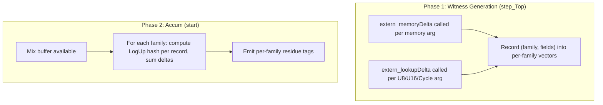

# Phase 3: Hook 3 -- Per-Family Residues via Extern Interception

## What We Are Implementing and Why

### Background

Hook 1 (Phase 2, completed) gives us a binary signal: "some global constraint broke." But it cannot tell us WHICH argument family is responsible (memory, U16, U8, or cycle). Hook 3 fills this gap by computing separate residues for each argument family.

The original catalog described Hook 3 as a "shadow accumulator replay" that re-walks data columns. Through investigation, we found a simpler and more robust approach: **intercept the extern calls** (`extern_memoryDelta`, `extern_lookupDelta`) that already fire during witness generation for every argument usage. These externs receive the exact field values (addr, cycle, data, count, table, index) before the accumulator mixes them. We record them during witgen, then after the mix buffer (verifier randomness) is available at the start of the accum phase, we compute per-family LogUp hashes and residues.

### Why This Approach Is Better Than the Catalog Description

The catalog described re-walking data columns and mapping them to argument families via layout offsets. Investigation revealed this is impractical because:
- Arguments are interleaved across families within each instruction arm (not grouped by family)
- Intermediate accum columns store mixed-family sums (batches of 3 args regardless of family)
- Layout offsets are nested deep in the generated code and vary per instruction arm

The extern interception approach avoids ALL of these issues: the externs already provide the field values tagged by family (table ID = 0/8/16 for cycle/U8/U16; `memoryDelta` for memory). No layout mapping needed.

### Design Principles

1. **Env var controlled:** Only active when `A4_FAMILY_RESIDUE=1` is set
2. **Non-interfering:** Records data during witgen, computes residues after mix available. Does NOT modify any witness or accum buffers.
3. **Distinct tags:** Uses `<a4_family_residue>` tags
4. **Easy toggle/removal:** Self-contained in ffi.cpp, no changes to generated code

---

## Implementation Plan

### Architecture



### Step 1: Add per-family recording globals in ffi.cpp

Add structs and vectors to record argument field values during witgen:

```cpp
struct A4MemoryRecord {
    uint32_t addr;
    uint32_t cycle;
    uint32_t dataLow;
    uint32_t dataHigh;
    int32_t count;  // +1 or -1 (in Baby Bear: 1 or 2013265920)
};

struct A4LookupRecord {
    uint32_t table;  // 0=cycle, 8=U8, 16=U16
    uint32_t index;
    int32_t count;
};

static std::vector<A4MemoryRecord> g_a4_memory_records;
static std::vector<A4LookupRecord> g_a4_lookup_records;
```

### Step 2: Intercept extern_memoryDelta and extern_lookupDelta

In `extern_memoryDelta` (line 237-243), add recording when `A4_FAMILY_RESIDUE` is set:

```cpp
void extern_memoryDelta(
    ExecContext& ctx, Val addr, Val cycle, Val dataLow, Val dataHigh, Val count) {
  if (std::getenv("A4_FAMILY_RESIDUE") != nullptr) {
    g_a4_memory_records.push_back({
        addr.asUInt32(), cycle.asUInt32(),
        dataLow.asUInt32(), dataHigh.asUInt32(),
        static_cast<int32_t>(count.asUInt32())
    });
  }
}
```

In `extern_lookupDelta` (line 219-226), add recording:

```cpp
void extern_lookupDelta(ExecContext& ctx, Val table, Val index, Val count) {
  ctx.tables.lookupDelta(ctx.cycle, table, index, count);
  if (std::getenv("A4_FAMILY_RESIDUE") != nullptr) {
    g_a4_lookup_records.push_back({
        table.asUInt32(), index.asUInt32(),
        static_cast<int32_t>(count.asUInt32())
    });
  }
}
```

### Step 3: Compute per-family residues at start of accum phase

In `risc0_circuit_rv32im_cpu_accum`, BEFORE the phase 1 loop (before stepAccum calls), add the computation. At this point the mix buffer is available in `buffers->mix`.

Read randomness values from the mix buffer:

```cpp
if (std::getenv("A4_FAMILY_RESIDUE") != nullptr && !g_a4_memory_records.empty()) {
    // Read randomness from mix buffer (offsets from kLayoutMix)
    auto read_ext = [&](size_t base_col) -> FpExt {
        return FpExt(buffers->mix.get(0, base_col),
                     buffers->mix.get(0, base_col + 1),
                     buffers->mix.get(0, base_col + 2),
                     buffers->mix.get(0, base_col + 3));
    };

    FpExt r_u8_val      = read_ext(0);   // randomness.argU8.val
    FpExt r_u16_val     = read_ext(4);   // randomness.argU16.val
    FpExt r_mem_addr    = read_ext(8);   // randomness.memoryArg.addr
    FpExt r_mem_cycle   = read_ext(12);  // randomness.memoryArg.cycle
    FpExt r_mem_dataLow = read_ext(16);  // randomness.memoryArg.dataLow
    FpExt r_mem_dataHigh= read_ext(20);  // randomness.memoryArg.dataHigh
    FpExt r_cyc_cycle   = read_ext(24);  // randomness.cycleArg.cycle
    FpExt r_offset      = read_ext(28);  // randomness._offset

    // Compute per-family residues
    FpExt residue_memory{};
    FpExt residue_u16{};
    FpExt residue_u8{};
    FpExt residue_cycle{};

    for (const auto& rec : g_a4_memory_records) {
        FpExt hash = r_mem_addr * FpExt(Fp(rec.addr))
                   + r_mem_cycle * FpExt(Fp(rec.cycle))
                   + r_mem_dataLow * FpExt(Fp(rec.dataLow))
                   + r_mem_dataHigh * FpExt(Fp(rec.dataHigh))
                   + r_offset;
        FpExt delta = FpExt(Fp(rec.count)) * inv(hash);
        residue_memory = residue_memory + delta;
    }

    for (const auto& rec : g_a4_lookup_records) {
        FpExt hash, *target;
        if (rec.table == 8) {
            hash = r_u8_val * FpExt(Fp(rec.index)) + r_offset;
            target = &residue_u8;
        } else if (rec.table == 16) {
            hash = r_u16_val * FpExt(Fp(rec.index)) + r_offset;
            target = &residue_u16;
        } else {  // table == 0 (cycle)
            hash = r_cyc_cycle * FpExt(Fp(rec.index)) + r_offset;
            target = &residue_cycle;
        }
        FpExt delta = FpExt(Fp(rec.count)) * inv(hash);
        *target = *target + delta;
    }

    // Emit per-family residues
    auto is_zero = [](const FpExt& v) {
        return v.elems[0] == Fp(0) && v.elems[1] == Fp(0)
            && v.elems[2] == Fp(0) && v.elems[3] == Fp(0);
    };
    auto emit = [&](const char* family, const FpExt& v) {
        if (is_zero(v)) {
            std::printf("<a4_family_residue>{\"family\":\"%s\", \"nonzero\":false}</a4_family_residue>\n", family);
        } else {
            std::printf("<a4_family_residue>{\"family\":\"%s\", \"nonzero\":true, "
                        "\"e0\":%u, \"e1\":%u, \"e2\":%u, \"e3\":%u}</a4_family_residue>\n",
                        family, v.elems[0].asUInt32(), v.elems[1].asUInt32(),
                        v.elems[2].asUInt32(), v.elems[3].asUInt32());
        }
    };

    emit("memory", residue_memory);
    emit("u16", residue_u16);
    emit("u8", residue_u8);
    emit("cycle", residue_cycle);
    std::fflush(stdout);

    // Reset for next run
    g_a4_memory_records.clear();
    g_a4_lookup_records.clear();
}
```

### Step 4: FpExt arithmetic availability

The computation needs FpExt multiplication and inversion. Check that `fpext.h` provides:
- `FpExt operator*(FpExt rhs)` -- multiplication
- `FpExt inv(FpExt)` -- inversion (or we use the `inv_0` helper from witgen.h)

The existing `inv_0` function in `witgen.h` computes `FpExt` inverse. We need to ensure it's accessible from ffi.cpp.

**Deviation from plan note:** If `inv_0` is only in witgen.h and not easily callable from ffi.cpp's new code, we may need to either include witgen.h or copy the inverse function. The `fpext.h` header defines `FpExt` with `operator*`, `operator+`, etc. We need to check if there's an `inv()` method or standalone function.

### Step 5: Python parser

Add to [touch_coverage.py](a4/core/touch_coverage.py):

```python
_FAMILY_RESIDUE_RE = re.compile(
    r'<a4_family_residue>({.*?})</a4_family_residue>'
)

def parse_family_residues(output: str) -> Optional[List[dict]]:
    """Parse all <a4_family_residue> tags. Returns list of dicts with 'family' and 'nonzero' keys."""
    matches = _FAMILY_RESIDUE_RE.findall(output)
    if not matches:
        return None
    results = []
    for m in matches:
        results.append(json.loads(m))
    return results
```

---

## Testing Plan

### T1: Compilation

```bash
cd workspace/risc0-modified && cargo build -p risc0-circuit-rv32im-sys
cd workspace/output && cargo build --release -p risc0-host
```

### T2: No env var -- no output

Run without `A4_FAMILY_RESIDUE=1`, verify no family_residue tags appear.

### T3: Clean run (no mutation) -- all families zero

```bash
A4_FAMILY_RESIDUE=1 risc0-host --in1 5 --in4 10
```
Expected: 4 lines, all `"nonzero":false`.

### T4: COMP_OUT_MOD -- memory family should be nonzero

```bash
A4_MUTATION_CONFIG=... CONSTRAINT_CONTINUE=1 A4_FAMILY_RESIDUE=1 A4_GLOBAL_RESIDUE=1 risc0-host ...
```
Expected: `memory: nonzero=true`, others likely `nonzero=false` (COMP_OUT_MOD changes a memory value, should only affect memory permutation).

Cross-check: Hook 1 should also show `<a4_global_residue_nonzero>`.

### T5: INSTR_WORD_MOD_SUR global-only -- identify which family

Use run 39's config (changes AUIPC rd from x1 to x17).
Expected: `memory: nonzero=true` (the register write goes to wrong address), others `nonzero=false`.

Cross-check: Hook 1 should show `<a4_global_residue_nonzero>`, local failures = 0.

### T6: Consistency with Hook 1

For T3-T5, verify:
- If Hook 3 shows ALL families zero -> Hook 1 should show `<a4_global_residue_zero/>`
- If Hook 3 shows ANY family nonzero -> Hook 1 should show `<a4_global_residue_nonzero>`

### T7: Proof pipeline unaffected

Verify that with `A4_FAMILY_RESIDUE=1` but no mutation, the verifier still accepts.

---

## Potential Issues and Mitigations

### Memory usage

Each `A4MemoryRecord` is 20 bytes. A trace with 32K cycles might have ~50K memory transactions (2 per memory IO). That's ~1MB of recorded data. Acceptable.

Each `A4LookupRecord` is 12 bytes. There could be ~100K lookup delta calls. That's ~1.2MB. Acceptable.

### FpExt inverse

The `inv_0` function in `witgen.h` computes the inverse of an FpExt value, returning 0 for the zero element. We need this in ffi.cpp. Since ffi.cpp already includes `witgen.h`, `inv_0` should be available. If not, we can use the `FpExt::inv()` method if it exists in `fpext.h`, or copy the inverse implementation.

### Count field encoding

In Baby Bear field, count = +1 is `Fp(1)`, count = -1 is `Fp(2013265920)` (which is `Fp(P-1)`). When we read `count.asUInt32()` in the extern, we get the Baby Bear encoding. We need to use `Fp(rec.count)` (not plain integer) when computing the delta, so the field arithmetic is correct.

**Important:** The count stored as `int32_t` in our record is actually a Baby Bear field element value (uint32_t). We should store it as `uint32_t` and wrap it in `Fp()` when computing. Let me correct the struct to use `uint32_t count`.

### Cycle table (table=0)

The `lookupDelta` for table=0 (cycle) passes `index` which is the cycle value, and `count`. We compute: `hash = r_cyc_cycle * Fp(index) + r_offset`, `delta = Fp(count) * inv(hash)`.

---

## How This Hook Works (Easy Explanation)

### The Problem

Hook 1 tells us "something global broke." But the accumulator mixes ALL argument families together:
- **Memory permutation**: every memory read must match a prior write
- **U16 lookups**: every 16-bit value must be in [0, 65535]
- **U8 lookups**: every 8-bit value must be in [0, 255]
- **Cycle lookups**: cycle ordering constraints

When Hook 1 says "nonzero," we don't know if it's a memory issue, a U16 issue, or something else.

### What Hook 3 Does

Hook 3 computes SEPARATE residues for each family. It does this by:

1. **During witness generation**: The circuit already calls extern functions for every argument:
   - `extern_memoryDelta(addr, cycle, dataLow, dataHigh, count)` for each memory transaction
   - `extern_lookupDelta(table, index, count)` for each U8/U16/Cycle lookup

   We record these calls into per-family vectors.

2. **After verifier randomness is available**: At the start of the accum phase, the mix buffer contains random values that the verifier chose. We use these to compute the same LogUp hash that the circuit uses: `hash = random_linear_combination(fields) + offset`.

3. **Compute per-family totals**: For each recorded argument, compute `count / hash` and sum by family. If a family's total is zero, that family's argument is consistent. If nonzero, that family has an imbalance.

### How It Differs from the Other Hooks

| | Hook 1 | Hook 2 | Hook 3 (this one) |
|---|---|---|---|
| **What** | Is the combined total zero? | Which cycles have non-zero check poly? | Which FAMILY has a non-zero total? |
| **Granularity** | Binary | Per-cycle | Per-family |
| **Answers** | "Something broke" | "Cycle 0 and cycle 16777 have issues" | "Memory permutation broke, U16 lookups fine" |
| **Proof impact** | None | Breaks proof (needs circuit_debug) | None |
| **Cost** | 4 reads | Linear scan | Moderate (replay computation) |

Hook 3 fills the gap between Hook 1's binary signal and Hook 2's per-cycle signal. It tells you WHAT kind of global constraint broke, without needing to know WHERE (which cycle) or breaking the proof.

**Example:** If a mutation changes a register write destination (INSTR_WORD_MOD_SUR), Hook 3 would report:
```
memory: nonzero (the register write goes to wrong address)
u16: zero (range checks unaffected)
u8: zero
cycle: zero
```

This tells the fuzzer: "this mutation specifically broke memory consistency" -- information that can guide mutation strategy.
