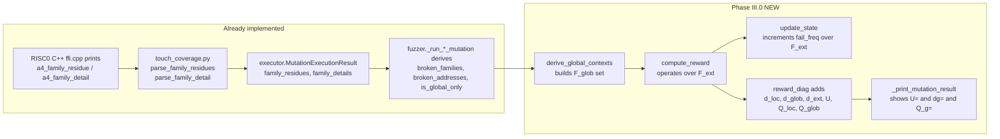

# Phase III.0 — Global-Aware Reward Implementation Plan

> **Anchor**: This is the first per-phase plan derived from [`PRECLOUD_MASTER_PLAN.md`](PRECLOUD_MASTER_PLAN.md) §4.
>
> **Goal in one sentence**: Make `compute_reward` consume Hook 3 global-constraint information so the bandit can differentiate "broke memory address 0x2020" from "broke u8 lookup index 137" (currently it sees both as the same indistinguishable rejection).
>
> **Source-of-truth basis**: Every code change cited below was verified against the live tree at plan time. Line numbers refer to `HEAD` of `main` plus the in-flight precloud branch.

---

## Table of Contents

- [1. Overview & goals](#1-overview--goals)
- [2. Non-goals](#2-non-goals)
- [3. Architecture and data flow](#3-architecture-and-data-flow)
- [4. Source-of-truth map](#4-source-of-truth-map)
- [5. Detailed code changes](#5-detailed-code-changes)
  - [5.1 New helper — `derive_global_contexts`](#51-new-helper--derive_global_contexts)
  - [5.2 `CalibratedParams` — rename `a_Z` → `a_U`, add `tau_g`](#52-calibratedparams--rename-a_z--a_u-add-tau_g)
  - [5.3 `compute_reward` — rewrite body](#53-compute_reward--rewrite-body)
  - [5.4 `update_state` — extend to global contexts](#54-update_state--extend-to-global-contexts)
  - [5.5 `MutationResult` — add `global_contexts` field](#55-mutationresult--add-global_contexts-field)
  - [5.6 Fuzzer wiring — both `_run_bandit_mutation` and `_run_single_mutation`](#56-fuzzer-wiring--both-_run_bandit_mutation-and-_run_single_mutation)
  - [5.7 `_print_mutation_result` — update diag line](#57-_print_mutation_result--update-diag-line)
  - [5.8 `analyze_campaign.py` — extend regex for new diag fields](#58-analyze_campaignpy--extend-regex-for-new-diag-fields)
- [6. Unit test plan](#6-unit-test-plan)
- [7. Smoke test plan](#7-smoke-test-plan)
- [8. Backwards compatibility & migration](#8-backwards-compatibility--migration)
- [9. Acceptance criteria](#9-acceptance-criteria)
- [10. Risks and mitigations](#10-risks-and-mitigations)
- [11. Variable / symbol reference (delta-only)](#11-variable--symbol-reference-delta-only)
- [12. For anyone new](#12-for-anyone-new)
- [13. What this phase explicitly defers to later phases](#13-what-this-phase-explicitly-defers-to-later-phases)

---

## 1. Overview & goals

Reward semantics today (verbatim, [`coverage_state.py:73-172`](a4/standalone/coverage_state.py)):

- $T_{\text{new}}, T_{\text{rare}}$ from the touch bitmap (unchanged)
- $F_{\text{new}}, F_{\text{rare}}$ from $F^{\text{loc}}_t = \{(\text{loc}, \text{major}, \text{minor})\}$
- $Z = \mathbb{1}[\texttt{REJECTED} \wedge \texttt{proof\_generated} \wedge d_{\text{loc}} = 0]$
- $Q = Q_{\text{dist}} \cdot Q_{\text{rep}}$
- $r = \min(1, Q \cdot S)$ with $S$ a weighted average of $\{T_{\text{new}}, T_{\text{rare}}, F_{\text{new}}, F_{\text{rare}}, Z\}$

Reward semantics after III.0:

1. $F^{\text{glob}}_t = \{(\texttt{GLOBAL}, \ell, a)\}$ derived from `family_residues` + `family_details` via a new helper.
2. $F^{\text{ext}}_t = F^{\text{loc}}_t \cup F^{\text{glob}}_t$; **all** $F_{\text{new}}, F_{\text{rare}}$ work over $F^{\text{ext}}_t$ from now on.
3. $Z \to U$ semantically: $U = \mathbb{1}[\texttt{REJECTED} \wedge \texttt{proof\_generated} \wedge d_{\text{loc}} = 0 \wedge d_{\text{glob}} = 0]$.
4. $Q$ gains a third factor: $Q = Q_{\text{loc}} \cdot Q_{\text{rep}} \cdot Q_{\text{glob}}$, where $Q_{\text{glob}} = \exp(-d_{\text{glob}}/\tau_g)$ and $\tau_g \gg \tau_d$.
5. `state.fail_freq` now keys off extended contexts (per-run-per-context increment, like local).
6. `CalibratedParams.a_Z` renamed to `a_U` (back-compat alias kept); new field `tau_g`.

The deliverable is purely on the reward path; no DB schema, no selector additions, no replicate runner. Those are III.1, III.2, III.4 respectively.

### 1.1 Why this is the *first* precloud phase

Master-plan §1 (citing ProG_Report_1 §5) makes this explicit: every phase after III.0 either (a) consumes the new diag fields (III.1, III.3) or (b) is independent of reward (III.2, III.5). Doing III.0 first means every subsequent phase can land on a reward signal that already incorporates global information — no rework.

---

## 2. Non-goals

- ❌ Persisting global contexts to SQLite. → Phase III.1.
- ❌ Adding new selectors. → Phase III.2.
- ❌ Persisting reward-component scalars to SQLite (we only add fields to the printed terminal line + in-memory `MutationResult.reward_diag`). → Phase III.3.
- ❌ Multi-seed replicate runner. → Phase III.4.
- ❌ Step-level cold-start fix in the bandit. → Phase III.5.
- ❌ Re-calibrating $\tau_d$ or $\tau_{\text{new}}$ for the post-Hook-3 regime — kept at current `pilot_calibration` defaults. Re-tuning is part of III.6 if validation reveals it.
- ❌ Modifying Rust/C++ instrumentation. The C++ side already prints `<a4_family_residue>` and `<a4_family_detail>` (verified at [`workspace/risc0-modified/risc0/circuit/rv32im-sys/kernels/cxx/ffi.cpp:512-662`](workspace/risc0-modified/risc0/circuit/rv32im-sys/kernels/cxx/ffi.cpp)).

---

## 3. Architecture and data flow



The only **new** Python module surface is `derive_global_contexts` (kept inside `coverage_state.py` for locality). Everything else is an in-place edit.

---

## 4. Source-of-truth map

Every change in this phase touches exactly these files. Line numbers are anchors at plan time; we will re-anchor against the working tree before each StrReplace.

| File | Lines (approx.) | Edit type | Responsibility |
|---|---|---|---|
| [`a4/standalone/coverage_state.py`](a4/standalone/coverage_state.py) | 1–215 | Add helper, rewrite `compute_reward`, extend `update_state`, update imports | §5.1, 5.3, 5.4 |
| [`a4/standalone/pilot_calibration.py`](a4/standalone/pilot_calibration.py) | 53–90 | Rename `a_Z` → `a_U` (with alias), add `tau_g`, add `__post_init__` | §5.2 |
| [`a4/standalone/fuzzer.py`](a4/standalone/fuzzer.py) | 73–98 (`MutationResult`), 441–478 (`_run_bandit_mutation`), 670–730 (`_run_single_mutation`), 1340–1392 (`_print_mutation_result`) | Add `global_contexts` field, derive set, pass to `compute_reward`, update print | §5.5, 5.6, 5.7 |
| [`a4/standalone/tests/test_coverage_state.py`](a4/standalone/tests/test_coverage_state.py) | (whole file) | Update existing fixtures (`a_Z` → `a_U`), add 5 new tests | §6 |
| [`a4/standalone/tests/analyze_campaign.py`](a4/standalone/tests/analyze_campaign.py) | regex block near top | Extend `REWARD_RE` to capture `dg=`, `U=` (replacing `Z=`); preserve back-compat | §5.8 |

**Files NOT touched** in III.0 (verified): `executor.py`, `touch_coverage.py`, `bandit.py`, `arm_universe.py`, `step_selector.py`, `coverage_db.py`, `cli.py`, `constraint_parser.py`. Each is either upstream of III.0's input boundary (already produces the data we need) or downstream of its output boundary (will be touched by later phases).

---

## 5. Detailed code changes

Each subsection follows the same pattern: **before**, **after**, **rationale**.

### 5.1 New helper — `derive_global_contexts`

**Location**: append to [`coverage_state.py`](a4/standalone/coverage_state.py), right after the imports block (≈ line 32, before the `_CRASH_SIGNALS_*` constants).

**Specification**:

```python
def derive_global_contexts(
    family_residues: Optional[List[dict]],
    family_details: Optional[List[dict]],
) -> Set[Tuple[str, str, str]]:
    """Build the canonical set F_glob = {(GLOBAL, family, address-or-index), ...}
    from Hook 3 output dicts.

    Inputs (from a4.core.touch_coverage parsers):
      family_residues: list of dicts, each {"family": str, "nonzero": bool, ...}.
        Only families with nonzero=True contribute.
      family_details:  list of dicts, each either
          {"family": "memory", "broken_addrs": [int, ...], ...}
        or
          {"family": "u8"|"u16"|"cycle", "broken_indices": [int, ...], ...}

    Returns: a set of 3-tuples ("GLOBAL", family_name, str(addr_or_idx)).
             addr/idx is stringified for uniform hashability; we use decimal
             for now (revisit canonicalisation if III.6 shows pathological
             repetition).
    """
```

**Logic**:

1. If `family_residues is None` or empty: return `set()`.
2. Build `nonzero_families = {fr["family"] for fr in family_residues if fr.get("nonzero")}`.
3. If `family_details is None`: return `set()` (residues nonzero but no detail = degenerate output; treat as no-info rather than fabricating contexts).
4. Iterate `family_details`:
   - If `fd["family"]` ∉ `nonzero_families`: skip (defensive — Hook 3 already only emits details for nonzero families, but we double-check).
   - For `fd["family"] == "memory"`: each `a in fd.get("broken_addrs", [])` → add `("GLOBAL", "memory", str(a))`.
   - Else (u8/u16/cycle): each `i in fd.get("broken_indices", [])` → add `("GLOBAL", fd["family"], str(i))`.
5. Return the accumulated set.

**Imports to add** at top of `coverage_state.py`:

```python
from typing import Dict, List, Optional, Set, Tuple   # Set added
```

**Why a free function, not a method on `CoverageState`?** The helper is pure (no state read/write); inputs come from `MutationExecutionResult`; the same helper will be needed in non-bandit paths and unit tests. Keeping it free makes it trivially fixturable.

### 5.2 `CalibratedParams` — rename `a_Z` → `a_U`, add `tau_g`

**File**: [`a4/standalone/pilot_calibration.py:53-90`](a4/standalone/pilot_calibration.py).

**Before** (current shape, lines 73-90):

```python
class CalibratedParams:
    tau_new: float
    tau_d: float
    K_T_rare: int
    gamma: float
    tau_F_new: float = 2.0
    K_F_rare: int = 2
    r_0: int = 10
    tau_r: float = 25.0
    c_explore: float = 0.25
    a_Tn: float = 1.0
    a_Tr: float = 0.25
    a_Fn: float = 1.0
    a_Fr: float = 1.0
    a_Z: float = 1.0
```

**After**:

```python
@dataclass
class CalibratedParams:
    tau_new: float
    tau_d: float
    K_T_rare: int
    gamma: float
    tau_F_new: float = 2.0
    K_F_rare: int = 2
    r_0: int = 10
    tau_r: float = 25.0
    c_explore: float = 0.25
    a_Tn: float = 1.0
    a_Tr: float = 0.25
    a_Fn: float = 1.0
    a_Fr: float = 1.0
    a_U: float = 1.0      # renamed from a_Z (semantic upgrade — see III.0 plan §5.3)
    tau_g: float = 0.0    # global distinct-failure scale; default := 2*tau_d via __post_init__

    def __post_init__(self):
        # Default tau_g to 2*tau_d unless caller (or env var) overrides.
        if self.tau_g <= 0:
            override = os.environ.get("A4_TAU_G")
            self.tau_g = float(override) if override else 2.0 * self.tau_d

    # Back-compat alias: old code paths and external scripts may still reference `a_Z`.
    @property
    def a_Z(self) -> float:
        return self.a_U

    @a_Z.setter
    def a_Z(self, value: float) -> None:
        self.a_U = value
```

**Imports to add at top of `pilot_calibration.py`** (likely already imported, verify):

```python
import os
```

**Rationale**:

- Renaming `a_Z` to `a_U` reflects the semantic shift ($Z$ no longer means what it used to). A pure rename without alias would break `test_coverage_state.py` and any external diagnostic scripts.
- `tau_g` defaults to `2 * tau_d` per ProG_Report_1 §4.6 ("noticeably larger than tau_d"). Concrete value with current calibration: `tau_d ≈ 3.0`, so `tau_g ≈ 6.0`. Override-able via env var so III.6 validation can sweep without touching code.
- `__post_init__` is idiomatic for `@dataclass` derived defaults.

### 5.3 `compute_reward` — rewrite body

**File**: [`a4/standalone/coverage_state.py:73-172`](a4/standalone/coverage_state.py).

**New signature**:

```python
def compute_reward(
    touch_bitmap: Optional[bytes],
    failures: List[ConstraintFailure],
    exit_code: int,
    outcome: str,
    proof_generated: bool,
    state: CoverageState,
    global_contexts: Optional[Set[Tuple[str, str, str]]] = None,
) -> Tuple[float, dict]:
```

The new keyword arg defaults to `None` so all five existing callers (fuzzer × 2, three test cases) keep compiling. `None` is normalised to `set()` inside the function.

**New body — section by section**:

**(a) Crash / missing-bitmap early return** (lines 97-104 today): keep, but extend the diag dict with the new keys defaulted to neutral values:

```python
if _is_crash(exit_code) or touch_bitmap is None:
    return 0.0, {
        "T_new": 0.0, "T_rare": 0.0, "F_new": 0.0, "F_rare": 0.0,
        "U": 0,                              # was Z
        "delta_T": 0, "delta_F": 0,
        "d_loc": 0, "d_glob": 0, "d_ext": 0, # was d_fail
        "n_fail": len(failures), "r_rep": 0,
        "Q_loc": 0.0, "Q_rep": 1.0, "Q_glob": 1.0, "Q": 0.0,  # Q_loc was Q_dist
        "S": 0.0, "r": 0.0, "mode": "crash",
    }
```

We **rename** `d_fail` → `d_loc` and `Q_dist` → `Q_loc` to match the master-plan symbols. We **rename** `Z` → `U`. `d_glob`, `d_ext`, `Q_glob` are new keys.

**(b) Per-run failure analysis** (lines 106-112 today):

```python
fail_contexts = set()  # F_loc
for f in failures:
    fail_contexts.add((f.constraint_loc(), f.major, f.minor))
n_fail = len(failures)
d_loc = len(fail_contexts)
r_rep = max(0, n_fail - d_loc)

global_contexts = global_contexts or set()  # F_glob
d_glob = len(global_contexts)
ext_contexts = fail_contexts | global_contexts
d_ext = len(ext_contexts)
```

**(c) Touch novelty / rarity** (lines 114-126 today): unchanged.

**(d) Failure novelty / rarity** — change keyset from `fail_contexts` to `ext_contexts`:

```python
delta_F = sum(1 for c in ext_contexts if c not in state.fail_freq)
F_new = 1.0 - math.exp(-delta_F / p.tau_F_new) if p.tau_F_new > 0 else 0.0

if ext_contexts:
    f_weights = [(1.0 / math.sqrt(1.0 + state.fail_freq.get(c, 0)), c) for c in ext_contexts]
    f_weights.sort(reverse=True)
    K_F = min(p.K_F_rare, len(f_weights))
    F_rare = sum(w for w, _ in f_weights[:K_F]) / K_F
else:
    F_rare = 0.0
```

Critically, `state.fail_freq` is now a `Dict[Tuple[str, ...], int]` whose keys are heterogeneous (`(loc, major, minor)` for local, `("GLOBAL", family, addr)` for global). Both are 3-tuples → no type-check ambiguity at the dict-key level.

**(e) U indicator** (replaces line 142):

```python
U = 1 if (
    outcome == "REJECTED"
    and proof_generated
    and d_loc == 0
    and d_glob == 0
) else 0
```

**(f) Q factor** (replaces lines 144-150):

```python
Q_loc = math.exp(-d_loc / p.tau_d) if p.tau_d > 0 else 0.0
if r_rep <= p.r_0:
    Q_rep = 1.0
else:
    Q_rep = math.exp(-(r_rep - p.r_0) / p.tau_r) if p.tau_r > 0 else 0.0
Q_glob = math.exp(-d_glob / p.tau_g) if p.tau_g > 0 else 1.0
Q = Q_loc * Q_rep * Q_glob
```

Crucial invariant: $r_{\text{rep}}$ uses **only** `n_fail - d_loc` (the local instance repeat-mass). Global addresses are already deduped by Hook 3's `broken_addrs` / `broken_indices`, so feeding them into $r_{\text{rep}}$ would double-clip the cascade penalty — see master-plan §0.4 admonition.

**(g) Weighted sum** (replaces lines 152-157):

```python
w_sum = p.a_Tn + p.a_Tr + p.a_Fn + p.a_Fr + p.a_U
if w_sum > 0:
    S = (p.a_Tn * T_new + p.a_Tr * T_rare + p.a_Fn * F_new + p.a_Fr * F_rare + p.a_U * U) / w_sum
else:
    S = 0.0
```

**(h) Final reward** (lines 159-164): unchanged.

**(i) Diag dict** (lines 166-171):

```python
diag = {
    "T_new": T_new, "T_rare": T_rare, "F_new": F_new, "F_rare": F_rare,
    "U": U,
    "delta_T": delta_T, "delta_F": delta_F,
    "d_loc": d_loc, "d_glob": d_glob, "d_ext": d_ext,
    "n_fail": n_fail, "r_rep": r_rep,
    "Q_loc": Q_loc, "Q_rep": Q_rep, "Q_glob": Q_glob, "Q": Q,
    "S": S, "r": r,
    "mode": "accepted" if outcome == "ACCEPTED" else "normal",
}
```

**Backwards-compat note**: callers that read `diag["Z"]` or `diag["d_fail"]` or `diag["Q_dist"]` will get a `KeyError`. Audit:

- [`fuzzer.py:1387`](a4/standalone/fuzzer.py): `d.get('Z',0)` — uses `.get` so will silently degrade to 0. **Must be updated** in §5.7.
- [`fuzzer.py:1388`](a4/standalone/fuzzer.py): `d.get('d_fail',0)` — same, must update to `d_loc`.
- [`tests/analyze_campaign.py`](a4/standalone/tests/analyze_campaign.py) — `REWARD_RE` already optional-captures these; must update in §5.8.
- `tests/test_coverage_state.py` — must update in §6.

### 5.4 `update_state` — extend to global contexts

**File**: [`a4/standalone/coverage_state.py:175-214`](a4/standalone/coverage_state.py).

**New signature**:

```python
def update_state(
    touch_bitmap: Optional[bytes],
    failures: List[ConstraintFailure],
    exit_code: int,
    state: CoverageState,
    global_contexts: Optional[Set[Tuple[str, str, str]]] = None,
) -> None:
```

**New body — only the failure-frequency block changes** (lines 202-208 today):

```python
fail_contexts_seen = set()
for f in failures:
    key = (f.constraint_loc(), f.major, f.minor)
    if key not in fail_contexts_seen:
        fail_contexts_seen.add(key)
        state.fail_freq[key] = state.fail_freq.get(key, 0) + 1

# NEW: increment global contexts once per run per context
for key in (global_contexts or set()):
    state.fail_freq[key] = state.fail_freq.get(key, 0) + 1
```

`fail_contexts_seen` already provides the once-per-run guarantee for local; the `global_contexts` set is itself already a set, so iterating it gives the same once-per-run semantics for free.

**Invariant check**: after this change, `state.fail_freq` keys form a disjoint union — locals have the form `(<file:line>, <int>, <int>)` and globals are `("GLOBAL", <family>, <decimal-string>)`. The first element is never `"GLOBAL"` for a local (it's a `constraint_loc()` string like `"MemoryWrite(...zir:99)"`), so collision is structurally impossible.

### 5.5 `MutationResult` — add `global_contexts` field

**File**: [`a4/standalone/fuzzer.py:73-98`](a4/standalone/fuzzer.py).

**Add field**:

```python
@dataclass
class MutationResult:
    # ... existing fields ...
    family_details: Optional[List[dict]] = None
    global_contexts: Set[Tuple[str, str, str]] = field(default_factory=set)  # NEW
```

The set type matches the helper return type. Default-empty so non-Hook-3 paths (legacy DBs, future tests) don't crash.

### 5.6 Fuzzer wiring — both `_run_bandit_mutation` and `_run_single_mutation`

There are **two** call sites that build `MutationResult` and call `compute_reward`. Both must change identically.

#### 5.6.1 `_run_bandit_mutation` (≈ lines 386–500)

After the existing "Global constraint info from Hook 3" block (lines 441-455 today), add:

```python
from a4.standalone.coverage_state import derive_global_contexts  # already imported, but verify

global_contexts = derive_global_contexts(
    exec_result.family_residues, exec_result.family_details
)
```

Set on the result:

```python
result = MutationResult(
    # ... existing fields ...
    family_details=exec_result.family_details,
    global_contexts=global_contexts,   # NEW
)
```

Pass to `compute_reward` (replaces line 473-476):

```python
reward, diag = compute_reward(
    exec_result.touch_bitmap, failures, exit_code,
    outcome, proof_generated, self.coverage_state,
    global_contexts=global_contexts,
)
```

Pass to `update_state` (replaces line 484):

```python
update_state(
    exec_result.touch_bitmap, failures, exit_code, self.coverage_state,
    global_contexts=global_contexts,
)
```

#### 5.6.2 `_run_single_mutation` (≈ lines 575–743)

Same three changes at the analogous lines. Sub-agent audit located the analogous code at lines 670-685 (Hook 3 derivation), 730 (compute_reward), 740 (update_state) — re-anchor before editing.

#### 5.6.3 Common-path refactor (optional but recommended)

The 14-line block "derive `broken_families`, `broken_addresses`, `is_global_only`, `global_contexts`" is now duplicated in both paths. Extract to a helper on `A4Fuzzer`:

```python
def _derive_global_info(
    self, exec_result, failures: List[ConstraintFailure]
) -> Tuple[List[str], List, bool, Set[Tuple[str,str,str]]]:
    broken_families, broken_addresses = [], []
    if exec_result.family_residues:
        for fr in exec_result.family_residues:
            if fr.get("nonzero"):
                broken_families.append(fr["family"])
    if exec_result.family_details:
        for fd in exec_result.family_details:
            if fd.get("broken_addrs"):
                broken_addresses.extend(fd["broken_addrs"])
            if fd.get("broken_indices"):
                broken_addresses.extend(fd["broken_indices"])
    local_failures = [f for f in failures if f.phase == "local"]
    is_global_only = len(broken_families) > 0 and len(local_failures) == 0
    global_contexts = derive_global_contexts(
        exec_result.family_residues, exec_result.family_details
    )
    return broken_families, broken_addresses, is_global_only, global_contexts
```

This is a pure refactor (no behaviour change) and prevents drift between the two paths during Phase III.1 (when the same block will need to also call `db.record_global_failures`).

**Decision**: do the refactor as part of III.0. It's < 30 LoC and removes one of the most duplication-prone parts of the fuzzer.

### 5.7 `_print_mutation_result` — update diag line

**File**: [`a4/standalone/fuzzer.py:1383-1388`](a4/standalone/fuzzer.py).

**Before**:

```python
if result.reward_diag is not None:
    d = result.reward_diag
    print(f"       r={result.reward:.3f}  T_new={d.get('T_new',0):.2f} "
          f"F_new={d.get('F_new',0):.2f} F_rare={d.get('F_rare',0):.2f} "
          f"Z={d.get('Z',0)} Q={d.get('Q',0):.2f} "
          f"df={d.get('d_fail',0)}")
```

**After**:

```python
if result.reward_diag is not None:
    d = result.reward_diag
    print(f"       r={result.reward:.3f}  T_new={d.get('T_new',0):.2f} "
          f"F_new={d.get('F_new',0):.2f} F_rare={d.get('F_rare',0):.2f} "
          f"U={d.get('U',0)} Q={d.get('Q',0):.2f} "
          f"Q_l={d.get('Q_loc',0):.2f} Q_g={d.get('Q_glob',0):.2f} "
          f"dl={d.get('d_loc',0)} dg={d.get('d_glob',0)}")
```

**Rationale**: shows U not Z; surfaces $Q_{\text{loc}}$ and $Q_{\text{glob}}$ separately so it's instantly visible whether the global penalty is biting; replaces `df=` with `dl=` + `dg=` (the two halves of $d_{\text{ext}}$). The line is one column wider than before (~115 chars); acceptable in the 132-col terminals we always run on.

### 5.8 `analyze_campaign.py` — extend regex for new diag fields

**File**: [`a4/standalone/tests/analyze_campaign.py`](a4/standalone/tests/analyze_campaign.py), `REWARD_RE` block (current line ≈ 45).

**Before**:

```python
REWARD_RE = re.compile(
    r'r=([\d.]+)\s+T_new=([\d.]+)\s+F_new=([\d.]+)\s+F_rare=([\d.]+)'
    r'\s+Z=(\d+)\s+Q=([\d.]+)(?:\s+df=(\d+))?'
)
```

**After**:

```python
# New format (post-III.0): U= replaces Z=, and we now emit Q_l=, Q_g=, dl=, dg=
REWARD_RE = re.compile(
    r'r=([\d.]+)\s+T_new=([\d.]+)\s+F_new=([\d.]+)\s+F_rare=([\d.]+)'
    r'\s+U=(\d+)\s+Q=([\d.]+)'
    r'(?:\s+Q_l=([\d.]+)\s+Q_g=([\d.]+))?'
    r'(?:\s+dl=(\d+)\s+dg=(\d+))?'
)

# Legacy format (pre-III.0 campaigns): Z= and df=
REWARD_RE_LEGACY = re.compile(
    r'r=([\d.]+)\s+T_new=([\d.]+)\s+F_new=([\d.]+)\s+F_rare=([\d.]+)'
    r'\s+Z=(\d+)\s+Q=([\d.]+)(?:\s+df=(\d+))?'
)
```

`parse_terminal()` tries the new regex first; on miss, falls back to the legacy regex and stores `U = old_Z`, `d_loc = old_df`, `d_glob = 0`, `Q_loc = Q`, `Q_glob = 1.0`. This means the boss notebook can re-load the **old** uniform-baseline-1000.txt and bandit-16-fixed-1000.txt without crashing.

**Update `RunRecord`** to add new fields:

```python
@dataclass
class RunRecord:
    # ... existing ...
    U: int = 0          # was Z
    d_loc: int = 0      # was d_fail
    d_glob: int = 0
    Q_loc: float = 1.0
    Q_glob: float = 1.0
```

Keep `Z` and `d_fail` as `@property` aliases for back-compat with the existing notebook cells:

```python
@property
def Z(self): return self.U
@property
def d_fail(self): return self.d_loc
```

---

## 6. Unit test plan

**File**: [`a4/standalone/tests/test_coverage_state.py`](a4/standalone/tests/test_coverage_state.py).

### 6.1 Update existing fixtures

The `_params(...)` factory at lines 25-32 sets `a_Z=1.0`. Change to `a_U=1.0`. All ~14 existing tests should keep passing.

Also: any existing test that asserts `diag["Z"]`, `diag["d_fail"]`, or `diag["Q_dist"]` must be updated to `diag["U"]`, `diag["d_loc"]`, `diag["Q_loc"]` respectively. Pre-edit grep:

```bash
grep -nE 'diag\["(Z|d_fail|Q_dist)"\]|d\["(Z|d_fail|Q_dist)"\]' a4/standalone/tests/test_coverage_state.py
```

### 6.2 Five new tests (in a new class `TestGlobalAwareReward`)

#### Test 1 — `test_no_global_contexts_matches_old_reward`

Goal: with `global_contexts=set()`, the new reward equals the pre-III.0 reward bit-for-bit on a non-trivial fixture (so any silent regression on local-only campaigns is caught).

Strategy: build a fixture with `delta_T = 5`, `delta_F = 2`, `n_fail=4, d_loc=2, r_rep=2`, `outcome=REJECTED, proof=True`. Compute expected $r$ using the algebraic formulas (assert to 1e-9). Then call `compute_reward(..., global_contexts=set())` and assert numerical equality.

#### Test 2 — `test_global_only_increases_F_new`

Goal: a run with `d_loc=0, d_glob=3`, all three globally novel, gives `F_new > 0`, `U=0`, `Q_glob < 1.0`.

```python
def test_global_only_increases_F_new(self):
    state = CoverageState(_params(tau_F_new=2.0, tau_d=3.0))
    state.seed_from_baseline(_bm({0: 1, 1: 1, 2: 1}))  # touch baseline
    g_ctx = {("GLOBAL", "memory", "10"), ("GLOBAL", "u8", "5"), ("GLOBAL", "u16", "7")}
    bm = _bm({0: 1, 1: 1, 2: 1})  # no new touch
    r, d = compute_reward(bm, [], 0, "REJECTED", True, state, global_contexts=g_ctx)
    assert d["d_loc"] == 0 and d["d_glob"] == 3
    assert d["F_new"] > 0
    assert d["U"] == 0           # because d_glob > 0
    assert d["Q_glob"] < 1.0     # mild global penalty
    assert d["Q_loc"] == 1.0     # no local failures
```

#### Test 3 — `test_U_indicator_distinguishes_global_from_unknown`

Goal: $U=1$ requires both $d_{\text{loc}}=0$ and $d_{\text{glob}}=0$.

```python
def test_U_indicator(self):
    state = CoverageState(_params())
    bm = _bm({0: 1})
    # Case a: rejected, no failures of any kind, proof generated -> U=1
    _, d = compute_reward(bm, [], 0, "REJECTED", True, state, global_contexts=set())
    assert d["U"] == 1
    # Case b: rejected with global failures -> U=0
    g = {("GLOBAL", "memory", "1")}
    _, d = compute_reward(bm, [], 0, "REJECTED", True, state, global_contexts=g)
    assert d["U"] == 0
    # Case c: rejected with local failures -> U=0
    _, d = compute_reward(bm, [_fail()], 0, "REJECTED", True, state, global_contexts=set())
    assert d["U"] == 0
```

#### Test 4 — `test_Q_glob_mild`

Goal: with `tau_g = 2 * tau_d`, $Q_{\text{glob}}(d_{\text{glob}}=k)$ matches $Q_{\text{loc}}(d_{\text{loc}}=k/2)$ within 1e-9.

```python
def test_Q_glob_mild(self):
    p = _params(tau_d=3.0)  # __post_init__ sets tau_g = 6.0
    assert p.tau_g == pytest.approx(6.0)
    state_loc = CoverageState(p)
    state_glob = CoverageState(p)
    bm = _bm({0: 1})
    _, dl = compute_reward(bm, [_fail(major=1, minor=1), _fail(major=2, minor=2),
                                _fail(major=3, minor=3)], 0, "REJECTED", True, state_loc)
    g = {("GLOBAL","memory",str(i)) for i in range(6)}  # 6 global vs 3 local
    _, dg = compute_reward(bm, [], 0, "REJECTED", True, state_glob, global_contexts=g)
    # Q_loc(3, tau=3) ≈ exp(-1) ≈ 0.368
    # Q_glob(6, tau=6) ≈ exp(-1) ≈ 0.368
    assert dl["Q_loc"] == pytest.approx(dg["Q_glob"], abs=1e-9)
```

#### Test 5 — `test_state_increments_once_per_ext_ctx`

Goal: invoking `update_state` twice with the same global+local context sets increments each `state.fail_freq[c]` by exactly 2.

```python
def test_update_state_increments_once_per_ext_ctx(self):
    state = CoverageState(_params())
    bm = _bm({0: 1})
    f = [_fail(major=1, minor=1), _fail(major=1, minor=1)]  # repeat instance, same ctx
    g = {("GLOBAL", "memory", "10"), ("GLOBAL", "u8", "5")}
    update_state(bm, f, 0, state, global_contexts=g)
    update_state(bm, f, 0, state, global_contexts=g)
    # local: same key incremented twice (once per run, regardless of repeats)
    loc_key = (f[0].constraint_loc(), 1, 1)
    assert state.fail_freq[loc_key] == 2
    # globals: each incremented twice
    assert state.fail_freq[("GLOBAL", "memory", "10")] == 2
    assert state.fail_freq[("GLOBAL", "u8", "5")] == 2
```

### 6.3 Helper for global fixture dicts

Add to the test module:

```python
def _residues(*families_nonzero) -> List[dict]:
    """Build family_residues fixture. Pass family names that are nonzero."""
    return [{"family": fam, "nonzero": True, "e0": 1, "e1": 0, "e2": 0, "e3": 0}
            for fam in families_nonzero]

def _details_memory(*addrs) -> dict:
    return {"family": "memory", "broken_addrs": list(addrs), "broken_count": len(addrs)}

def _details_lookup(family: str, *idxs) -> dict:
    return {"family": family, "broken_indices": list(idxs), "broken_count": len(idxs)}
```

These let unit tests of `derive_global_contexts` itself look like:

```python
def test_derive_memory(self):
    ctx = derive_global_contexts(_residues("memory"), [_details_memory(10, 20, 30)])
    assert ctx == {("GLOBAL","memory","10"), ("GLOBAL","memory","20"), ("GLOBAL","memory","30")}
```

Add tests for: empty input, only-some-families-nonzero, missing details (residue says nonzero but no detail dict), all-zero residues.

### 6.4 Test execution

```bash
cd /root/arguzz
python -m pytest a4/standalone/tests/test_coverage_state.py -v
python -m pytest a4/standalone/tests/test_bandit.py -v          # must still pass
python -m pytest a4/standalone/tests/test_pilot_calibration.py -v # if it exists, must still pass
```

All-green is a hard gate.

---

## 7. Smoke test plan

**Goal**: prove end-to-end on the real prover that the new reward path is wired correctly.

**Command**:

```bash
cd /root/arguzz
python -m a4.standalone.cli fuzz \
    --host workspace/risc0-modified/target/release/risc0-host \
    --selector zoned \
    --num 50 \
    --seed 999 \
    --db /tmp/iii0_smoke.db \
    -- --in1 5 --in4 10 \
    2>&1 | tee /tmp/iii0_smoke.log
```

**What to check** (in /tmp/iii0_smoke.log):

1. At least one run prints a diag line containing `U=`, `Q_l=`, `Q_g=`, `dl=`, `dg=` — confirms §5.7 wired correctly.
2. At least one run with `INSTR_WORD_MOD_*` shows `dg>0` — confirms `derive_global_contexts` is non-trivially populated.
3. At least one run shows `Q_g<1.00` for a `dg>0` run — confirms `Q_glob` factor is biting.
4. At least one run with `dl=0 dg=0` and `U=1` — confirms the new $U$ indicator fires only when both halves are zero.
5. No `KeyError`, no `AttributeError` in the log.
6. The campaign reaches "Campaign complete: 50 mutations" without crashing.

**If any of (1)–(6) fails**: that's the bug to fix before declaring III.0 done. Each failure mode corresponds to a specific section of §5 above.

---

## 8. Backwards compatibility & migration

### 8.1 Old DBs and old terminal logs

- **Old DBs** (`a4_coverage.db`, `bandit_16_fixed_1000.db`, `uniform_baseline_1000.db`): unaffected — III.0 doesn't touch the DB schema. Old `coverage_db.get_distinct_context_ids_for_campaign` queries continue to work and return the same numbers.
- **Old terminal logs**: parsable via the legacy regex fallback in §5.8. The boss notebook (`boss_presentation.ipynb`) will continue to render against `uniform_baseline_1000.db` + log because every per-run record will fill `U` from `Z` and `d_loc` from `d_fail`.

### 8.2 External scripts

The `CalibratedParams.a_Z` property alias (§5.2) keeps any external script that imports `CalibratedParams` working. Same for `RunRecord.Z` / `RunRecord.d_fail` properties (§5.8).

### 8.3 In-flight Phase II reports

`PHASE_II_*_IMPLEMENTATION_REPORT.md` files reference `Z`, `d_fail`, `Q_dist`, `a_Z` throughout. These are historical records — **do not edit them**. The `MAB_ARCHITECTURE_REVIEW.md` (which is being shipped to ChatGPT Pro and lives at the boundary of historical/current) is also left alone for III.0; if we want to update it to reflect III.0 we do so as a one-shot post-merge edit, not as part of III.0 acceptance.

---

## 9. Acceptance criteria

The phase is complete when **all** of the following hold:

| # | Criterion | How verified |
|---|---|---|
| 1 | `derive_global_contexts` returns the expected sets on six fixture inputs (empty, only-memory, only-lookup, mixed, residue-without-detail, all-zero) | New unit tests in §6 |
| 2 | All 14 (approx.) existing `test_coverage_state.py` tests still pass after `a_Z` → `a_U` rename | `pytest -v` |
| 3 | All 14 `test_bandit.py` tests still pass | `pytest -v` |
| 4 | Five new global-aware reward tests pass | `pytest -v` |
| 5 | 50-mutation smoke campaign completes successfully | §7 |
| 6 | Smoke log contains at least one line each of: `U=1`, `dg>0`, `Q_g<1.00` | grep |
| 7 | Smoke log contains zero `KeyError`/`AttributeError`/`Traceback` lines | grep |
| 8 | `analyze_campaign.parse_terminal()` parses both an old log (`bandit_16_fixed_1000_output.txt`) and the new smoke log without errors, returning `RunRecord`s with both `Z` (alias) and `U` filled | quick repl test |
| 9 | The Phase II.4 1000-mut bandit log re-parses to the same `df` / `Z` / `Q` values it always had | regression test in `analyze_campaign` |
| 10 | A short implementation report (`PHASE_III_0_IMPLEMENTATION_REPORT.md`) is written, mirroring the structure of the Phase II reports | manual review |

---

## 10. Risks and mitigations

| Risk | Likelihood | Impact | Mitigation |
|---|---|---|---|
| `derive_global_contexts` produces millions of contexts on a single run (e.g. memory hook mis-emits a huge `broken_addrs` list) | Low | High — `state.fail_freq` blows up | Hook 3 caps at 10 memory addrs / 20 lookup indices per family per run (verified at [`ffi.cpp:582-630`](workspace/risc0-modified/risc0/circuit/rv32im-sys/kernels/cxx/ffi.cpp)). Add an assertion in `derive_global_contexts` that `len(returned_set) <= 4 * 30 = 120` per run; log a warning and truncate if exceeded. |
| Memory addresses are emitted in different forms between runs (e.g. `12345` vs `0x3039`) — same address, different keys, blows up `f_F^{ext}` | Medium | Medium — over-counts global novelty | Decision in §5.1: use decimal `str(int)` consistently. The C++ side prints `%u` (decimal) for both `broken_addrs` and `broken_indices`, so this is handled by the parser shape. Verified at [`ffi.cpp:582, 657`](workspace/risc0-modified/risc0/circuit/rv32im-sys/kernels/cxx/ffi.cpp). |
| `tau_g = 2*tau_d ≈ 6` is wrong for IWORD runs, which routinely break 5-15 memory addresses → $Q_{\text{glob}}$ collapses too aggressively | Medium | Medium — bandit may over-penalise the highest-information mutation kind | Add `A4_TAU_G` env-var override (§5.2) so III.6 validation can sweep without code changes. If validation shows IWORD runs systematically have `Q_glob < 0.3`, raise default to `4*tau_d`. |
| Local + global contexts collide in `fail_freq` because some local `loc` string happens to equal `"GLOBAL"` | Negligible | High | Structurally impossible — local first-tuple element is always `f.constraint_loc()`, a `<file:line>` string with embedded parens (e.g. `"MemoryWrite(zir/...:99)"`). Document the invariant in `update_state`'s docstring. |
| `a_Z` → `a_U` rename breaks tests that monkeypatch `params.a_Z = …` | Low | Low | Property setter (§5.2) makes assignment work too. |
| `_print_mutation_result` line wraps in narrow terminals | Low | Low (cosmetic) | Acceptable — we always run in 132+-col terminals; the field count is bounded. |

---

## 11. Variable / symbol reference (delta-only)

For full reference, see [`PRECLOUD_MASTER_PLAN.md` §16](PRECLOUD_MASTER_PLAN.md). The deltas this phase introduces:

| Symbol | Role | Code identifier (after III.0) |
|---|---|---|
| $F^{\text{glob}}_t$ | Per-run global failure-context set | `global_contexts` (param) / `MutationResult.global_contexts` (field) |
| $F^{\text{ext}}_t$ | Union $F^{\text{loc}}_t \cup F^{\text{glob}}_t$ | `ext_contexts` (local var in `compute_reward`) |
| $d_{\text{loc}}$ | $\|F^{\text{loc}}_t\|$ (was `d_fail`) | `d_loc` |
| $d_{\text{glob}}$ | $\|F^{\text{glob}}_t\|$ (NEW) | `d_glob` |
| $d_{\text{ext}}$ | $\|F^{\text{ext}}_t\|$ (NEW) | `d_ext` |
| $U$ | Unknown-rejection indicator (replaces $Z$) | `U` (was `Z`) |
| $Q_{\text{loc}}$ | $\exp(-d_{\text{loc}}/\tau_d)$ (was `Q_dist`) | `Q_loc` |
| $Q_{\text{glob}}$ | $\exp(-d_{\text{glob}}/\tau_g)$ (NEW) | `Q_glob` |
| $\tau_g$ | Global distinct-failure scale (NEW) | `CalibratedParams.tau_g` (default `2*tau_d`, env override `A4_TAU_G`) |
| $a_U$ | Weight on $U$ in $S$ (was `a_Z`) | `CalibratedParams.a_U` (with `a_Z` property alias) |

Unchanged but worth re-listing for clarity: $T_{\text{new}}, T_{\text{rare}}, F_{\text{new}}, F_{\text{rare}}, Q_{\text{rep}}, S, r$, and all touch-related state (`global_bitmap`, `freq`).

---

## 12. For anyone new

If you're starting from scratch:

- **Reward** is what tells the bandit "how interesting was that mutation". Today it's mostly a function of how many *novel local failures* the run produced — and a single binary "got past local checks but still rejected" bonus called $Z$.
- We have a separate hook (Hook 3) in the prover that reports which **global** lookup/permutation arguments broke and at which addresses/indices. **Today the reward ignores it.** That's the bug this phase fixes.
- After this phase, the reward will treat each unique broken global address as just another "failure context" — same novelty/rarity machinery as for local failures, just with `(GLOBAL, family, address)` keys.
- The only new tunable is $\tau_g$, the scale on the global distinct-failure penalty. We set it to twice $\tau_d$ by default because Hook 3 caps the number of addresses it reports (so we don't want to over-penalise a run that legitimately broke many things).
- Everything outside the reward function (DB, selectors, bandit, cloud infra) is untouched. That's deliberate — it makes this phase rollback-able with a single `git revert`.

If the smoke test in §7 passes and unit tests are green, the phase is done. If smoke shows that `dg=0` for every IWORD run, `derive_global_contexts` has a bug and §5.1 is the place to look. If `Q_g=1.00` for every run, `tau_g` is too large or `derive_global_contexts` returns empty sets.

---

## 13. What this phase explicitly defers to later phases

| Deferred to | What | Why |
|---|---|---|
| III.1 | Add `global_failures` SQLite table; persist `global_contexts` to DB | Independent change, scoped to `coverage_db.py` + the two fuzzer call sites |
| III.2 | Add `UniformArmSelector`, register `--selector uniform` | Independent — doesn't depend on reward changes |
| III.3 | Add `mutation_rewards` SQLite table; persist diag dict per run | Depends on III.0 (need stable diag schema) and III.1 (table fits naturally beside global_failures) |
| III.4 | `--replicates` flag and `run_replicates.py` | Independent |
| III.5 | Step-level UCB cold-start fix using raw `step_m` counter | Independent (touches `bandit.py` only) |
| III.6 | Validation campaign (3 strats × 3 seeds × 250 muts) | Gates the precloud → cloud transition |
| IV.0+ | Cloud Docker image, dispatcher, A/B campaign, boss notebook | Sequential post-validation |

Each deferred phase has its own implementation plan in this folder, mirroring the structure of this document.

---

## Status

| Item | Status |
|---|---|
| Plan reviewed and approved | PENDING |
| Code changes implemented | NOT STARTED |
| Unit tests written | NOT STARTED |
| Smoke test passed | NOT STARTED |
| Implementation report written | NOT STARTED |
