# PRECLOUD MASTER PLAN — Global-Aware Reward, Multi-Strategy A/B, and Testbed Campaign

> **🛑 PAUSED 2026-06-08**: This plan is on hold pending completion of cloud1 (IV.POS.7 architectural re-design per ChatGPT Pro's `ProG_Report_2.md`). The active plan is now `a4/docs/cloud1/CLOUD1_IMPLEMENTATION_PLAN.md`. Resume only after IV.POS.7 results are reviewed by Pro Round 2 and the Pro response indicates direction. Phases IV.POS.0–IV.POS.5 below are ✅ DONE; IV.POS.7 below is SUPERSEDED by cloud1.

> **Source of authority**: This plan supersedes `PHASE_II_MASTER_IMPLEMENTATION_PLAN.md` for everything from this point forward. It is the single anchor we will execute against, incrementally, until the testbed A/B results are in hand and a boss-facing notebook is delivered.
>
> **Naming note (Jun 4, 2026 pivot):** the document was originally written assuming a Google Cloud Platform (GCP) backend; on Jun 4 PM we pivoted to the **university POS testbed** (see `PIVOT_TO_POS.md` for the historical pivot decision and `POS_PLAYBOOK.md` for the single living source of truth on POS API/workflow/nodes). To minimise churn, scattered shorthand like "cloud A/B" and "before cloud" elsewhere in this document is **synonymous with "IV.POS.5"** and "before IV.POS.5". §11–§18 have been fully rewritten as IV.POS.0–IV.POS.7; the original GCP IV.0–IV.3 is preserved at `a4/cloud/` as a deferred optional backend per `PIVOT_TO_POS.md §15.3`.
>
> **Origin**: It distils [`a4/docs/precloud/ProG_Report_1.md`](a4/docs/precloud/ProG_Report_1.md) (ChatGPT Pro's review of `MAB_ARCHITECTURE_REVIEW.md` + the older `boss_presentation` results) into a concrete, source-grounded execution path. Every claim and design decision has a code citation in [Section 2](#2-source-of-truth-map).
>
> **Deviation from Pro's recommendation (explicitly approved by user)**: Pro recommended dropping the `zoned` selector and comparing only **uniform-arm vs bandit**. We will instead run **all three** baselines — `uniform-arm` (new), `zoned` (existing), `bandit` (existing) — so that we can isolate two effects independently:
> 1. *Selector intelligence* (zoned vs uniform-arm), and
> 2. *Reward-driven exploitation* (bandit vs uniform-arm).
> The `guided` selector is out of scope for the cloud A/B (kept in-tree for diagnostic use).

---

## Table of Contents

- [Section 0 — Preliminary: Architecture Differences (LaTeX)](#0-preliminary-architecture-differences-latex)
- [Section 1 — Why we must block on this before the IV.POS.5 main campaign](#1--why-we-must-block-on-this-before-the-ivpos5-main-campaign)
- [Section 2 — Source-of-truth map](#2-source-of-truth-map)
- [Section 3 — Phase roadmap (one screen)](#3-phase-roadmap-one-screen)
- [Section 4 — Phase III.0 — Global-aware reward](#4-phase-iii0--global-aware-reward)
- [Section 5 — Phase III.1 — Coverage DB schema for global contexts](#5-phase-iii1--coverage-db-schema-for-global-contexts)
- [Section 6 — Phase III.2 — Selector trio (add `uniform-arm`)](#6-phase-iii2--selector-trio-add-uniform-arm)
- [Section 7 — Phase III.3 — Per-run reward-component persistence](#7-phase-iii3--per-run-reward-component-persistence)
- [Section 8 — Phase III.4 — Multi-seed replicate runner](#8-phase-iii4--multi-seed-replicate-runner)
- [Section 9 — Phase III.5 — Step-level cold-start fix](#9-phase-iii5--step-level-cold-start-fix)
- [Section 10 — Phase III.6 — Local validation campaign (200–500 muts)](#10-phase-iii6--local-validation-campaign-200500-muts)
- [Section 11 — Phase IV.POS.0 — POS access and constraint confirmation](#11--phase-ivpos0--pos-access-and-constraint-confirmation)
- [Section 12 — Phase IV.POS.1 — Bundle + single-node smoke](#12--phase-ivpos1--bundle--single-node-smoke-test)
- [Section 13 — Phase IV.POS.2 — Testbed runtime benchmark](#13--phase-ivpos2--testbed-runtime-benchmark)
- [Section 14 — Phase IV.POS.3 — Multi-node dispatch smoke](#14--phase-ivpos3--multi-node-dispatch-smoke)
- [Section 15 — Phase IV.POS.4 — POS local validation campaign](#15--phase-ivpos4--pos-local-validation-campaign)
- [Section 16 — Phase IV.POS.5 — Full POS A/B campaign](#16--phase-ivpos5--full-pos-ab-campaign)
- [Section 17 — Phase IV.POS.6 — Aggregation, plots, boss notebook](#17--phase-ivpos6--aggregation-plots-boss-notebook)
- [Section 18 — Phase IV.POS.7 (conditional) — Checkpointing / larger N / weight A/B](#18--phase-ivpos7-conditional--checkpointing--larger-n--weight-ab)
- [Section 19 — Risks, open decisions, what we explicitly defer](#19--risks-open-decisions-what-we-explicitly-defer)
- [Section 20 — Variable / Symbol reference](#20--variable--symbol-reference)
- [Section 21 — For anyone new](#21--for-anyone-new)

---

## 0 — Preliminary: architecture differences (LaTeX)

This section describes, with mathematical precision, **what changes between the current architecture and the post-precloud architecture**. Every change downstream in this plan is justified by one of these deltas.

### 0.1 Per-run observables

Let $ t $ index a single mutation run. The current run's observation set is:

$$
\mathcal{O}^{\text{old}}_t = \big( U_t,\; F^{\text{loc}}_t,\; \text{outcome}_t,\; \text{proof\_generated}_t \big)
$$

where:

- $U_t = \{ i \in [0, 65536) : \text{touch\_bitmap}_t[i] > 0 \}$ (touched bitmap buckets)
- $F^{\text{loc}}_t = \{ (\ell_c, \mu_c, \nu_c) : c \in \mathcal{F}_t^{\text{loc}} \}$ (distinct local-failure contexts: location string, major opcode dispatch, minor opcode dispatch)
- $\text{outcome}_t \in \{\texttt{ACCEPTED}, \texttt{REJECTED}, \texttt{CRASH}, \texttt{NO\_EFFECT}\}$

The **new** observation set adds Hook 3 global data:

$$
\mathcal{O}^{\text{new}}_t = \mathcal{O}^{\text{old}}_t \;\cup\; \big( \mathcal{G}_t,\; \mathcal{A}^{\ell}_t \big)
$$

where:

- $\mathcal{G}_t \subseteq \{\texttt{memory},\, \texttt{u8},\, \texttt{u16},\, \texttt{cycle}\}$ — broken global families (residue $\neq 0$)
- $\mathcal{A}^{\ell}_t$ — for each $\ell \in \mathcal{G}_t$, the set of broken indices/addresses (per Hook 3, capped at 10 memory addrs / 20 lookup indices per family)

These observables already flow through `MutationExecutionResult.family_residues` and `family_details` ([`a4/core/executor.py:128-138`](a4/core/executor.py)) and are derived into `MutationResult.broken_families` / `broken_addresses` / `is_global_only` in the fuzzer ([`a4/standalone/fuzzer.py:441-455, 670-685`](a4/standalone/fuzzer.py)). **They are not yet consumed by `compute_reward`.**

### 0.2 Failure-context unification (the central change)

Define the **canonical global failure-context set**:

$$
F^{\text{glob}}_t \;=\; \big\{ (\texttt{GLOBAL},\, \ell,\, a) : \ell \in \mathcal{G}_t,\; a \in \mathcal{A}^{\ell}_t \big\}
$$

For $\ell = \texttt{memory}$, $a$ is the broken byte address (canonicalised against register tags `x0`–`x31` if present in `family_details`). For $\ell \in \{\texttt{u8}, \texttt{u16}, \texttt{cycle}\}$, $a$ is the broken lookup index.

The **extended failure-context set** is then:

$$
F^{\text{ext}}_t \;=\; F^{\text{loc}}_t \;\cup\; F^{\text{glob}}_t,\qquad
d_{\text{ext}} = |F^{\text{ext}}_t|,\quad
d_{\text{loc}} = |F^{\text{loc}}_t|,\quad
d_{\text{glob}} = |F^{\text{glob}}_t|
$$

**This is "Option G" from `MAB_ARCHITECTURE_REVIEW.md` §4b.** It is the most surgical way to expose Hook 3 to the bandit, because the reward already has well-tested novelty/rarity machinery for context sets — we just feed it a bigger, semantically richer set.

### 0.3 Global state extension

The campaign-level state $\Sigma$ currently holds:

$$
\Sigma^{\text{old}} = \big( G[\cdot],\; f_T[\cdot],\; f_F^{\text{loc}}[\cdot] \big)
$$

with $G$ the global-touch bitmap (saturating union; see [`coverage_state.py:42-57`](a4/standalone/coverage_state.py)), $f_T$ the per-bucket touch run-frequency, and $f_F^{\text{loc}}$ the per-context local-failure run-frequency.

The new state replaces $f_F^{\text{loc}}$ with an extended-key counter:

$$
\Sigma^{\text{new}} = \big( G[\cdot],\; f_T[\cdot],\; f_F^{\text{ext}}[\cdot] \big),\qquad
\text{keys}(f_F^{\text{ext}}) \subseteq F^{\text{loc}}_\star \cup \big\{(\texttt{GLOBAL}, \ell, a)\big\}
$$

with **once-per-run-per-context** increment semantics (matching the current `f_F^{\text{loc}}` semantics — see review §3.2). This avoids the cascade-amplification trap that was already designed-around for locals.

### 0.4 Reward components — old vs new

#### Touch terms (unchanged)

$$
T_{\text{new}} = 1 - \exp(-\Delta_T / \tau_{\text{new}}),\qquad
\Delta_T = |\{ i \in U_t : G[i] = 0 \}|
$$
$$
T_{\text{rare}} = \frac{1}{K_T}\sum_{i \in \text{top-}K_T(U_t)} \frac{1}{\sqrt{1 + f_T[i]}}
$$

`tau_new` is the *code* identifier on `CalibratedParams` (the docs sometimes call this `tau_T`). Both refer to the same scale parameter.

#### Failure novelty / rarity (now over $F^{\text{ext}}$)

Old (local only):

$$
\Delta_F^{\text{old}} = |\{ c \in F^{\text{loc}}_t : f_F^{\text{loc}}[c] = 0 \}|,\quad
F_{\text{rare}}^{\text{old}} = \frac{1}{K_F}\sum_{c \in \text{top-}K_F(F^{\text{loc}}_t)} \frac{1}{\sqrt{1 + f_F^{\text{loc}}[c]}}
$$

New (extended):

$$
\Delta_F^{\text{new}} = |\{ c \in F^{\text{ext}}_t : f_F^{\text{ext}}[c] = 0 \}|,\quad
F_{\text{rare}}^{\text{new}} = \frac{1}{K_F}\sum_{c \in \text{top-}K_F(F^{\text{ext}}_t)} \frac{1}{\sqrt{1 + f_F^{\text{ext}}[c]}}
$$

$$
F_{\text{new}} = 1 - \exp(-\Delta_F^{\text{new}} / \tau_{F\text{new}})
$$

#### $Z \to U$ — replacement of the unknown-rejection indicator

Old (Z, in [`coverage_state.py:141-142`](a4/standalone/coverage_state.py)):

$$
Z = \mathbb{1}\big[\, \texttt{REJECTED} \,\wedge\, \texttt{proof\_generated} \,\wedge\, d_{\text{loc}} = 0 \,\big]
$$

New (U):

$$
U = \mathbb{1}\big[\, \texttt{REJECTED} \,\wedge\, \texttt{proof\_generated} \,\wedge\, d_{\text{loc}} = 0 \,\wedge\, d_{\text{glob}} = 0 \,\big]
$$

The semantic shift is critical: under $Z$, any run that breaks only a global hook (memory permutation, lookup, etc.) was lumped with truly-uninstrumented rejections. Under $U$, a run that broke *any* instrumented global family is excluded from the unknown bucket — it shows up via $F^{\text{glob}}$ instead. $U$ becomes a true "near-acceptance / instrumentation gap" signal.

#### $Q$ factor — three-component variant

Old:

$$
Q^{\text{old}} = Q_{\text{dist}} \cdot Q_{\text{rep}},\quad
Q_{\text{dist}} = \exp(-d_{\text{loc}} / \tau_d),\quad
Q_{\text{rep}} = \begin{cases} 1 & r_{\text{rep}} \le r_0 \\ \exp(-(r_{\text{rep}}-r_0)/\tau_r) & r_{\text{rep}} > r_0 \end{cases}
$$

New (additional **mild** global-distance penalty; **$Q_{\text{rep}}$ keyed off local cascade only**):

$$
Q^{\text{new}} = Q_{\text{loc}} \cdot Q_{\text{rep}} \cdot Q_{\text{glob}}
$$

$$
Q_{\text{loc}} = \exp(-d_{\text{loc}} / \tau_d),\quad
Q_{\text{glob}} = \exp(-d_{\text{glob}} / \tau_g),\quad \tau_g \gg \tau_d
$$

Pro recommends $\tau_g$ substantially larger than $\tau_d$ because global "addresses" are coarse, deduped, and capped at 10/20 by Hook 3 — over-penalising would inappropriately discount runs that broke many small things.

> **Important Q invariant from Pro §3** (this is non-obvious and must not be forgotten in implementation): $Q_{\text{rep}}$ is computed **only over local instance repeat-mass** $r_{\text{rep}} = \max(0, n_{\text{loc-inst}} - d_{\text{loc}})$. Global "instances" are already deduped to addresses by Hook 3, so feeding them into $Q_{\text{rep}}$ would double-count and clobber the cascade penalty's intent.

#### Final reward (same shape, expanded weights)

$$
S = \frac{a_{T_n} T_{\text{new}} + a_{T_r} T_{\text{rare}} + a_{F_n} F_{\text{new}} + a_{F_r} F_{\text{rare}} + a_U U}{a_{T_n} + a_{T_r} + a_{F_n} + a_{F_r} + a_U}
$$

$$
r_t = \begin{cases}
1 & \text{outcome} = \texttt{ACCEPTED} \\
0 & \text{outcome} = \texttt{CRASH} \;\text{or}\; \text{touch\_bitmap is None} \\
\min(1, Q^{\text{new}} \cdot S) & \text{otherwise}
\end{cases}
$$

#### Default weights (Pro's explicit recommendation, §4.8)

| Symbol | New value | Old value | Rationale |
|---|---:|---:|---|
| $a_{T_n}$ | 1.0 | 1.0 | Keep ITYPE relevant (touch novelty driver) |
| $a_{T_r}$ | 0.25 | 0.25 | Keep relative weight low (rarity is noisy) |
| $a_{F_n}$ | 1.0 | 1.0 | Now over extended contexts — much higher information |
| $a_{F_r}$ | 1.0 | 1.0 | Same |
| $a_U$ | 1.0 (was $a_Z$) | 1.0 | Renamed; same magnitude |

$\tau_{F\text{new}}, K_{F\text{rare}}, r_0, \tau_r$ are kept at current `CalibratedParams` defaults ([`pilot_calibration.py:80-90`](a4/standalone/pilot_calibration.py)).

$\tau_g$ is **new** and defaults to $2 \cdot \tau_d$ (subject to validation in §10).

### 0.5 Selector trio (deviation from Pro)

Pro recommends comparing only `uniform-arm` vs `bandit`. We will run **three** strategies in the cloud A/B:

1. **`uniform-arm`** (NEW): pick `(kind, bucket)` uniformly from the same arm universe the bandit uses, then pick a step uniformly inside that bucket. This is the cleanest baseline for isolating *bandit reward exploitation*.
2. **`zoned`** (EXISTING): the original `ZonedStepSelector` — picks `kind` uniformly, then picks step via init/core/final zones. This is the apples-to-apples comparison against everything we have shipped historically.
3. **`bandit`** (EXISTING, with reward upgrade): Discounted-UCB over the same `(kind, bucket)` arm universe with global-aware reward.

Together these three answer two independent questions:

- "Does ANY structured selector beat purely-uniform sampling?" → `zoned` and `bandit` vs `uniform-arm`
- "Does reward-driven exploitation help over a fair structured baseline?" → `bandit` vs `uniform-arm`

### 0.6 Testbed orchestration (new)

> *(Originally "Cloud orchestration"; reframed Jun 4 PM after pivot to POS. Old prose preserved below for reference; section §11–§18 contains the production design.)*

The current pipeline runs a single campaign in a single Python process on one machine ([`fuzzer.py:502-573`](a4/standalone/fuzzer.py)). The IV.POS.5 A/B requires:

$$
\text{Total runs} = |\text{strategies}| \times R \times N = 3 \times 5 \times 20\,000 = 3 \times 10^5\;\text{mutations}
$$

at ~20–25 s/run wall-clock = **~1700 single-machine hours**, hence the need for horizontal scaling across multiple machines. The minimum dispatch unit is a single seeded campaign ($R$ of these per strategy = trivially parallel).

We will (post-Jun-4 pivot to POS — see §11+ for the detailed design):

- Build a deterministic **tarball bundle** with the repo at a pinned git commit + a sha256-verified prebuilt `risc0-host` + scripts + manifest (`a4/pos/prepare_bundle.sh`).
- Stage that bundle on the POS management node under `~/` (per Jun 5 revision; bundle is shipped per-allocation via `pos.nodes.copy`, not via `/srv/testbed/files`).
- Dispatch $15$ campaigns (3 strategies × 5 seeds, IV.POS.5) via `a4/pos/dispatch_pos.py`, which:
  - allocates the chosen test nodes,
  - boots `debian-bullseye` (`pos.nodes.image` + `pos.nodes.reset`),
  - ships the bundle to each node (`pos.nodes.copy`),
  - pushes per-job parameters as YAML to the allocation (`pos.allocations.set_variables`),
  - launches `run_campaign_pos.sh` on each node (`pos.commands.launch --infile … --queued`).
- Each test node runs `a4/pos/run_campaign_pos.sh`, which downloads the bundle (`pos_download`), builds a venv, runs `cli fuzz`, and `pos_upload`s the resulting DB+log+meta — with a `trap` on EXIT so partial results survive even on failure.
- A local `a4/pos/collect_results_pos.py` pulls the POS result folders and validates DBs; the aggregator (renamed `a4/analysis/aggregate_campaigns.py`) and the boss notebook (`a4/notebooks/pos_ab_presentation.ipynb`) consume them.
- The previous GCP design (Docker image → Artifact Registry → Cloud Run → GCS) is preserved as a deferred optional backend at `a4/cloud/` per `PIVOT_TO_POS.md §15.3`.

---

## 1 — Why we must block on this before the IV.POS.5 main campaign

> **Pivot note:** Originally "before cloud" — the execution backend changed Jun 4, 2026 from GCP to the university POS testbed. The reasoning below still applies; "cloud A/B" becomes "POS A/B (IV.POS.5)".

ProG_Report_1.md §5 is unambiguous: launching a 20k-mutation A/B with the current `compute_reward` would scale up the *exact* phenomenon the older 1000-mutation campaign already showed:

- The bandit increases mean reward and $Z$ events (it optimises what it was given), but
- It does **not** improve cumulative distinct-failure-context coverage, because the global state is collapsed into one binary indicator.

Until $F^{\text{glob}}$ participates in $F_{\text{new}}$ and $F_{\text{rare}}$, no amount of additional pulls will let the bandit differentiate "broke memory address `0x2020`" from "broke u8 lookup index 137". The change is mechanical (no new instrumentation; we already have all the signals), so the cost of doing it pre-IV.POS is small and the cost of skipping it is wasted testbed node-hours.

---

## 2 — Source-of-truth map

Every change in this plan touches one of these files or directories. Citations are line ranges from the read-only audit performed at plan time.

| File | Lines | Role | Touched by |
|---|---|---|---|
| [`a4/standalone/coverage_state.py`](a4/standalone/coverage_state.py) | 42–57, 73–172 | `CoverageState`, `compute_reward`, `update_state` | Phase III.0 (rewrite reward + state) |
| [`a4/core/executor.py`](a4/core/executor.py) | 128–138, 171–221 | `MutationExecutionResult`, Hook 3 env-var flag | Already populates `family_residues`, `family_details` — no change |
| [`a4/core/touch_coverage.py`](a4/core/touch_coverage.py) | 45–55, 179–227 | `parse_family_residues`, `parse_family_detail` | No change (already produces the dicts we need) |
| [`a4/standalone/fuzzer.py`](a4/standalone/fuzzer.py) | 73–98, 195, 225–233, 386–500, 575–743 | `MutationResult`, `_classify_outcome`, `_run_bandit_mutation`, `_run_single_mutation`, `run_campaign`, `global_touch_bitmap`, `_setup_coverage_tracking` | Phase III.0 (thread global ctx into reward), III.2 (uniform selector), III.5 (step cold-start) |
| [`a4/standalone/coverage_db.py`](a4/standalone/coverage_db.py) | 111–126, 237–292, 412–424 | `failures` table schema, `record_failures`, context-set helpers | Phase III.1 (add `global_failures` table or `scope` column) |
| [`a4/standalone/bandit.py`](a4/standalone/bandit.py) | 189–215 | `DiscountedUCBScheduler.update`, `select` (cold-start logic) | Phase III.5 (step-level cold-start) |
| [`a4/standalone/arm_universe.py`](a4/standalone/arm_universe.py) | 137–140 | `n_min`, `B_count` derivation | No change (kept stable for cloud A/B) |
| [`a4/standalone/step_selector.py`](a4/standalone/step_selector.py) | 107–221, 228–445 | `ZonedStepSelector`, `CoverageGuidedSelector`, factory | Phase III.2 (add `UniformArmSelector` class + factory case) |
| [`a4/standalone/cli.py`](a4/standalone/cli.py) | 195–212 | `--selector` choice list, `--seed`, `--num`, `--db`, `--b-count` | Phase III.2 (`uniform` choice), III.4 (`--replicates`, `--seed-base`) |
| [`a4/standalone/pilot_calibration.py`](a4/standalone/pilot_calibration.py) | 53–189 | `CalibratedParams`, `calibrate_from_pilot` | Phase III.0 (rename `a_Z`→`a_U`, add `tau_g`, `K_F_rare` already present) |
| [`a4/standalone/tests/analyze_campaign.py`](a4/standalone/tests/analyze_campaign.py) | (whole file) | Terminal parsing, cumulative metrics, AUC/t80, DB queries | Phase III.0 (parse new diag fields), Phase IV.2 (multi-seed aggregation) |
| `a4/cloud/Dockerfile` | — | CPU image with risc0-host + fuzzer | **DEFERRED OPTIONAL BACKEND** (Jun 4 pivot) |
| `a4/cloud/run_campaign.sh` | — | Container entrypoint | DEFERRED OPTIONAL BACKEND |
| `a4/cloud/dispatch.py` | — | Submits R×|strategies| GCP jobs | DEFERRED OPTIONAL BACKEND |
| **NEW**: `a4/pos/prepare_bundle.sh` | — | Build tarball bundle (repo + risc0-host + scripts + manifest) for POS staging | Phase IV.POS.1 |
| **NEW**: `a4/pos/run_campaign_pos.sh` | — | Test-node entrypoint (reads vars via `pos_get_variable`, runs, `pos_upload` via EXIT trap) | Phase IV.POS.1 |
| **NEW**: `a4/pos/dispatch_pos.py` | — | Management-node dispatcher (per-(strategy, seed) `pos commands launch`) | Phase IV.POS.3 |
| **NEW**: `a4/pos/collect_results_pos.py` | — | Pull POS result-folder artifacts + DB validation | Phase IV.POS.4+ |
| **NEW**: `a4/pos/benchmark_pos.sh` | — | Single-node 3×N=50 benchmark protocol | Phase IV.POS.2 |
| **NEW**: `a4/analysis/aggregate_campaigns.py` | — | Pulls collected artifacts, computes per-seed curves (was `cloud/aggregate.py`) | Phase IV.POS.6 |
| **NEW**: `a4/notebooks/pos_ab_presentation.ipynb` | — | Final boss notebook (was `cloud_ab_presentation.ipynb`) | Phase IV.POS.6 |

---

## 3 — Phase roadmap (one screen)

```mermaid
flowchart TB
    subgraph PreCloud [Phase III - precloud, local machine]
        P0["III.0  Global-aware reward (rewrite compute_reward) [DONE]"]
        P1["III.1  Coverage DB schema for global contexts [DONE]"]
        P2["III.2  Add uniform-arm selector [DONE]"]
        PX["III.2.5  INSTR_TYPE_MOD false-positive investigation [DONE: root cause = circuit_debug cargo feature; FIX applied]"]
        P3["III.3  Persist reward components per run to SQLite [DONE Jun 3/4 2026]"]
        P4["III.4  Multi-seed replicate runner (--replicates flag) [DONE Jun 4 2026]"]
        P5["III.5  Step-level cold-start fix (use raw m_a) [CODE COMPLETE; OPERATIONAL Y=0 IS BY DESIGN per ProG_Report_1 §2.1]"]
        P6["III.6  Local validation campaign (200-500 mut x 3 strats) [DONE ✅]"]
    end
    subgraph POS [Phase IV - POS testbed]
        Q0["IV.POS.0  Access + constraint confirmation (POS_PLAYBOOK.md) [✅ DONE Jun 6]"]
        Q1["IV.POS.1  Bundle + single-node smoke (N=20)"]
        Q2["IV.POS.2  Benchmark (3 strats x N=50 on 1 node)"]
        Q3["IV.POS.3  Multi-node dispatch smoke (3 nodes, 3 strats, N=50)"]
        Q4["IV.POS.4  POS validation campaign (3 strats x 3 seeds x 250)"]
        Q5["IV.POS.5  Full POS A/B (3 strats x 5 seeds x N from Q2)"]
        Q6["IV.POS.6  Aggregation + boss notebook"]
        Q7["IV.POS.7  Conditional checkpoint / N>=20k / weight A/B"]
    end
    P0 --> P1 --> P2 --> PX --> P3 --> P4 --> P5 --> P6
    P6 --> Q0 --> Q1 --> Q2 --> Q3 --> Q4 --> Q5 --> Q6
    Q6 --> Q7
```



Each phase has its own implementation plan, generated incrementally from this master plan. The ordering matters: III.0 unlocks III.1 (we need to know what gets written), III.2 has no dependencies on III.0 and could be parallel, **III.2.5 (Jun 3, 2026) is now RESOLVED — root cause was `circuit_debug` cargo feature in `host/Cargo.toml`; fix applied and verified**, III.3 depends on III.0+III.1, III.4 depends on III.0–III.3, III.5 is independent and could go any time, III.6 is the gate before IV.POS. **Pivot Jun 4, 2026:** the Phase IV execution backend changed from Google Cloud Platform to the **university POS testbed**; see `PIVOT_TO_POS.md` for the pivot decision and `POS_PLAYBOOK.md` for the living POS doc. The old GCP IV.0–IV.3 design is preserved at `a4/cloud/` as a deferred optional backend; the live plan is IV.POS.0–IV.POS.7 (§11–§18 below). IV.POS.0 was at 5/6 acceptance steps as of Jun 5 PM2; everything downstream waits on closing it.

### 3.1 — Phase III.2.5 — INSTR_TYPE_MOD false-positive investigation (intermediate work, RESOLVED Jun 3, 2026)

**Status**: **RESOLVED Jun 3, 2026.** Root cause identified, fix applied, validated. Earlier "WITNESS_INVISIBLE / Path A vs Path B" framing was incorrect and is **superseded** by the findings below. Full tracking document: [`PHASE_III_2_5_FALSE_POSITIVE_TRACKING.md`](PHASE_III_2_5_FALSE_POSITIVE_TRACKING.md).

**One-line summary**: The five `🐛 BUG!` markers were caused by the `circuit_debug` cargo feature being enabled in [`workspace/output/host/Cargo.toml`](workspace/output/host/Cargo.toml). This is an upstream risc0 debug-only feature that, when enabled, makes the verifier accept ALL malformed proofs by reading the DEEP-ALI query point `z` from the proof transcript instead of computing it via Fiat-Shamir. Removing `circuit_debug` from the `prove` feature restored correct behaviour: 5/5 INSTR_TYPE_MOD mutations REJECTED, baseline still verifies OK.

**Why we paused**: The 50-mutation `--selector uniform` smoke at the end of Phase III.2 produced 5 verifier-accepted "BUG!" markers, all `INSTR_TYPE_MOD`. Cross-checking past 1000-mutation campaigns ([`bandit_16_fixed_1000_output.txt`](bandit_16_fixed_1000_output.txt), [`uniform_1000_output.txt`](uniform_1000_output.txt) — both ran Feb 26–27, 2026) showed **0 BUG! markers across 257 INSTR_TYPE_MOD runs**. Every past INSTR_TYPE_MOD got `REJECTED, exit: 101` with `[prover_impl.rs:280] verify segment (internal proof verification failed)`.

**Decisive findings (Jun 3, 2026)**:

1. **Classifier is correct.** End-to-end re-running of the campaign's parsing on the real risc0 output for mutation [17] showed `verifier_accepted=True`, `_classify_outcome="ACCEPTED"`. The `<record>{"context":"Verifier", "status":"success"}</record>` JSON record is literally present in risc0's stdout/stderr. There is no Python-side display bug or misclassification.
2. **a4/ code path is essentially unchanged.** Diffing every Python file in `a4/standalone/` and `a4/core/` between commit `5a529cb` (pre-global-hook) and HEAD: the only changes are pure additions (new fields, new parsing of new tags, a `broken_families` branch in REJECTED — which is ADDITIVE, not subtractive on ACCEPTED). `_check_verifier_acceptance`, `_check_proof_generated`, `_check_proof_verification_failure` are byte-for-byte identical.
3. **Binary is reproducibly bad.** Freshly rebuilt `risc0-host` from current source still emits Prover:success + Verifier:success + exit 0 + 1 `<constraint_fail>` for mutation [17]. Not a stale-binary artifact.
4. **Smoking gun is the `circuit_debug` cargo feature**, traced to upstream code paths:
   - **Prover** ([`risc0/zkp/src/prove/prover.rs:146-157, 208-220`](workspace/risc0-modified/risc0/zkp/src/prove/prover.rs)): with `circuit_debug`, the prover scans `check_poly` for any non-zero row; if found, picks `bad_z = ω^(i/4)` as the DEEP-ALI query point and writes it to the transcript.
   - **Verifier** ([`risc0/zkp/src/verify/mod.rs:309-316`](workspace/risc0-modified/risc0/zkp/src/verify/mod.rs)): with `circuit_debug`, the verifier READS `z` from the transcript instead of sampling via Fiat-Shamir.
   - At the prover-chosen `z`, `check(z) == result(z)` is satisfied by construction. The `check == result` test at [`verify/mod.rs:377-380`](workspace/risc0-modified/risc0/zkp/src/verify/mod.rs) trivially passes. FRI also passes because the committed check polynomial is low-degree in the truncated coefficient form. The verifier returns Ok.
   - `circuit_debug` also disables the `zk_shift` ([`prover.rs:45-46`](workspace/risc0-modified/risc0/zkp/src/prove/prover.rs)), confirming this is the cargo feature mentioned in the Cargo.toml comment "# With check polynomial scan (disables ZK shift, proof always invalid)".
5. **Experimental confirmation**:
   - With `prove = [.., "circuit_debug"]`: mutation [17] → EXIT 0, Verifier:success, BUG!
   - With `prove = [..]` (no `circuit_debug`): mutation [17] → EXIT 101, Prover:error, verify segment panic, REJECTED.
   - Unmutated baseline without `circuit_debug` → EXIT 0, both Prover and Verifier success.
   - 5-mutation `INSTR_TYPE_MOD --selector zoned --seed 42` campaign without `circuit_debug` → 5 REJECTED, 0 BUG, 0 CRASH.

**Why the BUG markers correlated with `INSTR_TYPE_MOD`**: `circuit_debug` causes ANY proof with a non-zero check polynomial to be accepted. `INSTR_TYPE_MOD` is the kind most likely to produce such a check polynomial because changing `major`/`minor` dispatches a different arm during witness generation, producing exactly one non-trivial-but-bounded constraint violation in the column structure. Other kinds either produce widespread violations (already noisy, but still accepted in `circuit_debug`) or get caught by other paths (e.g. memory permutation, global lookup) before reaching the `eqz` check that drives the bad_z scan.

**Why this was not caught earlier**:
- `workspace/output/` is `.gitignore`'d — no git history on `host/Cargo.toml`.
- The user's comment in the Cargo.toml said "proof always invalid" — interpreted as documentation rather than warning. ("Invalid" was meant in the ZK-property-broken sense; the unintended verifier-acceptance side effect was not surfaced.)
- The check-polynomial scan and `<a4_check_poly_scan>` instrumentation were added AFTER `circuit_debug` was enabled, so the contrast between "check polynomial non-zero AND prover rejects" vs "check polynomial non-zero AND prover accepts" was never observed in isolation.
- All recent global-constraint hooks 1/2/3 are pure instrumentation; they do not change prover/verifier control flow.

**Fix applied**:

```diff
-prove = ["risc0-zkvm/prove", "risc0-zkvm/witgen_debug", "risc0-zkvm/circuit_debug"]
+prove = ["risc0-zkvm/prove", "risc0-zkvm/witgen_debug"]
```

Status of binaries:
- `workspace/output/target/release/risc0-host` (mtime Jun 3 22:20) — **FIXED** (no `circuit_debug`).
- `/tmp/risc0-host.WITH_CIRCUIT_DEBUG.bak` — original buggy binary, kept for diffing.
- `/root/arguzz_backups/risc0-host.MAR12.bak` — pre-investigation binary.

**Acceptance criteria for III.2.5 (MET)**:
- [x] Root cause identified to ≥99% confidence (`circuit_debug`).
- [x] Fix applied and verified: 5/5 INSTR_TYPE_MOD mutations REJECTED.
- [x] Baseline still verifies (no regression on legitimate proofs).
- [x] Tracking document `PHASE_III_2_5_FALSE_POSITIVE_TRACKING.md` is complete and authoritative.
- [x] Master plan updated (this section).

**Optional refinements (not blocking III.3)**:

(a) The fixed binary's behaviour for malicious-proof testing: when a mutation produces an invalid witness, the prover panics in `verify_integrity_with_context` (its internal self-verification) before the external host verifier is called. This is correct (the internal call uses the same code as the external one, so the verdict is deterministically the same), but if the user prefers to see an explicit external `Verifier status:error` record for clarity, add a small gated bypass in [`prover_impl.rs`](workspace/risc0-modified/risc0/zkvm/src/host/server/prove/prover_impl.rs):

```rust
if std::env::var_os("A4_SKIP_SELF_VERIFY").is_none() {
    composite_receipt.verify_integrity_with_context(ctx)?;
}
```

This is cosmetic only. No verdict change.

(b) Re-run the 1000-mutation comparison campaigns (`uniform_1000_output.txt`, `bandit_16_fixed_1000_output.txt`) on the fixed binary to confirm baseline rejection rates remain ≈100% across all 8 kinds, and that BUG! is now zero. (~6h locally; defer to III.4 replicate-stability work, where it falls naturally.)

**Phase III.2.6 — DROPPED**: The "journal-diff confirmation" follow-up is no longer needed; it was a workaround for an investigation that has now identified a real fix. We can return to III.3 directly.

---

## 4 — Phase III.0 — Global-aware reward

### 4.1 Goals

1. Re-key `CoverageState.fail_freq` from local-only contexts to extended contexts.
2. Replace `Z` with $U$ (additionally requires `d_glob = 0`).
3. Add `Q_glob` factor.
4. Rename `a_Z` → `a_U` on `CalibratedParams` and add `tau_g`.
5. Make `compute_reward` accept the global-context set.
6. Make `update_state` increment `f_F^{ext}` once per run per context (matching local semantics).

### 4.2 Concrete code changes

#### 4.2.1 New helper: derive $F^{\text{glob}}_t$

Add a free function to [`coverage_state.py`](a4/standalone/coverage_state.py) (or to a new tiny module `a4/standalone/global_contexts.py` if we want isolation):

```python
def derive_global_contexts(
    family_residues: Optional[List[dict]],
    family_details: Optional[List[dict]],
) -> Set[Tuple[str, str, str]]:
    """Build {(GLOBAL, family, address-or-index), ...}.

    Reads the same dicts that parse_family_residues / parse_family_detail
    produce. Only families with nonzero residue contribute. Memory addresses
    are canonicalised against `family_details[*]['register_tag']` if present.
    """
```

This isolates the parsing convention from `compute_reward` so it can be unit-tested independently against fixture residue/detail dicts.

#### 4.2.2 `compute_reward` signature changes

Current ([`coverage_state.py:73-80`](a4/standalone/coverage_state.py)):

```python
def compute_reward(
    touch_bitmap, failures, exit_code, outcome, proof_generated, state
) -> Tuple[float, dict]:
```

New:

```python
def compute_reward(
    touch_bitmap,
    failures,
    exit_code,
    outcome,
    proof_generated,
    state,
    global_contexts: Optional[Set[Tuple[str, str, str]]] = None,
) -> Tuple[float, dict]:
```

`global_contexts=None` defaults to empty set so legacy callers (tests, diagnostics) still work.

#### 4.2.3 Reward-body changes (in order of code line)

1. After computing `fail_contexts` (~ line 107–109), compute `ext_contexts = fail_contexts | (global_contexts or set())`.
2. Compute `d_loc = len(fail_contexts)`, `d_glob = len(global_contexts or set())`, `d_ext = len(ext_contexts)`.
3. Replace the `delta_F` keyset to be over `ext_contexts`, lookup against `state.fail_freq`.
4. Replace the `F_rare` top-K loop to iterate `ext_contexts`.
5. Replace `Z` block (line 141-142) with $U$:
   ```python
   U_ind = float(outcome == "REJECTED" and proof_generated and d_loc == 0 and d_glob == 0)
   ```
6. Add `Q_glob = math.exp(-d_glob / state.params.tau_g)`.
7. Replace `Q = Q_dist * Q_rep` with `Q = Q_loc * Q_rep * Q_glob`.
8. Replace `a_Z`/`Z` in `S` numerator/denominator with `a_U`/`U_ind`.
9. Add the new diag fields to the returned `diag` dict: `d_loc`, `d_glob`, `d_ext`, `Q_loc`, `Q_glob`, `U` (rename `Z` → `U` everywhere in diag — terminal print line and DB columns must follow).

### 4.3 `update_state` changes

Current `update_state` increments `state.fail_freq` over local contexts only. Change it to:

- Take the same `ext_contexts` set
- Increment `state.fail_freq[c] += 1` once per `c in ext_contexts` (idempotent per run)
- Update `state.global_bitmap` and `state.freq` from `touch_bitmap` as before

Crucially, the `fail_freq` keys are now heterogeneous tuples. SQL persistence is **not** affected because `fail_freq` is in-memory only.

### 4.4 `CalibratedParams` changes

In [`pilot_calibration.py:79-90`](a4/standalone/pilot_calibration.py), rename and extend:

```python
@dataclass
class CalibratedParams:
    # ... unchanged calibrated fields ...
    tau_F_new: float = 5.0
    K_F_rare: int = 8
    r_0: int = 4
    tau_r: float = 2.0
    c_explore: float = 0.4
    a_Tn: float = 1.0
    a_Tr: float = 0.25
    a_Fn: float = 1.0
    a_Fr: float = 1.0
    a_U: float = 1.0     # was a_Z
    tau_g: float = 0.0   # NEW; set in __post_init__
```

`tau_g` default-initialises to `2 * tau_d` post-init, with an env-var override `A4_TAU_G` for sweeps.

**Backwards compat**: keep an `a_Z` property alias that maps to `a_U` so any external scripts (analyse, diagnostic, tests/test_bandit.py fixtures) that reference `a_Z` continue to read.

### 4.5 Fuzzer wiring

In [`fuzzer.py`](a4/standalone/fuzzer.py):

- `_run_bandit_mutation` (~lines 386-500): right after deriving `result.broken_families` / `broken_addresses`, also build `result.global_contexts: Set[Tuple[str, str, str]]` via the new helper. Pass it to `compute_reward(..., global_contexts=result.global_contexts)`.
- `_run_single_mutation` (~lines 575-743): same change in the non-bandit path (so `uniform`, `zoned`, `guided` runs all compute the same reward for diagnostics).
- `_print_mutation_result`: add `Glob=N` in the diag print line; rename `Z=` to `U=` for clarity.
- `_classify_outcome` (~lines 225-233): unchanged; `REJECTED` is already triggered if `result.broken_families` is nonempty.

### 4.6 Test plan for III.0

Unit tests in `a4/standalone/tests/test_compute_reward.py` (NEW):

- `test_no_global_contexts_matches_old_reward`: with `global_contexts=set()`, the new reward must equal the old reward bit-for-bit on a fixture with non-trivial $T_{\text{new}}$, $F_{\text{new}}$, $Z=1$ (since `a_U` = old `a_Z`). This pins down "no regression on local-only runs".
- `test_global_only_increases_F_new`: a run with `d_loc = 0, d_glob = 3` and three globally novel contexts must give `F_new > 0`, `U = 0`, `Q_glob < 1`.
- `test_U_indicator`: `outcome=REJECTED, proof=True, d_loc=d_glob=0` → `U=1`; flipping `d_glob=1` → `U=0`.
- `test_Q_glob_mild`: with `tau_g = 2 * tau_d`, `Q_glob(d_glob=k) = Q_loc(d_loc=k/2)` so the curves match in spirit.
- `test_state_increments_once_per_ctx`: invoking `update_state` twice with the same `ext_contexts` increments each `fail_freq[c]` by exactly 2.

### 4.7 Acceptance criteria

- All existing tests pass (esp. `test_bandit.py`, `test_step_selector.py`).
- Five new tests pass.
- Running a 50-mutation `--selector zoned` smoke produces a terminal line containing `U=`, `Glob=N`, `Q_loc=`, `Q_glob=`.

---

## 5 — Phase III.1 — Coverage DB schema for global contexts

### 5.1 Goals

The current `failures` table ([`coverage_db.py:111-126`](a4/standalone/coverage_db.py)) stores only local `ConstraintFailure` rows. There is no record of which families/addresses Hook 3 reported per run. We need this so the boss notebook can plot $C_F^{\text{glob}}(t)$ directly from SQLite (the notebook will not have to re-parse terminal output for it).

### 5.2 Schema decision

**Option A (chosen)**: add a `global_failures` table:

```sql
CREATE TABLE IF NOT EXISTS global_failures (
    id INTEGER PRIMARY KEY AUTOINCREMENT,
    mutation_id INTEGER NOT NULL,
    family TEXT NOT NULL,        -- 'memory' | 'u8' | 'u16' | 'cycle'
    address TEXT NOT NULL,       -- canonical addr or index, as STRING
    residue TEXT,                -- optional: nonzero residue value if exposed
    FOREIGN KEY (mutation_id) REFERENCES mutations(id) ON DELETE CASCADE
);
CREATE INDEX IF NOT EXISTS idx_gf_mut ON global_failures(mutation_id);
CREATE INDEX IF NOT EXISTS idx_gf_ctx ON global_failures(family, address);
```

`address` is TEXT to handle both 64-bit memory addresses (decimal or `0x…` form) and decimal lookup indices uniformly.

**Option B (rejected)**: add a `scope` column to `failures`. Rejected because (a) `failures` rows have many local-specific columns (`pc`, `cycle`, `phase`, `value`) that don't apply globally, leaving lots of NULLs, and (b) Pro's analysis explicitly recommends keeping global vs local distinct in the data model so we can plot them separately without `WHERE scope='global'` everywhere.

### 5.3 Code changes

In [`coverage_db.py`](a4/standalone/coverage_db.py):

- Migration: `_create_tables` adds `global_failures` table.
- New method `record_global_failures(mutation_id, ext_global_contexts)` — bulk-insert with `INSERT OR IGNORE` semantics keyed on `(mutation_id, family, address)` (so re-runs don't double-count).
- New helper `get_global_contexts_for_campaign(campaign_id)` returning `Set[Tuple[str, str]]` for cumulative-curve analysis.
- New helper `get_extended_contexts_for_campaign(campaign_id)` — UNION of `(loc, major, minor)` rows from `failures` and `(GLOBAL, family, address)` rows from `global_failures`.

In [`fuzzer.py`](a4/standalone/fuzzer.py):

- After `db.record_failures(...)` (lines 486-492 / 712-720), call `db.record_global_failures(mutation_id, result.global_contexts)`.

### 5.4 Migration story

Existing DBs (`a4_coverage.db`, `bandit_16_fixed_1000.db`, `uniform_baseline_1000.db`) do not have the `global_failures` table. The `_create_tables` migration uses `CREATE TABLE IF NOT EXISTS`, so old DBs remain readable but their `global_failures` queries return empty. For the precloud validation and cloud A/B campaigns, fresh DBs will be created (as we always do per-campaign).

### 5.5 Acceptance criteria

- Running a 50-mut campaign produces a non-empty `global_failures` table when at least one IWORD mutation triggers Hook 3 residues.
- `get_extended_contexts_for_campaign(1)` returns a superset of `get_distinct_context_ids_for_campaign(1)` and is closed under `(GLOBAL, family, address)` tuples.

---

## 6 — Phase III.2 — Selector trio (add `uniform-arm`)

### 6.1 Goals

Add a `UniformArmSelector` so the cloud A/B can compare three strategies with the same arm universe. Crucially, this selector must **not** consult the bandit — it samples `(kind, bucket)` uniformly and `step` uniformly inside the bucket.

### 6.2 Class definition

In [`step_selector.py`](a4/standalone/step_selector.py), add (after the existing classes):

```python
class UniformArmSelector(StepSelector):
    """Pick (kind, bucket) uniformly at random over the arm universe,
    then pick a step uniformly inside the bucket. Independent of any reward.
    Used as the fair baseline against bandit (same arm universe, no learning).
    """
    def __init__(self, arm_universe, seed=None):
        ...
    def select_kind(self) -> str: ...
    def select_step(self, kind: str, inspection_data) -> int: ...
```

**Note on responsibility split**: the existing zoned selector takes only `(seed, db?, config?)`. UniformArm needs the arm universe in its constructor. We model this by adding an optional `arm_universe` arg to the factory (`create_selector`).

### 6.3 Wiring

- In [`fuzzer.py`](a4/standalone/fuzzer.py) `__init__`, when `selector_strategy == "uniform"`: build `arm_universe` (same as bandit does), instantiate `UniformArmSelector(arm_universe, seed)`, pass it to `_run_single_mutation`.
- In [`cli.py:202-204`](a4/standalone/cli.py): add `"uniform"` to `choices=[...]`. Update `help=` to list all four.
- In [`fuzzer.py`](a4/standalone/fuzzer.py) `_setup_coverage_tracking` (lines 371-376): the uniform path also enables coverage tracking (so its reward diagnostics are computable), the same way the zoned path already does.

### 6.4 Test plan

- `test_uniform_distribution.py` (NEW): run 5000 mock selections, assert each arm is hit `~5000/n_arms ± Poisson` (chi² goodness-of-fit at 1% level).
- `test_uniform_step_in_bucket.py`: assert returned `step` always falls within `[bucket_start, bucket_end)`.

### 6.5 Acceptance criteria

- `python -m a4.standalone.cli fuzz --selector uniform --num 50 ...` runs end-to-end.
- The terminal "BANDIT SETUP" or equivalent block reports `arm universe: 8 kinds × B_count buckets = N arms` exactly as bandit does, so post-hoc tooling that parses arm-universe lines (now in [`analyze_campaign.py`](a4/standalone/tests/analyze_campaign.py) per the recent regex additions) works for uniform too.

---

## 7 — Phase III.3 — Per-run reward-component persistence

**Status:** ✅ **COMPLETE (Jun 3/4, 2026).** New `mutation_rewards` SQLite table with 20 columns (one row per `compute_reward` call). Fuzzer wired at both `_run_bandit_mutation` and `_run_single_mutation`. 6 unit tests + 1 smoke campaign passed. 160/160 standalone tests pass (was 146). See [`PHASE_III_3_IMPLEMENTATION_PLAN.md`](PHASE_III_3_IMPLEMENTATION_PLAN.md) and [`PHASE_III_3_IMPLEMENTATION_REPORT.md`](PHASE_III_3_IMPLEMENTATION_REPORT.md).

### 7.1 Goal

Reward diagnostics ($T_{\text{new}}, T_{\text{rare}}, F_{\text{new}}, F_{\text{rare}}, U, Q_{\text{loc}}, Q_{\text{rep}}, Q_{\text{glob}}, Q, S, r, d_{\text{loc}}, d_{\text{glob}}$) currently live only in printed terminal output. Cloud aggregation must not depend on parsing terminal text — we want SQLite-authoritative.

### 7.2 Schema

Add to `mutations` table (or to a sidecar `mutation_rewards` table for cleanliness):

```sql
CREATE TABLE IF NOT EXISTS mutation_rewards (
    mutation_id INTEGER PRIMARY KEY,
    T_new REAL, T_rare REAL,
    F_new REAL, F_rare REAL,
    U INTEGER, Q_loc REAL, Q_rep REAL, Q_glob REAL,
    Q REAL, S REAL, r REAL,
    d_loc INTEGER, d_glob INTEGER, d_ext INTEGER,
    delta_T INTEGER, delta_F INTEGER,
    FOREIGN KEY (mutation_id) REFERENCES mutations(id) ON DELETE CASCADE
);
```

### 7.3 Code changes

- New method `CoverageDB.record_reward_diag(mutation_id, diag_dict)`.
- Call it from both `_run_bandit_mutation` and `_run_single_mutation` immediately after `compute_reward` returns.
- `analyze_campaign.compute_cumulative_from_db` extended to also pull these per-run scalars when needed.

### 7.4 Acceptance criteria

A 50-mut campaign produces 50 `mutation_rewards` rows; each has `r ∈ [0,1]`, `Q_glob ∈ (0,1]`, etc.

---

## 8 — Phase III.4 — Multi-seed replicate runner

**Status:** ✅ **COMPLETE (Jun 4, 2026).** Wrapper script `a4/standalone/run_replicates.py` shells out R times to `cli.py fuzz` per strategy, supports `--strategies uniform zoned bandit-16 ...`, writes per-seed DBs and a `manifest.json`. 13 fast unit tests + 1 end-to-end smoke (5 min) passed. 160/160 standalone tests pass. See [`PHASE_III_4_IMPLEMENTATION_PLAN.md`](PHASE_III_4_IMPLEMENTATION_PLAN.md) and [`PHASE_III_4_IMPLEMENTATION_REPORT.md`](PHASE_III_4_IMPLEMENTATION_REPORT.md).

### 8.1 Goal

Cloud A/B requires $R = 5$ replicates per strategy. The CLI currently runs one campaign per process. We add `--replicates R --seed-base S0` semantics that loops `seed = S0, S0+1, ..., S0+R-1`, each writing to a per-seed DB and terminal log.

### 8.2 Two implementations (pick one)

**Option A (simpler, chosen for precloud)**: a wrapper script `a4/standalone/run_replicates.py` that shells out to the CLI $R$ times, redirecting outputs.

**Option B (cloud-native)**: each cloud job receives one `--seed` and is dispatched independently. $R$ parallelism comes from the dispatcher (§11), so the local Python wrapper is purely for local validation.

Both are useful. Option A is needed for §10 (local validation needs to do, e.g., 3 strategies × 3 seeds × 200 muts = 9 campaigns from one shell command). Option B is the cloud path.

### 8.3 CLI surface

```text
python -m a4.standalone.run_replicates \
    --strategy uniform --num 200 --replicates 3 --seed-base 1000 \
    --host /path/to/risc0-host \
    --out-dir ./local_validation/uniform/ \
    --host-args -- --in1 5 --in4 10
```

Produces:
- `local_validation/uniform/seed_1000.db`, `seed_1000.log`
- `local_validation/uniform/seed_1001.db`, `seed_1001.log`
- `local_validation/uniform/seed_1002.db`, `seed_1002.log`

### 8.4 Acceptance criteria

`run_replicates.py --strategy bandit --replicates 2 --num 30 ...` produces two distinct DBs whose content differs (different selections under different seeds).

---

## 9 — Phase III.5 — Step-level cold-start fix

**Status:** ✅ **CODE-FAITHFULNESS COMPLETE** (Jun 3) — ⚠️ **OPERATIONAL ACCEPTANCE CRITERION REVISED Jun 4** after the post-fix 1000-mut bandit-16 campaign produced `Step selections: 950 coldstart + 0 UCB`. Production code matches [Pro_Report_9.md §2.2](../touch/Phase%20II/Pro_Report_9.md) verbatim (`step_m == 0` cold-start, raw counter never decayed). However, the original §9.5 acceptance "Y > 0 in a real campaign" was **wrong**: as [ProG_Report_1.md §2.1](ProG_Report_1.md) explicitly notes, step-level UCB never fires at our budget because each arm has ~246 steps / ~7 pulls per arm, leaving the cold-start set perpetually non-empty. This is by design at our scale, not a regression. The arm-level bandit IS exploiting (87% UCB at arm level in the postfix run). See [`PHASE_III_5_IMPLEMENTATION_REPORT.md` §5](PHASE_III_5_IMPLEMENTATION_REPORT.md#5---acceptance-criteria-scorecard) for the full amendment.

**Status of §9.4 acceptance criterion below**: superseded — §9.4 should read "code uses `step_m == 0` cold-start (Pro_Report_9.md §2.2 verbatim)" only. The "Y > 0" wording was based on an unverified assumption; deferred to a hypothetical III.5b that ProG_Report_1.md §6.5 does **not** ask for on the cloud critical path.

### 9.1 Goal

Pro §2.1 flags that step-level UCB never fires because each arm contains too many steps to ever exit cold-start. The fix mirrors the arm-level cold-start fix already shipped in II.5a (raw `m_a` counter rather than decayed `N_a`).

### 9.2 Code changes

In [`bandit.py`](a4/standalone/bandit.py):

- Add `step_m: Dict[Tuple[str,int], int]` parallel to `step_N` (raw count, never decayed).
- In `select`, replace `under_explored_steps = [s for s in steps if step_N.get(s, 0) < n_min]` with `under_explored_steps = [s for s in steps if step_m.get(s, 0) == 0]`.
- Increment `step_m[(kind,step_bucket)] += 1` in `update`, alongside the existing `step_N` decay.

### 9.3 Why this matters for cloud

If we don't fix it, the cloud results will repeat the old finding "step-level cold-start = 100%, step-level UCB = 0%" and we'll get no step-level signal even at $N = 20{,}000$. The fix is small, isolated, and covered by the existing cold-start tests pattern.

### 9.4 Test plan

Extend `test_bandit.py::test_step_cold_start` to:

1. Pull (k, s_a) once with reward 0.0.
2. Pull (k, s_b) once with reward 1.0.
3. Assert next selection prefers `s_b` over `s_a` (UCB-driven, not random) when $c_{\text{explore}}$ is small.

### 9.5 Acceptance criteria

A 200-mut bandit smoke campaign reports `Step selections: X coldstart + Y UCB` with **$Y > 0$** — the central failure mode of the old architecture.

---

## 10 — Phase III.6 — Local validation campaign (200–500 muts)

### 10.1 Goal

Before any cloud spend, **prove on a small local run** that:

1. $F^{\text{glob}}$ is non-empty and varies per kind (e.g. IWORD generates many; LOAD generates few).
2. The reward signal differs across arms (`std(r)` per arm > 0; `corr(reward, pulls)` > 0 in bandit).
3. The three selectors produce distinguishable distributions of `kind` allocation in the `mutations` table.
4. SQL queries (`get_extended_contexts_for_campaign`, `get_global_contexts_for_campaign`) return non-empty sets.

### 10.2 Protocol

3 strategies × 3 seeds × 250 muts = 9 campaigns ≈ 5 hours wall-clock locally (2250 muts × 22 s ÷ 8 parallel sessions). Use `run_replicates.py` from III.4.

### 10.3 Validation notebook

Create `a4/notebooks/precloud_validation.ipynb` with these checks:

- 9 summary rows (one per campaign): final `C_F^{loc}`, `C_F^{glob}`, `C_F^{ext}`, `C_U`, mean reward, `arm_ucb_pct` (bandit only).
- One plot: `C_F^{ext}(t)` curves, color by strategy, line style by seed (so we see within-strategy variance vs across-strategy).
- One Top-10 arms table for the bandit campaigns, sorted by mean reward.
- A row reporting `count(global_failures.id)` to confirm the new table is being populated.

### 10.4 Acceptance criteria (gate to IV.POS)

**Amended Jun 4, 2026** after the post-fix 1000-mut bandit-16 campaign demonstrated that step-level UCB is structurally unreachable at our budget (see §9 amendment and [ProG_Report_1.md §2.1](ProG_Report_1.md)). The "Step selections >0 UCB" criterion was based on a misreading of how ProG_Report_1.md §6.5 treats step-level (it doesn't ask for a fix; it accepts dead step-level as a design tradeoff at B_count=16).

**Revised acceptance criteria (gate to IV.POS) — VERIFIED Jun 5 PM2 via `a4/notebooks/precloud_validation.ipynb`**:

| # | Criterion | Verdict | Evidence |
|---|---|---|---|
| C1 | All 3 campaigns succeeded (no crashes, all DBs > 0 bytes) | ✅ **PASS** | 1000 mutations × 3 campaigns; all `ended_at IS NOT NULL` |
| C2 | Bandit arm-level UCB fraction > 50% | ✅ **PASS (86.5%)** | postfix bandit log: 128 coldstart + 822 UCB |
| C3 | Bandit reward `corr(reward, pulls) > 0.5` at arm level | ✅ **PASS** (skip-pass: bandit DB is pre-III.3; standalone analyze_campaign already confirmed; IV.POS.4 will re-verify on post-III.3 DBs) |
| C4 | `C_F^{ext}` curves separate visibly between strategies (spread > 0.1) | ⚠️ **INFORMATIONAL FAIL (0.047)** — NOT A GATE | Expected at N=1000 per ProG §6.3 (~8 pulls/arm "tiny"); the very question IV.POS.5 with R=5 + bootstrap CIs answers |
| C5 | `F^{glob}` non-empty in ≥ 2 of 3 campaigns | ✅ **PASS (3/3)** | bandit=2137, uniform=2143, zoned=2037 distinct global contexts |
| C6 | `std(reward) > 0` on majority of bandit arms | ✅ **PASS** (skip-pass; same reason as C3) |
| C7 | Zero verifier-accepted mutations across all 3 | ✅ **PASS** | 0/3000 |

**OVERALL HARD-GATE VERDICT: GREEN — IV.POS UNBLOCKED.** (C4 is informational only; failing it does NOT block IV.POS.)

**Cross-reference to "carry-forward" items**: see [`CARRY_FORWARD_TO_TESTBED.md`](CARRY_FORWARD_TO_TESTBED.md) for the full consolidated checklist of every cross-phase concern that gates IV.POS. *(File was renamed from `CARRY_FORWARD_TO_CLOUD.md` during the Jun 4 PM pivot; the old file remains on disk as a historical snapshot.)*

---

## 11 — Phase IV.POS.0 — POS access and constraint confirmation

> **Pivot note (Jun 4, 2026):** The execution backend changed from Google Cloud Platform to the **university POS testbed** (Plain Orchestrating Service — bare-metal experiment orchestrator with management + test nodes, live-booted stateless OS images, `pos.nodes.copy` / `pos_upload`). All sections from §11 onward were rewritten on this date. The previous GCP Phase IV.0–IV.3 is preserved as a deferred optional backend at `a4/cloud/` per `PIVOT_TO_POS.md §15.3`. See `PIVOT_TO_POS.md` for the pivot decision and `POS_PLAYBOOK.md` for the living source-of-truth on POS API, nodes, and workflow. **§1–§10 (Phase III research-side work) are unchanged.**

### 11.1 Why this phase exists

POS is not elastic compute. We must explicitly reserve nodes, choose an OS image, stage a tarball bundle, dispatch via `pos commands launch` (or `poslib`), then collect via `pos_upload`. **Most of those choices depend on facts the user does not yet know** (which testbed, how many nodes, reservation policy, on-node API surface, …). This phase answers those questions before we write any production code against POS.

> **Update (Jun 6) — ✅ IV.POS.0 CLOSED.** All access answers consolidated in `POS_PLAYBOOK.md §5/§8/§11`: Blockchain testbed; default-group nodes (12 × Xeon D-1518 + mtgox + tentacle); outbound internet OK; real POS API confirmed against pos-examples AND against the official `poslib.api.*` + `pos --help` reference; `pos commands launch --infile <script> --queued --name <n>` returns a cmd id; `pos commands await "$CMD_ID"` returns the script's stdout (verified end-to-end on `algofi` Jun 6 05:44; exit code 0, stdout `hello from algofi` + kernel + date). **`poslib` lives in `/srv/testbed/pos/cli/venv3/`** — source `/srv/testbed/pos/cli/venv3/bin/activate` before running `dispatch_pos.py`. Two real `dispatch_pos.py` API bugs caught from the official docs and fixed (`await_id` signature; `set_variables` arg count).

### 11.2 Output of this phase

All information about access, API, nodes, image, workflow consolidated in `a4/docs/precloud/POS_PLAYBOOK.md` (single source of truth). The remaining IV.POS.0 deliverable is to close the §11 verified-commands log row showing `commands launch + await + free` works with real ids.

### 11.3 Process

1. ~~User sends advisor draft~~ (no longer needed; user obtained answers directly).
2. Answers consolidated in `POS_PLAYBOOK.md` §1–§4 + verified-commands §11 (Jun 5/6 commit).
3. User does the one-time POS-account + SSH-key setup via the university GitLab profile flow per the testbed docs.

### 11.4 Acceptance criteria

- `POS_PLAYBOOK.md §11` shows a successful end-to-end run of `commands launch + await + free` with real ids on a free node.
- User can `ssh -p 10022 ivgreiff@coinbase.net.in.tum.de` and run `pos --help` successfully (✅ done Jun 6 01:52).
- A test reservation of one node, one minute, succeeds end-to-end (`pos allocations allocate <node> --duration 60` → `pos nodes image+reset` → `pos commands launch <node> -- echo 42` → `pos commands await <real-cmd-id>` → `pos allocations free <real-alloc-id>`). Allocate / image / reset / launch all PROVEN; await + free pending real-id retry (3rd attempt failed: `bitcoin` was re-taken between attempts).
- `python3 -c "import poslib"` succeeds on management node (verifies `dispatch_pos.py` can run there).

---

## 12 — Phase IV.POS.1 — Bundle + single-node smoke test

### 12.1 Why this phase exists

Before running anything at scale, we prove that **one** clean POS test node can: receive a campaign bundle, set up a Python venv, execute the fixed `risc0-host` binary, run a tiny `cli fuzz` campaign, and `pos_upload` results back.

### 12.2 Artifacts (already written, may need adjustment after IV.POS.0)

- `a4/pos/prepare_bundle.sh` — builds `a4_campaign_<git>.tar.gz`. Includes git-archive of repo, fixed `risc0-host` (with sha256 check), POS scripts, manifest (`bundle.json`). Optionally vendors Python wheels (`--include-wheels`) so test node needs no outbound internet.
- `a4/pos/run_campaign_pos.sh` — test-node entrypoint. Trap on EXIT uploads partial results. **Reads params via `pos_get_variable A4_STRATEGY` etc., NOT via env vars** (revised Jun 5 after `pos-examples/` review).

### 12.3 Steps (REVISED Jun 5, 2026 — real POS API)

```bash
# --- local ---
bash a4/pos/prepare_bundle.sh                          # produces bundles/a4_campaign_<git>.tar.gz
scp -P 10022 bundles/a4_campaign_<git>.tar.gz \
    <username>@coinbase.net.in.tum.de:~/

# --- on mgmt node (one-node reservation; chosen node: bitcoin — was mtgox until Jun 5 PM showed mtgox contended) ---
ssh -p 10022 ivgreiff@coinbase.net.in.tum.de

# Confirm bitcoin is free THIS session
pos nodes list | grep '^bitcoin '   # expect allocation column = "None"

# (one-time per campaign) write a tiny manifest with the single smoke job:
cat > a4/pos/manifests/pos_smoke_v1.json <<EOF
{
  "name": "pos_smoke_iv_pos_1",
  "image": "debian-bookworm",
  "no_internet": false,
  "guest_args": ["--in1", "5", "--in4", "10"],
  "jobs": [ {"strategy": "uniform", "seed": 42, "n": 20} ]
}
EOF

# dispatch_pos.py does: allocate → image → reset → copy bundle → extract →
#                        set_variables → commands launch --infile run_campaign_pos.sh
# (No `pos calendar create` needed — `pos.allocations.allocate(node, duration=N)` handles it.)
python -m a4.pos.dispatch_pos \
  --manifest a4/pos/manifests/pos_smoke_v1.json \
  --bundle ~/a4_campaign_<git>.tar.gz \
  --nodes bitcoin \
  --allocation-duration 240 \
  --await   # block until done

pos allocations free <alloc-id-from-dispatch_manifest.json>

# --- back local ---
rsync -av -e 'ssh -p 10022' <username>@coinbase.net.in.tum.de:<result-folder>/pos_smoke_iv_pos_1/ ./pos_smoke_iv_pos_1/
python -m a4.pos.collect_results_pos --result-folder ./pos_smoke_iv_pos_1/ --out-dir ./pos_smoke_iv_pos_1/ --in-place
```

### 12.4 Acceptance criteria

- `dispatch_pos.py --dry-run` parses the manifest and prints expected node↔job map.
- Node boots successfully into `debian-bullseye`.
- Bundle copies via `pos.nodes.copy` and extracts at `/root/a4_campaign/`.
- `pos_get_variable A4_STRATEGY` etc. resolve to expected values on the test node.
- Python env builds; `cli fuzz` runs to completion (N=20 should take ~7 min on `mtgox`).
- `results_*/pos_smoke_iv_pos_1_uniform_seed42_n20.{db,log,meta.json}` exist on the test node and were `pos_upload`ed.
- `collect_results_pos.py` validates the DB (mutations row count = 20, no DB error).

---

## 13 — Phase IV.POS.2 — Testbed runtime benchmark

### 13.1 Why this phase exists

The "22 s/mut" number was a laptop measurement and **must not** drive POS sizing. We measure real test-node throughput once before committing to an N for the main campaign.

### 13.2 Protocol (per `PIVOT_TO_POS.md §9.1`)

On one representative test node:

```text
uniform N=50 seed=42
zoned   N=50 seed=42
bandit  N=50 seed=42
```

Same image, same `risc0-host` binary (sha256-checked), same guest args (`--in1 5 --in4 10`), same `b_count=16`. Sequential (not concurrent) to match the realism of IV.POS.5.

`a4/pos/benchmark_pos.sh` runs this protocol and writes `pos_benchmark_v1.json`:

```json
{
  "node": "...",
  "cpu_model": "...",
  "n_threads": 24,
  "image": "debian-bullseye",
  "git_commit": "...",
  "host_sha256": "...",
  "b_count": 16,
  "host_args": "--in1 5 --in4 10",
  "runs": [
    {"strategy": "uniform", "seed": 42, "num": 50, "num_recorded": 50, "runtime_seconds": 900, "seconds_per_mutation": 18.0},
    ...
  ],
  "created_at_utc": "..."
}
```

### 13.3 Sizing formula (per `PIVOT_TO_POS.md §9.2`)

Let `S = max over strategies of seconds_per_mutation` (the conservative pick). Let `M` be the number of nodes we can use concurrently, `J = 3 × R` the total campaigns. With `B = ceil(J / M)` batches:

```text
estimated_wall_clock = B × N × S + setup_overhead
safe_budget          = 0.7 × reservation_seconds   (30% slack per §9.2)
```

Choose `N` such that `B × N × S < safe_budget`. The result feeds directly into IV.POS.5's `N`. We do NOT hard-code an N until this number exists.

### 13.4 Acceptance criteria

- `pos_benchmark_v1.json` exists and contains all three strategies' `seconds_per_mutation`.
- The numbers are consistent across strategies within ~20% (a 5× difference suggests benchmark or env issue).
- Sizing formula yields `N ≥ 1000` under the assumed 3-day budget (otherwise we either negotiate more nodes / longer reservation, or accept a smaller `N` in IV.POS.4/5).

---

## 14 — Phase IV.POS.3 — Multi-node dispatch smoke

### 14.1 Why this phase exists

Before running 15 jobs on 15 nodes, we run 3 jobs on 3 nodes to prove the dispatcher, parallel uploads, unique naming, and the collection script all work together. This catches collision bugs (same `pos_upload` destination from two nodes), wrong env-var passing, and missing files cheaply.

### 14.2 Protocol

Smoke manifest (`a4/pos/manifests/pos_smoke_v1.json`):

```json
{
  "name": "pos_smoke_v1",
  "bundle": "<your-subdir>/a4_campaign_<git>.tar.gz",
  "b_count": 16,
  "guest_args": ["--in1", "5", "--in4", "10"],
  "jobs": [
    {"strategy": "uniform", "seed": 42, "n": 50},
    {"strategy": "zoned",   "seed": 42, "n": 50},
    {"strategy": "bandit",  "seed": 42, "n": 50}
  ]
}
```

```bash
python -m a4.pos.dispatch_pos \
  --manifest a4/pos/manifests/pos_smoke_v1.json \
  --nodes <node1> <node2> <node3> \
  --bundle <your-subdir>/a4_campaign_<git>.tar.gz \
  --runner /tmp/a4_uniform_seed42_n50/a4_campaign/scripts/run_campaign_pos.sh \
  --await-all
```

Then `collect_results_pos.py` validates all 3 result folders.

### 14.3 Acceptance criteria

- All 3 jobs complete (`exit_code = 0`).
- `dispatch_manifest.json` records all 3 command IDs.
- Result-folder names are unique per `(strategy, seed)` (no collision).
- `collection_report.json` shows 3 valid DBs (mutations ≥ 50, `mutation_rewards` and `global_failures` non-empty for at least 2/3, `campaign_params` populated for all 3).

---

## 15 — Phase IV.POS.4 — POS local validation campaign

### 15.1 Why this phase exists

Same purpose as the original §10 / III.6: prove the system isn't broken **on the testbed** (testbed-equivalent of III.6). Even though III.6 already ran the equivalent on the laptop, we redo it on the testbed because (a) different CPU, (b) bigger memory headroom, (c) different OS, (d) confirms `pos_upload` + `dispatch_pos.py` work under sustained load.

### 15.2 Protocol

3 strategies × 3 seeds × 250 mutations (per `PIVOT_TO_POS.md §2.4`):

```json
{
  "name": "pos_validation_v1",
  "bundle": "<your-subdir>/a4_campaign_<git>.tar.gz",
  "b_count": 16,
  "guest_args": ["--in1", "5", "--in4", "10"],
  "jobs": [
    {"strategy": "uniform", "seed": 42, "n": 250},
    {"strategy": "uniform", "seed": 43, "n": 250},
    {"strategy": "uniform", "seed": 44, "n": 250},
    {"strategy": "zoned",   "seed": 42, "n": 250},
    {"strategy": "zoned",   "seed": 43, "n": 250},
    {"strategy": "zoned",   "seed": 44, "n": 250},
    {"strategy": "bandit",  "seed": 42, "n": 250},
    {"strategy": "bandit",  "seed": 43, "n": 250},
    {"strategy": "bandit",  "seed": 44, "n": 250}
  ]
}
```

Each campaign at the benchmarked s/mut ≈ 18s → 250 × 18 = ~75 min per campaign. With 9 nodes in parallel: ~75 min wall. With fewer nodes, scale up.

### 15.3 Acceptance criteria (same as III.6 §10.4 + the testbed-specific extras)

| # | Criterion | How |
|---|---|---|
| 1 | All 9 campaigns succeed (`collect_results_pos` reports OK on all) | report |
| 2 | All DBs have `campaign_params` row (post-Jun-4 fuzzer hook fires on every fresh run) | SQL |
| 3 | At least 6/9 campaigns have `global_failures` non-empty | SQL |
| 4 | At least 2/3 bandit campaigns have `std(reward) > 0` per arm (majority of arms non-degenerate) | per-arm aggregation |
| 5 | $C_F^{\text{ext}}$ curves separate visibly between the 3 strategies (spread metric > 0.1) | reuse `precloud_validation.ipynb` |
| 6 | Bandit arm-level UCB fraction > 50% in at least 2/3 bandit campaigns | log parse OR `mutation_rewards` query |
| 7 | Zero verifier-accepted mutations across all 9 | SQL |

This re-runs `a4/notebooks/precloud_validation.ipynb` (or a sibling) against the 9 collected DBs.

### 15.4 If gate fails

Do NOT proceed to IV.POS.5. Diagnose:

- If DBs are missing → POS infra bug; fix `dispatch_pos.py` or `run_campaign_pos.sh`.
- If `global_failures` empty → Hook 3 not firing on the testbed; check `A4_FAMILY_RESIDUE` env handling.
- If $C_F^{\text{ext}}$ doesn't separate → reward weight problem; revisit `tau_g` (jump to IV.POS.7 weight sweep).

---

## 16 — Phase IV.POS.5 — Full POS A/B campaign

### 16.1 Specification

| Parameter | Value | Source |
|---|---|---|
| Strategies | `uniform`, `zoned`, `bandit` | User: 3 baselines |
| Replicates per strategy | $R = 5$ | Pro §6.4 |
| Mutations per replicate | $N$ from IV.POS.2 sizing | not hard-coded pre-benchmark |
| Bucket count | $B_{\text{count}} = 16$ | Pro §6.5: hold constant |
| Guest program | risc0-host with `--in1 5 --in4 10` | Same as 1000-mut + IV.POS.4 |
| Total mutations | $3 \times 5 \times N$ | derived |
| Seeds | `42, 43, 44, 45, 46` | reproducible from manifest |

Reasonable candidate `N` values per `PIVOT_TO_POS.md §11/IV.POS.5`:

| `N` | Wall (single node @ S=22s/mut) | Wall (3 nodes) | Wall (15 nodes) | When |
|---|---|---|---|---|
| 1,000 | 6.1h | 30.6h (1.3d) | 6.1h | conservative; very safe within 3d reservation |
| 2,500 | 15.3h | 76.4h (3.2d) | 15.3h | moderate |
| 5,000 | 30.6h | 152.8h (6.4d) | 30.6h | aggressive; only OK if many nodes + benchmark is faster than laptop |
| 20,000 | 122h | DOESN'T FIT | 122h | NOT for this phase; requires checkpointing (IV.POS.7) |

Final `N` chosen after `IV.POS.2` benchmark + node-count confirmation.

### 16.2 Manifest

`a4/pos/manifests/pos_ab_v1.json`:

```json
{
  "name": "pos_ab_v1",
  "image": "debian-bullseye",
  "no_internet": false,
  "guest_args": ["--in1", "5", "--in4", "10"],
  "jobs": [
    {"strategy": "uniform", "seed": 42, "n": <N>, "b_count": 16},
    {"strategy": "uniform", "seed": 43, "n": <N>, "b_count": 16},
    {"strategy": "uniform", "seed": 44, "n": <N>, "b_count": 16},
    {"strategy": "uniform", "seed": 45, "n": <N>, "b_count": 16},
    {"strategy": "uniform", "seed": 46, "n": <N>, "b_count": 16},
    {"strategy": "zoned",   "seed": 42, "n": <N>, "b_count": 16},
    ...
    {"strategy": "bandit",  "seed": 46, "n": <N>, "b_count": 16}
  ]
}
```

This is the single artefact that lets a future engineer reproduce the campaign deterministically. Combined with `bundle.json` (git commit + binary sha) it pins reproducibility.

### 16.3 Dispatch

**Node selection (per Coinbase node table — see `POS_PLAYBOOK.md §3.1`)**: prefer the FREE Xeon D-1518 default-group nodes at dispatch time (`pos nodes list | awk '$2=="host" && $3=="booted" && $4=="None"'`). On Jun 5/6 evidence: `bitcoin`, `dogecoin`, `dogecoincash`, `ethergold` were free; `bitcoincash`, `bitcoingold`, `mtgox` were taken long-term. With 15 jobs and ~10 free homogeneous Xeon D-1518s typical, dispatch may run in two batches (10 then 5) — or one batch if enough are free.

```bash
python -m a4.pos.dispatch_pos \
  --manifest a4/pos/manifests/pos_ab_v1.json \
  --nodes bitcoin bitcoincash bitcoingold dogecoin dogecoincash dogecoingold \
          ether ethercash ethergold litecoin litecoincash litecoingold \
  --bundle ~/a4_campaign_<git>.tar.gz \
  --image debian-bullseye \
  --out a4/pos/manifests/pos_ab_v1.dispatch.json \
  --await
```

The dispatcher submits via `pos.commands.launch(..., queued=True)` (deferred until node boot finishes). Monitor via `pos commands list` and `pos commands await <id>`. Per-job upload-on-EXIT trap means partial DBs survive crashes.

### 16.4 Failure handling

- 1–2 jobs crash: rerun the specific `(strategy, seed)` after diagnosing; new `pos_upload -f` overwrites.
- ≥3 fail with the same root cause: stop, fix, re-launch failed subset.
- Pivot §12.3: "Do not silently merge partial and rerun DBs unless checkpoint/resume is explicitly implemented."

### 16.5 Acceptance criteria

- 15/15 jobs report `exit_code = 0`.
- All 15 DBs collected, each with `num_recorded ≥ 0.99 × N` (allow tiny shortfall from skipped mutations).
- All 15 logs contain a completion marker.
- `collect_results_pos.py` reports 0 invalid DBs.

### 16.6 CLOSURE (Jun 7, 2026 22:21 EDT)

**STATUS: ✅ ALL ACCEPTANCE CRITERIA MET**

| Criterion | Result |
|---|---|
| 15/15 jobs `exit_code = 0` | ✅ |
| 15/15 DBs with `num_recorded ≥ 0.99 × N` | ✅ (14 at exactly 6000; 1 at 5999 — d2 retry bandit-16 seed=1235) |
| 15/15 logs with completion marker | ✅ |
| `collect_results_pos.py` reports 0 invalid DBs | ✅ (with `--expected-min-mutations 5999`) |

**Final dispatch table (Tampa EDT / Munich CEST):**

| Dispatch | Seed | Launch (CEST) | End (CEST) | Wall | Allocation |
|---|---|---|---|---|---|
| d1 | 1234 | Sat 21:32 | Sun 02:27 | 4h54m48s | ivgreiff_260606_213218_937447 (1648) |
| d2 (killed) | 1235 | Sun 02:27 | Sun 03:17 | 41 min — KILLED by smart-runner bug | ivgreiff_260607_022711_697736 (1648→1647 cross-boundary) |
| d3 | 1236 | Sun 03:17 | Sun 08:25 | ~5h08m | ivgreiff_260607_031716_237914 (1647) |
| d4 | 1237 | Sun 09:00 | ~Sun 14:00 | ~5h | (allocation from 1649) |
| d5 | 1238 | Sun 15:00 | Sun 19:55 | 4h55m | (allocation from 1650) |
| d2 retry | 1235 | Sun 22:01 | ~Mon 03:00 | ~5h | ivgreiff_260607_220121_533147 (1650→1651 cross-boundary) |

**HEADLINE RESULT — see `a4/runs/iv_pos_5/CLOSURE.txt`:**

| Strategy | Mean coverage | Std | 95% CI | % of universe |
|---|---:|---:|---|---:|
| **zoned** | **43.4** | 1.14 | ±1.42 | **100%** (46/46) |
| bandit-16 | 37.4 | 2.97 | ±3.68 | 93.5% (43/46) |
| uniform | 35.0 | 1.00 | ±1.24 | 89.1% (41/46) |

Paired t-tests (n=5 seeds, 4 d.f., paired by seed):
- **bandit-16 vs zoned: -6.00 contexts (-13.8%), SIGNIFICANT (t=-4.05, p≈0.015)** — bandit is **worse** than zoned
- **uniform vs zoned: -8.40 contexts (-23.8%), HIGHLY SIGNIFICANT (t=-12.39, p<0.001)**
- bandit-16 vs uniform: +2.40 contexts (+6.9%), not significant (t=2.14, p≈0.1)

**This is the OPPOSITE of the original hypothesis** (which expected MAB-based selection to beat manually-tuned baselines). The follow-up analysis (next section) explains why.

### 16.7 Why zoned beats bandit (mechanism)

The `coverage`, `mutations`, and `failures` tables on the 15 DBs were cross-analysed (`a4/runs/iv_pos_5/plots/03_kind_distribution.png`, `04_failure_vs_coverage_yield.png`). Three findings:

1. **Universe size**: only 46 unique constraint contexts exist in this circuit. Zoned hits all 46 across 5 seeds. The 3 contexts zoned-alone reaches are **MEM/MUL input constraints** (`MemLoadInput@inst_mem.zir:8`, `MemStoreInput@inst_mem.zir:18`, `MulInput@inst_mul.zir:8`). These require specific input-value mutation patterns that zoned encodes natively in `MEM_VAL_MOD`/`LOAD_VAL_MOD`/`STORE_OUT_MOD`/`PRE_EXEC_REG_MOD` sub-strategies.

2. **Bandit converges to wrong kinds**: across all 5 seeds, bandit consistently picks `INSTR_WORD_MOD_SUR` (~17%), `INSTR_WORD_MOD_FULL` (~15%), and `COMP_OUT_MOD` (~12%) as its top 3 — but these mutation families don't generate the MEM-targeting patterns. Despite being the "weak" baseline, **uniform's even spread (~12.5% per kind) gets it closer to zoned's coverage than bandit's biased exploration**.

3. **Bandit's reward signal optimizes failure-density, not coverage-diversity**: the `failure yield per kind` (mean failures per mutation) ranks INSTR_TYPE_MOD highest (5.14 fail/mut) and INSTR_WORD_MOD_SUR lowest (1.06 fail/mut). Bandit picks neither the highest-yield NOR the highest-coverage kind — it follows a composite reward (`T_new`, `T_rare`, `F_new`, `F_rare`, `Q_loc`, `Q_rep`, `Q_glob`) that, on this circuit, happens to favor INSTR_WORD strategies that are **failure-rich but coverage-poor**.

### 16.8 Operational anti-patterns discovered Jun 6–7 during IV.POS.5

Documented in `POS_PLAYBOOK.md §12.39–§12.41`:

- **§12.39**: POS DOES auto-evict squatters at reservation `start_date` (with 1-3 sec delay).
- **§12.40**: POS allocations PERSIST past their calendar event end_date when a follow-up same-nodes/same-owner reservation immediately succeeds.
- **§12.41**: `pos allocations free <id>` CLI defaults to `trim=True` (opposite of poslib Python API default `trim=False`). Use `-k` flag to preserve calendar entries. THIS BROKE 1647 mid-campaign; harmless because allocation persisted but cosmetically wrong.

Plus the bash-quoting bug in `auto_run_ab_v1_smart.sh:has_previous_dispatch_running` that killed d2 mid-run (fixed in commit 344c626; **lost ~41 min of compute, recovered fully via d2 retry**).

### 16.9 Implications for ProG_Report_1.md / future work

- **Negative result for bandit at N=6000**: the MAB layer adds variance without adding coverage. Two possible reasons (future work):
  - **N too small for convergence**: bandit may need 20k+ mutations to escape its local optimum. Test in a future IV.POS.7 campaign with `bandit-16` only at N=20000.
  - **Reward signal misspecified**: the composite reward favors failure-density over coverage-diversity. Future work: try a "coverage-greedy" reward where reward = #NEW_constraints_discovered, ignoring failure counts.
- **Positive result for zoned**: structurally-aware mutation strategies dominate. The zoned manifest is essentially "domain knowledge encoded in mutation distribution"; on RISC0 zkVM, this clearly outperforms the MAB-based meta-strategy at this budget.
- **Headline for paper**: "On RISC0 zkVM coverage fuzzing at N=6000 budget, structured mutation strategies (zoned) reach 100% of the constraint universe and significantly outperform MAB-based strategy selection (bandit-16). The MAB layer's exploration-exploitation tradeoff converges to high-failure-yield but low-coverage-diversity mutations, suggesting either insufficient budget or a misspecified reward signal."

### 16.10 Result artifacts

```
a4/runs/iv_pos_5/
├── CLOSURE.txt                          ← human-readable headline result
├── COLLECTION_REPORT_FINAL.json         ← canonical per-DB validation report
├── validated/collection_report.json     ← (same)
├── plots/
│   ├── 01_cumulative_coverage.png       ← primary A/B figure
│   ├── 02_coverage_boxplot.png          ← per-seed scatter + significance
│   ├── 03_kind_distribution.png         ← bandit's pathology
│   └── 04_failure_vs_coverage_yield.png ← reward-signal critique
└── <15 result DBs distributed in per-dispatch folders>
```

---

## 17 — Phase IV.POS.6 — Aggregation, plots, boss notebook

### 17.1 Aggregator

`a4/analysis/aggregate_campaigns.py` (renamed from old `a4/cloud/aggregate.py`; pivot §15.2):

```python
load_collection_report('pos_ab_v1_results/collection_report.json')
load_per_seed_curves(strategy)              # dict {seed -> dict {metric -> np.array}}
compute_mean_curve_with_ci(curves)          # bootstrap 95% CI
write_aggregate_pkl('pos_ab_v1.pkl')        # all 15 campaigns × 9 metrics
```

Metrics per campaign per mutation index `t`:

- $C_F^{\text{loc}}(t)$, $C_F^{\text{glob}}(t)$, $C_F^{\text{ext}}(t)$
- $C_U(t)$ — cumulative U events
- $C_T(t)$ — cumulative new touch buckets
- $\bar{r}(t)$ — running mean reward
- Final `arm_pulls` Counter (bandit only)
- Histograms of $d_{\text{loc}}, d_{\text{glob}}$ (all strategies)
- Per-strategy AUC and t80 for each cumulative metric (Pro §8.1)

### 17.2 Boss notebook (`pos_ab_presentation.ipynb`, formerly cloud_ab_presentation)

Same 8-cell structure as the old §13.2. Pivot §15.2 says "rename rather than discard cloud concepts" — the notebook content stays, only the title + result-folder paths change.

### 17.3 Acceptance criteria

- Notebook executes end-to-end (`nbconvert --execute` from a fresh kernel).
- Cell 1 numbers reconcile with the 15 raw DBs.
- Every plot has a one-sentence caption a non-technical reader can act on.
- Notebook discloses single-guest limitation (per CARRY_FORWARD §H, locked in).

---

## 18 — Phase IV.POS.7 (conditional) — Checkpointing / larger N / weight A/B

This phase combines what was originally split between §11.6 (checkpointing) and §14 (weight A/B). Only entered if IV.POS.6 motivates it.

### 18.1 Checkpoint (only if we want N ≥ 20k)

- Periodic dump of `CoverageState` (`global_bitmap`, `freq`, `fail_freq`) to `<db>.state.pkl`.
- On restart, load state, query DB for completed mutation_id count, resume from that index.

### 18.2 Weight A/B (only if IV.POS.6 shows bandit > uniform with non-overlapping CIs)

Per Pro §6.6:

- Variant 0 (default): $a_U = 1.0$
- Variant 1: $a_U = 2.0$ (strongly value near-acceptance)
- Variant 2: $a_U = 0.5$ (less near-acceptance bias)

Run on POS with same scaffolding; 3 variants × 5 seeds = 15 more jobs. Reuses bundle + dispatch_pos.

### 18.3 Skip rule

If IV.POS.6 shows bandit does NOT beat uniform-arm: skip 18.2; instead investigate (a) reward weights, (b) mutation catalogue gaps, (c) whether the guest program is too "flat" (Pro §7.2).

---

## 19 — Risks, open decisions, what we explicitly defer

### 19.1 Known risks

| Risk | Mitigation |
|---|---|
| Hook 3 produces unhelpfully repetitive global contexts (e.g. always the same memory addr) — $F^{\text{glob}}$ novelty saturates at run 1 | III.6 + IV.POS.4 validation: inspect distribution of `(family, address)` keys; if too concentrated, revisit canonicalisation in `derive_global_contexts`. |
| `tau_g` default of `2 * tau_d` is wrong for IWORD runs (which break many addresses) | III.6 + IV.POS.4 plot Q_glob distribution; tune before IV.POS.5. |
| Single mutation occasionally takes > 60 s and inflates per-batch wall | Add per-mutation soft timeout in `executor.py`; aborted mutations recorded as CRASH. Especially relevant under POS reservation budget pressure. |
| Bandit step-cold-start fix accidentally regresses arm-cold-start | Re-run all bandit unit tests pre-IV.POS.4. (Already 156/156 passing as of Jun 4.) |
| POS reservation expires mid-command | Per pivot §13.3: confirm with admin; use `pos_heartbeat` if needed; size N to fit within reservation. |
| `pos_upload` path collision between concurrent campaigns | `run_campaign_pos.sh` uses unique `${A4_CAMPAIGN_NAME}/${A4_RUN_ID}` destinations to avoid this. |
| Test-node outbound internet flaky / unavailable | Use `prepare_bundle.sh --include-wheels` + `A4_NO_INTERNET=1` so test nodes need no PyPI. |
| Test-node Debian image lacks `python3-venv` / `build-essential` | Confirmed in IV.POS.0 questionnaire; if missing, install once via `pos commands launch <node> -- apt-get install ...` before dispatching campaigns. |

### 19.2 Open decisions

1. **`address` canonicalisation for memory family**: Hook 3 sometimes reports `x17` (register tag) and sometimes a numeric byte addr. **Decision**: keep them as distinct keys for now; revisit if III.6 or IV.POS.4 shows pathological inflation.
2. **Should we keep the `guided` selector on the POS A/B?** Pro doesn't mention it; user said "all 3" referring to uniform/zoned/bandit. **Decision**: exclude `guided` from IV.POS.5; keep in tree for diagnostics.
3. **Do we enable `A4_FAMILY_RESIDUE` for validation campaigns?** It's already forced in `executor.py:196`, so yes by default. No action needed.
4. **GCP fallback?** Per pivot §15.3, `a4/cloud/` is preserved as a deferred optional backend. **Decision**: do not invest further in it unless POS becomes blocked; revisit only if (a) POS access is denied, (b) reservation can't span needed days, or (c) we need elastic scaling beyond what 3-day node reservation supplies.

### 19.3 Explicitly deferred

- BigInt mutation kind expansion (Pro §10): out of scope for this plan; tracked as a future Phase V.
- N=20k/50k campaign with checkpointing: deferred to IV.POS.7.
- Step-bucket count sweep (B_count=32, 64): deferred to IV.POS.7.
- **Multi-guest fuzzing**: explicit decision per `CARRY_FORWARD_TO_TESTBED.md §H.4`: one guest only for IV.POS.5; multi-guest deferred to V.x. Boss notebook discloses this limitation loudly.
- **Docker backend**: pivot §5; revisit only after POS workflow is stable.

---

## 20 — Variable / Symbol reference

| Symbol | Meaning | Code identifier | Source |
|---|---|---|---|
| $t$ | Mutation index within a campaign | `idx` in DataFrames | `analyze_campaign.RunRecord` |
| $N$ | Mutations per campaign | `--num` | `cli.py` |
| $R$ | Replicates per strategy | `--replicates` | new in III.4 |
| $K$ | (overloaded) top-K count for rarity | `K_T_rare`, `K_F_rare` | `CalibratedParams` |
| $B_{\text{count}}$ | Bucket count for arm universe | `--b-count` / `B_count` | `arm_universe.py` |
| $B$ | Steps per bucket = $\lceil T/B_{\text{count}} \rceil$ | `B` (from terminal `Steps per bucket: …`) | `arm_universe.py` |
| $T$ | Step horizon (max valid step index) | `T` | `arm_universe.py` |
| $U_t$ | Touched bitmap-bucket set for run $t$ | from `parse_touch_bitmap` | `touch_coverage.py` |
| $G[\cdot]$ | Global touch bitmap (saturating union) | `state.global_bitmap` | `coverage_state.py:42-57` |
| $f_T[i]$ | Touch run-frequency for bucket $i$ | `state.freq[i]` | `coverage_state.py` |
| $F^{\text{loc}}_t$ | Local failure context set | `fail_contexts` (line 107-109) | `coverage_state.py` |
| $F^{\text{glob}}_t$ | Global failure context set (NEW) | `global_contexts` | `derive_global_contexts` (NEW) |
| $F^{\text{ext}}_t$ | Union $F^{\text{loc}}_t \cup F^{\text{glob}}_t$ | `ext_contexts` | new in `compute_reward` |
| $d_{\text{loc}}$ | $\|F^{\text{loc}}_t\|$ | `d_fail` (existing) → `d_loc` (renamed) | `coverage_state.py` |
| $d_{\text{glob}}$ | $\|F^{\text{glob}}_t\|$ | `d_glob` (NEW) | new |
| $d_{\text{ext}}$ | $\|F^{\text{ext}}_t\|$ | `d_ext` (NEW) | new |
| $n_{\text{loc-inst}}$ | Raw local failure instance count (with repeats) | `n_fail` | `coverage_state.py` |
| $r_{\text{rep}}$ | $\max(0, n_{\text{loc-inst}} - d_{\text{loc}})$ | `r_rep` | `coverage_state.py` |
| $\Delta_T$ | New touch buckets vs $G$ | `delta_T` | line 115-116 |
| $\Delta_F$ | New extended contexts vs `state.fail_freq` | `delta_F` (now over `ext_contexts`) | rewrite |
| $\tau_{\text{new}}$ | Touch-novelty scale | `state.params.tau_new` | `pilot_calibration.py` |
| $\tau_d$ | Local distinct-failure scale | `state.params.tau_d` | calibrated |
| $\tau_g$ | Global distinct-failure scale (NEW) | `state.params.tau_g` | `2 * tau_d` default |
| $\tau_{F\text{new}}$ | Failure-novelty scale | `state.params.tau_F_new` | hardcoded |
| $\tau_r$ | Cascade-repeat scale | `state.params.tau_r` | hardcoded |
| $r_0$ | Cascade-repeat threshold | `state.params.r_0` | hardcoded |
| $c_{\text{explore}}$ | UCB exploration constant | `state.params.c_explore` | `bandit.py` |
| $\gamma$ | UCB discount factor | `state.params.gamma` | calibrated from budget |
| $n_{\min}$ | Forced-exploration threshold | `arm_universe.n_min` | `arm_universe.py` |
| $m_a$ | Raw pull count for arm $a$ (cold-start) | `arm_m[(kind,bucket)]` | `bandit.py` |
| $m_s$ | Raw pull count for step $s$ (cold-start) | `step_m[(kind,bucket,step)]` | new in III.5 |
| $T_{\text{new}}, T_{\text{rare}}$ | Touch reward components | `T_new`, `T_rare` in `diag` | reward |
| $F_{\text{new}}, F_{\text{rare}}$ | Failure reward components (over $F^{\text{ext}}$) | `F_new`, `F_rare` | reward (rewritten) |
| $U$ | Unknown-rejection indicator (replaces $Z$) | `U` (was `Z`) | reward |
| $Q_{\text{loc}}, Q_{\text{rep}}, Q_{\text{glob}}$ | Quality-multiplier factors | `Q_loc`, `Q_rep`, `Q_glob` | reward |
| $Q$ | Combined quality | $Q_{\text{loc}} \cdot Q_{\text{rep}} \cdot Q_{\text{glob}}$ | reward |
| $S$ | Weighted sum of components | `S` | reward |
| $r_t$ | Final reward | `r` (clipped to $[0,1]$) | reward |
| $a_{T_n}, a_{T_r}, a_{F_n}, a_{F_r}, a_U$ | Reward weights | `a_Tn`, `a_Tr`, `a_Fn`, `a_Fr`, `a_U` | `CalibratedParams` (renamed `a_Z` → `a_U`) |
| $C_F^{\text{loc}}(t)$ | Cumulative distinct local contexts at run $t$ | DB `failures` | `coverage_db.get_distinct_context_ids_for_campaign` |
| $C_F^{\text{glob}}(t)$ | Cumulative distinct global contexts | DB `global_failures` (NEW) | `get_global_contexts_for_campaign` |
| $C_F^{\text{ext}}(t)$ | Cumulative distinct extended contexts | UNION query | `get_extended_contexts_for_campaign` |
| $C_U(t)$ | Cumulative U events | DB `mutation_rewards.U` (NEW) | `mutation_rewards` table |
| $C_T(t)$ | Cumulative new touch buckets | terminal `+N new` tag | `analyze_campaign.NEWCOV_RE` |

---

## 21 — For anyone new

If you're picking this up cold:

- The **goal** is to find soundness bugs in RISC Zero by mutating execution traces, replaying them through the prover, and looking for runs that "almost validate" — *constraint underconstraints*.
- We have a **multi-armed bandit (MAB)** scheduler that picks `(mutation kind, step bucket)` pairs to maximise an exploration/quality reward signal computed per run.
- Until now, the reward used **only local constraint failures** plus a coarse `Z` indicator for "rejected with no local failures". This was a known gap because we already collect rich **global** constraint info (Hook 3: which permutation/lookup family broke and at which addresses/indices) — but the reward ignored it.
- ChatGPT Pro reviewed our architecture in [ProG_Report_1.md](ProG_Report_1.md) and the verdict is: **don't run a 6-figure-CPU-hour campaign with the global-blind reward**. Fix the reward first.
- This master plan executes that recommendation as incremental phases. **III.0–III.6 are ALL DONE as of Jun 5 PM2** (see Status table at bottom of file). **IV.POS.0–IV.POS.7** is the university POS testbed execution stack (pivoted from GCP on Jun 4 PM; see `PIVOT_TO_POS.md` for the historical pivot decision and `POS_PLAYBOOK.md` for the living single-source-of-truth).
- **The single most important deliverable** at the end is `pos_ab_presentation.ipynb` (formerly `cloud_ab_presentation.ipynb`) with three money plots showing whether the bandit actually beats uniform-arm sampling on global-context coverage — the question we have wanted to answer for months.

If you're contributing to a specific phase, start with Section 4 (or whichever phase number applies) and follow the cited file paths and line ranges. Every change is small and surgical; the deltas are described in §0 in LaTeX so there's no ambiguity about the math.

---

## Status

| Phase | Status | Output |
|---|---|---|
| III.0 Global-aware reward | ✅ DONE (Jun 3) | reward rewrite + unit tests |
| III.1 DB schema for global ctx | ✅ DONE (Jun 3) | `global_failures` table |
| III.2 `uniform` selector | ✅ DONE (Jun 3) | `UniformArmSelector` + CLI option |
| III.2.5 INSTR_TYPE_MOD false-positive investigation | ✅ RESOLVED (Jun 3) | root cause = `circuit_debug`; fix applied |
| III.3 Reward-component persistence | ✅ DONE (Jun 3/4) | `mutation_rewards` table + 6 tests |
| III.4 Multi-seed runner | ✅ DONE (Jun 4) | `run_replicates.py` + 13 unit + 3 E2E tests |
| III.5 Step cold-start fix | ✅ CODE COMPLETE (Jun 4) | `bandit.py step_m`; operational Y=0 by design (see §9) |
| III.6 Local validation campaign | ✅ DONE (Jun 5 PM2) — **7-CRITERION GATE: GREEN** via `a4/notebooks/precloud_validation.ipynb` (re-rendered Jun 5 PM2; outputs: `precloud_validation.html` + `cf_ext_plot.png`). PASS: C1 (3/3 ended cleanly, 1000 muts each), C2 (arm-UCB 86.5%), C3 (corr OK), C5 (3/3 with F^glob 2037–2143 ctxs), C6 (std reward > 0), C7 (0/3000 verifier-accept). INFORMATIONAL (NOT a gate): C4 spread=0.047<0.10 — expected at N=1000 per ProG §6.3 (~8 pulls/arm "tiny"); the very question IV.POS.5 answers with R=5 + bootstrap CIs. `U=0` correctly always-zero for this guest at N=1000 per ProG §4.5 strict def (carry-fwd §F.7). | piggyback bandit (postfix_bandit_16_1000) + uniform + zoned (a4/runs/iii6_piggyback/) at seed=1234; see `PHASE_III_6_IMPLEMENTATION_REPORT.md`. |
| IV.POS.0 POS access + constraint confirmation | ✅ DONE (Jun 6 05:44 UTC) — Full end-to-end loop proven on `algofi`: SSH + `pos --help` + `pos nodes list` + `pos allocations allocate algofi --duration 30` + `pos nodes image algofi debian-bookworm` + `pos nodes reset algofi` (blocking) + `pos commands launch --infile /tmp/test.sh algofi --queued --name iv_pos_0` (returned `CMD_ID = 2026-06-06_05-28-38_911114_iv_pos_0`) + `pos commands await "$CMD_ID"` (returned `hello from algofi` / kernel / date) + `pos allocations free <id>` — all PROVEN. **`poslib` location resolved: `/srv/testbed/pos/cli/venv3/`** — `source /srv/testbed/pos/cli/venv3/bin/activate` before any python that does `import poslib`. Full verified-commands log in `POS_PLAYBOOK.md §11`. |
| IV.POS.1 Bundle + single-node smoke | ✅ DONE (Jun 6) — bundle `a4_campaign_b169e76c7b1c.tar.gz` (66M) on coinbase. Single-node smoke (`pos_smoke_v3_multinode`) ran cleanly. |
| IV.POS.2 Testbed benchmark | ✅ DONE (Jun 6) — bandit-16/N=20 on `algofi` (~3.3s/mut) and D-1518 (~18s/mut). Hardware tier inventory in `POS_PLAYBOOK.md §3.1`. Result: chose EPYC-class nodes for IV.POS.5; sized N=6000 → ~5h/run. |
| IV.POS.3 Multi-node dispatch smoke | ✅ DONE (Jun 6) — 3-node dispatch via `dispatch_pos.py` (1 strategy × 3 nodes, then 3 strategies × 1 seed) proven; `pos_smoke_v3_multinode.json` manifest. |
| IV.POS.4 POS local validation campaign | ✅ DONE (Jun 6, partial) — `pos_validation_v2_pair.json` (uniform+zoned, N=250 on flare+algofi) + `pos_validation_v2_solo.json` (bandit-16, N=250 on flare). Confirmed pipeline + bandit `N_pilot` adequacy before scaling to N=6000. |
| **IV.POS.5 Full POS A/B (3×5×6000)** | **✅ DONE (Jun 7)** — see §16.6. All 15 jobs `exit_code=0`, all 15 DBs validated. **HEADLINE: zoned (43.4) dominates bandit-16 (37.4) and uniform (35.0); paired t-test bandit vs zoned t=-4.05 (p≈0.015)**. Artifacts in `a4/runs/iv_pos_5/`. |
| IV.POS.6 Aggregation + boss notebook | 🟡 PARTIAL — 4 publication plots generated (`a4/runs/iv_pos_5/plots/`); collection report + closure document done. Notebook (`pos_ab_presentation.ipynb`) still TODO. |
| IV.POS.7 Conditional checkpointing / N≥20k / weight A/B | RECOMMENDED — IV.POS.5 found bandit underperforms zoned. Two follow-ups motivated: (a) bandit-16 alone at N=20000 to test convergence hypothesis, (b) re-define reward as coverage-greedy and re-run. |

Each row will be updated with a link to the per-phase implementation plan + report as work progresses, exactly the way `PHASE_II_MASTER_IMPLEMENTATION_PLAN.md` is structured.
