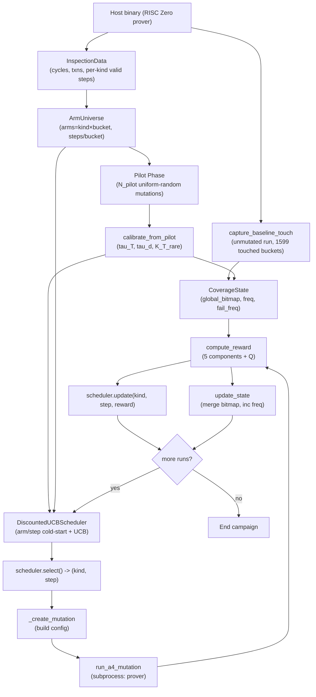
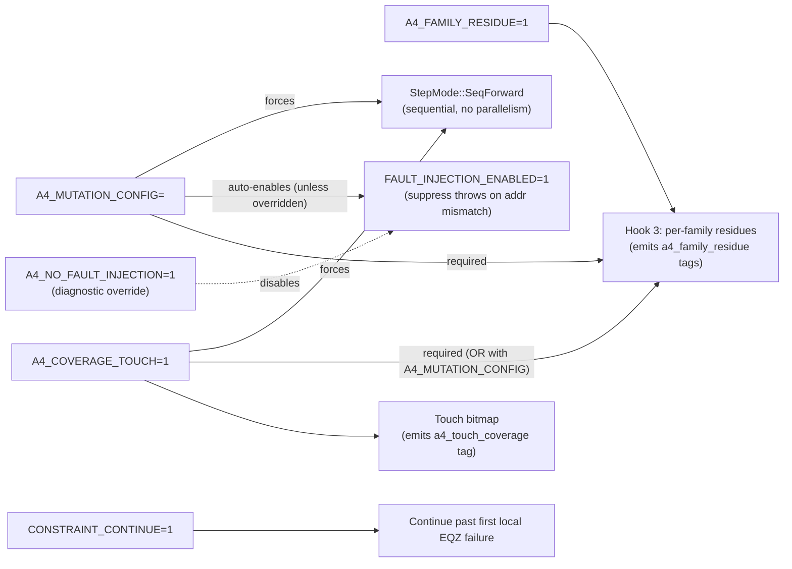

# Coverage-Guided Multi-Armed Bandit for RISC Zero Fuzzing

## Architecture Review Package for ChatGPT Pro

---

### Companion Notebook

This document is intended to be read alongside `boss_presentation.ipynb` (the A/B notebook comparing uniform-random vs fixed-bandit-16). The notebook carries the plots; this document carries the formal specification, source references, empirical tables, history, and open questions.

### Conventions

- All statements are tied to actual source code or campaign output. Where inference is needed, this is explicitly flagged.
- LaTeX formulas use `$...$` inline and `$$...$$` blocks.
- Variable names match the source code.
- File references link to actual files in the repository.

---

## Part 1 — Context & Goals

### What we fuzz

**RISC Zero** is a zkVM: it executes RISC-V guest programs, produces a witness, and emits a STARK proof that the execution satisfies a large system of polynomial constraints (a zero-knowledge proof of correct execution). A soundness bug in such a system — an **underconstraint** — is a case where the constraint system accepts an execution that did not actually happen.

Finding underconstraints empirically requires producing an invalid execution trace and observing that the verifier still accepts the resulting proof. Our fuzzer:

1. Runs the guest program once to collect the full execution trace (the "preflight data")
2. Mutates one specific field at one specific step of that trace
3. Feeds the mutated trace back through the prover
4. Checks whether the verifier accepts, rejects, or crashes

### What we instrument

We have modified RISC Zero's C++ and Rust layers to expose both **local** and **global** constraint information.

**Local instrumentation.** Every call to the `eqz` choke point (the C++ function that asserts a polynomial equals zero) is intercepted; we record:

- **Touch**: which constraint evaluation sites are active during witness generation, keyed by `(constraint_loc, major, minor)` and hashed into a 65536-byte bitmap.
- **Failure**: which constraint sites produced a non-zero residual (the constraint would have been violated).

The `eqz` hook covers constraints from both `step_Top` (witness generation, `phase:local`) and `step_TopAccum` (accumulator delta computation, `phase:accum`). BigInt polynomial-identity failures (`BigIntPolyOpEqz` at `inst_bigint.zir:315`) surface here as `phase:accum` entries.

**Global instrumentation** (added in commit `a8115a7`, three hooks per `[a4/docs/global/GLOBAL_HOOKS_CATALOG_V2.md](a4/docs/global/GLOBAL_HOOKS_CATALOG_V2.md)`):

- **Hook 1** (`A4_GLOBAL_RESIDUE=1`, diagnostic-only): reads the post-prefix-sum grand total of the machine accum columns and emits a binary "all-LogUp-families ok / nonzero" indicator with 4 field-element limbs.
- **Hook 3** (`A4_FAMILY_RESIDUE=1`, **enabled by default** at `[a4/core/executor.py](a4/core/executor.py)` line 196): independently recomputes the LogUp grand total **per argument family**. Four families are exposed: `memory` (permutation argument over memory transactions), `u8`, `u16`, `cycle` (the three lookup arguments). When a family is nonzero, Hook 3 further emits per-address detail (up to 10 broken memory addresses with register-name decoding) or per-index detail (up to 20 broken lookup indices).
- **Hook 2** (`circuit_debug` Cargo feature): per-cycle scan of the check polynomial. Requires a special build and *invalidates the proof*, so it is not used in production campaigns.

Segment verification is still not exposed with structured tags — we fall back to substring-matching `"verify segment"` in stderr to detect it coarsely.

**What is still not covered.** The BigInt polynomial accumulator is not covered by Hooks 1/3 (BigInt uses user accum columns with different externs). BigInt failures still appear in the local-failure list via `phase:accum` EQZ, so they are not lost — they are reached through the local path, not the global path.

**The Z indicator.** Z was originally introduced (Pro_Report_6) as a binary proxy for "got past all local checks but got rejected anyway" — before Hook 3 existed. It is still defined as $Z = \mathbb{1}[\text{REJECTED} \wedge \text{proof\_generated} \wedge d_{\text{fail}} = 0]$ and remains part of the reward function. With Hook 3 now active, this is a coarse approximation of information we can measure more precisely per family and per address. See §4 for the current reward, §4a for the hooks catalog, §4b for seven concrete ways to integrate Hook 3 into the reward, and §11 Issue J for why this is the main question for review.

### The mutation catalog

We have 8 mutation kinds, each modifying a different aspect of the trace:

| Kind | Target | Valid steps |
|------|--------|-------------|
| `COMP_OUT_MOD` | Destination register of a compute instruction | major ∈ {0..4} |
| `LOAD_VAL_MOD` | Value loaded from memory | major == 5 |
| `STORE_OUT_MOD` | Value stored to memory | major == 6 |
| `PRE_EXEC_REG_MOD` | Register value pre-execution | major ≤ 6 |
| `INSTR_TYPE_MOD` | Decoded major/minor of an instruction | major ≤ 6 |
| `MEM_VAL_MOD` | Memory transaction value | any step with mem txns |
| `INSTR_WORD_MOD_FULL` | Full 32-bit instruction word | major ≤ 6 or major == 8 |
| `INSTR_WORD_MOD_SUR` | Single field of the instruction (surgical) | major ≤ 6 or major == 8 |

Each mutation is applied at a specific **step** (the instruction index in the execution trace). The step-horizon is $T \approx 3930$ for our current test guest program.

### The hypothesis

> Coverage-guided multi-armed bandit scheduling of mutation kind and step region explores the local constraint space more efficiently than uniform random scheduling, and produces more runs in the "near-soundness-boundary" regime (mutations that pass local checks but get rejected at verification) per mutation budget.

The efficiency dimension matters because each mutation costs ~20-25s of prover time (1000 mutations ≈ 6 hours on our hardware). To do a serious search, we must use a good scheduler.

---

## Part 2 — System Architecture Overview

### Component map and data flow



### Source file map

| Component | File | Role |
|-----------|------|------|
| Fuzzer orchestrator | `a4/standalone/fuzzer.py` | Campaign loop, pilot phase, bandit setup |
| Bandit scheduler | `a4/standalone/bandit.py` | DiscountedUCBScheduler (cold-start + UCB) |
| Coverage state + reward | `a4/standalone/coverage_state.py` | `CoverageState`, `compute_reward`, `update_state` |
| Arm universe | `a4/standalone/arm_universe.py` | `ArmUniverse` (kind × bucket enumeration) |
| Pilot calibration | `a4/standalone/pilot_calibration.py` | `CalibratedParams`, `calibrate_from_pilot` |
| Baseline capture | `a4/standalone/baseline_touch.py` | `capture_baseline_touch` (seed for CoverageState) |
| Touch coverage primitives | `a4/core/touch_coverage.py` | Bitmap merge/count |
| Constraint parser | `a4/core/constraint_parser.py` | Parse C++ `<constraint_fail>` tags |
| Executor | `a4/core/executor.py` | Subprocess driver for the modified prover |
| CLI | `a4/standalone/cli.py` | Entry point (`--selector bandit --b-count 16`) |
| Bandit tests | `a4/standalone/tests/test_bandit.py` | 14 unit + integration tests, all passing |

### Campaign loop contract

Per Pro_Report_7 §H, the update protocol is:

1. `(kind, step) = scheduler.select()` (read state)
2. execute mutation
3. `reward, diag = compute_reward(...)` (read coverage state BEFORE this run's contribution)
4. `scheduler.update(kind, step, reward)` (write bandit state)
5. `update_state(...)` (write coverage state)

Steps 3→4→5 must happen in that order so that this run's own contribution does not bias its own reward calculation.

---

## Part 3 — Observable Data Model (per run)

Each mutation run produces the following observables (see `MutationResult` in `a4/standalone/fuzzer.py` lines 73-93 and `ConstraintFailure` in `a4/core/constraint_parser.py`):

### Raw observables

| Symbol | Type | Meaning |
|--------|------|---------|
| `touch_bitmap` | `bytes[65536]` | Saturating per-bucket counter (0..255) indexed by `hash(constraint_loc, major, minor)` |
| `failures` | `List[ConstraintFailure]` | Every failed constraint site, one record per instance |
| `exit_code` | `int` | Prover process exit code (101 = panic, -11 = SIGSEGV, 0 = success) |
| `proof_generated` | `bool` | True if the prover produced a proof (even one that fails verification) |
| `verifier_accepted` | `bool` | True if the verifier accepted the proof (a BUG) |

### Derived per-run quantities

Let $\mathcal{F}_t = \{(\texttt{constraint\_loc}(f), f.\texttt{major}, f.\texttt{minor}) : f \in \texttt{failures}\}$ be the set of **distinct failure contexts** observed in this run.

| Symbol | Definition | Comment |
|--------|-----------|---------|
| $n_{\text{fail}}$ | $\lvert \texttt{failures} \rvert$ | Raw failure instance count |
| $d_{\text{fail}}$ | $\lvert \mathcal{F}_t \rvert$ | Distinct failure contexts |
| $r_{\text{rep}}$ | $\max(0, n_{\text{fail}} - d_{\text{fail}})$ | Cascade repeat mass |
| `outcome` | {ACCEPTED, CRASH, REJECTED, NO_EFFECT} | Classification, see below |

### Outcome classification

Priority order (`a4/standalone/fuzzer.py:_classify_outcome`):

1. If `verifier_accepted`: **ACCEPTED** (soundness bug)
2. Else if `crashed` (exit_code in SIGSEGV/SIGABRT/etc.): **CRASH**
3. Else if `failures` non-empty OR `proof_verify_failed`: **REJECTED**
4. Otherwise: **NO_EFFECT**

### Global state

`CoverageState` (`a4/standalone/coverage_state.py` lines 42-70) maintains:

| Symbol | Type | Meaning |
|--------|------|---------|
| `global_bitmap` $G$ | `bytearray[65536]` | Merge of all runs' touch bitmaps (saturating union) |
| `freq` $f_T[\cdot]$ | `List[int][65536]` | Per-bucket: how many runs touched this bucket |
| `fail_freq` $f_F[c]$ | `Dict[(loc, maj, min), int]` | Per-context: how many runs failed with this exact context |

Note: `fail_freq` is **per-run-per-context** (not per-instance). A single run with 50 cascade failures of the same context contributes +1 to that context's frequency, not +50. This prevents cascade-heavy runs from dominating the rarity signal. (Confirmed in source: `a4/standalone/coverage_state.py` lines 203-208.)

### 3.4 Global observables (via Hooks 1 and 3)

Since commit `a8115a7`, each mutation run also produces per-family LogUp residues. These are parsed from the C++ output into `MutationExecutionResult` at `[a4/core/executor.py](a4/core/executor.py)` lines 128-221 and then promoted onto `MutationResult` at `[a4/standalone/fuzzer.py](a4/standalone/fuzzer.py)` lines 94-98, 444-455, 671-682.

**Raw parsed fields on `MutationExecutionResult`:**

| Symbol | Type | Meaning | Source parser |
|--------|------|---------|---------------|
| `family_residues` | `List[{family, nonzero, e0..e3}]` | One entry per family in `{memory, u8, u16, cycle}`. `nonzero` is a boolean; `e0..e3` are the four base-field limbs of the FpExt residue when nonzero. | `parse_family_residues` at `[a4/core/touch_coverage.py](a4/core/touch_coverage.py)` lines 179-200 |
| `family_details` | `List[{family, broken_addrs or broken_indices, broken_count, total_*}]` | Present only for families with nonzero residue. Memory family: up to 10 `{addr, hex, reg?, plus, minus}` entries. Lookup families (u8/u16/cycle): up to 20 `{index, plus, minus}` entries. | `parse_family_detail` at `[a4/core/touch_coverage.py](a4/core/touch_coverage.py)` lines 217-228 |

**Derived fields on `MutationResult`** (the fuzzer-layer object):

| Symbol | Type | Meaning | Source |
|--------|------|---------|--------|
| `broken_families` | `List[str]` | Subset of `{memory, u8, u16, cycle}` whose residue is nonzero this run. | Populated at `[a4/standalone/fuzzer.py](a4/standalone/fuzzer.py)` lines 444-447 and 673-676. |
| `broken_addresses` | `List[dict]` | Flattened concatenation of all `broken_addrs` and `broken_indices` across families. | Populated at `[a4/standalone/fuzzer.py](a4/standalone/fuzzer.py)` lines 448-453 and 677-682. |
| `is_global_only` | `bool` | True iff `len(broken_families) > 0` AND there are zero local-phase failures (`phase == "local"`). Identifies "pure global failure" runs. | `[a4/standalone/fuzzer.py](a4/standalone/fuzzer.py)` line 455 and 684. |
| `family_details` | pass-through | Same list, carried through for per-address display and downstream analysis. | Populated at `[a4/standalone/fuzzer.py](a4/standalone/fuzzer.py)` lines 466 and 704. |

**Relation to the reward.** As of the current codebase, none of the four fields above are read by `compute_reward` in `[a4/standalone/coverage_state.py](a4/standalone/coverage_state.py)`. The reward still sees only `touch_bitmap` and `failures`. See §4b for how these fields could be consumed.

**Outcome classification uses `broken_families`.** `_classify_outcome` at `[a4/standalone/fuzzer.py](a4/standalone/fuzzer.py)` line 231 treats a run as `REJECTED` if `failures` OR `proof_verify_failed` OR `broken_families` is non-empty. So global-only runs are never misclassified as `NO_EFFECT`.

---

## Part 4 — Reward Function Specification

Source: `a4/standalone/coverage_state.py` lines 73-172. All symbols below use the exact formulas from that file.

### 4.1 Component scores

**Touch novelty** (bounded exponential in new buckets this run):

$$T_{\text{new}} = 1 - \exp\!\left(-\frac{\Delta_T}{\tau_T}\right), \quad \Delta_T = \lvert \{i : \texttt{touch}[i] > 0 \wedge G[i] = 0\} \rvert$$

**Touch rarity** (mean inverse-root weight over the $K_T$ rarest touched buckets):

$$T_{\text{rare}} = \frac{1}{K_T} \sum_{i \in \operatorname{top-}K_T(w_T)} w_T(i), \quad w_T(i) = \frac{1}{\sqrt{1 + f_T[i]}}, \quad K_T = \min(K_T^{\text{rare}}, \lvert U_t \rvert)$$

where $U_t = \{i : \texttt{touch}[i] > 0\}$.

**Failure novelty** (bounded exponential in new contexts this run):

$$F_{\text{new}} = 1 - \exp\!\left(-\frac{\Delta_F}{\tau_F}\right), \quad \Delta_F = \lvert \{c \in \mathcal{F}_t : c \notin f_F\} \rvert$$

**Failure rarity** (mean inverse-root weight over the $K_F$ rarest failure contexts):

$$F_{\text{rare}} = \frac{1}{K_F} \sum_{c \in \operatorname{top-}K_F(w_F)} w_F(c), \quad w_F(c) = \frac{1}{\sqrt{1 + f_F[c]}}, \quad K_F = \min(K_F^{\text{rare}}, \lvert \mathcal{F}_t \rvert)$$

If $\mathcal{F}_t = \emptyset$, $F_{\text{rare}} := 0$.

**Zero-local-fail indicator** (Pro_Report_7 §1, gated on proof_generated):

$$Z = \mathbb{1}\left[\texttt{outcome} = \texttt{REJECTED} \;\wedge\; \texttt{proof\_generated} \;\wedge\; d_{\text{fail}} = 0\right]$$

This fires iff: the mutation produced a proof (not a shallow abort), the verifier rejected the proof, and **no** local constraint failures were detected. The interpretation: the mutation got past every local check we instrument but was still caught by something else (global constraint, permutation argument, segment check, verification-time consistency check).

> **Note — Z is now a degraded signal.** Z was designed as a **binary proxy** for "passed all local checks, got rejected somewhere else" back when global constraints were uninstrumented. Hook 3 (§3.4, §4a.3) now gives us per-family and per-address information about exactly *which* global argument failed. The current `compute_reward` (source lines 73-172) does NOT consume `family_residues` or `family_details` — Z is still binary and treats all post-local rejections identically. This is the main design question for this review; see §4b for seven concrete integration options and Issue J in §11.

### 4.2 Execution quality (Q)

Q is a multiplicative "quality gate" that suppresses runs that cause many failures or cascade failures.

**Distinct-failure penalty**:

$$Q_{\text{dist}} = \exp\!\left(-\frac{d_{\text{fail}}}{\tau_d}\right)$$

**Cascade-repeat penalty** (piecewise, only activates beyond threshold $r_0$):

$$Q_{\text{rep}} = \begin{cases} 1 & \text{if } r_{\text{rep}} \leq r_0 \\ \exp\!\left(-\dfrac{r_{\text{rep}} - r_0}{\tau_r}\right) & \text{if } r_{\text{rep}} > r_0 \end{cases}$$

**Combined quality**:

$$Q = Q_{\text{dist}} \cdot Q_{\text{rep}}$$

### 4.3 Weighted average S and final reward

$$S = \frac{a_{T_n} \cdot T_{\text{new}} + a_{T_r} \cdot T_{\text{rare}} + a_{F_n} \cdot F_{\text{new}} + a_{F_r} \cdot F_{\text{rare}} + a_Z \cdot Z}{a_{T_n} + a_{T_r} + a_{F_n} + a_{F_r} + a_Z}$$

$$r = \min(1, Q \cdot S)$$

### 4.4 Edge cases

**Crash or missing bitmap** (source lines 98-104): Return $r = 0$ immediately. Do not compute components. Do not update `CoverageState` afterwards (see §4.5).

**Verifier ACCEPTED** (source line 163-164): Override $r := 1$. This is the "soundness bug" case.

### 4.5 State-update gating

`update_state` (source lines 175-214) skips frequency updates for crash or missing-bitmap runs. Rationale (Pro_Report_7): crashes do not reveal real constraint behavior; counting them would corrupt rarity signals.

### 4.6 Current parameter values

Values used in the bandit-16 campaign that is the subject of this review:

| Param | Value | Type | Source |
|-------|-------|------|--------|
| $\tau_T$ | 35.0 | Calibrated (pilot) | p75 of $\Delta_T > 0$, clamped to [8, 128] |
| $\tau_F$ | 2.0 | Hard | Pro_Report_6 §3.2 |
| $\tau_d$ | 3.0 | Calibrated (pilot) | max(1, p75($d_{\text{fail}}$)) |
| $\tau_r$ | 25.0 | Hard | Pro_Report_6 §3.2 |
| $K_T^{\text{rare}}$ | 31 | Calibrated (pilot) | clamp(0.02·median(\|U\|), 16, 64) |
| $K_F^{\text{rare}}$ | 2 | Hard | Pro_Report_7 §1: "stable when d_fail small" |
| $r_0$ | 10 | Hard | Pro_Report_6 §3.2 |
| $a_{T_n}$ | 1.0 | Weight | Pro_Report_6 §3.3 |
| $a_{T_r}$ | 0.25 | Weight | Lower (touch rarity mostly uniform for value mutations) |
| $a_{F_n}$ | 1.0 | Weight | Co-primary |
| $a_{F_r}$ | 1.0 | Weight | Co-primary (bandwidth signal after novelty decays) |
| $a_Z$ | 1.0 | Weight | Co-primary |

Weight sum: $\sum a_i = 4.25$.

---

## Part 4a — Global Constraint Instrumentation Catalog

The local/accum EQZ hooks documented above are the *original* instrumentation. Since commit `a8115a7`, three additional hooks expose **global** constraint information (LogUp grand totals for permutation and lookup arguments). This section documents what each hook provides, what it does not cover, and the raw tag formats.

Authoritative reference: `[a4/docs/global/GLOBAL_HOOKS_CATALOG_V2.md](a4/docs/global/GLOBAL_HOOKS_CATALOG_V2.md)`.

### 4a.1 Summary of hooks

| Hook | Status | Granularity | Env var | Proof impact | Per-family | BigInt | Production use |
|------|--------|-------------|---------|--------------|------------|--------|---------------|
| **1** — Post-prefix-sum total | Done | Binary | `A4_GLOBAL_RESIDUE=1` | None | No | No | Diagnostic only (cross-check) |
| **2** — Check-polynomial scan | Done | Per-cycle | `circuit_debug` Cargo flag | **Breaks proof** | No | Yes | Deep debugging only |
| **3** — Per-family + per-address detail | Done | Per-family + per-address/per-index | `A4_FAMILY_RESIDUE=1` | None | **Yes** (4 families) | No | **Default-on in every run** |

Hook 3 is the one that affects runtime behavior because it is always active in `[a4/core/executor.py](a4/core/executor.py)` line 196.

### 4a.2 Hook 1 — Binary global residue

Reads the last row of the last four machine accum columns after prefix-sum. The four elements form a single FpExt field element representing the grand total of *all* LogUp contributions (memory + u8 + u16 + cycle) combined.

Emitted tags:
```
<a4_global_residue_zero/>
<a4_global_residue_nonzero>{"e0":..., "e1":..., "e2":..., "e3":...}</a4_global_residue_nonzero>
```

Parsed by `parse_global_residue` at `[a4/core/touch_coverage.py](a4/core/touch_coverage.py)` lines 231-248. The parser returns `{"nonzero": bool, "e0"..."e3"?: int}` or `None` if the tag is not present.

**Not enabled by default** — `A4_GLOBAL_RESIDUE` is only set in diagnostic scripts (e.g. `a4/standalone/tests/run_diagnostic_campaign.py`). The standard campaign path does not set it and does not call this parser. Information-wise, Hook 1 is strictly subsumed by Hook 3 (which computes the same quantity per family); Hook 1 exists as a cross-check.

### 4a.3 Hook 3 — Per-family residues with per-address detail

**Production hook.** Enabled by default in `[a4/core/executor.py](a4/core/executor.py)` line 196 (`A4_FAMILY_RESIDUE=1`).

During `step_Top`, every call to `extern_memoryDelta(addr, cycle, dataLow, dataHigh, count)` and `extern_lookupDelta(table, index, count)` is recorded. At the start of `step_TopAccum` (once the verifier's `mix` randomness is available), the hook independently recomputes the LogUp sum for each family:

For memory:  $\delta = \text{Fp}(\texttt{count}) \cdot (r_{\text{addr}} \cdot \text{addr} + r_{\text{cycle}} \cdot \text{cycle} + r_{\text{dataLow}} \cdot \text{dataLow} + r_{\text{dataHigh}} \cdot \text{dataHigh} + \text{offset})^{-1}$

For lookups:  $\delta = \text{Fp}(\texttt{count}) \cdot (r_{\text{val}} \cdot \text{index} + \text{offset})^{-1}$

Deltas are summed per family; a family whose sum is nonzero is "broken."

**Family mapping** (source: `[a4/docs/global/GLOBAL_HOOKS_CATALOG_V2.md](a4/docs/global/GLOBAL_HOOKS_CATALOG_V2.md)` §4a.1):

| Family tag | Constraint class |
|------------|------------------|
| `memory` | Permutation argument over all memory transactions (every read must match a prior write at the same address/value) |
| `u16` | U16 lookup (range check, value must fit in 16 bits) |
| `u8` | U8 lookup (range check, value must fit in 8 bits) |
| `cycle` | Cycle-ordering lookup (cross-row cycle numbering) |

**Per-address detail (Phase 3.5).** When `memory` is broken, Hook 3 further groups by address and emits up to 10 `{addr, hex, reg?, plus, minus}` entries. Register-mapped addresses (`0x3fffc000–0x3fffc080` range) are decoded to register names (e.g., `x17`). When a lookup family is broken, Hook 3 emits up to 20 `{index, plus, minus}` entries.

**Emitted tags (from `GLOBAL_HOOKS_CATALOG_V2.md` §4a.3):**
```
<a4_family_residue>{"family":"memory", "nonzero":true, "e0":..., "e1":..., "e2":..., "e3":...}</a4_family_residue>
<a4_family_residue>{"family":"u16", "nonzero":false}</a4_family_residue>
<a4_family_residue>{"family":"u8", "nonzero":false}</a4_family_residue>
<a4_family_residue>{"family":"cycle", "nonzero":false}</a4_family_residue>
<a4_family_stats>{"family":"memory", "records":69448, "plus":34724, "minus":34724, "distinct_addrs":13952}</a4_family_stats>
<a4_family_detail>{"family":"memory", "broken_addrs":[
  {"addr":527468,"hex":"0x00080c6c","plus":11,"minus":11},
  {"addr":1073725473,"hex":"0x3fffc021","reg":"x1","plus":664,"minus":664},
  {"addr":1073725489,"hex":"0x3fffc031","reg":"x17","plus":92,"minus":92}
],"broken_count":3,"total_addrs":13952}</a4_family_detail>
```

Parsers at `[a4/core/touch_coverage.py](a4/core/touch_coverage.py)` lines 179-228. `family_stats` is parsed but not currently promoted onto `MutationExecutionResult`.

**Sanity benchmarks (from the catalog's test log):**

| Mutation type | Memory broken | Lookups broken | Local fails | Comment |
|---------------|--------------:|---------------:|------------:|---------|
| Clean run | no | no | 0 | 69448 memory records, 184257 lookup records |
| `COMP_OUT_MOD` (typical) | 1 addr (the mutated register) | no | — | tight per-address localization |
| `INSTR_WORD_MOD_SUR` (global-only) | 3 addrs (PC + 2 regs) | no | **0** | mutation passes all local checks |
| `INSTR_TYPE_MOD` | sometimes | sometimes `cycle` | many | instruction-type change affects both families |

### 4a.4 Hook 2 — Per-cycle check polynomial scan

Requires the `circuit_debug` Cargo feature. With that feature, the ZK shift is disabled, the trace polynomials are evaluated on the original domain instead of the coset, and `eval_check` produces a meaningful per-cycle scan of the constraint polynomial $C(x)$. Emits `<a4_check_poly_scan>` tags listing non-zero cycle indices.

**Cannot be used in production** because disabling the ZK shift makes the proof always invalid to the verifier — any ACCEPTED check would be meaningless. Used only for deep debugging when Hook 3's per-address detail is insufficient.

### 4a.5 BigInt — still a gap

BigInt (cryptographic precompile) constraints use a polynomial state machine over user accum columns (0-22), not LogUp. They are *not* visible to Hook 1 or Hook 3 (which read only the machine accum columns). Instead, BigInt failures surface through the `BigIntPolyOpEqz` EQZ call at `inst_bigint.zir:315`, which our *local* `eqz` hook captures as a `phase:accum` `constraint_fail` tag.

So BigInt failures appear in `MutationExecutionResult.failures` (and thus in $\mathcal{F}_t$, $d_{\text{fail}}$, $F_{\text{new}}$, $F_{\text{rare}}$) alongside other local failures. They do not produce a `family_residues` entry.

**Practical consequence.** For our current mutation catalog (which does not target `trace.bigint_bytes` or ECALL dispatch), BigInt is essentially unreachable. If future mutation kinds target BigInt, the failures will still be captured — just through the local path.

### 4a.6 Recommended runtime configuration

The full picture spans (1) env vars our Python executor sets explicitly, (2) environment changes the prover makes automatically as a side effect of those vars, (3) a dependency-constraint gotcha, and (4) diagnostic-only flags. Items in (2) matter for cloud-scaling discussions — they are implicit but they change what the prover does.

#### 4a.6.1 Explicitly-set env vars (production campaign path)

Set by `run_a4_mutation` in `[a4/core/executor.py](a4/core/executor.py)` lines 192-197:

| Env var | Value | Purpose | Scope |
|---------|-------|---------|-------|
| `A4_MUTATION_CONFIG` | path to per-run mutation JSON | Tells the prover which mutation to apply this run | Per-run |
| `CONSTRAINT_CONTINUE` | `"1"` | Continue past first local EQZ failure (else the runtime aborts; see `[workspace/risc0-modified/risc0/circuit/rv32im-sys/kernels/cxx/witgen.h](workspace/risc0-modified/risc0/circuit/rv32im-sys/kernels/cxx/witgen.h)` line 198) | Fixed |
| `A4_COVERAGE_TOUCH` | `"1"` | Enable touch bitmap emission | Fixed |
| `A4_FAMILY_RESIDUE` | `"1"` | Enable Hook 3 per-family residue computation | Fixed |

No other env vars are set by the production campaign path.

#### 4a.6.2 Automatic side effects (implicit — triggered by the vars above)

Two environment/runtime changes happen *inside* the prover without us setting them explicitly. These are the non-obvious parts of our configuration and matter for anyone reasoning about prover performance or behavior.

**(a) Sequential step mode (`StepMode::SeqForward`)** — forced at `[workspace/risc0-modified/risc0/circuit/rv32im/src/prove/hal/mod.rs](workspace/risc0-modified/risc0/circuit/rv32im/src/prove/hal/mod.rs)` lines 146-165 whenever `A4_MUTATION_CONFIG` OR `A4_COVERAGE_TOUCH` is set. The source-comment justification:

```text
// A4: Force sequential mode when A4_MUTATION_CONFIG or A4_COVERAGE_TOUCH is set.
// A4_MUTATION_CONFIG: avoid SIGSEGV from parallel thread corruption during mutations.
// A4_COVERAGE_TOUCH: touch bitmap emission requires SeqForward (ffi.cpp emits after loop).
```

**Consequences**:

- The prover executes every cycle in order on a single thread. Parallel witgen is disabled.
- Per-mutation wall-clock time does **not** shrink with more CPU cores. Our ~20-25s/mutation is CPU-bound on one core.
- For cloud scaling, horizontal parallelism (many VMs running different mutations in parallel) is the only speedup path. Vertical scaling of a single VM only helps memory / page cache, not witgen.

**(b) Fault injection auto-enable (`FAULT_INJECTION_ENABLED=1`)** — set at `[workspace/risc0-modified/risc0/circuit/rv32im/src/prove/witgen/mod.rs](workspace/risc0-modified/risc0/circuit/rv32im/src/prove/witgen/mod.rs)` lines 219-225 whenever `A4_MUTATION_CONFIG` is set (can be overridden by `A4_NO_FAULT_INJECTION=1`, see 4a.6.4). Source comment:

```text
// Enable fault injection to skip throws on address mismatches
// This allows mutations that cause transaction mismatches to continue
// rather than crashing. Set A4_NO_FAULT_INJECTION=1 to disable.
```

**Consequences**: `FAULT_INJECTION_ENABLED` is checked at multiple C++ sites (e.g., `witgen.h:94, 155`, `ffi.cpp:190, 204`, `buffers.h:31-56`). With it on, bounds checks and address mismatches that would normally throw are suppressed, allowing the run to continue and surface constraint failures rather than abort. Without it, most address-corrupting mutations (LOAD_VAL_MOD, STORE_OUT_MOD, MEM_VAL_MOD, instruction-word mutations) would abort on the first anomaly and produce no data.

The run also emits `<a4_fault_injection_enabled/>` to stdout as a flag.

#### 4a.6.3 Dependency constraint (gotcha)

Hook 3 is gated at `[workspace/risc0-modified/risc0/circuit/rv32im-sys/kernels/cxx/ffi.cpp](workspace/risc0-modified/risc0/circuit/rv32im-sys/kernels/cxx/ffi.cpp)` lines 228-230, 246-248, and 463:

```cpp
if (std::getenv("A4_FAMILY_RESIDUE") != nullptr
    && (std::getenv("A4_MUTATION_CONFIG") != nullptr
        || std::getenv("A4_COVERAGE_TOUCH") != nullptr)) { ... }
```

Setting `A4_FAMILY_RESIDUE=1` **alone** is silently ignored — Hook 3 never runs. Our executor always sets all three (`A4_MUTATION_CONFIG` or both plus `A4_COVERAGE_TOUCH`), so this is not a production issue, but worth knowing when reading the code or designing a diagnostic variant.

#### 4a.6.4 Diagnostic-only flags (not set in production)

| Env var / flag | Effect | When used |
|---|---|---|
| `A4_GLOBAL_RESIDUE=1` | Hook 1 — binary combined LogUp residue. Strictly subsumed by Hook 3 information-wise; exists for cross-check. | `a4/standalone/tests/run_diagnostic_campaign.py` only |
| `A4_COVERAGE_TOUCH_VERBOSE=1` | Emit the exact set of touched `loc|major|minor` triples as a JSON payload (source: `ffi.cpp:131`). Slow; useful for cross-checking the touch bitmap against ground-truth. | Debug / bitmap-consistency campaigns |
| `A4_TRACE_TXN=1` | Per-transaction trace output (source: `ffi.cpp:175`). Very noisy. | Debug single runs |
| `A4_NO_FAULT_INJECTION=1` | Overrides the implicit `FAULT_INJECTION_ENABLED` auto-enable from 4a.6.2(b). Without this override, fault injection is on whenever mutations are applied. | Debug: study how often mutations would have aborted without fault injection |
| `RISC0_WITGEN_DEBUG=1` | Alternate route to force `StepMode::SeqForward`, via the `witgen_debug` Cargo feature (source: `hal/mod.rs:156`). Requires rebuild. | Unused; our path already forces SeqForward via 4a.6.2(a) |
| `circuit_debug` (Cargo feature) | Build-time flag enabling Hook 2 (per-cycle check-polynomial scan). Disables the ZK shift, which **invalidates the proof** for every run. | Deep-debugging builds only |

#### 4a.6.5 Flag trigger graph



The OR-gate on Hook 3: `A4_FAMILY_RESIDUE` needs at least one of `A4_MUTATION_CONFIG` or `A4_COVERAGE_TOUCH` to actually fire.

---

## Part 4b — Global Info → Reward: Design Space

This is the **central question for ChatGPT Pro**. Hook 3 data (`family_residues`, `family_details`, derived `broken_families`, `is_global_only`) flows all the way to `MutationResult` but is never read by `compute_reward`. The reward still contains only the binary $Z$ indicator, which was designed as a proxy for exactly this data back when it was unavailable.

Below are seven concrete options for integrating the new data. Each is presented as a minimal, mechanical change to §4's formula. Each has tradeoffs — we want ChatGPT Pro to evaluate them against our hypothesis ("more Hook 3-informed bandit → more ACCEPTED runs per budget than uniform").

Notation additions used below:
- $\mathcal{G}_t \subseteq \{\text{memory}, \text{u8}, \text{u16}, \text{cycle}\}$: set of broken families this run (`broken_families` on `MutationResult`).
- $\mathcal{A}_t^{\text{mem}}$: set of broken memory addresses this run (from `family_details` memory).
- $\mathcal{A}_t^{\ell}$: set of broken lookup indices in family $\ell \in \{u8, u16, \text{cycle}\}$.
- $d_G := |\mathcal{G}_t|$ — global-failure distance, 0..4.

### Option A — Sharpen Z

**Change:** Require at least one broken family to be identified before Z fires.

$$Z' = \mathbb{1}\left[\texttt{REJECTED} \wedge \texttt{proof\_generated} \wedge d_{\text{fail}} = 0 \wedge \mathcal{G}_t \neq \emptyset\right]$$

**Intent.** Rule out "unknown-rejection" runs where nothing we instrument flags a failure. Those runs might be BigInt-class failures captured in `failures`, or verification-layer issues we do not observe. They are noise for the "near-acceptance via global failure" signal.

**Pros.** Minimal change (just AND an extra condition). Cleans up Z semantics.
**Cons.** Loses information: a run that does reach the "passed local, rejected by unknown" regime is still interesting, and now invisible to the reward. The empirical rate of $Z = 1 \wedge \mathcal{G}_t = \emptyset$ is unknown (our bandit-16 campaign does not record this).

### Option B — Per-family Z split

**Change:** Replace $Z$ with five indicators, one per family plus one residual.

$$Z_{\ell} = \mathbb{1}\left[\texttt{REJECTED} \wedge \texttt{proof\_generated} \wedge d_{\text{fail}} = 0 \wedge \ell \in \mathcal{G}_t\right], \quad \ell \in \{\text{mem}, u8, u16, \text{cyc}\}$$

$$Z_{\text{unknown}} = \mathbb{1}\left[\texttt{REJECTED} \wedge \texttt{proof\_generated} \wedge d_{\text{fail}} = 0 \wedge \mathcal{G}_t = \emptyset\right]$$

Each indicator gets its own weight in $S$. The $S$ numerator gains five terms.

**Intent.** Apply targeted pressure to specific global-argument classes. If ChatGPT Pro recommends prioritizing memory-permutation mutations (often the closest to ACCEPTED for zkVM soundness bugs), increasing $a_{Z_{\text{mem}}}$ does that directly.

**Pros.** Expressive. Enables A/B testing per family.
**Cons.** 5 new weights to tune. Without strong priors, we may over-tune.

### Option C — Global rarity $G_{\text{rare}}$

**Change:** Maintain a global family-frequency counter $f_G[\ell]$ (runs that broke family $\ell$, incremented exactly once per run even if family broken multiple ways). Add a rarity component:

$$G_{\text{rare}} = \frac{1}{|\mathcal{G}_t|} \sum_{\ell \in \mathcal{G}_t} \frac{1}{\sqrt{1 + f_G[\ell]}} \quad\text{if } \mathcal{G}_t \neq \emptyset, \text{ else } 0$$

Add a weight $a_{G_r}$. The numerator of $S$ gains $a_{G_r} G_{\text{rare}}$ and the denominator grows accordingly.

**Intent.** Analog of $F_{\text{rare}}$ for global families. Encourages exploring the *rarer* global-failure modes (e.g., if `cycle` or `u8` has only been broken 5 times but `memory` 400 times, a `cycle` break is worth more).

**Pros.** Semantically clean — mirrors existing $F_{\text{rare}}$. Non-stationary (rarity decays as more runs break a family).
**Cons.** Only 4 families — the rarity signal has very low bandwidth. Might saturate instantly (one memory-breaking mutation and $f_G[\text{memory}]$ is 1; rarity drops to $1/\sqrt{2}$).

### Option D — Address-level rarity

**Change:** Maintain a counter $f_{GA}[(\ell, a)]$ over all `(family, address)` tuples. For each run, define

$$\text{GAddr}_{\text{rare}} = \frac{1}{K_{GA}} \sum_{(\ell, a) \in \operatorname{top-}K_{GA}} \frac{1}{\sqrt{1 + f_{GA}[(\ell, a)]}}$$

where the sum is over the $K_{GA}$ rarest broken `(family, address)` pairs in the run. Add weight $a_{GA_r}$.

**Intent.** Treat each broken register or lookup index as a "failure context" at the global level. A mutation that breaks a rare memory address (e.g., an obscure control register) is more informative than one that breaks `x1` for the 1000th time.

**Pros.** Maximum granularity. Memory family typically produces ~13,952 total addresses and 1-3 broken ones per run — a rich rarity signal.
**Cons.** Hook 3's broken-address list is truncated to ≤10 memory + ≤20 lookup entries — for pathological mutations we may miss the full set. Additional state grows with the number of distinct broken addresses seen.

### Option E — Distance-to-acceptance metric

**Change:** Reward scales with fewness of broken families.

$$D = \exp\left(-\frac{d_G}{\tau_G}\right) \cdot \mathbb{1}[\texttt{REJECTED} \wedge \texttt{proof\_generated}]$$

with some $\tau_G \approx 1$–$2$. Replaces $Z$ with this continuous-valued version.

**Intent.** A run with 0 broken families *and* 0 local failures ($d_G = 0$, $d_{\text{fail}} = 0$) would score $D = 1$ — this is the closest we can get to "looks ACCEPTED except the verifier said no" — exactly the near-soundness regime we want to emphasize. A run with all 4 families broken scores $D = e^{-4/\tau_G}$, near zero.

**Pros.** Natural interpretation as "distance from the acceptance manifold." Continuous signal.
**Cons.** Conflates BigInt-class "unknown-rejection" runs (0 broken families, 0 local fails, proof generated but verifier rejected) with legitimate near-accepting runs. Option F makes this distinction explicit.

### Option F — Multi-level Z

**Change:** Replace the single $Z$ with three hierarchical indicators.

$$Z_{\text{local}} = \mathbb{1}[d_{\text{fail}} = 0]$$
$$Z_{\text{global}} = \mathbb{1}[\mathcal{G}_t = \emptyset]$$
$$Z_{\text{full}} = \mathbb{1}[\texttt{REJECTED} \wedge \texttt{proof\_generated} \wedge Z_{\text{local}} \wedge Z_{\text{global}}]$$

$Z_{\text{full}}$ is the "truly near-acceptance" signal: passed every check we instrument, still rejected. Candidates include BigInt mismatch, segment verification failure, or FRI-level issues. Each indicator has its own weight, with $a_{Z_{\text{full}}} \gg a_{Z_{\text{local}}}, a_{Z_{\text{global}}}$.

**Intent.** Make the near-soundness regime explicit and weight it heavily. Lower-tier indicators still reward "passed local but failed global" and "failed local but passed global" — partial progress signals.

**Pros.** Semantically clearest; three tiers map to real instrumentation layers. $Z_{\text{full}}$ is the signal you would most want to see if looking for soundness bugs.
**Cons.** Three new weights. $Z_{\text{full}}$ may be rare in small campaigns (we have no data on its incidence in bandit-16 output).

### Option G — Unify failure coverage (no new reward components)

**Change:** Extend the failure-context set to include global failures.

$$\mathcal{F}_t^{\text{extended}} = \mathcal{F}_t \;\cup\; \{(\text{GLOBAL}, \ell, a) : \ell \in \mathcal{G}_t, a \in \text{broken addrs/indices of } \ell\}$$

Replace $\mathcal{F}_t$ with $\mathcal{F}_t^{\text{extended}}$ in the definitions of $F_{\text{new}}$, $F_{\text{rare}}$, $d_{\text{fail}}$, $r_{\text{rep}}$, and in `fail_freq`. Drop $Z$ entirely (or keep as an override for the pure-unknown case).

**Intent.** Treat global failures as "failure contexts" with extra structure, so existing novelty/rarity machinery handles them. No new formula to tune; no new weights. The Z-versus-failure-context trade-off (current Issue A) dissolves because the contexts now *include* global info.

**Pros.** No new reward components. Cleanly unifies the two worlds. Existing $F_{\text{new}}$, $F_{\text{rare}}$ handle arbitrary cardinalities.
**Cons.** Changes the semantics of $d_{\text{fail}}$ (and therefore $Q_{\text{dist}}$). A global-only run formerly had $d_{\text{fail}} = 0$ and triggered $Z$; under Option G it has $d_{\text{fail}} = |\text{broken addrs}|$ which could be small or large, and $Q_{\text{dist}}$ penalizes it. The cascade handling ($Q_{\text{rep}}$ via $r_{\text{rep}}$) also interacts differently because $n_{\text{fail}}$ is traditionally instance-level while broken addrs are already deduplicated.

### Trade-off implications

Current §11 Issue A observes that the bandit shifted ~70 runs into IWORD-kinds chasing $Z$ events, at the cost of failure-context novelty. That trade-off only exists because $Z$ is a binary bonus that fires for `d_fail = 0` runs (which contribute zero failure novelty). Under Options B, C, D, E, or G the binary cliff is replaced by a continuous or fine-grained signal that interacts with $F_{\text{new}}$ and $F_{\text{rare}}$ rather than standing apart from them. The trade-off is likely to weaken or disappear.

### Summary

| Option | New components | New weights | New state | Disrupts Q? | Addresses Issue A |
|--------|----------------|-------------|-----------|-------------|-------------------|
| A — Sharpen Z | 0 | 0 | 0 | No | Weakly |
| B — Per-family Z | 4 | 5 | 0 | No | Strongly |
| C — Global rarity | 1 | 1 | $f_G[\ell]$ (4 ints) | No | Moderately |
| D — Address rarity | 1 | 1 | $f_{GA}$ (unbounded) | No | Strongly |
| E — Distance-to-acceptance | 1 (replaces Z) | 0 (replaces $a_Z$) | 0 | No | Strongly |
| F — Multi-level Z | 3 (replaces Z) | 3 (replaces $a_Z$) | 0 | No | Strongly |
| G — Unify failure contexts | 0 | 0 | None (extends existing) | **Yes** ($d_{\text{fail}}$ semantics) | Disappears |

Options C, D, E, F, G are orthogonal-ish and can be combined; A is weakest; B is expressive but adds the most weights.

---

## Part 5 — Bandit Algorithm Specification

Source: `a4/standalone/bandit.py`.

### 5.1 Per-arm and per-step state

For each arm $a = (k, b)$ (kind × bucket), maintain:

| Symbol | Type | Meaning | Decays? |
|--------|------|---------|---------|
| $N_a$ | `float` | Discounted pull count | Yes |
| $S_a$ | `float` | Discounted reward sum | Yes |
| $t_a$ | `int` | Last update time | — |
| $m_a$ | `int` | **Raw** pull count | **No** |

Same four quantities per step $(k, s)$ within an arm's bucket.

### 5.2 Lazy discount decay

When any arm is "touched" at global time $t$, its state is decayed from its last-seen time:

$$N_a \leftarrow N_a \cdot \gamma^{t - t_a}, \quad S_a \leftarrow S_a \cdot \gamma^{t - t_a}, \quad t_a \leftarrow t$$

The mean estimate $\hat{\mu}_a = S_a / N_a$ is preserved (both numerator and denominator decay by the same factor); only the evidence mass $N_a$ shrinks, which **increases** the UCB exploration bonus for neglected arms.

### 5.3 UCB index

$$\text{UCB}_a = \hat{\mu}_a + c \cdot \sqrt{\frac{\ln(1 + N_{\text{tot}})}{\max(N_a, \varepsilon)}}$$

with $\varepsilon = 10^{-6}$ for numerical safety, and

$$N_{\text{tot}} = \sum_{a' \in \mathcal{A}} N_{a'}$$

(arm-level: sum over all arms; step-level: sum over steps within the chosen bucket only).

### 5.4 Selection algorithm

At round $t$:

```
select():
    t <- t + 1
    decay every arm's (N_a, S_a) to time t
    cold_start_arms = {a : m_a == 0}
    if cold_start_arms:
        chosen_arm = uniform_random(cold_start_arms)
    else:
        chosen_arm = argmax UCB_a over all arms
    
    k, b = chosen_arm
    steps = universe.steps_in_arm(k, b)
    decay every step (k,s) in steps
    cold_start_steps = {s : m_{k,s} == 0}
    if cold_start_steps:
        chosen_step = uniform_random(cold_start_steps)
    else:
        chosen_step = argmax UCB_{k,s} over steps in bucket
    
    return (k, chosen_step)
```

### 5.5 Update algorithm

```
update(k, step, reward):
    a = (k, step // B)
    N_a += 1
    S_a += reward
    m_a += 1
    t_a = t
    
    N_{k,step} += 1
    S_{k,step} += reward
    m_{k,step} += 1
    t_{k,step} = t
```

### 5.6 Two-level structure

Arm level: 128 arms = 8 kinds × 16 buckets.
Step level: each arm contains between 40 and ~250 candidate steps; step-level state is kept per step within the bucket. $N_{\text{tot}}$ for the step-level UCB is scoped to the chosen arm's bucket (not global).

### 5.7 The cold-start vs UCB gate — a critical design choice

The most important change in the current architecture is that the exploration/exploitation gate uses a **raw, never-decayed counter $m_a$** rather than the discounted $N_a$. See Part 8 (History) for why this matters.

### 5.8 Current bandit parameter values

| Param | Value | Type | Source |
|-------|-------|------|--------|
| $c$ | 0.25 | Hard | Pro_Report_5 §11 (default) |
| $\gamma$ | 0.9965 | Derived from budget | $\gamma = 2^{-1/H},\; H = \text{clamp}(N/5, 50, 300) = 200$ for $N = 1000$ |
| $B_{\text{count}}$ | 16 | CLI override | Pro_Report_9 §3.1 recommendation (from 32 → 16) |
| $B$ | 246 | Derived | $\lceil T / B_{\text{count}} \rceil = \lceil 3930 / 16 \rceil$ |
| num_arms | 128 | Derived | $K \cdot B_{\text{count}} = 8 \cdot 16$, all non-empty |
| $N_{\text{pilot}}$ | 50 | Derived | $\max(30, \min(100, N/20)) = 50$ for $N=1000$ |

---

## Part 6 — Arm Universe Construction

Source: `a4/standalone/arm_universe.py`.

### 6.1 Arm definition

Each arm is a pair $(k, b)$ where:
- $k$ is a mutation kind from $\mathcal{K} = \{8 \text{ kinds}\}$
- $b$ is a step bucket index from $\{0, \ldots, B_{\text{count}} - 1\}$

Step $s$ belongs to bucket $b = \lfloor s / B \rfloor$ where $B = \lceil T / B_{\text{count}} \rceil$.

An arm is **available** iff there is at least one valid step for that kind in that bucket.

### 6.2 B_count derivation

Default formula (when no CLI override):

$$B_{\text{count}}^{\text{auto}} = \operatorname{pow2\_clamp}\!\left(\left\lfloor \frac{N}{K \cdot N_{\text{target}}} \right\rfloor, 16, 128\right)$$

with $K = 8$ (kinds) and $N_{\text{target}} = 3$ (desired avg samples per arm). `pow2_clamp` rounds down to nearest power of 2 then clamps.

For $N = 1000$: raw $= 1000 / 24 = 41$, nearest lower power of 2 = 32, so auto would give $B_{\text{count}} = 32$. **We override to $B_{\text{count}} = 16$** per Pro_Report_9 §3.1.

### 6.3 Current campaign instance

From the fixed-bandit-16 campaign output:

| Quantity | Value |
|----------|-------|
| Kinds $K$ | 8 |
| Step horizon $T$ | 3930 |
| Bucket count $B_{\text{count}}$ | 16 |
| Steps per bucket $B$ | 246 |
| Total arms $\lvert \mathcal{A} \rvert$ | 128 (all 128 possible are non-empty) |
| Avg valid steps per arm | 182.9 |
| Avg samples/arm at budget | 7.8 |

### 6.4 Arms per kind (from campaign output)

| Kind | Arms | Valid steps |
|------|------|-------------|
| COMP_OUT_MOD | 16 | 2615 |
| LOAD_VAL_MOD | 16 | 680 |
| STORE_OUT_MOD | 16 | 596 |
| PRE_EXEC_REG_MOD | 16 | 3891 |
| INSTR_TYPE_MOD | 16 | 3891 |
| MEM_VAL_MOD | 16 | 3930 |
| INSTR_WORD_MOD_FULL | 16 | 3906 |
| INSTR_WORD_MOD_SUR | 16 | 3906 |

Note: COMP_OUT_MOD, LOAD_VAL_MOD, STORE_OUT_MOD have fewer valid steps because they target specific instruction classes (compute, load, store). The arm count is still 16 for each because there is at least one valid step in every bucket.

---

## Part 7 — Pilot Calibration Phase

Source: `a4/standalone/pilot_calibration.py`.

### 7.1 Purpose

Derive three reward-function parameters ($\tau_T, \tau_d, K_T^{\text{rare}}$) from a small warm-up phase so that the reward signal is well-scaled for the specific guest program at hand.

### 7.2 Pilot size

$$N_{\text{pilot}} = \max(30, \min(100, \lfloor N / 20 \rfloor))$$

For $N = 1000$, $N_{\text{pilot}} = 50$. These 50 runs use the **ZonedStepSelector** (the old uniform-random selector with 5%/90%/5% zone weights), not the bandit. They count toward the total budget.

### 7.3 Parameter derivations

Let the pilot phase produce per-run stats $\{s_1, \ldots, s_{N_{\text{pilot}}}\}$ with fields `delta_new`, `abs_U`, `n_fail`, `d_fail`, `is_crash`, `has_bitmap`.

**Touch novelty scale** (source lines 156-162):

$$\tau_T = \operatorname{clamp}\!\left( p_{75}(\{s.\texttt{delta\_new} : s.\texttt{delta\_new} > 0\}),\; 8,\; 128 \right)$$

If no pilot run produced nonzero $\Delta_T$, default $\tau_T = 64$.

**Distinct-failure penalty** (source lines 164-169):

$$\tau_d = \max\!\left( 1,\; p_{75}(\{s.\texttt{d\_fail} : \neg s.\texttt{is\_crash} \wedge s.\texttt{has\_bitmap}\}) \right)$$

**Touch rarity K** (source lines 171-178):

$$K_T^{\text{rare}} = \operatorname{clamp}\!\left( \left\lfloor 0.02 \cdot \operatorname{median}(\{s.\texttt{abs\_U}\}) \right\rfloor,\; 16,\; 64 \right)$$

**Discount factor** (source lines 180-182):

$$H = \operatorname{clamp}(\lfloor N / 5 \rfloor, 50, 300), \quad \gamma = 2^{-1/H}$$

So $\gamma$ is chosen such that the half-life of a single observation is $H$ rounds. For $N = 1000$, $H = 200$, $\gamma \approx 0.9965$.

### 7.4 Calibration output for the current campaign

From the campaign's terminal output (line 107):
```
Calibrated: τ_T=35.0, τ_d=3.0, K_T_rare=31, γ=0.9965
```

### 7.5 Baseline seeding (Pro_Report_7 §Q3)

Before the pilot runs, we capture the baseline touch bitmap (the 1599 buckets hit by an unmutated run) and seed `CoverageState.global_bitmap` and `CoverageState.freq` from it. This means:

- The first pilot run does not get credited with touch novelty for buckets that the baseline already hit.
- Rarity weights are meaningful from the start (baseline buckets start with $f_T[i] = 1$).

We do NOT seed `fail_freq` — the baseline has no failures.

---

## Part 8 — Architecture History (critical context)

The architecture passed through three substantive design stages. ChatGPT Pro should understand this because the current architecture reflects fixes to specific problems found empirically.

### Stage 1 — Original spec (Pro_Report_4 / 5)

- 3-component reward: touch novelty, touch rarity, failure (weighted λ=0.2 secondary)
- Rolling-window saturation switch to transition from novelty-primary to rarity-primary
- Single Q penalty: $Q = \exp(-n_{\text{fail}} / \tau_{\text{fail}})$
- Discounted-UCB with forced exploration via $N_a < n_{\min}$

### Stage 2 — Reward rework (Pro_Report_6 / 7)

Empirical finding from a 200-mutation diagnostic: touch novelty saturated after 1-2 runs for 7 of 8 kinds. Touch-dominated reward was ineffective.

Changes:
- **5 co-primary components**: $T_{\text{new}}, T_{\text{rare}}, F_{\text{new}}, F_{\text{rare}}, Z$ with equal weight (0.25 for $T_{\text{rare}}$)
- **Failure rarity** $F_{\text{rare}}$ added — the bandwidth signal after novelty decays
- **Z indicator** added — explicitly reward no-local-fail runs
- **Q split**: $Q_{\text{dist}} \cdot Q_{\text{rep}}$ (distinct vs cascade repeats)
- Rolling window / saturation switch **removed**
- $K_F^{\text{rare}} = 2$ (hardcoded, not calibrated — Pro_Report_7 Q1)

This is the reward function documented in Part 4. It was validated in a 200-mut diagnostic: reward variance existed across all 8 kinds, cascades were suppressed, Z-event rewards were 2.7× higher.

### Stage 3 — Scheduler correctness fix (Pro_Report_9)

After running a 1000-mut bandit campaign ("bandit-32") and an A/B vs uniform, we observed **no measurable improvement** over uniform. Diagnostic investigation revealed that the bandit's UCB branch was **dead code**.

**The mechanism (cited in `Pro_Report_9_Input.md`):**

Forced exploration was defined as `N_a < n_min` where $N_a$ is the **discounted** count and $n_{\min} = 1$. But with $\gamma = 0.9965$ and 254 arms (old B_count=32), between pulls every arm's $N_a$ decayed below 1.0:

- After a pull, $N_a = 1.0$ (after increment from 0).
- After one round of decay: $N_a = 1.0 \cdot 0.9965 = 0.9965 < 1.0$. The arm is under-explored again.
- Even "just pulled" arms immediately qualify for forced exploration on the next round.

Simulation (from `Pro_Report_9_Input.md` §3):

| Config | Forced exploration | UCB |
|--------|-------------------:|----:|
| 254 arms, $n_{\min}=1$, $\gamma=0.9965$ | **100%** | **0%** |
| 254 arms, $n_{\min}=0.5$ | 88.6% | 11.4% |
| 128 arms, $n_{\min}=1$ | 74.7% | 25.3% |
| 2000 budget, 254 arms | 100% | 0% |

The structural issue: **forced exploration defined on discounted quantities is incompatible with discounting by design**. Any arm not pulled in ~$H/\ln 2 \approx O(H)$ rounds falls below any fixed threshold.

**The fix (Pro_Report_9 §2):**

Replace the gate with a raw, never-decayed counter $m_a$:

- Cold-start set: $\{a : m_a = 0\}$ — each arm is pulled at most once before UCB takes over.
- After every arm has been pulled once, $m_a \geq 1$ for all arms permanently. UCB runs from then on.
- Discounting of $N_a, S_a$ is unchanged; it continues to make the mean estimate responsive to non-stationarity. What changes is only which quantity controls the explore/exploit gate.

This is what `a4/standalone/bandit.py` now implements (see Part 5). The **only code change** was swapping `N_a < n_min` for `m_a == 0` in two places in `select()`, plus adding the $m_a$ counter.

### Stage 3 — empirical impact

On the post-fix campaign (1000 mutations, $B_{\text{count}} = 16$, 128 arms):

- Arm-level: 128 cold-start selections (13%) + 822 UCB selections (87%)
- Step-level: 950 cold-start + 0 UCB (step-level UCB still never fires — see Issue B in Part 11)
- Pearson $r$ (arm mean reward, arm pull count) = **0.9590** (was ~0.06 in the broken bandit)
- Z events: 129 (fixed bandit) vs 104 (uniform) = **+24%**

So the fix worked: UCB is now the dominant selection mode, and it correlates strongly with reward.

### Stage 4 — Global constraint instrumentation (concurrent with / after Stage 3)

Three global-constraint hooks were added to the modified RISC Zero repo in commit `a8115a7` (see §4a and `[a4/docs/global/GLOBAL_HOOKS_CATALOG_V2.md](a4/docs/global/GLOBAL_HOOKS_CATALOG_V2.md)`):

- Hook 1 (combined LogUp binary residue), Hook 2 (per-cycle scan, `circuit_debug`), Hook 3 (per-family + per-address detail).
- Hook 3 is wired through `[a4/core/executor.py](a4/core/executor.py)` (always-on) and `[a4/standalone/fuzzer.py](a4/standalone/fuzzer.py)` (promoted onto `MutationResult.broken_families`, `broken_addresses`, `is_global_only`, `family_details`).
- Outcome classification (`_classify_outcome`) was updated to treat a non-empty `broken_families` as `REJECTED`, so global-only mutations no longer look like `NO_EFFECT`.

**What did NOT change: the reward function.** `compute_reward` in `[a4/standalone/coverage_state.py](a4/standalone/coverage_state.py)` (lines 73-172) still reads only `touch_bitmap` and `failures`. The four new fields (`family_residues`, `family_details`, `broken_families`, `is_global_only`) are present on the result object but unused by the bandit's reward. Z — which was introduced as a proxy for exactly this information — remains binary. See §4b for the design-space question.

**Empirical data.** The bandit-16 1000-mutation terminal output (`bandit_16_fixed_1000_output.txt`) does not contain any `G=` markers from the fuzzer's print path (per-mutation global summary line), and does not contain the underlying `<a4_family_residue>` tags either. Two plausible explanations:

1. The fuzzer's print integration of `broken_families` (`G={family}[GO]` marker at `[a4/standalone/fuzzer.py](a4/standalone/fuzzer.py)` lines 1365-1368) was added after the campaign was run.
2. The executor's `A4_FAMILY_RESIDUE=1` env var (`[a4/core/executor.py](a4/core/executor.py)` line 196) was added after the campaign was run, so the subprocess never emitted the tags in the first place.

Either way, Part 10's empirical results **do not include per-family global residue statistics** for the bandit-16 campaign. §10.10 acknowledges this gap and recommends a short validation campaign before cloud scaling.

---

## Part 9 — Current Implementation Snippets

Inlining the critical code for cross-checking against the specification above.

### 9.1 `DiscountedUCBScheduler.select()` (`a4/standalone/bandit.py` lines 134-187)

```python
def select(self) -> Tuple[str, int]:
    self.t += 1
    arms = self.universe.available_arms

    # Arm-level decay
    for arm in arms:
        self._decay_arm(arm)

    # Arm-level cold-start (raw pull count, never decayed)
    cold_start = [a for a in arms if self.arm_m[a] == 0]
    if cold_start:
        chosen_arm = self.rng.choice(cold_start)
        self.stats_coldstart_arm += 1
    else:
        # Arm-level UCB selection
        n_tot = sum(self.arm_N[a] for a in arms)
        def arm_ucb(a):
            mu = self.arm_S[a] / max(self.arm_N[a], _EPSILON)
            return self._ucb_index(mu, self.c, n_tot, self.arm_N[a])
        chosen_arm = self._pick_max_random_tie(arms, arm_ucb)
        self.stats_ucb_arm += 1

    kind, bucket = chosen_arm
    steps = self.universe.steps_in_arm(kind, bucket)
    for s in steps:
        self._decay_step((kind, s))

    cold_start_steps = [s for s in steps if self.step_m[(kind, s)] == 0]
    if cold_start_steps:
        chosen_step = self.rng.choice(cold_start_steps)
        self.stats_coldstart_step += 1
    else:
        n_tot_step = sum(self.step_N[(kind, s)] for s in steps)
        def step_ucb(s):
            key = (kind, s)
            mu = self.step_S[key] / max(self.step_N[key], _EPSILON)
            return self._ucb_index(mu, self.c, n_tot_step, self.step_N[key])
        chosen_step = self._pick_max_random_tie(steps, step_ucb)
        self.stats_ucb_step += 1

    return kind, chosen_step
```

### 9.2 `DiscountedUCBScheduler.update()` (`a4/standalone/bandit.py` lines 189-215)

```python
def update(self, kind: str, step: int, reward: float) -> None:
    bucket = self.universe.bucket_for_step(step)
    arm = (kind, bucket)

    if arm in self.arm_N:
        self.arm_N[arm] += 1.0
        self.arm_S[arm] += reward
        self.arm_t[arm] = self.t
        self.arm_m[arm] += 1

    step_key = (kind, step)
    if step_key in self.step_N:
        self.step_N[step_key] += 1.0
        self.step_S[step_key] += reward
        self.step_t[step_key] = self.t
        self.step_m[step_key] += 1
```

### 9.3 Lazy decay (`a4/standalone/bandit.py` lines 98-112)

```python
def _decay_arm(self, arm):
    dt = self.t - self.arm_t[arm]
    if dt > 0:
        decay = self.gamma ** dt
        self.arm_N[arm] *= decay
        self.arm_S[arm] *= decay
        self.arm_t[arm] = self.t
```

### 9.4 `compute_reward` core (`a4/standalone/coverage_state.py` lines 114-160)

```python
# Touch novelty
delta_T = count_new_bits(touch_bitmap, state.global_bitmap)
T_new = 1.0 - math.exp(-delta_T / p.tau_new) if p.tau_new > 0 else 0.0

# Touch rarity
touched_indices = [i for i in range(A4_TOUCH_MAP_SIZE) if touch_bitmap[i] > 0]
t_weights = [(1.0 / math.sqrt(1.0 + state.freq[i]), i) for i in touched_indices]
t_weights.sort(reverse=True)
K_T = min(p.K_T_rare, len(t_weights))
T_rare = sum(w for w, _ in t_weights[:K_T]) / K_T if t_weights else 0.0

# Failure novelty
delta_F = sum(1 for c in fail_contexts if c not in state.fail_freq)
F_new = 1.0 - math.exp(-delta_F / p.tau_F_new)

# Failure rarity
f_weights = [(1.0 / math.sqrt(1.0 + state.fail_freq.get(c, 0)), c) for c in fail_contexts]
f_weights.sort(reverse=True)
K_F = min(p.K_F_rare, len(f_weights))
F_rare = sum(w for w, _ in f_weights[:K_F]) / K_F if f_weights else 0.0

# Z indicator
Z = 1 if (outcome == "REJECTED" and proof_generated and d_fail == 0) else 0

# Q
Q_dist = math.exp(-d_fail / p.tau_d)
Q_rep = 1.0 if r_rep <= p.r_0 else math.exp(-(r_rep - p.r_0) / p.tau_r)
Q = Q_dist * Q_rep

# Weighted S
w_sum = p.a_Tn + p.a_Tr + p.a_Fn + p.a_Fr + p.a_Z
S = (p.a_Tn*T_new + p.a_Tr*T_rare + p.a_Fn*F_new + p.a_Fr*F_rare + p.a_Z*Z) / w_sum

# Final reward
r = min(1.0, Q * S)
if outcome == "ACCEPTED":
    r = 1.0
```

### 9.5 Testing

14 unit + integration tests in `a4/standalone/tests/test_bandit.py`, all passing post-fix. They cover:

- Cold-start: all arms pulled once before any second pull
- Lazy decay: $N_a \cdot \gamma^{dt}$ correct
- Decay preserves mean: $\hat{\mu}$ unchanged after decay
- UCB exploits high-reward arms
- Cold-start triggers for $m_a = 0$ arms specifically
- Step-level selection scoped to bucket
- Discount forgets old rewards: recent high-reward preferred
- Crash reward handling
- Determinism: same seed ⇒ same sequence

---

## Part 10 — Empirical Results

All numbers below are recomputed directly from the campaign terminal outputs and SQLite DBs. Both campaigns: 1000 mutations, seed = 777, same guest program (`risc0-host --in1 5 --in4 10`).

### 10.1 Campaign configurations

| | Uniform | Bandit-16 (fixed) |
|---|---|---|
| Selector | `zoned` (5% / 90% / 5% init / core / final) | `bandit` (Discounted-UCB + cold-start) |
| Pilot | none | 50 uniform-random |
| Main budget | 1000 | 950 |
| Total mutations | 1000 | 1000 |
| Baseline seeding | yes | yes |
| Same parameters for reward | yes ($\tau_T=35,\tau_d=3,K_T=31$ hardcoded to match) | yes (calibrated to same values) |

### 10.2 Outcome summary

|Metric | Uniform | Bandit-16 |
|---|---|---|
| REJECTED | 988 | 940 (bandit phase) + 50 (pilot phase, included in DB) |
| CRASH | 12 | 10 (bandit phase) |
| ACCEPTED (bug) | 0 | 0 |
| NO_EFFECT | 0 | 0 |
| Skipped | 0 | 0 |

### 10.3 Selection mode breakdown (Bandit-16 only)

From campaign output line 11791:

| Level | Cold-start | UCB |
|-------|-----------:|----:|
| Arm (128 arms, 950 rounds) | 128 (13%) | 822 (87%) |
| Step (avg ~8 pulls / arm over ~180 steps) | 950 (100%) | 0 (0%) |

**Interpretation**:
- Arm-level UCB is firing as designed. Cold-start cost = 128 rounds, leaving 822 for UCB.
- Step-level UCB never fires: each arm is selected ~7–8 times, but each arm contains ~180 steps, so step-level cold-start never completes.

### 10.4 Constraint-coverage metrics (DB-authoritative)

| Metric | Uniform | Bandit-16 | Δ |
|--------|--------:|----------:|--:|
| Distinct failure contexts (loc, major, minor) | 346 | 325 | -6% |
| Distinct constraint families (loc) | 33 | 30 | -9% |
| Z events | 104 | 129 | **+24%** |
| Crashes | 12 | 10 | -17% |

Cumulative curves (values at selected run indices, from SQLite):

| Run | Uni contexts | Ban contexts | Uni families | Ban families |
|----:|-------------:|-------------:|-------------:|-------------:|
| 50 | 65 | 65 | 18 | 20 |
| 100 | 110 | 89 | 26 | 20 |
| 200 | 154 | 136 | 28 | 26 |
| 500 | 254 | 229 | 31 | 27 |
| 750 | 314 | 280 | 33 | 28 |
| 1000 | 346 | 325 | 33 | 30 |

AUC (normalized) and $t_{80}$:

| Metric | Uni AUC | Uni $t_{80}$ | Ban AUC | Ban $t_{80}$ |
|--------|--------:|-------------:|--------:|-------------:|
| Failure contexts | 0.683 | 569 | 0.654 | 666 |
| Families | 0.889 | 104 | 0.876 | 165 |

**Reading**: Uniform discovers constraint coverage slightly faster and reaches slightly more. Bandit "loses" on these metrics.

### 10.5 Kind allocation — the budget shift

Both columns use the **same denominator** (total campaign budget = 1000 mutations) so the Δ column is a fair apples-to-apples comparison. Ban % rows sum to ~95% because the remaining 5% is the 50-mutation pilot phase (uniform-random, not a bandit decision); the pilot appears in neither the Uni nor the Ban % rows.

| Kind | Uni % | Ban % | Δ (percentage points) |
|------|------:|------:|---------------------:|
| INSTR_WORD_MOD_SUR | 12.3% | **15.8%** | **+3.5** |
| INSTR_WORD_MOD_FULL | 11.1% | **14.3%** | **+3.2** |
| INSTR_TYPE_MOD | 12.5% | 12.0% | -0.5 |
| MEM_VAL_MOD | 12.9% | 10.9% | -2.0 |
| PRE_EXEC_REG_MOD | 13.2% | 10.9% | -2.3 |
| COMP_OUT_MOD | 12.3% | 10.8% | -1.5 |
| STORE_OUT_MOD | 12.9% | 10.2% | -2.7 |
| LOAD_VAL_MOD | 12.8% | 10.1% | -2.7 |

The bandit shifted roughly **70 runs** (absolute count: 158 + 143 − 123 − 111 = +67) into INSTR_WORD_MOD_{SUR,FULL} at the expense of mostly LOAD, STORE, MEM, PRE_REG, COMP.

### 10.6 Per-kind reward and Z rate (Bandit-16 only, bandit phase)

| Kind | n | mean r | Z rate | mean Q | mean $n_{\text{fail}}$ | mean $d_{\text{fail}}$ |
|------|---:|------:|------:|------:|------:|------:|
| INSTR_WORD_MOD_SUR | 158 | **0.157** | **46.2%** | 0.83 | 0.8 | 0.7 |
| INSTR_WORD_MOD_FULL | 143 | 0.129 | 39.2% | 0.71 | 1.6 | 1.4 |
| INSTR_TYPE_MOD | 120 | 0.087 | 0.0% | 0.31 | 6.1 | 4.2 |
| PRE_EXEC_REG_MOD | 109 | 0.053 | 0.0% | 0.39 | 2.9 | 2.7 |
| MEM_VAL_MOD | 109 | 0.052 | 0.0% | 0.40 | 4.3 | 3.3 |
| COMP_OUT_MOD | 108 | 0.049 | 0.0% | 0.55 | 1.8 | 1.8 |
| LOAD_VAL_MOD | 101 | 0.030 | 0.0% | 0.55 | 1.8 | 1.8 |
| STORE_OUT_MOD | 102 | 0.029 | 0.0% | 0.54 | 1.9 | 1.9 |

**Key facts:**
- IWORD_SUR and IWORD_FULL are the **only** kinds that produce Z events (46.2% and 39.2% rate).
- ITYPE has the highest per-run $d_{\text{fail}}$ (4.2) → lowest Q (0.31) → moderate reward despite high $F_{\text{new}}, F_{\text{rare}}$.
- LOAD and STORE have the lowest rewards (0.030 and 0.029) despite moderate Q because they consistently produce 1-2 failures with low rarity.

### 10.7 Arm-level exploitation evidence

| Quantity | Value |
|----------|-------|
| Arms with ≥1 pull | 128 / 128 (100%) |
| Pull count stats | min=6, p25=6, median=7, p75=8, max=12 |
| Pearson $r$(arm mean reward, pull count) | **0.9590** |

Top-10 arms by pull count (all IWORD_SUR or IWORD_FULL):

| Kind | Bucket | Pulls | Mean r | Z rate |
|------|-------:|------:|-------:|-------:|
| INSTR_WORD_MOD_SUR | 3 | 12 | 0.2052 | **83.3%** |
| INSTR_WORD_MOD_SUR | 9 | 11 | 0.1906 | 45.5% |
| INSTR_WORD_MOD_SUR | 15 | 11 | 0.1783 | 45.5% |
| INSTR_WORD_MOD_SUR | 13 | 11 | 0.1615 | 54.5% |
| INSTR_WORD_MOD_SUR | 10 | 10 | 0.1644 | 40.0% |
| INSTR_WORD_MOD_FULL | 10 | 10 | 0.1615 | 40.0% |
| INSTR_WORD_MOD_SUR | 14 | 10 | 0.1494 | 40.0% |
| INSTR_WORD_MOD_FULL | 4 | 10 | 0.1382 | 50.0% |
| INSTR_WORD_MOD_SUR | 6 | 10 | 0.1636 | 50.0% |
| INSTR_WORD_MOD_SUR | 11 | 10 | 0.1694 | 60.0% |

The top arm is pulled 2× the bottom arm's count (12 vs 6), and 100% of the top 10 are IWORD_{SUR,FULL}. This is unambiguous exploitation.

### 10.8 Cascades and crashes

Cascades (n_fail > 10):

| Campaign | # cascades | Worst case |
|----------|-----------:|------------|
| Uniform | 21 | MEM_VAL_MOD @ 1530, $n_f$=42, r=0.003, Q=0.020 |
| Bandit | 20 | INSTR_TYPE_MOD @ 1428, $n_f$=144, r=0.000, Q=0.000 |

In both campaigns, cascade runs all receive near-zero reward (Q multiplier is working).

Crashes: distributed across multiple (kind, step) pairs in both campaigns — no concentration on a single step like the previous campaign's PRE_EXEC_REG_MOD @ step 0 pattern. (Note: step 0 fix was NOT applied to maintain parity with the previous broken-bandit campaign, but this is less relevant now.)

### 10.9 Aggregate reward

|Metric | Uniform | Bandit-16 |
|---|---|---|
| Mean reward | 0.0726 | 0.0804 |
| Stdev reward | 0.0765 | 0.0810 |

Bandit mean reward is +11% higher, consistent with the fact that the bandit systematically shifted budget toward higher-expected-reward arms.

### 10.10 What we do NOT have data on

The global instrumentation (§3.4, §4a) was either not active during the bandit-16 campaign or its print-path was added afterwards. As a result, none of the following quantities exist in the campaign output:

- **Per-family residue rates per mutation kind**: e.g., "what fraction of INSTR_WORD_MOD_SUR runs break only the memory family vs. all four families." Hook 3 infrastructure exists but the campaign terminal contains no `<a4_family_residue>` tags.
- **Per-address memory breakdown**: which specific registers (`x1`, `x17`, `PC`, …) or data addresses are broken most often. The `family_details` mechanism would provide this (up to 10 per run), but we have no aggregated data.
- **Per-index lookup breakdown**: which U8/U16/cycle indices are broken, per kind.
- **Count of `is_global_only == True` runs**: how many of the 950 bandit runs had no local failures but one or more broken global families. This directly quantifies how often the Z indicator would still fire *and* have identifiable global cause (Option A in §4b).
- **Overlap between $Z = 1$ and $\mathcal{G}_t \neq \emptyset$**: we do not know how many of the 129 Z-events had at least one broken family vs. were "dark rejections" (no local fails, no broken family, but verifier rejected — likely BigInt or segment-verify).
- **Distribution of $d_G = |\mathcal{G}_t|$**: how often exactly 1, 2, 3, or 4 families are broken simultaneously. Relevant for Option E (distance-to-acceptance).

**Recommendation**: before committing cloud compute to a 10k+ campaign, run a short validation campaign (e.g., 100-200 mutations with both the uniform and bandit selectors) with `A4_FAMILY_RESIDUE=1` confirmed active, and update the analysis script to parse and record `broken_families`, `is_global_only`, and per-family aggregates. This would give us:

- The base rates needed to calibrate Options C (global-family rarity) and D (address-level rarity).
- Empirical validation that the $Z$-vs-families distinction is meaningful (i.e., $Z = 1$ runs do correlate with $\mathcal{G}_t \neq \emptyset$).
- A signal for whether BigInt-class "dark rejections" are common enough to matter.

---

## Part 11 — Known Issues and Open Questions

### Issue A — The Z / failure-context trade-off (likely dissolves under §4b)

**Fact (from §10.4, §10.5, §10.6)**: The bandit discovers 24% more Z events but 6% fewer failure contexts and 9% fewer families. This is because:

- Z events are defined to have $d_{\text{fail}} = 0$ — runs producing Z events contribute **zero** new failure contexts.
- The bandit correctly learned that IWORD_{SUR,FULL} maximize reward (via Z events and high Q), and shifted ~70 runs toward those kinds.
- Those 70 runs produced +25 Z events but lost the ~21 new failure contexts they would have produced under uniform.

**Why this exists**: the current reward treats $Z$ as a *binary cliff* — a run either gives +1 in the Z slot or nothing. There is no reward for "what kind of global failure" or "which global address." Runs that fire $Z$ contribute 0 to $F_{\text{new}}/F_{\text{rare}}$. So the optimizer (correctly, given the reward) collapses toward whichever kinds maximize this cliff signal.

**How it likely dissolves**: under Options B, C, D, E, or G (§4b), the binary cliff is replaced by per-family / per-address / graded signals that sit alongside the local-failure novelty/rarity rather than displacing it. A run that breaks `memory@x17` now contributes *both* via the Z-family slot *and* via a rare `(GLOBAL, memory, x17)` entry in the failure-context set (Option G). The optimizer no longer faces a dichotomy.

**What we still cannot tell from current data** (because §10.10): whether the 129 Z events hit distinct global families/addresses or concentrated on one. After a validation campaign, we could measure whether Z-heavy runs actually produce diverse global contexts or just one dominant one — which would settle the "is Z replacing coverage" debate empirically.

**Question for review:** Of Options A–G in §4b, which most cleanly addresses this trade-off without introducing new pathologies?

### Issue B — Step-level UCB never fires

**Fact (§10.3)**: Over all 950 bandit rounds, step-level selection was 100% cold-start, 0% UCB.

**Why**: Each arm has ~180 candidate steps but gets selected ~7-8 times. Step-level cold-start needs 180 pulls of the same arm before step-level UCB kicks in, which never happens.

**Consequence**: Within each arm, step selection is uniform random. The entire "step-level Discounted-UCB" structure is decorative at this scale.

**Question for review:** Should we:
- (a) Remove step-level UCB entirely (use uniform within bucket)?
- (b) Coarsen the step dimension (fewer steps per bucket — e.g. hash steps into sub-buckets)?
- (c) Keep it because it may matter at larger budgets (50k+)?

### Issue C — Touch novelty concentrated in one kind

**Fact**: Only INSTR_TYPE_MOD produces meaningful $T_{\text{new}}$. Over the 1000-mut campaign:

- ITYPE accounts for ~95% of new-touch discoveries
- For all other 7 kinds, $\Delta_T$ per run is ≤ 2 most of the time

This means $T_{\text{new}}$ is effectively a "bonus for selecting ITYPE" in the reward function. The weight $a_{T_n} = 1$ is equal to the failure-novelty weight, and ITYPE still only has a moderate mean reward (0.087) because its Q is punished (0.31).

**Question for review:** Is this intended? Should $T_{\text{new}}$ be given more weight to encourage the bandit to pick ITYPE more often (currently it's at 12.6%, same as uniform)? Or should $T_{\text{new}}$ be replaced/down-weighted?

### Issue D — Z "signature" is already available via Hook 3 (§4a.3); which granularity to use?

**Historical framing (obsolete)**: We used to propose clustering Z events by error-string signature (`hash(normalize(sorted(errors)))`) to distinguish distinct global rejection modes. That was the best we could do before Hook 3.

**Current situation**: Hook 3 (§4a.3) gives us a structured signature for every global failure: the set of broken families (`memory`, `u8`, `u16`, `cycle`) and per-family broken addresses or indices. This *is* the Z signature we were planning to hash, but extracted directly from the prover state rather than reverse-engineered from error strings.

**Remaining question (granularity)**: Which level should the reward actually use?

| Granularity | Cardinality | Reward mechanism | Option in §4b |
|-------------|-------------|------------------|---------------|
| Family | 4 | $G_{\text{rare}}$ over $f_G[\ell]$ | C |
| (Family, address) tuple | Unbounded; ~thousands | Address-level rarity over $f_{GA}$ | D |
| Per-family binary | 4 indicators | Per-family Z split | B |
| All-families aggregate | 1 | Sharpened Z (Option A) or unified contexts (Option G) | A or G |

The validation campaign proposed in §10.10 should capture these distributions so the granularity choice is data-informed.

### Issue J — Global instrumentation exists but the reward ignores it

**Fact** (verified against source):

1. `[a4/core/executor.py](a4/core/executor.py)` line 196 unconditionally sets `A4_FAMILY_RESIDUE=1` — Hook 3 fires on every run.
2. `[a4/core/executor.py](a4/core/executor.py)` lines 209-210 call `parse_family_residues` and `parse_family_detail` and populate `MutationExecutionResult.family_residues` / `family_details`.
3. `[a4/standalone/fuzzer.py](a4/standalone/fuzzer.py)` lines 444-455 and 671-682 derive `broken_families`, `broken_addresses`, `is_global_only` on `MutationResult`.
4. **`[a4/standalone/coverage_state.py](a4/standalone/coverage_state.py)` `compute_reward`** (lines 73-172) imports neither `family_residues` nor `family_details`. The reward is global-blind.
5. The outcome classifier *does* consume `broken_families` (line 231), so a global-only run is reported as `REJECTED` and not `NO_EFFECT`. But that only affects whether the run counts as a "mutation detected," not the reward value.

**Why this matters empirically.** IWORD_{SUR,FULL} runs in the bandit-16 campaign have mean $d_{\text{fail}} \in [0.7, 1.4]$ (§10.6). Many of these are `is_global_only` style — the mutation breaks the memory permutation argument *only*. Under the current reward, these runs score either:
- $Z = 1 \Rightarrow S$ gets a 1.0 in the $a_Z$ slot, $Q \approx 1$ (since $d_{\text{fail}} = 0$), final reward $\approx 0.235$
- $Z = 0, d_{\text{fail}} \geq 1 \Rightarrow$ small $F_{\text{new}}/F_{\text{rare}}$, moderate $Q$, final reward $\approx 0.05{-}0.15$

In neither case does the reward see *which* family broke or *which* address. A `memory@x17` break and a `u16@42` break receive identical credit. The reward function is blind to the most interesting structural feature of these runs.

**Question for review:** Which of §4b's options (A–G) should we adopt before cloud scaling? Should we block on a reward change, or scale first and measure whether a global-blind bandit is good enough?

### Issue K — BigInt coverage gap

**Fact** (source: §4a.5 and `GLOBAL_HOOKS_CATALOG_V2.md`): Hooks 1 and 3 do NOT cover the BigInt polynomial accumulator. BigInt uses user accum columns (0-22), not the machine accum columns Hook 1/3 inspect. BigInt failures surface through the `BigIntPolyOpEqz` EQZ call at `inst_bigint.zir:315`, which our *local* EQZ hook captures as a `phase:accum` constraint failure.

**Practical consequence for the reward function.** A BigInt failure *does* appear in `MutationExecutionResult.failures` with `phase = "accum"`, so it contributes to $d_{\text{fail}}$, $F_{\text{new}}$, $F_{\text{rare}}$ just like any other local failure. Nothing special is done for it. The reward function *can* see and weight BigInt failures; they just go through the local-failure path.

**Downstream effect.** For the current mutation catalog (which does not target `trace.bigint_bytes` or the ECALL dispatch), BigInt constraints are essentially never triggered. If future mutation kinds target BigInt, the reward will handle them correctly without any code changes.

**Question for review:** Is it worth adding a dedicated mutation kind targeting BigInt precompiles? This is a scoping question for the mutation catalog, not the reward.

### Issue E — Parameter sensitivity untested

**Never A/B tested:**

- Weights: $(a_{T_n}, a_{T_r}, a_{F_n}, a_{F_r}, a_Z)$. Defaults chosen in Pro_Report_7, never validated empirically.
- $c$ (UCB exploration): 0.25 default, never varied.
- $\gamma$ derivation: $H = N/5$ is heuristic, never validated.
- $B_{\text{count}}$: we tested 32 (old broken) and 16 (current). Unclear whether 8 or 4 would produce stronger exploitation.
- $N_{\text{pilot}}$: 5% of budget. Unclear whether a longer pilot would give better calibrated $\tau$ values.

### Issue F — No ACCEPTED runs yet

**Fact**: Across 2000+ total mutations (both campaigns), 0 mutations produced ACCEPTED. We have no positive examples of the bug class we're trying to find.

**Question for review:** Is the reward function actually guiding toward ACCEPTED, or merely toward "looks like it could be ACCEPTED" (Z)? Without any ACCEPTED runs, we cannot validate the hypothesis that Z is a good proxy for bug proximity.

### Issue G — Non-stationarity not empirically measured

**Fact**: The design assumes non-stationary rewards (novelty decays). The discount factor $\gamma$ is there to adapt to this. But:

- We have not measured whether arm mean rewards actually shift over time.
- We have not measured whether the bandit's arm selection meaningfully changes between early and late phases (beyond random noise).

### Issue H — Uniform baseline also used the (now-fixed) reward function

**Fact**: The "uniform" baseline campaign computes and records the full reward per run for analysis purposes, but those rewards do not affect selection (the zoned selector is used). This means:

- The reward function is faithful in both campaigns (apples-to-apples).
- However, a purer baseline would be "old system, no reward function at all" — which would require running the pre-Phase-II code. We have not done this.

### Issue I — Single guest program

All experiments are on one guest program (`risc0-host --in1 5 --in4 10`). We do not know whether the bandit's learned preferences generalize to other programs. This is a scaling concern (Part 12).

---

## Part 12 — Scaling to Google Cloud — Questions

Current resource: single machine, ~20-25s per mutation, 1000 mutations takes ~6 hours of wall clock.

Target: definitive A/B comparisons that can justify whether the bandit actually helps find soundness bugs on real programs, with statistical significance.

### Open scaling questions

1. **Reward / global-info integration.** Of Options A–G in §4b, which should be adopted before cloud scaling, if any? Specifically: should we block on reward integration of `family_residues` / `family_details`, or scale first with the current global-blind reward and measure whether that's sufficient?

2. **Validation campaign first.** §10.10 proposes a short 100-200 mutation validation campaign with both selectors to capture `broken_families`, `is_global_only`, per-family aggregates, and the overlap between $Z = 1$ and $\mathcal{G}_t \neq \emptyset$. Should this be a prerequisite to a large cloud campaign, or can it happen in parallel?

3. **Budget size.** Recommended budget for a definitive A/B: 5k, 10k, 50k, 100k+? What's the smallest budget that would give statistical power for detecting, say, a 2× difference in ACCEPTED discovery rate? How does this interact with the global-info reward integration (Options A-G may change the variance of the reward signal and hence the required sample size)?

4. **Arm count scaling.** At 10k mutations with 128 arms we get ~78 pulls/arm. At 50k, ~390. Does $B_{\text{count}}$ need to grow with the budget to keep the action space informative? Current auto formula caps at 128.

5. **Seed/replicate strategy.** Single-seed A/B is not statistically valid. Should we run $R$ replicates of each arm configuration (different seeds), budget-split? What $R$ is adequate?

6. **Weight A/B.** Should we test the weights in parallel? For instance: default vs $a_Z = 2.0$ vs $a_Z = 0.5$ vs $a_{T_n} = 0.5$. If we add new weights from §4b (per-family $a_{Z_\ell}$, global rarity $a_{G_r}$), the A/B matrix grows further. What's a principled testing protocol that doesn't require $2^{5+}$ combinations?

7. **Multi-program.** Should we run the same scheduler across multiple guest programs and report aggregate performance? Should we use separate bandits per program, or a single contextual bandit with context = program_id? Note that Hook 3's broken-address granularity is program-specific (register names `x17` etc. mean different things in different programs), which might favor per-program bandits for Option D.

8. **Persistence.** For multi-day campaigns, should we implement save/resume of the bandit + CoverageState? Is this worth the engineering complexity before we have evidence the scheduler is working?

9. **Beyond Discounted-UCB.** Are there better off-the-shelf non-stationary MAB algorithms for this problem shape (e.g. SW-UCB, D-UCB variants, Thompson Sampling with a sliding window, EXP3.P)?

10. **Step-level policy.** Should step-level UCB be kept (betting on future scale), removed (keep it simple), or replaced with a coarser per-bucket exploration strategy?

11. **Mutation catalog extension for BigInt.** Issue K flags that BigInt precompiles are essentially unreachable with our current mutation kinds. Should we add a BigInt-targeted kind? Low priority relative to the reward-integration question.

---

## Appendix A — Parameter Inventory

Full list of every parameter in the system, its current value, and how it was determined.

| Symbol | Value | Type | Source / Formula | File |
|--------|-------|------|------------------|------|
| **Reward components** |
| $\tau_T$ | 35.0 | CALIBRATED | $\operatorname{clamp}(p_{75}(\Delta_T > 0), 8, 128)$ | pilot_calibration.py:156-162 |
| $\tau_F$ | 2.0 | HARD | Pro_Report_6 §3.2 | pilot_calibration.py:80 |
| $K_T^{\text{rare}}$ | 31 | CALIBRATED | $\operatorname{clamp}(\lfloor 0.02 \operatorname{med}(\lvert U \rvert) \rfloor, 16, 64)$ | pilot_calibration.py:171-178 |
| $K_F^{\text{rare}}$ | 2 | HARD | Pro_Report_7 §1 | pilot_calibration.py:81 |
| **Reward weights** |
| $a_{T_n}$ | 1.0 | HARD | Pro_Report_6 §3.3 | pilot_calibration.py:86 |
| $a_{T_r}$ | 0.25 | HARD | Pro_Report_6 §3.3 (lower for uniform touch) | pilot_calibration.py:87 |
| $a_{F_n}$ | 1.0 | HARD | Co-primary | pilot_calibration.py:88 |
| $a_{F_r}$ | 1.0 | HARD | Co-primary | pilot_calibration.py:89 |
| $a_Z$ | 1.0 | HARD | Co-primary | pilot_calibration.py:90 |
| **Quality** |
| $\tau_d$ | 3.0 | CALIBRATED | $\max(1, p_{75}(d_{\text{fail}}))$ | pilot_calibration.py:164-169 |
| $\tau_r$ | 25.0 | HARD | Pro_Report_6 §3.2 | pilot_calibration.py:83 |
| $r_0$ | 10 | HARD | Pro_Report_6 §3.2 | pilot_calibration.py:82 |
| **Bandit** |
| $c$ | 0.25 | HARD | Pro_Report_5 §11 | pilot_calibration.py:84 |
| $\gamma$ | 0.9965 | DERIVED | $2^{-1/H},\; H = \operatorname{clamp}(N/5, 50, 300)$ | pilot_calibration.py:180-182 |
| $n_{\min}$ | (deprecated) | — | No longer used; replaced by $m_a == 0$ | bandit.py:148 |
| **Arm universe** |
| $K$ | 8 | Structural | Mutation catalog | fuzzer.py:MUTATION_KINDS |
| $B_{\text{count}}$ | 16 | Override | CLI `--b-count 16` (Pro_Report_9 §3.1) | arm_universe.py:107-108 |
| $B$ | 246 | Derived | $\lceil T / B_{\text{count}} \rceil$ | arm_universe.py:117 |
| $T$ | 3930 | Structural | $1 + \max \text{valid step}$ | arm_universe.py:100-102 |
| num_arms | 128 | Derived | $\lvert \{(k, b) : \text{steps}(k, b) \neq \emptyset\} \rvert$ | arm_universe.py:137 |
| **Pilot** |
| $N_{\text{pilot}}$ | 50 | Derived | $\max(30, \min(100, N/20))$ | pilot_calibration.py:93-95 |
| **Constants** |
| MAP_SIZE | 65536 | HARD | Bitmap size | touch_coverage.py |
| $\varepsilon$ | 1e-6 | HARD | UCB numerical floor | bandit.py:31 |

### A.2 Global-instrumentation parameters (Hook 3, Hook 1)

These control the global-constraint hooks described in §4a. None of them are consumed by `compute_reward`; they govern the subprocess environment and parsing. Note on implicit side effects: setting the production env vars below also auto-triggers sequential step mode and fault-injection enable; see §4a.6.2 for details.

**Explicitly-set env vars (production):**

| Symbol | Value | Type | Meaning | File |
|--------|-------|------|---------|------|
| `A4_MUTATION_CONFIG` | `<path>` | env var | Path to per-run mutation JSON. Also triggers implicit side effects (SeqForward, FAULT_INJECTION_ENABLED). | `[a4/core/executor.py](a4/core/executor.py)` line 193 |
| `CONSTRAINT_CONTINUE` | `"1"` | env var | Continue past first local failure so full coverage is captured | `[a4/core/executor.py](a4/core/executor.py)` line 194 |
| `A4_COVERAGE_TOUCH` | `"1"` | env var | Touch bitmap emission. Also triggers implicit SeqForward. Prerequisite for Hook 3 (OR with `A4_MUTATION_CONFIG`). | `[a4/core/executor.py](a4/core/executor.py)` line 195 |
| `A4_FAMILY_RESIDUE` | `"1"` | env var | Hook 3 on/off. Gated by (`A4_MUTATION_CONFIG` OR `A4_COVERAGE_TOUCH`). **Always set** in production runs. | `[a4/core/executor.py](a4/core/executor.py)` line 196 |

**Implicit side effects (not env vars we set; automatic consequences of the above):**

| Effect | Trigger | Meaning | File |
|--------|---------|---------|------|
| `StepMode::SeqForward` | `A4_MUTATION_CONFIG` OR `A4_COVERAGE_TOUCH` | Sequential witgen (no parallelism). Consequence: per-mutation wall-clock cannot shrink with more cores. | `[workspace/risc0-modified/risc0/circuit/rv32im/src/prove/hal/mod.rs](workspace/risc0-modified/risc0/circuit/rv32im/src/prove/hal/mod.rs)` lines 146-165 |
| `FAULT_INJECTION_ENABLED=1` | `A4_MUTATION_CONFIG` (unless `A4_NO_FAULT_INJECTION`) | Suppress throws on addr mismatches / bounds violations so mutations continue past anomalies | `[workspace/risc0-modified/risc0/circuit/rv32im/src/prove/witgen/mod.rs](workspace/risc0-modified/risc0/circuit/rv32im/src/prove/witgen/mod.rs)` lines 219-225 |

**Diagnostic-only flags (NOT set in production):**

| Symbol | Value | Type | Meaning | File |
|--------|-------|------|---------|------|
| `A4_GLOBAL_RESIDUE` | `"1"` if set | env var | Hook 1 on/off. Diagnostic-only; not set by `run_a4_mutation`. | `ffi.cpp:742` |
| `A4_COVERAGE_TOUCH_VERBOSE` | `"1"` if set | env var | Verbose touch set (JSON). Slow; debug only. | `ffi.cpp:131` |
| `A4_TRACE_TXN` | `"1"` if set | env var | Per-transaction trace. Very noisy; debug only. | `ffi.cpp:175` |
| `A4_NO_FAULT_INJECTION` | `"1"` if set | env var | Override the implicit `FAULT_INJECTION_ENABLED` auto-enable | `witgen/mod.rs:223` |
| `RISC0_WITGEN_DEBUG` | `"1"` if set | env var | Alt SeqForward route via `witgen_debug` Cargo feature; unused by our path. | `hal/mod.rs:156` |
| `circuit_debug` | Cargo feature | build flag | Hook 2 only (per-cycle check-polynomial scan). Breaks proof validity. Debug-only builds. | Build configuration |

**Hardcoded caps (in the RISC Zero fork's C++ code):**

| Parameter | Value | Meaning | File |
|-----------|-------|---------|------|
| Hook 3 memory detail cap | ≤ 10 | Max distinct broken addresses reported per run for memory family | `ffi.cpp` (RISC Zero fork) |
| Hook 3 lookup detail cap | ≤ 20 | Max distinct broken indices reported per run per lookup family | `ffi.cpp` (RISC Zero fork) |

Families exposed: `memory`, `u8`, `u16`, `cycle` (fixed set of 4).

---

## Appendix B — Raw Empirical Tables

### B.1 Bandit-16 final scheduler state (from campaign output lines 11789-11817)

```
DiscountedUCBScheduler (t=950, γ=0.9965, c=0.25)
  Arms: 128
  Arm selections: 128 coldstart (13%) + 822 UCB (87%)
  Step selections: 950 coldstart + 0 UCB
  Active arms (N > 0.5): 128

  Top 10 arms by mean reward:
    INSTR_WORD_MOD_SUR        bucket=  6  N=  3.84  μ=0.2097
    INSTR_WORD_MOD_SUR        bucket= 15  N=  4.18  μ=0.2043
    INSTR_WORD_MOD_SUR        bucket=  3  N=  3.67  μ=0.1904
    INSTR_WORD_MOD_SUR        bucket=  9  N=  3.23  μ=0.1869
    INSTR_WORD_MOD_FULL       bucket=  7  N=  3.15  μ=0.1821
    INSTR_WORD_MOD_SUR        bucket= 11  N=  3.21  μ=0.1786
    INSTR_WORD_MOD_FULL       bucket= 10  N=  2.99  μ=0.1613
    INSTR_WORD_MOD_SUR        bucket= 10  N=  2.92  μ=0.1593
    INSTR_WORD_MOD_FULL       bucket=  2  N=  2.89  μ=0.1556
    INSTR_WORD_MOD_FULL       bucket=  5  N=  2.81  μ=0.1540

  Bottom 10 arms by mean reward:
    LOAD_VAL_MOD              bucket=  0  N=  1.73  μ=0.0171
    STORE_OUT_MOD             bucket= 10  N=  2.22  μ=0.0170
    COMP_OUT_MOD              bucket=  8  N=  1.78  μ=0.0170
    STORE_OUT_MOD             bucket= 14  N=  1.51  μ=0.0168
    LOAD_VAL_MOD              bucket= 15  N=  1.51  μ=0.0165
    STORE_OUT_MOD             bucket=  7  N=  2.30  μ=0.0165
    LOAD_VAL_MOD              bucket=  9  N=  2.32  μ=0.0164
    INSTR_TYPE_MOD            bucket=  5  N=  1.57  μ=0.0160
    LOAD_VAL_MOD              bucket= 12  N=  1.79  μ=0.0154
    LOAD_VAL_MOD              bucket=  1  N=  1.81  μ=0.0153
```

Ratio top-1 / bottom-1 mean reward: 0.2097 / 0.0153 = **13.7×**.

### B.2 Arm-level data summary

- 128 / 128 arms pulled
- Pulls-per-arm distribution: min=6, p25=6, median=7, p75=8, max=12
- Pulls-by-top-kind: IWORD_SUR got 158 pulls / 16 arms = 9.9 pulls/arm avg; IWORD_FULL got 143 / 16 = 8.9/arm
- Pulls-by-bottom-kind: LOAD got 101 / 16 = 6.3 pulls/arm; STORE got 102 / 16 = 6.4/arm
- Bandit gives top-tier kinds ~1.55× more pulls than bottom-tier kinds

### B.3 Cumulative comparison (context, family, Z, crashes)

| Metric | Uniform final | Bandit final | Δ % | Uni AUC | Ban AUC | Uni $t_{80}$ | Ban $t_{80}$ |
|--------|--------------:|-------------:|----:|--------:|--------:|-------------:|-------------:|
| Distinct fail contexts | 346 | 325 | -6.1% | 0.683 | 0.654 | 569 | 666 |
| Constraint families | 33 | 30 | -9.1% | 0.889 | 0.876 | 104 | 165 |
| Z events | 104 | 129 | +24.0% | — | — | — | — |
| Crashes | 12 | 10 | -16.7% | — | — | — | — |

### B.4 Per-kind full stats (Bandit-16 bandit-phase only, n=950)

| Kind | n | % of total | mean r | Z count | Z rate | mean Q | mean $n_f$ | mean $d_f$ | mean $T_{\text{new}}$ | mean $F_{\text{new}}$ | mean $F_{\text{rare}}$ |
|------|---:|----------:|------:|--------:|------:|------:|--------:|--------:|---------:|---------:|----------:|
| INSTR_WORD_MOD_SUR | 158 | 16.6% | 0.157 | 73 | 46.2% | 0.83 | 0.8 | 0.7 | 0.00 | 0.04 | 0.27 |
| INSTR_WORD_MOD_FULL | 143 | 15.1% | 0.129 | 56 | 39.2% | 0.71 | 1.6 | 1.4 | 0.00 | 0.05 | 0.29 |
| INSTR_TYPE_MOD | 120 | 12.6% | 0.087 | 0 | 0.0% | 0.31 | 6.1 | 4.2 | 0.12 | 0.47 | 0.82 |
| PRE_EXEC_REG_MOD | 109 | 11.5% | 0.053 | 0 | 0.0% | 0.39 | 2.9 | 2.7 | 0.00 | 0.08 | 0.55 |
| MEM_VAL_MOD | 109 | 11.5% | 0.052 | 0 | 0.0% | 0.40 | 4.3 | 3.3 | 0.01 | 0.09 | 0.48 |
| COMP_OUT_MOD | 108 | 11.4% | 0.049 | 0 | 0.0% | 0.55 | 1.8 | 1.8 | 0.00 | 0.04 | 0.37 |
| STORE_OUT_MOD | 102 | 10.7% | 0.029 | 0 | 0.0% | 0.54 | 1.9 | 1.9 | 0.00 | 0.00 | 0.21 |
| LOAD_VAL_MOD | 101 | 10.6% | 0.030 | 0 | 0.0% | 0.55 | 1.8 | 1.8 | 0.00 | 0.01 | 0.22 |

Note: the $T_{\text{new}}, F_{\text{new}}, F_{\text{rare}}$ columns are means from the reward-diagnostic line printed per run (parsed by `a4/standalone/tests/analyze_campaign.py`).

---

## Appendix C — Global Instrumentation Code Snippets

Inlining the exact parser and fuzzer-integration code so ChatGPT Pro can confirm the data paths cited throughout §3.4, §4a, §4b, and §8 Stage 4.

### C.1 Emitted tag formats (example, from `GLOBAL_HOOKS_CATALOG_V2.md` §Hook 3)

```
<a4_family_residue>{"family":"memory", "nonzero":true, "e0":..., "e1":..., "e2":..., "e3":...}</a4_family_residue>
<a4_family_residue>{"family":"u16", "nonzero":false}</a4_family_residue>
<a4_family_residue>{"family":"u8", "nonzero":false}</a4_family_residue>
<a4_family_residue>{"family":"cycle", "nonzero":false}</a4_family_residue>

<a4_family_stats>{"family":"memory", "records":69448, "plus":34724, "minus":34724, "distinct_addrs":13952}</a4_family_stats>

<a4_family_detail>{"family":"memory", "broken_addrs":[
  {"addr":527468,"hex":"0x00080c6c","plus":11,"minus":11},
  {"addr":1073725473,"hex":"0x3fffc021","reg":"x1","plus":664,"minus":664},
  {"addr":1073725489,"hex":"0x3fffc031","reg":"x17","plus":92,"minus":92}
],"broken_count":3,"total_addrs":13952}</a4_family_detail>
```

### C.2 Parsers — `[a4/core/touch_coverage.py](a4/core/touch_coverage.py)` lines 179-248

```python
def parse_family_residues(output: str) -> Optional[List[dict]]:
    matches = _FAMILY_RESIDUE_RE.findall(output)
    if not matches:
        return None
    results = []
    for m in matches:
        try:
            results.append(json.loads(m))
        except json.JSONDecodeError:
            continue
    return results if results else None


def parse_family_detail(output: str) -> Optional[List[dict]]:
    matches = _FAMILY_DETAIL_RE.findall(output)
    if not matches:
        return None
    results = []
    for m in matches:
        try:
            results.append(json.loads(m))
        except json.JSONDecodeError:
            continue
    return results if results else None


def parse_global_residue(output: str) -> Optional[dict]:
    m = _GLOBAL_RESIDUE_NONZERO_RE.search(output)
    if m:
        data = json.loads(m.group(1))
        return {"nonzero": True, **data}
    if _GLOBAL_RESIDUE_ZERO_RE.search(output):
        return {"nonzero": False}
    return None
```

### C.3 Executor integration — `[a4/core/executor.py](a4/core/executor.py)` lines 128-221

```python
@dataclass
class MutationExecutionResult:
    stdout: str
    stderr: str
    combined_output: str
    exit_code: int
    failures: List[ConstraintFailure]
    touch_bitmap: Optional[bytes] = None
    family_residues: Optional[List[dict]] = None
    family_details: Optional[List[dict]] = None


def run_a4_mutation(host_binary, host_args, config_path):
    env = {
        "A4_MUTATION_CONFIG": str(config_path),
        "CONSTRAINT_CONTINUE": "1",
        "A4_COVERAGE_TOUCH": "1",
        "A4_FAMILY_RESIDUE": "1",         # <-- Hook 3 enabled here
    }
    result = subprocess.run(..., env={**dict(os.environ), **env})
    combined = result.stdout + result.stderr
    failures = parse_all_constraint_failures(combined)
    touch_bitmap = parse_touch_bitmap(combined)
    family_residues = parse_family_residues(combined)
    family_details = parse_family_detail(combined)
    return MutationExecutionResult(
        stdout=result.stdout, stderr=result.stderr,
        combined_output=combined, exit_code=result.returncode,
        failures=failures, touch_bitmap=touch_bitmap,
        family_residues=family_residues, family_details=family_details,
    )
```

Note that `A4_GLOBAL_RESIDUE` is NOT set here (Hook 1 is diagnostic-only).

### C.4 Fuzzer-layer derivation of `broken_families`, `is_global_only` — `[a4/standalone/fuzzer.py](a4/standalone/fuzzer.py)` lines 441-467

```python
# Global constraint info from Hook 3
broken_families = []
broken_addresses = []
if exec_result.family_residues:
    for fr in exec_result.family_residues:
        if fr.get("nonzero"):
            broken_families.append(fr["family"])
if exec_result.family_details:
    for fd in exec_result.family_details:
        if fd.get("broken_addrs"):
            broken_addresses.extend(fd["broken_addrs"])
        if fd.get("broken_indices"):
            broken_addresses.extend(fd["broken_indices"])
local_failures = [f for f in failures if f.phase == "local"]
is_global_only = len(broken_families) > 0 and len(local_failures) == 0

# ... (later) populated on MutationResult:
result = MutationResult(
    ...,
    broken_families=broken_families,
    broken_addresses=broken_addresses,
    is_global_only=is_global_only,
    family_details=exec_result.family_details,
)
```

### C.5 Outcome classification uses `broken_families` — `[a4/standalone/fuzzer.py](a4/standalone/fuzzer.py)` line 231

```python
def _classify_outcome(self, result):
    if result.verifier_accepted:
        return "ACCEPTED"
    if result.crashed:
        return "CRASH"
    elif result.failures or result.proof_verify_failed or result.broken_families:
        return "REJECTED"
    return "NO_EFFECT"
```

The `or result.broken_families` clause is critical: without it, global-only runs (no local failures, proof generated, but verifier rejected due to a broken family) would be classified as `NO_EFFECT` and ignored.

### C.6 What is NOT in the reward path

`[a4/standalone/coverage_state.py](a4/standalone/coverage_state.py)` `compute_reward` (lines 73-172) takes these arguments:

```python
def compute_reward(
    touch_bitmap: Optional[bytes],
    failures: List[ConstraintFailure],
    exit_code: int,
    outcome: str,
    proof_generated: bool,
    state: CoverageState,
) -> Tuple[float, dict]:
```

**No parameter for `family_residues` or `family_details`.** The reward is literally unable to see global-family information. The only global signal that influences the reward is `outcome == "REJECTED"` (through the `_classify_outcome` path that already consumes `broken_families`), which feeds into the Z indicator. That is indirect and binary.

Implementing any of Options A-G from §4b requires:

1. Extending `compute_reward`'s signature (or `CoverageState`) to accept the family data
2. Extending the fuzzer's call sites (`_run_bandit_mutation`, `_run_single_mutation`) to pass them
3. Extending `CoverageState` to hold new rarity counters if needed (Options C, D)

This is a few hundred lines of additive change in a well-scoped region of the code.

---

## Summary — What to look at in the companion notebook

In `boss_presentation.ipynb`:

- **Section "Bandit Health Check"** → visual confirmation of the 128 cold-start / 822 UCB split and the Pearson $r=0.959$ reward-vs-pull scatter.
- **Section B (cumulative coverage)** → visual form of §10.4 tables. The coverage-context curves are where Issue A's trade-off is visible.
- **Section C (reward component breakdown)** → explains Part 10.6 numerically in stacked-bar form.
- **Section D (Z events)** → visual form of §10.6 Z-rate-by-kind.
- **Appendix (algorithm spec)** → compressed version of Parts 4-5 of this document.

---

## What we'd like ChatGPT Pro to decide

Given everything above, before we commit cloud compute to a 10k-50k campaign:

1. **Reward integration of global info (§4b).** Which of Options A through G should we adopt? This is the most important question. The bandit currently ignores per-family global-constraint data (Hook 3) that flows all the way to `MutationResult`. Either we modify `compute_reward` before scaling, or we scale with a global-blind reward and measure whether that's sufficient. Please evaluate each option's tradeoffs, recommend one, and flag any mathematical concerns (bounded-ness, interaction with $Q$, scaling of new weights).

2. **Validation campaign (§10.10).** Should a short 100-200 mutation validation campaign precede the large cloud campaign, so that the per-family base rates and $Z \cap \mathcal{G}_t \neq \emptyset$ overlap are known empirically before we tune reward weights?

3. **Overall architecture correctness.** Beyond the global-info integration, is the current Discounted-UCB + cold-start design correct enough to scale, or are other fixes needed (step-level policy change in Issue B, $B_{\text{count}}$ choice, $c$ coefficient, $\gamma$ derivation)?

4. **Scaling strategy.** What budget, replication scheme, and weight A/B protocol should we use to statistically validate whether the bandit finds more ACCEPTED runs per budget than uniform? How does the sample-size requirement change under the recommended reward option from (1)?

5. **Which open questions block scaling** (Issues A through K in §11) and which can be answered on cloud?

End of architecture review document.
