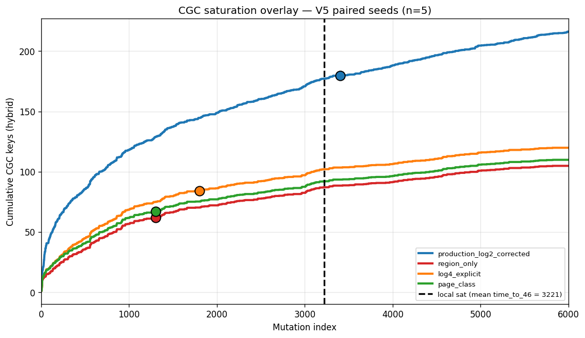
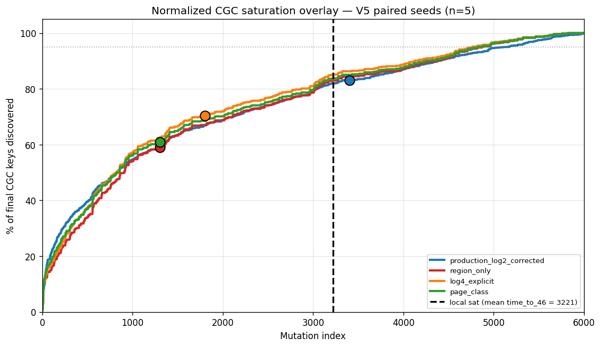

# IV.POS.8 — Pre-D1.E Briefing for Pro

**Audience:** ChatGPT Pro (architectural-design review).
**Purpose:** Chronological summary of the IV.POS.8 work that has fed into the D1.E reward-rewire spec. This is the "what we built, what we found, what we decided, why" briefing — written so Pro can validate the reasoning chain **before** D1.E spec-locks and the V5 + decay re-run dispatches on POS.
**This is NOT the final D1 report.** That deliverable (`IV_POS_8_D1_REPORT_FOR_PRO.md`) folds D1.A + D1.B + D1.C + D1.E together at Stage 4 (after D1.E completes). This briefing exists earlier in the pipeline so Pro can confirm or correct the architectural framing while the choices are still cheap to revise.
**Branch:** `cloud2`
**Author:** Opus
**Status:** **DRAFT v0.1 — covers completed work through 2026-06-17.** Sections marked **IN PROGRESS** are placeholders that Ivan will fill as D1.C, D2.B, and D1.E land.

---

## 0. TL;DR — Where we are right now

We have completed **three load-bearing deliverables** since IV.POS.8 began:

| # | Deliverable | Commit | Status | What it produced |
|---|---|---|---|---|
| 1 | **D1.A** — V5 decaying floor variants (analysis on existing scheduler + binary reward) | `1db0e88` then `4fce664` | **FROZEN** with 6 Findings (A–F) and 8 Limitations | Diagnosis: floor-decay alone is insufficient; reward signal saturation is the binding constraint |
| 2 | **D2.A** — 5-tuple ArmKey refactor + `mutations.outcome` column + applied accounting | `b844e8e` then `7b66fb9` | **DONE** | Scheduler shape that D1.E, D2.B, D2.C, D2.D all build on; V5 byte-identity preserved → D1.A archive remains a valid paired baseline |
| 3 | **D1.B** — CGC coarsening variants (3 alternates evaluated; corrected baseline) | `71dae77` | **DONE** | Recommendation: keep corrected `production_log2_corrected` as L0; coarsenings saturate EARLIER than local; L1 enrichment via D1.C is the primary remaining lever |

Two deliverables are **IN PROGRESS** in parallel chats:

| # | Deliverable | Owner | Status |
|---|---|---|---|
| 4 | **D1.C** — bug-proximity metric stack (Tier-1 per-mutation signals + Tier-2 per-campaign metrics) | D1 chat (this one) | Spec v0.3 LOCKED 2026-06-17; Composer Batch 1 about to kick off |
| 5 | **D2.B** — eight new pure-A4 mutation kinds + attestation hook + `PRE_EXEC_REG_MOD` retrofix | D2 chat (parallel) | Spec v0.5 LOCKED; Composer Batch 1 kickoff pending |

D1.E (the V5 + decay re-run under enriched reward path) is the **integration point** for D1.A + D1.B + D1.C + D2.A + the specific `PRE_EXEC_REG_MOD` retrofix portion of D2.B. The other D2.B work (eight new kinds, attestation hook, `txn_role` mappings) feeds the D2 variants (V6, Hybrid-cTS), NOT D1.E.

**This briefing chronologically narrates each completed deliverable so Pro can see the decision provenance.** Pro disclosure asks are surfaced inline (look for **❓ Pro ask**). The full Notes-for-Pro index (NFP-1 through NFP-10) is at `a4/docs/cloud2/IV_POS_8_NOTES_FOR_PRO.md` for deeper reading.

---

## 1. D1.A — Decay-floor variants on the existing scheduler (FROZEN)

### 1.1 What we did

We ran two V5 floor-decay variants alongside the R2 V5-static baseline on the V5 catalog (48 semantic arms; existing `ConstrainedTSScheduler` with per-epoch integer per-arm quota; existing `bandit_success = 1 if (l_new + g_new + s_new) > 0 else 0` binary composite reward at `reward_v2.py:60-62`):

| Variant | Floor schedule | Seeds (final n) |
|---|---|---:|
| V5-static (R2 baseline) | `ConstantFloor(0.55)` | 1234–1243 (n=10) |
| V5-decayexp | `ExponentialDecayFloor(0.55, 0.20, K=50)` — discovery-triggered | 1234–1238 (n=5 paired) |
| V5-decayepoch | `EpochStaircase([(0, 0.55), (2000, 0.35), (4000, 0.20)])` | 1234–1238 (n=5 paired) |

Original spec asked for n=10 paired triplets; a POS daemon failure capped us at n=5 paired (5 V5-static unpaired added for variance estimation).

### 1.2 What we found — six Findings (A–F)

| ID | Finding | Evidence |
|---|---|---|
| **A** | **K=50 saturates fast (not a bug, but a parameter mistake).** Pro's `max(0.20, 0.55 × exp(-d/K))` with K=50 hits `floor_min=0.20` after ~50 local discoveries. We accumulate ~150+/1000 mut. Decayexp behaves like `ConstantFloor(0.20)` for mut ~100–6000. Useful K range is ~200–300 (NOT K=500+, which would never transition in our 6000-mut run). | Empirical 48% floor-mode share post mut 200 vs V5-static's 96% |
| **B** | **`bandit_decisions.extra_json` is NULL.** Schema column exists but `ConstrainedTSScheduler` never populates it. Per-decision `floor_fraction_at_decision` not persisted. | Direct SQL inspection on all 20 DBs |
| **C** | **Mode sequence is seed-independent within each variant.** sha1 of `mode` sequence [200, end) is identical across all 10 V5-static seeds (`2d14a156aca51190`), all 5 decayexp seeds (`c07da3955a8f0347`), all 5 decayepoch seeds (`32a3abd14125281a`). Seed only affects WHICH arm is picked at adaptive positions, NOT the mode schedule. | Direct hashing per `D1A_SUBSECTION.md` §Finding C |
| **D** | **Scheduler geometry only supports ~3 mode regimes.** Per-arm quota is integer-checked: `target = floor_frac × 100 / 48`. Crossing each integer in `target` shifts mode share by an entire 48-pull pass. The scheduler has only `{~0%, ~48%, ~96%}` mode regimes (no ~75%, no ~25%). Pro's `[0.55, 0.35, 0.20]` epoch tiers collapse to a **2-tier** policy (0.55→96%, 0.35→48%, 0.20→48%) — the 0.35→0.20 boundary at mut=4000 is mechanically invisible. | Code analysis at `bandit_ts.py:180-187`, verified against per-DB mode share |
| **E** | **Post-boundary discovery is empirically tied.** In mut[2000, 6000) where decayepoch's policy diverges from V5-static, both variants discovered **exactly the same 10 contexts in total across 5 seeds**. Per-seed differences are ±1 to ±2; aggregate Δ = 0. | Direct first-discovery-time counts per seed |
| **F** | **We tested only HALF of Pro §7 Stage 2.** Pro §7 (`ProG_Report_3.md:175-196`) proposes both (a) floor decay AND (b) richer TS reward signals (recent marginal discovery, low-cofailure, repairability, underexplored zones). D1.A tested (a) only. The bandit's reward is a single Bernoulli bit; once `l_new`/`g_new`/`s_new` saturate together (local at ~46, CGC at ~186–189), adaptive mode has nothing to differentiate arms on — giving it 13× more decision share (decayexp's 52% vs V5's 4%) produces zero gain on the saturated metric. | `reward_v2.py:60-62` + paired-test p > 0.62 across all three pairwise comparisons + Finding E |

### 1.3 What we decided

**Decay variants are NOT killed.** D1.A's FROZEN scope is explicitly limited to "V5 catalog with existing sparse binary composite reward." The negative we measure is consistent with reward-signal saturation, NOT with decay being intrinsically bad. To either salvage decay variants or defensibly kill them in the final Pro deliverable, we must rewire the bandit reward path. **This is the entire motivation for D1.E.**

Tentative D2 recommendation (revisable after D1.E):

| Setting | Decision | Rationale |
|---|---|---|
| V5-only default | Keep `ConstantFloor(0.55)` | No evidence for switching |
| Decay variants in D2 scope | Keep | Remain candidates under enriched reward signals (D1.E) and Hybrid V7 (Pro Priority-1) |
| Future decay K | K ≈ 200–300 (NOT 50, NOT 500+) | Per Finding A — lands the available mode-transition in the saturation tail |
| Future epoch schedule | 2-tier `[(0, 0.55), (1000, 0.35)]` | Per Finding D — drop the no-op third tier |
| Block on reward signal | YES | Per Finding F — wire at least one richer signal before re-testing decay |

### 1.4 What this informs in D1.E

- **D1.E exists because of Finding F.** The point of D1.B + D1.C is to give the bandit something to learn on after the floor decays.
- **D1.E retunes K to ~200–300 per Finding A** and drops the no-op third epoch tier per Finding D.
- **D1.E re-runs V5-static + V5-decayexp + V5-decayepoch on 5 paired seeds × 3 variants = 15 jobs** under the rewired reward path. Same paired-seed structure as D1.A to enable direct comparison.

### 1.5 ❓ Pro asks

None at the D1.A stage beyond the standard "the decay diagnosis is preliminary; final verdict awaits D1.E." Frozen subsection is at `a4/runs/iv_pos_8/d1a/D1A_SUBSECTION.md` with all numbers, plots, and full Findings text.

---

## 2. D2.A — 5-tuple ArmKey refactor + `mutations.outcome` column (DONE)

### 2.1 What we did

D2.A is the **scheduler-shape foundation** for everything downstream. Two Composer batches:

- **Batch 1 (commit `b844e8e`):** Promoted `ArmKey` from `Tuple[str, str]` (kind, zone) to a `@dataclass(frozen=True)` with 5 string fields — `(surface, kind, zone, opcode_class, pre_post)`. Added `ArmKey.v5(kind, zone)` factory that collapses opcode_class and pre_post to `"n/a"`. Added `MutationOutcome` enum + skeleton `update_with_outcome()` method on `ConstrainedTSScheduler` (no fuzzer wiring yet). Added golden-trace test asserting V5 byte-identity under the new ArmKey.
- **Batch 2 (commit `7b66fb9`):** Added `mutations.outcome` column. Wired fuzzer-side outcome plumbing (`_outcome_for(result)` + `_mutation_record_kwargs` extension). End-to-end normalize verification. V5 byte-identity re-confirmed.

### 2.2 What we found

- **V5 byte-identity is preserved** under the 5-field ArmKey via the back-compat overload. The D1.A V5 archive (10 sealed DBs, ~3 hours POS compute) remains a valid baseline for paired D2 comparisons — no need to re-dispatch V5.
- **The 5-tuple is needed for Hybrid V7's Arguzz-shape arms** (`surface="arguzz_exec_fault"`, distinct `opcode_class` per fault) and for finer A4-side learning if Pro ever wants it (e.g., per-opcode-class reward profiles).
- **`mutations.outcome` resolves D1.A Finding B partially.** While `bandit_decisions.extra_json` remains NULL (Finding B), the new `outcome` column provides per-pull outcome classification that the bandit's `update_with_outcome()` consumes; D1.E's reward-rewire builds on top of this column.

### 2.3 What we decided — **NFP-1** (Notes for Pro)

| Decision | Rationale | Disclosure |
|---|---|---|
| Keep 2-tuple back-compat overload (`ArmKey.v5(...)`) | ~5 lines of code; preserves V5 RNG byte-identity → ~3h compute saved per cycle; D1.A archive reusable | `NFP-1` |
| `surface` axis distinguishes A4 vs Arguzz; A4 arms always `surface="a4_witness_mut"` | Required for D2.D's `Hybrid_cTS` to mix A4 and Arguzz kinds without arm-key collisions | `NFP-1` |
| Tests verify `is_v5_shape()` for archive-reuse-eligible arms | Guards against silent V5-shape drift | `NFP-1` |

### 2.4 What this informs in D1.E

- **D1.E uses V5-shape ArmKeys throughout** (D1.E does NOT touch surface / opcode_class / pre_post axes — those are for D2 variants). V5 byte-identity holds.
- **D1.E's reward rewire writes to `reward_counterfactuals` + `mutations.outcome`**, both of which are already in production schema thanks to D2.A.
- **D1.E paired-test baseline is the D1.A archive** (10 V5-static R2 DBs) — D2.A confirmed this is byte-identical to fresh runs under the new ArmKey, so the n=5 paired triplets can compare D1.E rewired V5 against D1.A archived V5 without re-running V5-static.

### 2.5 ❓ Pro asks

None at the D2.A stage — the refactor is internal-architecture-only; Pro does not need to confirm or revise the ArmKey shape. NFP-1 documented for posterity.

---

## 3. D1.B — CGC coarsening variants (DONE; with a load-bearing bug fix)

### 3.1 What we did

Originally a small analysis-only deliverable (3 coarsening functions + paired tests). **Expanded mid-flight** because Batch 1 audit data surfaced a production extractor bug (NFP-10, §3.5 below) that required a Batch 1.6 fix and post-hoc replay before any of the coarsening analysis could be trusted.

Final scope shipped in commit `71dae77`:

| Batch | Deliverable |
|---|---|
| 1 | Three coarsening functions (`region_only`, `log4_explicit`, `page_class`) in `analysis/cgc_variants.py`; 30-DB Cat-A layout-validation audit |
| 1.5 | Initial `page_class` ELF-derived layout for the sha2-host inspection guest |
| 1.5b | `user_dynamic` page_class label added — refined `page_class` semantics to eliminate the residual `user_other` band |
| 1.6 | **NEW (Composer audit found the bug):** `_coerce_broken_addr` field-priority fix in `compressed_global_extractor.py`; replay tooling reconstructs corrected metrics from preserved `hook3_raw` |
| 2 | Re-analysis on 20-row decay paired corpus under all 4 coarsenings (4 = production_log2_corrected + 3 alternates) |
| 3 | Saturation overlay plots, D2 recommendation, D1.E hand-off, Pro-facing subsection |

### 3.2 What we found — three headline findings

**Finding (1): Saturation inversion** (the central result)

D1.B Batch 2 measured CGC saturation timing across all 4 L0 candidates, overlaid against local saturation (`time_to_46`).

| L0 candidate | CGC saturation mut | Keys remaining at local sat (mut 3221) | Post-local rate |
|---|---:|---:|---|
| `production_log2_corrected` | ~3400 | **39** | ~1.4 new keys/100 mut |
| `log4_explicit` | ~1800 | 18 | ~0.6 new keys/100 mut |
| `page_class` | ~1300 | 18 | ~0.6 new keys/100 mut |
| `region_only` | ~1300 | 18 | ~0.6 new keys/100 mut |

**Coarsened variants saturate 1400–1900 mut EARLIER than local saturation** — the opposite of what Pro §11's "maybe page_class" hint was intended to achieve. Swapping production for `page_class` as L0 **shrinks** the post-local `g_new` discriminating window, not extends it.

Visual evidence:

(Black dashed line = mean local `time_to_46` = mut 3221.)

**Finding (2): Thin headroom for ALL L0 candidates**

Even production's best-case post-local headroom is only +179 mutations / ~39 keys — about **1 new CGC key per 70 mutations** after local saturation. None of the four L0 schemes provide robust long-window discrimination; production is **least-bad**. **L0 schema-swap alone cannot fix D1.A's adaptive-TS-no-signal problem; L1 enrichment is needed.**

**Finding (3): decayexp +2.5% AUC hint, barely significant**

Paired tests on decayexp vs V5-static AUC under coarsened variants showed p≈0.048 at n=5 — likely a cold-start artifact of K=50 collapsing to `ConstantFloor(0.20)` per D1.A Finding A, NOT Pro's intended Stage-2 decay benefit. **D1.E forward-run with K≈200–300 is needed to confirm or kill this.**

### 3.3 What we decided — **NFP-7** (page_class definition)

D1.B evaluated three coarsenings; the most substantive choice was the definition of `page_class`, which Pro hinted at in §11 without naming the exact definition.

| Variant | Definition | Reasoning |
|---|---|---|
| `region_only` | `(family, address_region)` — drops bucket entirely | Coarsest variant |
| `log4_explicit` | `(family, address_region, floor(log2(addr) / 2))` — strictly coarser than production log2 | Control / sanity |
| `page_class` | `(family, page_class)` where `page_class` is a **semantic memory-use class** derived from the inspected guest's ELF | Replaces geometric bucket with semantic intent |

**`page_class` is OUR definition, not Pro's.** Pro §11 wrote "maybe `page_class`, not raw/log2 bucket" without naming what `page_class` means. We picked:

- **Reading (a) — semantic memory-use class** = `{stack, text, rodata, data_bss, heap, host_ecall, user_dynamic, user_other}` derived from the guest ELF + `memory.rs` platform constants + GLOSSARY `HOST_ECALL_ADDR`
- **Rejected** Reading (b) "coarser geometric page index" (just log4 by another name — already covered by `log4_explicit`)
- **Rejected** Reading (c) "region + access pattern" (duplicates `txn_role`)

**Verified `page_class` layout for sha2-host guest (workspace/output Jun 3 2026 build):**

| page_class | Range | Source |
|---|---|---|
| `stack` | `[0x00010000, 0x00200800)` | `memory.rs` STACK_TOP=0x00200400 grows down |
| `text` | `[0x00200800, 0x00219db8)` | ELF `.text` + alignment pad |
| `rodata` | `[0x00219db8, 0x0022133c)` | ELF `.rodata` + `.eh_frame` (folded) |
| `data_bss` | `[0x0022133c, 0x00221488)` | ELF `.data` + `.bss`, ending at `_end` |
| `heap` | `[0x00221488, 0x42000000)` | Bump heap from `_end` to HOST_ECALL |
| `host_ecall` | `[0x42000000, 0x42000100)` | GLOSSARY / D42 |
| `user_dynamic` | `[0x42000100, 0xBFFF0000)` | Batch 1.5b addition — eliminates `user_other` residual |
| `user_other` | residual | Catch-all; gate triggers if > 15% (currently 0.0% on sha2-host) |
| `user_bigint` | `[0xBFFF0000, 0xC0000000)` | Pass-through (one semantic class — accelerator I/O) |

### 3.4 What we decided — **NFP-8** (paired-test corpus)

D1.B uses two distinct corpora for two distinct jobs:

| Corpus | Size | Composition | Purpose |
|---|---:|---|---|
| Cat-A layout-validation | 30 rows | 10 R2 V1 + 10 R2 V5 + 10 D1.A decay | Confirms `page_class` layout covers all observed addresses |
| Decay paired-comparison tests | 20 rows | 10 R2 V5-static + 5 D1.A decayexp + 5 D1.A decayepoch | Tests whether decay variants are statistically distinguishable from V5-static under each coarsening |

**V1 deliberately excluded from decay paired tests** — V1 is a different scheduler family (b1/cTS V1), not a V5 variant. Including V1 would confound the V5-static ↔ V5-decay contrast with V1 ↔ V5 differences.

Statistical power on the decay test is **5 paired triples** — small, by design. D1.E expands this via the V5-rewired forward run.

### 3.5 What we discovered — **NFP-10** (the byte_addr bug)

**During D1.B Batch 1 audit, Composer found that production CGC memory keys had `address_region ∈ {user, zero_page}` only across all 30 audited DBs — despite parallel `global_failures` rows on the same DBs showing rich geography** (`user_regs ≈ 34%`, `kernel ≈ 11%`, `machine_regs ≈ 6%`, etc.). Opus independently verified the bug with SQL on three DBs.

**The bug:** `_coerce_broken_addr` in `compressed_global_extractor.py:216` checked fields in order `("addr", "byte_addr", "address")` and returned the first present value. Hook 3 emits BOTH:
- `addr` = circuit **word** address (index into witness memory addressing, e.g., `USER_REG_BASE = 0x3FFFC020` for registers)
- `byte_addr = addr × 4` = 32-bit VM **byte** address (the address D8 `address_region()` and ELF `page_class` are defined on)

The bug fed word-addresses into `address_region()` (which expects byte-addresses), causing **53–59% memory CGC region mis-classification across audited DBs**.

| DB | Memory rows | Region mismatch | Stored regions | True regions via byte_addr |
|---|---:|---:|---|---|
| V5 s1234 | 13670 | **58.9%** | `{user, zero_page}` (2) | `{user, user_regs, kernel, machine_regs, machine_special, ecall_dispatch, user_bigint, zero_page, invalid}` (9) |
| V1 s1234 | 11376 | 53.2% | Same 2 | Same 9 |
| D1.A decayexp s1234 | 14650 | 55.7% | Same 2 | Same 9 + `trap_dispatch_and_beyond` |

**Invariant verified:** `byte_addr == addr × 4` for 13670/13670 memory dicts on V5 s1234 (zero exceptions). Same on V1 and D1.A samples.

**The fix (Batch 1.6):** Patch field priority to `("byte_addr", "addr", "address")`. Replay tooling reconstructs corrected metrics from preserved `hook3_raw` for R2 + D1.A; cloud2 forward runs (D1.E, D2.*) use the patched extractor natively.

**What is NOT affected by the bug:**

- **Lookup families (cycle, u8, u16):** UNAFFECTED — they route through `_coerce_broken_index` (different function, different fields)
- **Local channel / `local_context_final` / `coverage`:** UNAFFECTED — local rewards come from constraint_loc strings, not addresses
- **Arms / scheduler / `bandit_decisions`:** UNAFFECTED — arm targeting doesn't use this extractor
- **`f_new` family novelty:** UNAFFECTED — family-level, not per-address
- **Hook 3 residue math itself:** Correct — the C++ correctly uses `addr` for the permutation hash; the bug is only in the *downstream Python extractor's labeling of broken addresses for CGC key construction*

**Impact on Pro's prior R2 conclusions:**

| Claim made to Pro in PROG_REPORT_2 / Brief | Status after fix |
|---|---|
| D8 `user` band is huge (~3 GiB); code/heap/stack collapse | **Still true** — D8 design unchanged |
| `address_bucket` (log2) is dominant discriminator within `user` | **Partially true** — `txn_role` and `cycle_phase` also contribute; the user band collapse was made WORSE by the bug folding `user_regs/kernel` into `user` |
| V5 mean CGC ≈ 188; V1 ≈ 144; V5 > V1 by ~30% | **Direction preserved**, absolute counts understated. Replay shows +13–20% more total keys; V5 > V1 holds |
| Memory channel under `region_only`/`log4` coarsenings is "dead" | **Partially true** — those coarsenings still collapse heavily, but with `byte_addr` the post-hoc `region_only` count goes from 2 to 9 distinct memory labels |
| `page_class` is necessary to add semantics inside `user` | **Still true** — `page_class` is complementary to a correct `address_region`, not redundant |

### 3.6 What this informs in D1.E

- **D1.E L0 baseline is `production_log2_corrected`** (post-`byte_addr` fix), NOT page_class or any other coarsening. D1.B Batch 3's recommendation `d1b_recommendation.md` is the load-bearing input here, reaffirmed in `d1e_handoff_CGC_saturation.md`.
- **D1.E forward runs use the patched extractor natively** — Batch 1.6 already landed in cloud2 main; D1.E does not need to re-coordinate the fix.
- **D1.E DOES need L1 enrichment** (D1.C's job) because L0 schema-swap alone cannot extend the post-local discriminating window. D1.B's saturation-inversion finding is the empirical evidence motivating D1.E's L1 dependency on D1.C.

### 3.7 ❓ Pro asks (the load-bearing ones)

These are the disclosures Pro should explicitly confirm or correct before D1.E spec-locks:

**❓ Pro ask (NFP-7 Q-PC-4) — `page_class` semantic definition.** When you read the D1.B subsection, please confirm:

1. Whether **semantic memory-use class** matches your "maybe page_class" intent (we picked Reading (a) `{stack, text, rodata, data_bss, heap, host_ecall, user_dynamic, user_other}`).
2. Whether you want `.eh_frame` folded into `rodata` (current) or split as its own class.
3. Whether `user_bigint` should be sub-split or pass-through (current).
4. Whether the **ELF-mandatory derivation recipe** is acceptable (Batch 1.5 hard-fails if guest ELF is missing — no silent fallback to empirical bucketing).

If you correct any of these, D1.B's `page_class` definition gets re-run; this does NOT block D1.E (which uses `production_log2_corrected` regardless), but it affects D2.G's V5-vs-V6 comparison table and the final Pro deliverable's framing.

**❓ Pro ask (NFP-10) — `byte_addr` fix + post-hoc replay acceptability.** Please confirm:

1. **`byte_addr` is the correct field** for VM-region and page-class labeling (we believe yes based on D8 + ELF semantics + the explicit `ffi.cpp:590-593` calculation `byte_addr = (uint64_t)addr * 4`).
2. **Post-hoc replay from `hook3_raw` is acceptable** for D1.B / R2 corrected metrics. Re-dispatch would cost ~5–7 hours POS compute for ~10% additional rigor; we believe replay is sufficient because local/AUC/`local_context_final` are unaffected by the memory-CGC bug, so frozen D1.A subsection conclusions stand on local-channel data.
3. If you want **legally-clean bandit trajectory under corrected reward** (i.e., re-dispatch instead of post-hoc replay), say so before D1.E dispatches its 15 POS jobs and we can include a re-dispatch of R2 V1-V5 in the same POS reservation window.

---

## 4. D1.C — Bug-proximity metric stack (IN PROGRESS)

### 4.1 Status as of 2026-06-17

**Spec locked at v0.3** (`a4/docs/cloud2/IV_POS_8_D1_C_SPEC.md`). Composer Batch 1 kickoff brief written at `a4/docs/cloud2/composer/D1C_BATCH1_COMPOSER_KICKOFF.md`. Ivan has greenlit all 7 Q-C-* recommendations and the v0.2 + v0.3 audit fixes.

### 4.2 Planned scope (from spec)

D1.C ships **two tiers of signals + one coordination artifact** on the same 30-DB Cat-A corpus D1.B used:

| Tier | Granularity | Purpose | Count |
|---|---|---|---:|
| **Tier-1** | Per-mutation | L1 OR-channel candidates for D1.E reward rewire | **5 candidates** |
| **Tier-2** | Per-campaign | D2.G's V5-vs-V6 comparison table + Pro-facing bug-proximity disclosure | **8 metrics** |

**Tier-1 candidates** (each scoped via §1.4 Option A channel reconstruction — uses `discovery_binary_reward` directly from `reward_counterfactuals`, no replay):
1. `f_new_flag` — exact proxy for `f_new ≥ 1` via `fnew_only_reward > 0` (already-computed family novelty, free addition)
2. `recent_marginal_discovery_rate` — rolling mean of `discovery_binary_reward` over W=100 pulls (momentum / smoothed bandit-success rate)
3. `singleton_failure_flag` — exactly one constraint_loc broke this pull
4. `mutation_substrategy_uniqueness` — first occurrence of composite kind-specific substrategy key
5. `d_loc_le_2_flag` — per-pull threshold flag from Pro Report 3 §8 "unique locs discovered with d_loc ≤ 2"

**Tier-2 metrics** (Pro-§-tagged column names; D2.G consumes these via `cat_a_pro_s*` schema):
1. `pro_s5_verifier_accepted_invalid_count` (aligned to D1.A spec locked SQL)
2. `pro_s5_co_failure_graph_degree_p95`
3. `pro_s5_singleton_failure_rate`
4. `pro_s5_d_loc_p95`
5. `pro_s8_unique_locs_with_d_loc_le_2`
6. `pro_s8_unique_locs_with_d_glob_le_1` (Pro §8 paired)
7. `pro_s5_proof_generated_zero_residue_rejected_rate` (Cat-B; D1.A 10 DBs only)
8. `pro_b_wall_clock_per_normalized_discovery` (Cat-B)

**Critical scope disclaimer:** D1.C identifies CANDIDATE signals; it does NOT prove the bandit benefits from learning on them. That validation is D1.E's forward-run job. D1.C's only claim is "these signals have empirically promising properties (orthogonality to existing channels + non-saturation past mut 3000)."

### 4.3 Expected output → D1.E hand-off

- `d1c_signal_shortlist.md` — Top 2–3 Tier-1 signals (Bucket A: RECOMMENDED for D1.E L1) + deferred candidates with rationale (Bucket B: ortho failure; Bucket C: ortho failure but kept as NFP-9 scalar-bandit candidate)
- `d1e_handoff_L1_signals.md` — Per-seed disjoint-fire rates + sample L1 OR sketch + ≤3 OR'd channels stopping rule
- `d1c_metrics_table.csv` (30 rows × 8 metric columns) — feeds D2.G headline comparison table
- `d1c_tier2_schema.md` — column schema for D2.G `build_d2_artifacts.py` consumption

### 4.4 ❓ Pro asks (to be surfaced when D1.C completes)

> _**[IVAN TO FILL after D1.C Batch 3 completes]**_
>
> Likely asks based on spec v0.3:
> 1. Confirmation of Tier-2 metric schema (especially the Pro §5 `verifier_accepted_invalid_count` SQL — D1.A spec locked one definition, Pro Report 3 §5 wrote a slightly different one; we shipped the D1.A-locked Cat-A variant and flagged the Cat-B-literal variant as a possible later add)
> 2. Endorsement of Tier-1 shortlist (Bucket A) for D1.E L1 wiring, or pushback if Pro wants different signals prioritized
> 3. Acknowledgment of Bucket C (continuous signals kept for future scalar-bandit consideration per NFP-9 deferred L2)

---

## 5. D2.B — Eight new pure-A4 kinds + attestation hook + `PRE_EXEC_REG_MOD` retrofix (IN PROGRESS)

### 5.1 Status as of 2026-06-17

**Spec locked at v0.5** (`a4/docs/cloud2/IV_POS_8_D2_B_SPEC.md`). Composer Batch 1 kickoff pending in the parallel D2 chat.

### 5.2 What D2.B will deliver

| Component | Purpose | Relevance to D1.E |
|---|---|---|
| **Eight new A4 kinds** (3 high-priority + 5 medium) per `NFP-2` | Implements Pro's complete §8 + §15.3 wish list of pure-A4 mutation kinds | NOT in D1.E critical path — these feed D2 variants (V5-expanded, Hybrid-cTS), not V5-static + decay re-run |
| **NFP-3: `TXN_PREV_WORD_MOD` single registry kind, RNG-picked strategy** | Bandit treats `at_read` and `at_write` as one arm; fuzzer RNG-picks per pull | NOT in D1.E critical path — V5 catalog only uses existing 8 kinds |
| **NFP-4: `txn_role` mappings for 8 new kinds** | All map to Pro-valid `MEMORY_TXN_ROLES`; per-kind D2.G pivots on `producer_kind` | NOT in D1.E critical path — D1.E doesn't introduce new kinds |
| **NFP-5: Layer 3 attestation hook (`A4_DUMP_POST_MUT=1`)** | New ~30 LOC Rust hook in `workspace/risc0-modified/.../witgen/mod.rs` — emits post-mutation state dumps for cross-check | NOT in D1.E critical path — V5 mutations are already well-tested; D1.E doesn't need new attestation |
| **NFP-6: `PRE_EXEC_REG_MOD` retrofix (Batch 1.5e)** | Existing kind had two Rust strategies (`next_read`/`prev_write`) but fuzzer hardcoded `next_read` and arm universe only probed it. Half the designed surface was dead. Retrofix: fuzzer RNG-picks per pull + arm universe ORs both. | **YES — D1.E SYNC POINT.** This alters V5 mutation behavior. D1.E's V5 baseline must run AFTER this fix lands so the new baseline matches the post-D2.B-Batch-1 codebase. |

**The D1.E ↔ D2.B sync point is narrow.** Only `PRE_EXEC_REG_MOD` retrofix (Batch 1.5e, ~10 LOC) is in the D1.E critical path. The other D2.B work happens in parallel and feeds D2.D / D2.G — NOT D1.E.

### 5.3 Why the PRE_EXEC_REG_MOD retrofix matters for Pro

**D1.A V5 control archive remains valid** (frozen history, run under hardcoded `next_read`). Fresh V5 reruns AFTER Batch 1.5e would diverge from the D1.A archive because of the new per-pull RNG draw.

**D1.E's V5-static baseline IS a fresh re-run** (because D1.E's whole point is to test V5 under the rewired reward path). So D1.E's fresh V5 baseline uses the **new** `PRE_EXEC_REG_MOD` strategy mix. Comparing D1.E's rewired V5 against D1.A's archived V5 requires Pro to mentally separate:

- **Reward-signal effect (D1.E's hypothesis):** rewired reward vs binary composite
- **Mutation-coverage effect (D2.B Batch 1.5e side effect):** dual-strategy `PRE_EXEC_REG_MOD` vs hardcoded `next_read`

We will explicitly call this confound out in the D1.E subsection (and ideally re-run D1.A's V5-static under the new code as a control if POS reservation allows — see §6.4 below).

### 5.4 ❓ Pro asks (to be surfaced when D2.B Batch 1.5e completes)

> _**[IVAN TO FILL after D2.B Batch 1.5e completes]**_
>
> Likely asks:
> 1. Whether Pro wants the D1.A V5-static archive re-run under the new `PRE_EXEC_REG_MOD` strategy mix (Pro-visible delta if comparing R2 PRE_EXEC_REG_MOD failure rates against post-D2.B numbers)
> 2. Acknowledgment of NFP-4 `txn_role` mapping decisions (we mapped 8 new kinds to Pro-valid roles; Pro can request a `cycle_meta` schema bump in IV.POS.9 if finer separation is wanted)

---

## 6. D1.E preview — what we will wire (and what Pro will see)

### 6.1 D1.E's three components

Per `IV_POS_8_D1_REVISIT_PLAN.md` v0.6 §3.3 + `NFP-9`:

**(A) Reward rewire** in `a4/standalone/reward_v2.py` + `a4/standalone/fuzzer.py`:

| Layer | Change | Source |
|---|---|---|
| **L0** | Keep production `compressed_global_context` log2 bucketing (D1.B Batch 1.6 corrected). NOT a swap — keep what we have, because D1.B Finding (1) showed coarsenings make the post-local window WORSE. | D1.B `d1b_recommendation.md` + `d1e_handoff_CGC_saturation.md` |
| **L1** | Extend `compute_bandit_success` to OR-in (a) `f_new > 0` (free per NFP-9 — already computed in `reward_v2.py:compute_reward_v2_components` but excluded from today's Bernoulli) + (b) one or more Tier-1 D1.C-shortlisted per-mutation signals (top 2–3 from D1.C Bucket A) | D1.C `d1e_handoff_L1_signals.md` |
| **L2** | **OUT OF SCOPE for D1.E v1.** Replacing Beta-Bernoulli TS with scalar-reward bandit (so we can use continuous-valued signals like `recent_marginal_discovery_rate` directly) is a Layer-2 architectural change deferred to D2 or follow-on. Bucket-C D1.C signals are flagged for this future work. | NFP-9 |

**(B) K + epoch retune** per D1.A Finding A + Finding D:

| Parameter | D1.A value | D1.E value |
|---|---|---|
| Decayexp K | 50 (saturated by d=7) | **200–300** (transition lands in saturation tail at d≈27–41) |
| Epoch boundaries | `[(0, 0.55), (2000, 0.35), (4000, 0.20)]` (third tier is no-op per Finding D) | **`[(0, 0.55), (1000, 0.35)]`** (drop the no-op third tier; move boundary earlier so staircase fires inside discovery window) |

K target derivation will use `_local_discoveries` saturation (cumulative legacy `coverage` row count, per Pro §7 verbatim formula `floor_fraction(t) = max(0.20, 0.55 × exp(-local_coverage_seen / K))`). NOT changed by D1.B/D1.C — K stays anchored to local survey progress per Pro's intent.

**(C) POS re-run** — 5 paired triplets × 3 variants (V5-static, V5-decayexp, V5-decayepoch) = **15 jobs** under the rewired reward path. Same paired-seed structure as D1.A (seeds 1234–1238) for direct comparability.

### 6.2 What Pro will see after D1.E

A **direct paired comparison** of three V5 floor schedules under the **rewired reward signal**:

- If decay variants now show statistically significant gains on at least one of (a) `local_context_final`, (b) corrected `compressed_global_context_final`, (c) any of the D1.C Tier-2 bug-proximity metrics — then Pro §7 Stage 2 is partially validated and decay variants survive into D2.
- If decay variants STILL show no significant difference — then either (a) Pro's Stage 2 hypothesis is empirically wrong for the V5 catalog (decay-alone-isn't-enough), or (b) there's a Layer-2 (scalar bandit) requirement we haven't met. D1.E result will distinguish (a) vs (b) by examining whether the rewired binary OR `bandit_success` actually has more post-local discrimination than the original.

### 6.3 D1.E sync requirements (must land BEFORE D1.E dispatches)

| Requirement | Owner | Status |
|---|---|---|
| D1.B `production_log2_corrected` baseline | D1.B (Composer + Opus, commit `71dae77`) | **DONE** |
| D1.C Tier-1 shortlist + `d1e_handoff_L1_signals.md` | D1.C Batch 3 | IN PROGRESS |
| D2.B Batch 1.5e `PRE_EXEC_REG_MOD` retrofix | D2.B Composer (parallel chat) | IN PROGRESS |
| Ivan greenlight on D1.E spec | Ivan | Pending D1.C + D2.B Batch 1.5e completion |

### 6.4 Open Decision for Pro at D1.E dispatch time

**❓ Pro ask (likely surfaced at D1.E spec-lock):** D1.A's V5-static baseline was run under the hardcoded `PRE_EXEC_REG_MOD next_read` strategy. D1.E's V5-static will run under the new dual-strategy mix (NFP-6). Do you want:

- **(a) Compare D1.E rewired V5 against D1.A archived V5 directly** (cleanest test of reward-rewire effect; confounded by the dual-strategy `PRE_EXEC_REG_MOD` change), OR
- **(b) Re-run D1.A V5-static under the new code as a control** (5 extra POS jobs; clean separation of reward-rewire effect from mutation-coverage effect; ~3 extra hours POS compute), OR
- **(c) Skip the V5-static re-run in D1.E and only test decayexp + decayepoch under rewired reward** (saves 5 POS jobs but loses the V5-baseline anchor; not recommended)

Our default if Pro doesn't specify: **(a)** with the confound explicitly disclaimed in the subsection. **(b)** is cleaner and we can absorb the 5 extra jobs if Pro wants the cleaner statistical separation.

---

## 7. Where to read more

| Topic | File |
|---|---|
| D1.A frozen subsection (Findings A–F, Limitations 1–8) | `a4/runs/iv_pos_8/d1a/D1A_SUBSECTION.md` |
| D1.B Pro-facing subsection (saturation overlay + recommendation) | `a4/runs/iv_pos_8/d1b/D1B_SUBSECTION.md` |
| D1.B → D1.E hand-off (L0 baseline rationale) | `a4/runs/iv_pos_8/d1b/d1e_handoff_CGC_saturation.md` |
| D1.B `page_class` ELF layout | `a4/runs/iv_pos_8/d1b/d1b_page_class_layout.md` |
| D1.B variant recommendation | `a4/runs/iv_pos_8/d1b/d1b_recommendation.md` |
| D1.C spec (IN PROGRESS) | `a4/docs/cloud2/IV_POS_8_D1_C_SPEC.md` v0.3 |
| D2.A spec (DONE at `7b66fb9`) | `a4/docs/cloud2/IV_POS_8_D2_A_SPEC.md` v0.2 |
| D2.B spec (IN PROGRESS) | `a4/docs/cloud2/IV_POS_8_D2_B_SPEC.md` v0.5 |
| D1 revisit plan (the master plan that spawned this briefing) | `a4/docs/cloud2/IV_POS_8_D1_REVISIT_PLAN.md` v0.6 |
| Notes for Pro index (NFP-1 through NFP-10) | `a4/docs/cloud2/IV_POS_8_NOTES_FOR_PRO.md` |

---

## 8. Revision history

| Date | Author | Change |
|---|---|---|
| 2026-06-17 | Opus | Initial draft v0.1 — covers completed work through 2026-06-17: D1.A (frozen), D2.A (done at `7b66fb9`), D1.B (done at `71dae77`). Placeholder structures for D1.C (in progress), D2.B (in progress), D1.E preview. Embeds Pro disclosure asks NFP-7 Q-PC-4, NFP-10 byte_addr fix + post-hoc replay acceptability, NFP-9 D1.E L0+L1 framing, NFP-6 D1.A V5-static re-run decision. Briefing is intentionally NOT the final D1 report (that comes at Stage 4 after D1.E); this is the pre-D1.E checkpoint so Pro can validate the reasoning chain while the choices are still cheap to revise. |

*End of `IV_POS_8_PRE_D1E_BRIEFING_FOR_PRO.md` v0.1.*
