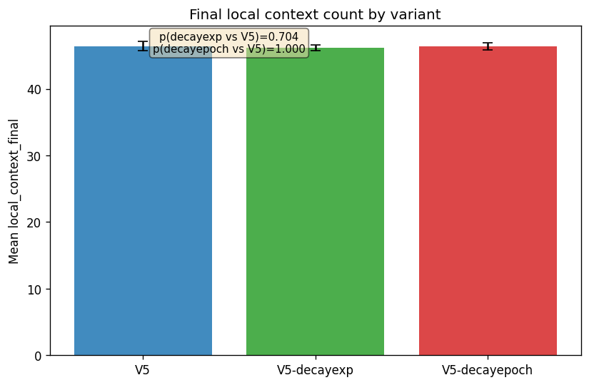
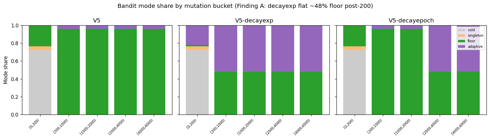
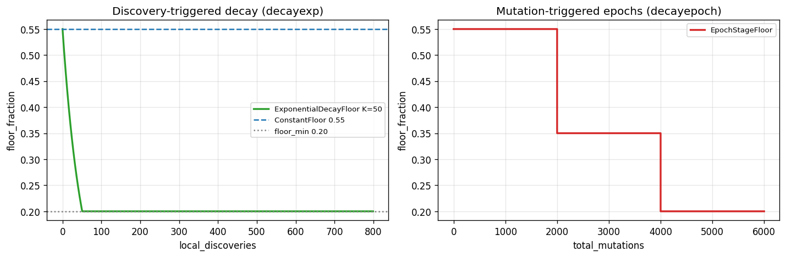
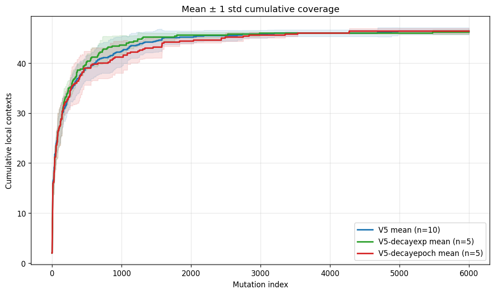
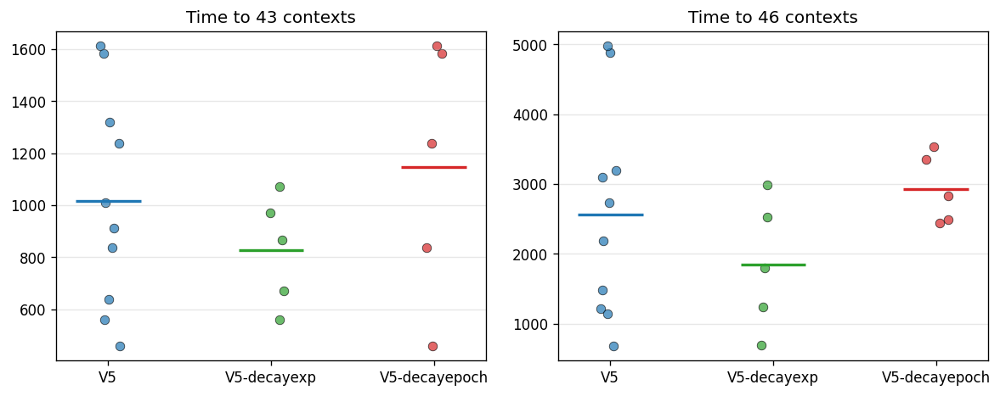

# D1.A — V5 Decaying Floor Variants

> **⚠ FROZEN 2026-06-17 — INTERIM RESULTS, NOT YET FINAL FOR PRO.**
>
> This subsection tests Pro §7's literal floor-decay schedules on the V5 catalog with the existing **sparse binary composite** TS reward (`bandit_success = 1 if (l_new + g_new + s_new) > 0 else 0` per `reward_v2.py:60-62` — one bit per pull across local context / compressed-global context (production log4 bucketing) / structural cell). Per **Findings D, E, F** below, this is **only half of Pro §7 Stage 2's proposal** — we did not rewire TS reward to use the richer signals Pro listed (*recent marginal discovery, low-cofailure discoveries, repairability, underexplored semantic zones*) and we did not vary the CGC coarsening function (D1.B territory).
>
> **Decay variants are NOT killed by this evidence.** They remain candidates for re-evaluation once D1.B (coarsened-CGC reward signals) and D1.C (bug-proximity signals) are wired into the scheduler's reward path. This subsection is preserved as-is for traceability; the final Pro-facing D1 deliverable will fold in the follow-on re-run.

## TL;DR

We shipped two V5 floor-schedule variants (`V5-decayexp`: discovery-triggered exponential decay with K=50; `V5-decayepoch`: mutation-count epoch staircase) alongside the R2 V5-static baseline. On **5 paired triplets** (seeds 1234–1238), decay variants show **no statistically significant change in `local_context_final`** vs V5-static (paired p > 0.62), AND, in the post-boundary window where decayepoch's policy differs from V5-static (mut[2000, 6000)), the two variants discovered **the same 10 contexts in total across 5 seeds** (Finding E). This rules out the narrow hypothesis "V5's 96% floor share is starving productive TS exploitation" but is **scoped to the V5 catalog with the existing sparse binary composite reward** (`bandit_success = 1 if (l_new+g_new+s_new)>0`, Finding F). Mechanically the schedules engaged correctly; the scheduler's per-arm-integer-quota geometry only supports **3 effective mode regimes** (~0% / ~48% / ~96% floor), so Pro's `[0.55, 0.35, 0.20]` epoch tiers collapse to a 2-tier policy and `K=50` jumps regimes at d=7 instead of d≈46 (Finding D). **Tentative recommendation pending the D1.B/D1.C-enriched re-run:** keep V5-static as the V5-only default; do **not** drop decay variants from D2's scope.

## Dataset

| Variant | Seeds (this report) | Source |
|---|---|---|
| V5 (static) | 1234–1243 (10) | R2 archive `a4/runs/iv_pos_7/dbs/` |
| V5-decayexp | 1234–1238 (5) | `a4/runs/iv_pos_8/d1a/dbs/` |
| V5-decayepoch | 1234–1238 (5) | same |

**Paired triplets:** seeds **1234, 1235, 1236, 1237, 1238** — all three variants present (Task 5.4 complete; final n=5).

**Scope note:** Spec originally targeted 10 paired seeds × 2 decay variants (20 D1.A DBs). POS daemon failure after the first 8-job dispatch limited decay-variant coverage to 5 seeds. We do **not** dispatch seeds 1239–1243 × decay variants in this increment (agreed scope lock).

## Headline numbers

(from `d1a_build_summary.json`, n=5 paired triplets for decay variants; n=10 for V5-static mean)

- Mean `local_context_final` **V5-static:** **46.40**
- Mean `local_context_final` **V5-decayexp:** **46.20**
- Mean `local_context_final` **V5-decayepoch:** **46.40**
- Paired t-test p (**V5 vs V5-decayexp**, local_context_final): **0.704**
- Paired t-test p (**V5 vs V5-decayepoch**, local_context_final): **1.000**
- Floor-mode share **V5-decayexp** mut[200, 6000): **48.0%** (Finding A signature)



## Mechanism: floor schedules behave as designed



**V5-decayepoch (epoch staircase):** floor-mode share is **96%** in mut[200, 2000), **48%** in mut[2000, 4000), **48%** in mut[4000, 6000) — matching the configured boundaries at 2000 and 4000 mutations.

**V5-decayexp (exponential):** floor-mode share is **flat ~48%** across all post-cold-start buckets — consistent with the floor fraction having saturated at `floor_min=0.20` early in the run (see Finding A).

**V5-static:** floor-mode share ~96% post-200 (constant 0.55 floor with 48 semantic arms).







## Findings

### Finding A — K=50 saturates fast (not an implementation bug)

Pro's formula `max(0.20, 0.55 × exp(-d/K))` with **K=50** reaches `floor_min` after ~50 local discoveries. Our fuzzer accumulates local coverage at ~150+ entries per 1000 mutations, so decayexp behaves like **`ConstantFloor(0.20)`** for mutations ~100–6000. Empirical evidence: flat **48%** floor-mode share post-200 (Plot 4) vs V5-static **96%**.

At `floor_min=0.20` with 48 arms, the per-arm floor quota is below one pull per epoch — the scheduler alternates floor and adaptive pulls, so the **~48% floor share is a structural pool mix**, not a direct readout of `floor_fraction=0.20`. The Pro-relevant takeaway is unchanged (K=50 too small), but the mechanism is epoch/pool structure rather than stochastic noise.

**Implication for Pro/D2 (revised):** the **right K is ~200–300, NOT K=500+**. Computed table (where `floor_frac × 100 / 48 = 1.0`, the actual mode-transition threshold):

| K | 96%→48% mode-transition at d= | What that means for our N=6000 run |
|---|---:|---|
| 50 (this run) | 7 | Transitions during discovery rush — what we measured |
| 100 | 14 | Still during discovery rush |
| **200** | **27** | **Transitions during saturation tail — best** |
| 300 | 41 | Transitions near saturation ceiling |
| 500 | 68 | **Never transitions during our run — ≡ V5-static** |
| 1000 | 136 | Same — ≡ V5-static |

K=500 (which earlier drafts of this subsection recommended) would make decayexp behaviorally identical to V5-static for the entire run, since max discoveries observed is ~46 — it would not test decay at all. The actual useful K range to land the single available mode-transition in the saturation tail is K ≈ 200–300.

### Finding B — `bandit_decisions.extra_json` is NULL

The schema column exists but is never populated by `ConstrainedTSScheduler`. Per-decision `floor_fraction_at_decision` is not persisted. Variant behavior is reconstructable from `mode` + `mutation_id` + `campaign_params.extra_json`, but this is a minor instrumentation gap to fix before D2 if per-decision floor telemetry is needed.

### Finding C — Mode sequence is seed-independent within each variant

Direct evidence from the DBs (sha1 of `mode` sequence [200, end)):

| DB | sha1 of `mode` sequence [200, end) |
|---|---|
| V5-static (all 10 seeds) | `2d14a156aca51190` |
| V5-decayexp (all 5 seeds) | `c07da3955a8f0347` |
| V5-decayepoch (all 5 seeds) | `32a3abd14125281a` |

(Hashes computed with the command below; if you get different values, your separator / range convention differs — what matters is that all seeds of a given variant collide on the same hash.)

```bash
python -c "
import sqlite3, hashlib, sys
db = sys.argv[1]
with sqlite3.connect(db) as c:
    seq = [m for (m,) in c.execute(
        'SELECT mode FROM bandit_decisions WHERE mutation_id >= 200 ORDER BY mutation_id'
    )]
print(hashlib.sha1('|'.join(seq).encode()).hexdigest()[:16])
" <db_path>
```

The collision (all seeds of a variant producing the same hash) is robust to convention choice; the specific hex value is not.

The per-mutation `mode` (cold / singleton / floor / adaptive) is **deterministic within a variant**; seed affects **which arm is selected**, not the mode schedule. Example: decayexp seeds 1234 and 1235 share the same mode sequence but differ in `selected_arm` at adaptive positions.

Three consequences:

1. **Finding A's ~48% floor share** reflects the structural floor/adaptive pool mix at saturated `floor_min`, not run-to-run randomness (see Finding A refinement above).
2. **V5-decayepoch matches V5-static through mut ~2048** — same `mode` and `selected_arm` at every mutation_id before the epoch boundary takes effect (first mode divergence at mut **2049** on seed 1234). Paired `time_to_43` values are **bit-identical** across all 5 seeds for V5 vs decayepoch.
3. **The current experiment cannot meaningfully distinguish V5-decayepoch from V5-static on `local_context_final` in aggregate**, even at n=5. Per-seed differences are non-zero (Δ ∈ {0, +1, +1, −2, 0}), but the mean diff lands at exactly 0.0 (paired p=1.000). The cancellation is structural, not coincidental: `local_context_final` saturates near mut~2800 (median time_to_46), and the first 2049 mutations are deterministically identical between V5-decayepoch and V5-static (same mode, same floor schedule, same RNG state per seed). Most of the final coverage is therefore inherited from the shared early phase. To meaningfully distinguish them you'd need either (a) **earlier epoch boundaries** (≤1000 instead of 2000/4000) so the staircase fires *inside* the discovery window, or (b) **a metric that saturates later** (e.g., `compressed_global_context_final`, or a coarser CGC grouping per the planned D1.B work).

   For decayexp the situation is different: per-seed Δ_exp ∈ {0, 0, 0, −2, +1}, also no significant aggregate effect (paired p=0.704). Here the limitation isn't shared early phase — it's that K=50 collapses decayexp to the 48% floor regime by d=7 (Finding A), so the variant never actually exercises a gradual decay over the saturation tail. A redesigned experiment with K ≈ 200–300 (NOT K=500; see Finding A) would be needed to land the available mode-transition during the saturation tail (d≈27–41) where it could plausibly matter — and even that requires Finding F's reward-signal change to be testable on `local_context_final`.

**Note:** V5-static also exhibits seed-independent mode sequences — this is a general property of `ConstrainedTSScheduler` under our campaign setup, not decay-specific.

### Finding D — Scheduler mode space is discrete (3 regimes), not a continuous gradient

`ConstrainedTSScheduler._floor_target()` (`a4/standalone/bandit_ts.py:187`) computes per-arm quota as:

```python
target = floor_frac * self.epoch_size / len(self.arms)   # = floor_frac × 100 / 48
```

with the mode-selection check (`bandit_ts.py:237`):

```python
under = [a for a in self.arms if self.epoch_pulls[a] < target - _EPSILON]
```

`epoch_pulls` is an integer. So crossing each integer in `target` shifts mode share by an entire 48-pull "pass" per 100-mutation epoch. The scheduler has **only 3 effective mode regimes**:

| Per-arm quota (target) | floor_frac range | Mode share |
|---|---|---|
| > 2 | floor_frac > 0.960 | ~100% floor |
| 1 < target ≤ 2 | **0.480 < floor_frac ≤ 0.960** | **~96% floor (2 passes × 48)** |
| 0 < target ≤ 1 | **0.005 < floor_frac ≤ 0.480** | **~48% floor (1 pass × 48)** |
| ≈ 0 | floor_frac ≤ 0.005 | ~0% floor |

Two consequences for what we actually tested:

1. **Pro's `[0.55, 0.35, 0.20]` epoch tiers are mechanically a 2-tier policy.** 0.55 → 96% floor; 0.35 → 48% floor; 0.20 → 48% floor. The 0.35 → 0.20 boundary at mut=4000 is **invisible to the scheduler** — both produce 48% floor. We are not testing 3-stage decay; we're testing a 2-stage decay where stage 3 is a no-op.

2. **Continuous `floor_frac(d)` decay collapses to step transitions.** The exponential schedule produces a smooth `floor_frac` curve, but mode behavior only changes when that curve crosses 0.48 (and again at 0.96 / 0.005). For K=50 this is one transition at d=7; for any K, exactly one transition (if floor_frac ever crosses 0.48 during the run).

**Implication for Pro:** Pro's intended "gradual decay" is not testable on this scheduler at all. To get a true gradient, either:

- Replace per-epoch integer quotas with per-mutation Bernoulli sampling: `mode = floor with prob = floor_frac` (one-line change, makes mode share linear in `floor_frac`).
- Substantially increase the arm count (Hybrid V7's expanded catalog has more arms → smaller per-arm step sizes → more granular quotas).

Either way, **scheduler geometry — not schedule parameters — is the binding constraint** on testing gradient decay.

### Finding E — Post-boundary discovery is empirically tied (10 vs 10 contexts)

To answer "did decayepoch's lower post-boundary floor actually let adaptive find more contexts in the policy-divergent window?" directly, we bucket per-seed first-discovery times:

**Contexts FIRST-discovered in mut[2000, 6000) — the region where decayepoch differs from V5-static:**

| Seed | V5-static | V5-decayepoch | Δ | V5-decayexp |
|---|---:|---:|---:|---:|
| 1234 | 2 | 2 | 0 | 1 |
| 1235 | 2 | 3 | +1 | 0 |
| 1236 | 2 | 3 | +1 | 1 |
| 1237 | 3 | 1 | -2 | 0 |
| 1238 | 1 | 1 | 0 | 1 |
| **Total** | **10** | **10** | **0** | **3** |

**Literally identical totals.** This is not a power-cancellation artifact at the aggregate level — even restricted to the policy-divergent window, V5-static (with 96% floor) and decayepoch (with 48% floor) discovered exactly the same number of new contexts.

In mut[4000, 6000) where Pro's tier-3 (0.20) supposedly fires: V5 found 3 contexts total, decayepoch found 2. Tiny absolute numbers — the policy difference at the deepest tier is operating on a near-empty discovery region.

**This rules out** the narrow hypothesis: "V5's 96% floor share starves productive TS exploitation in the saturation tail." It does NOT rule out decay being useful with different reward signals (Finding F) or on a larger catalog (Hybrid V7).

For decayexp the comparable answer is: 3 contexts post-mut-2000 across 5 seeds (vs V5's 10). decayexp discovered MORE contexts earlier (faster `time_to_43`/`time_to_46`) but FEWER late — net tied on `local_context_final`.

### Finding F — We tested only half of Pro §7 Stage 2

Pro §7 (`ProG_Report_3.md:175-196`) proposes a *staged* schedule:

> "Stage 2: Adaptive exploitation … floor decays to 0.20–0.30. **TS or bootstrapped TS selects arms based on: recent marginal discovery, low-cofailure discoveries, repairability, underexplored semantic zones.**"

D1.A implemented (a) the floor decay. We did **not** implement (b) the reward-signal enrichment. Our `ConstrainedTSScheduler`'s TS posterior update uses the **binary composite** at `a4/standalone/reward_v2.py:60-62`:

```python
def compute_bandit_success(l_new: int, g_new: int, s_new: int) -> int:
    return 1 if (l_new + g_new + s_new) > 0 else 0
```

— i.e. **one bit per pull**, indicating whether the mutation discovered anything new across local context (`l_new`), compressed-global context (`g_new`), or structural cell (`s_new`). This is richer than `d_loc` alone — compressed-global novelty IS part of the bandit reward — but it is still **a single Bernoulli bit**, not the multi-signal vector Pro §7 Stage 2 lists (recent marginal discovery, low-cofailure discoveries, repairability, underexplored semantic zones). On the current inspection guest, all three of `l_new`/`g_new`/`s_new` plateau together (local at ~46 contexts, compressed-global at ~186, structural cells also saturate); once arms' Bernoulli posteriors converge near zero across all three, TS draws become near-uniform among the top arms. **Adaptive mode has nothing to differentiate arms on.**

This is consistent with our empirical observation that giving adaptive mode 13× more decision share (decayexp's 52% vs V5's 4%) produced no measurable gain on the saturated metric. **The bottleneck appears to be the reward signal, not the schedule.**

A fair test of Pro §7 Stage 2 — and the only test that can credibly inform whether decay variants belong in D2 — requires:

| Pro §7 Stage 2 signal | Where it could come from in our codebase |
|---|---|
| recent marginal discovery | computable from `mutation_rewards.d_loc` with a sliding window (need code) |
| low-cofailure discoveries | requires co-failure graph — Pro Priority-2 / D1.C territory |
| repairability | requires repair templates / minimization loop — Pro Priority-2 |
| underexplored semantic zones | requires zone-coverage telemetry — needs schema addition |
| coarsened-CGC discovery (D1.B addition) | D1.B coarsened CGC variants (region-only / log4 / page_class) |

D2 work cannot fairly evaluate decay variants without at least one of these signals rewired into the TS reward path.

## Verdict

### What this evidence rules out (high confidence at n=5)

On the V5 catalog with the existing **sparse binary composite** TS reward (`bandit_success = 1 if (l_new + g_new + s_new) > 0 else 0`, `reward_v2.py:60-62`; note that `f_new` family-novelty is computed but **not** included in the bandit's Bernoulli flag) and the current per-epoch-integer-quota scheduler:

1. **Floor decay alone (without changing the reward signal) does not move `local_context_final`.** Paired p > 0.62 across all three pairwise comparisons; per-seed differences ≤ ±2 contexts; mean diffs ≤ 0.20 absolute.
2. **"V5's 96% floor share is too aggressive and is starving productive TS exploitation" is dead.** decayexp gave adaptive mode 13× more decision share (52% vs 4%) and produced no measurable gain on the saturated metric. decayepoch's lower-floor post-boundary phase found exactly the same 10 contexts in mut[2000, 6000) as V5-static (Finding E).
3. **Pro's intended 3-stage decayepoch policy is not actually 3-stage on our scheduler.** The 0.35 → 0.20 boundary at mut=4000 is mechanically invisible (Finding D).

### What this evidence does NOT rule out

- Decay variants helping on **Hybrid V7** (Pro Priority-1) where the expanded arm count gives the scheduler more granular per-arm quotas (Finding D consequence).
- Decay variants helping with a **richer TS reward signal per Pro §7 Stage 2** (recent marginal discovery, low-cofailure, repairability, underexplored zones) — we did not test this (Finding F).
- Decay variants helping on **a metric that saturates later** than `local_context_final` — e.g., D1.B coarsened-CGC metrics (mean compressed_global_context_final = ~186–189, not 46), where the discovery window extends well past mut=2000.
- **Properly-tuned parameters** (K ≈ 200–300; epoch boundary at mut ≈ 1000) on the current V5 setup — we tested only Pro's literal proposed values.

### Frozen-state D2 recommendation (to be revised after D1.B/D1.C re-run)

| Setting | Decision |
|---|---|
| V5-only default (single-catalog runs) | **Keep `ConstantFloor(0.55)`** — no evidence for switching |
| Decay variants in D2's scope | **Keep** — they remain candidates for Hybrid V7 + enriched reward signals. Do NOT remove from the design proposal. |
| If decay is included in a follow-on run on V5 | Use **K ≈ 200–300** for exponential (NOT K=50, NOT K=500); use **2-tier epoch `[(0, 0.55), (1000, 0.35)]`** (drop the no-op third tier per Finding D) |
| Reward signal change | **Block follow-on decay testing on having at least one richer reward signal wired in** per Finding F |
| Scheduler geometry change | **Optional but high-leverage**: replace per-epoch integer quotas with per-mutation Bernoulli sampling (`mode = floor with prob = floor_frac`) — one-line change in `_floor_target`/`select`, unlocks continuous-mode-share testing of any decay schedule |

## Limitations

1. **n=5 paired triplets** (spec originally n=10; campaign truncated due to POS daemon failure).
2. **K=50 too aggressive** for our discovery rate — exponential variant provides no gradual decay (Finding A).
3. **`bandit_decisions.extra_json` unpopulated** (Finding B).
4. **POS daemon failure** prevented full 20-DB campaign; all **10 D1.A DBs** recovered via SSH-bypass per POS_PLAYBOOK §12.52 (POS daemon was non-responsive; pos_upload never fired).
5. **Design-power limitation on decayepoch vs V5-static.** decayepoch ≡ V5-static before mut ~2049 by construction (Finding C). Since `local_context_final` saturates in that range, paired p=1.000 persists at n=5 (mean cancellation, not absence of per-seed effects). Earlier epoch boundaries or a later-saturating metric would be needed.
6. **Scheduler geometry limits testability.** The current `_floor_target = floor_frac × epoch_size / n_arms` with integer per-arm-quota checks produces only ~3 effective mode regimes (Finding D). Any "gradual decay" schedule mechanically collapses to one of two step transitions during our run. Pro's intended gradient is not testable on this scheduler without either a per-mutation Bernoulli sampling change or a larger arm count (Hybrid V7).
7. **Sparse binary composite reward.** TS posteriors are updated on `bandit_success = 1 if (l_new + g_new + s_new) > 0 else 0` (`reward_v2.py:60-62`) — one bit per pull across local context, compressed-global context (production log4 bucketing), and structural cell. Pro §7 Stage 2 listed at least four *additional* reward signals (recent marginal discovery, low-cofailure, repairability, underexplored zones); we wired none of them and we did not vary the CGC coarsening (D1.B's job). When all three of `l_new`/`g_new`/`s_new` saturate together, adaptive mode loses arm-differentiation signal exactly when the decay schedule hands it more decisions. **This is the single most important caveat for Pro** — the negative we measure may be primarily a reward-signal-saturation result, not a schedule result (Finding F).
8. **Catalog not exercised: Hybrid V7.** Pro Priority-1 (Hybrid V7) was not tested; this report's negatives are scoped to V5 catalog only. Decay variants remain valid candidates for Hybrid V7 evaluation.

## Provenance

| Item | Value |
|---|---|
| Git commit | `4fce6649946300729937595a66543afda53a1f3d` |
| Build date | 2026-06-17 (Task 5.4 refresh) |
| `d1a_metrics_table.csv` sha256 | `e20a2e50737e44a4ce3ddaa25eeae77906e97c78b6cb3be10098bdcfcb58dfc8` |
| `d1a_paired_tests.csv` sha256 | `997e8faf18675943bf86eff1ad2fd7c9085ec4ffc4d99d20d552b7c2dc031536` |
| `d1a_floor_dynamics.csv` sha256 | `e5dfd314082ac184856e9c7548bdfc8001dcb41e475265df983802a330bae77b` |
| `d1a_build_summary.json` sha256 | `fbe48bfbf7df7bab076d0ba8fa197a55f3ae146a9fb0c2587d43d1e598d9ded3` |
| Notebook | `IV_POS_8_D1A_NOTEBOOK.ipynb` (executed) + `IV_POS_8_D1A_NOTEBOOK.html` |

## Revision history

| Date | Author | Change |
|---|---|---|
| 2026-06-17 (Task 5.4) | Composer | Initial subsection at n=5 paired triplets; Findings A/B/C, Verdict, Limitations 1-5, Provenance |
| 2026-06-17 (audit) | Opus | **Frozen-state audit** — added FROZEN banner, refined TL;DR, fixed Finding A's K recommendation (K=500 was wrong; correct range is K ≈ 200–300), added Finding D (scheduler geometry / 3 mode regimes), Finding E (post-boundary discovery empirically tied 10 vs 10), Finding F (only half of Pro §7 Stage 2 tested — reward signal not enriched), rewrote Verdict for narrower scope + explicit "decay variants NOT killed", added Limitations 6/7/8. No numbers changed; no artifacts re-run. Mechanism verified directly against `a4/standalone/bandit_ts.py:180-187` and the live DBs. |
| 2026-06-17 (post-audit fact correction) | Opus (per Composer pushback) | Fact correction inside FROZEN scope: TS posterior update uses the **binary composite** `bandit_success = 1 if (l_new + g_new + s_new) > 0 else 0` (`reward_v2.py:60-62`), NOT a single-signal `d_loc` reward. Updated TL;DR, Finding F body, and Limitation 7 accordingly. Compressed-global novelty IS part of the bandit reward today, but the bandit still sees only one Bernoulli bit per pull. Implication unchanged (saturation problem persists); framing now precise. No numbers re-run; no artifact re-build. |
| 2026-06-17 (post-audit fact correction #2) | Opus (per second Composer pushback) | Fact correction inside FROZEN scope: Verdict §"What this evidence rules out" §preamble at line ~209 still said "single-signal `d_loc` reward" — updated to match TL;DR / Finding F wording. Also noted that `f_new` family-novelty is computed in `reward_v2.py` but is NOT included in the bandit's `compute_bandit_success` Bernoulli flag (it is part of the scalar `compute_reward_v2` but the cTS scheduler only consumes the Bernoulli). No numbers re-run; no artifact re-build. |
