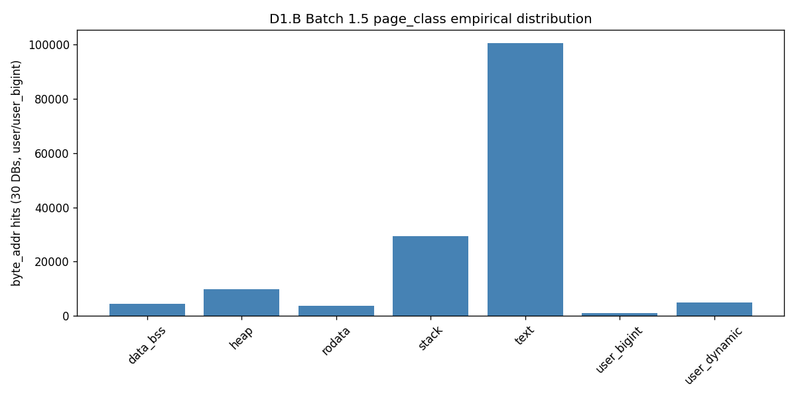

# D1.B Batch 1.5 — page_class layout derivation

**Generated:** 2026-06-17T23:29:02.291212+00:00
**Guest ELF sha256:** `3e5082ad7ee76bad8be4e403a6a13b566f2a06cbb85b947fae9cbbd0dfd05494`

## Q-PC-EHF decision

**.eh_frame folded into `rodata`** via half-open range `[.rodata.addr, .data.addr)`.

## memory.rs constants

| Constant | Value |
|---|---|
| `GUEST_MIN_MEM` | `0x4000` |
| `GUEST_MAX_MEM` | `0xc0000000` |
| `STACK_TOP` | `0x200400` |
| `TEXT_START` | `0x200800` |

## ELF sections

| Section | Addr | Size | End |
|---|---|---|---|
| `.bss` | `0x221398` | `0xf0` | `0x221488` |
| `.comment` | `0x0` | `0xf1` | `0xf1` |
| `.data` | `0x22133c` | `0x58` | `0x221394` |
| `.eh_frame` | `0x21d744` | `0x2bf8` | `0x22033c` |
| `.rodata` | `0x219db8` | `0x398c` | `0x21d744` |
| `.shstrtab` | `0x0` | `0x59` | `0x59` |
| `.strtab` | `0x0` | `0x11bc3` | `0x11bc3` |
| `.symtab` | `0x0` | `0xb760` | `0xb760` |
| `.text` | `0x200800` | `0x185b4` | `0x218db4` |
| `_end` | `0x221488` | — | — |

## Final `_PAGE_CLASS_USER_LAYOUT`

| page_class | Range | Source |
|---|---|---|
| `stack` | `[0x10000, 0x200800)` | memory.rs TEXT_START lower bound |
| `text` | `[0x200800, 0x219db8)` | [TEXT_START, .rodata.addr) folds .text gap |
| `rodata` | `[0x219db8, 0x22133c)` | [.rodata.addr, .data.addr) — eh_frame_policy=fold_into_rodata |
| `data_bss` | `[0x22133c, 0x221488)` | [.data.addr, _end) |
| `heap` | `[0x221488, 0x42000000)` | [_end, HOST_ECALL) |
| `host_ecall` | `[0x42000000, 0x42000100)` | GLOSSARY / D42 |
| `user_dynamic` | `[0x42000100, 0xbfff0000)` | Batch 1.5b: [HOST_ECALL_HI, D8 user band) — upper user RAM, no ELF map |

## Empirical validation (30 Cat-A DBs)

- Total user/user_bigint `byte_addr` hits: **153577**
- `user_other` fraction: **0.0%** (Batch 1.5 gate ≤ 15.0%; Batch 1.5b gate ≤ 0.5%)
- Batch 1.5b gate: **PASS**
- Stack-text gap `[0x200400, 0x200800)` hits: **926**

### Label histogram

```
{
  "data_bss": 4359,
  "heap": 9948,
  "rodata": 3633,
  "stack": 29410,
  "text": 100364,
  "user_bigint": 1013,
  "user_dynamic": 4850
}
```



## Pro disclosure draft (Q-PC-4)

We define `page_class` as semantic memory-use classes within the `user` band,
derived deterministically from the sha2-host guest ELF + zkVM `memory.rs` +
HOST_ECALL MMIO range. Non-`user`/`user_bigint` regions pass through as
`page_class = address_region`.

